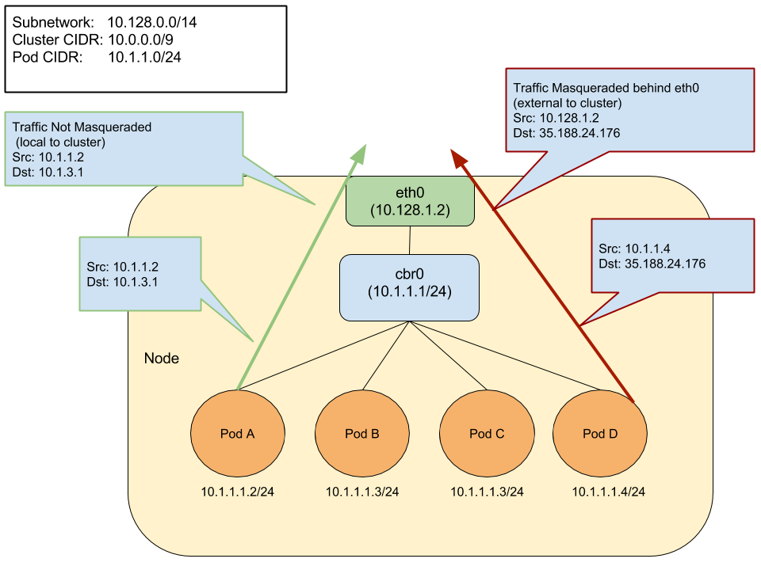

# ip-masq-agent

[ip-masq-agent](https://github.com/kubernetes-incubator/ip-masq-agent) 是一个用来管理 IP 伪装的扩展，即管理节点中 IP 网段的 SNAT 规则。

ip-masq-agent 配置 iptables 规则，以便将流量发送到集群节点之外的目标时处理 IP 伪装。默认情况下，RFC 1918 定一个的三个私有 IP 范围是非伪装网段，即 10.0.0.0/8、172.16.0.0/12 和 192.168.0.0/16。另外，链接本地地址（169.254.0.0/16）也被视为非伪装网段。



## 部署方法

首先，标记要运行 ip-masq-agent 的 Node

```sh
kubectl label nodes my-node beta.kubernetes.io/masq-agent-ds-ready=true
```

然后部署 ip-masq-agent：

```sh
kubectl create -f https://raw.githubusercontent.com/kubernetes-incubator/ip-masq-agent/master/ip-masq-agent.yaml
```

部署好，查看 iptables 规则，可以发现

```sh
iptables -t nat -L IP-MASQ-AGENT
RETURN     all  --  anywhere             169.254.0.0/16       /* ip-masq-agent: cluster-local traffic should not be subject to MASQUERADE */ ADDRTYPE match dst-type !LOCAL
RETURN     all  --  anywhere             10.0.0.0/8           /* ip-masq-agent: cluster-local traffic should not be subject to MASQUERADE */ ADDRTYPE match dst-type !LOCAL
RETURN     all  --  anywhere             172.16.0.0/12        /* ip-masq-agent: cluster-local traffic should not be subject to MASQUERADE */ ADDRTYPE match dst-type !LOCAL
RETURN     all  --  anywhere             192.168.0.0/16       /* ip-masq-agent: cluster-local traffic should not be subject to MASQUERADE */ ADDRTYPE match dst-type !LOCAL
MASQUERADE  all  --  anywhere             anywhere             /* ip-masq-agent: outbound traffic should be subject to MASQUERADE (this match must come after cluster-local CIDR matches) */ ADDRTYPE match dst-type !LOCAL
```

## 使用方法

自定义 SNAT 网段的方法：

```sh
cat >config <<EOF
nonMasqueradeCIDRs:
  - 10.0.0.0/8
resyncInterval: 60s
EOF

kubectl create configmap ip-masq-agent --from-file=config --namespace=kube-system
```

这样，查看 iptables 规则可以发现

```sh
$ iptables -t nat -L IP-MASQ-AGENT
Chain IP-MASQ-AGENT (1 references)
target     prot opt source               destination         
RETURN     all  --  anywhere             169.254.0.0/16       /* ip-masq-agent: cluster-local traffic should not be subject to MASQUERADE */ ADDRTYPE match dst-type !LOCAL
RETURN     all  --  anywhere             10.0.0.0/8           /* ip-masq-agent: cluster-local
MASQUERADE  all  --  anywhere             anywhere             /* ip-masq-agent: outbound traffic should be subject to MASQUERADE (this match must come after cluster-local CIDR matches) */ ADDRTYPE match dst-type !LOCAL
```

