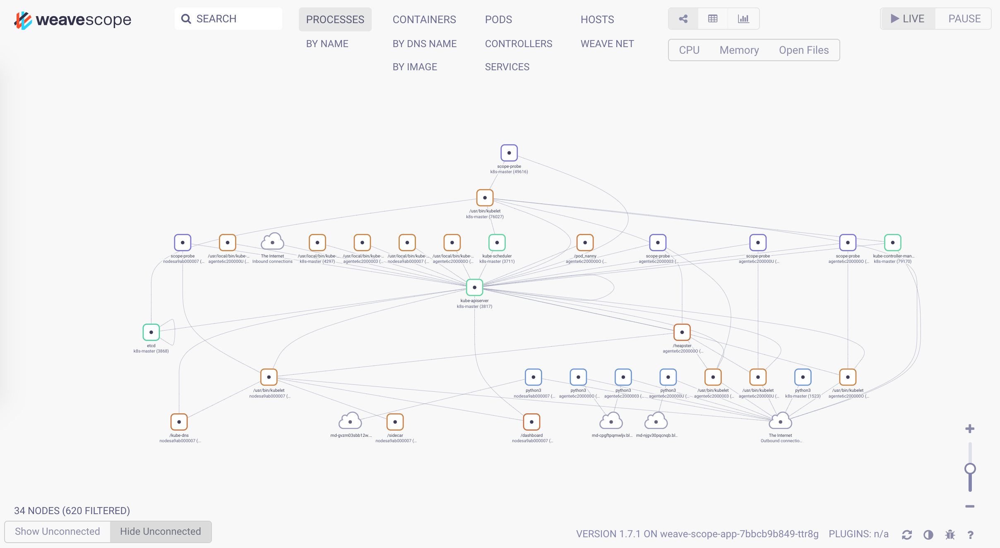
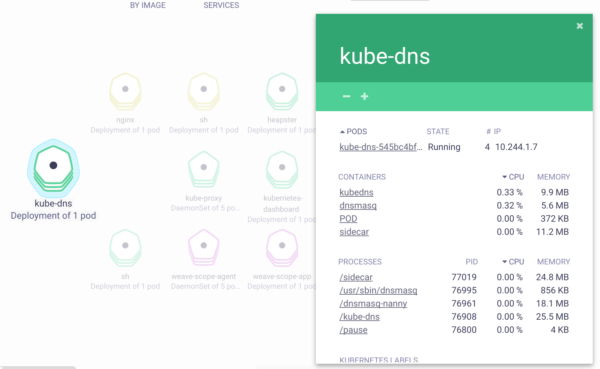

# Kubernetes 监控

Kubernetes 社区提供了一些列的工具来监控容器和集群的状态，并借助 Prometheus 提供告警的功能。

- cAdvisor 负责单节点内部的容器和节点资源使用统计，内置在 Kubelet 内部，并通过 Kubelet `/metrics/cadvisor` 对外提供 API
- [InfluxDB](https://www.influxdata.com/time-series-platform/influxdb/) 是一个开源分布式时序、事件和指标数据库；而 [Grafana](http://grafana.org/) 则是 InfluxDB 的 Dashboard，提供了强大的图表展示功能。它们常被组合使用展示图表化的监控数据。
- [Heapster](https://github.com/kubernetes/heapster) 提供了整个集群的资源监控，并支持持久化数据存储到 InfluxDB 等后端存储中。
- [kube-state-metrics](https://github.com/kubernetes/kube-state-metrics) 提供了 Kubernetes 资源对象（如 DaemonSet、Deployments 等）的度量。
- [Prometheus](https://prometheus.io) 是另外一个监控和时间序列数据库，还提供了告警的功能。
- [Node Problem Detector](https://github.com/kubernetes/node-problem-detector) 监测 Node 本身的硬件、内核或者运行时等问题。

## cAdvisor

[cAdvisor](https://github.com/google/cadvisor) 是一个来自 Google 的容器监控工具，也是 Kubelet 内置的容器资源收集工具。它会自动收集本机容器 CPU、内存、网络和文件系统的资源占用情况，并对外提供 cAdvisor 原生的 API（默认端口为 `--cadvisor-port=4194`，未来可能会删除该端口）。


从 v1.7 开始，Kubelet metrics API 不再包含 cadvisor metrics，而是提供了一个独立的 API 接口：

- Kubelet metrics: `http://127.0.0.1:8001/api/v1/proxy/nodes/<node-name>/metrics`
- Cadvisor metrics: `http://127.0.0.1:8001/api/v1/proxy/nodes/<node-name>/metrics/cadvisor`

然而 cadvisor metrics 通常是监控系统必需的数据。给 Prometheus 增加新的 target 可以解决这个问题，比如

```sh
helm install stable/prometheus --set rbac.create=true --name prometheus --namespace monitoring
```

## InfluxDB 和 Grafana

[InfluxDB](https://www.influxdata.com/time-series-platform/influxdb/) 是一个开源分布式时序、事件和指标数据库；而 [Grafana](http://grafana.org/) 则是 InfluxDB 的 Dashboard，提供了强大的图表展示功能。它们常被组合使用展示图表化的监控数据。


## Heapster

Kubelet 内置的 cAdvisor 只提供了单机的容器资源占用情况，而 [Heapster](https://github.com/kubernetes/heapster) 则提供了整个集群的资源监控，并支持持久化数据存储到 InfluxDB、Google Cloud Monitoring 或者 [其他的存储后端](https://github.com/kubernetes/heapster)。

Heapster 首先从 Kubernetes apiserver 查询所有 Node 的信息，然后再从 kubelet 提供的 API 采集节点和容器的资源占用，同时在 `/metrics` API 提供了 Prometheus 格式的数据。Heapster 采集到的数据可以推送到各种持久化的后端存储中，如 InfluxDB、Google Cloud Monitoring、OpenTSDB 等。


### 部署 Heapster、InfluxDB 和 Grafana

在 Kubernetes 部署成功后，dashboard、DNS 和监控的服务也会默认部署好，比如通过 `cluster/kube-up.sh` 部署的集群默认会开启以下服务：

```sh
$ kubectl cluster-info
Kubernetes master is running at https://kubernetes-master
Heapster is running at https://kubernetes-master/api/v1/proxy/namespaces/kube-system/services/heapster
KubeDNS is running at https://kubernetes-master/api/v1/proxy/namespaces/kube-system/services/kube-dns
kubernetes-dashboard is running at https://kubernetes-master/api/v1/proxy/namespaces/kube-system/services/kubernetes-dashboard
Grafana is running at https://kubernetes-master/api/v1/proxy/namespaces/kube-system/services/monitoring-grafana
InfluxDB is running at https://kubernetes-master/api/v1/proxy/namespaces/kube-system/services/monitoring-influxdb
```

如果这些服务没有自动部署的话，可以参考 [kubernetes/heapster](https://github.com/kubernetes/heapster/tree/master/deploy/kube-config) 来部署这些服务：

```sh
git clone https://github.com/kubernetes/heapster
cd heapster
kubectl create -f deploy/kube-config/influxdb/
kubectl create -f deploy/kube-config/rbac/heapster-rbac.yaml
```

注意在访问这些服务时，需要先在浏览器中导入 apiserver 证书才可以认证。为了简化访问过程，也可以使用 kubectl 代理来访问（不需要导入证书）：

```sh
# 启动代理
kubectl proxy --address='0.0.0.0' --port=8080 --accept-hosts='^*$' &
```

然后打开 `http://<master-ip>:8080/api/v1/proxy/namespaces/kube-system/services/monitoring-grafana` 就可以访问 Grafana。


## Prometheus

[Prometheus](https://prometheus.io) 是另外一个监控和时间序列数据库，并且还提供了告警的功能。它提供了强大的查询语言和 HTTP 接口，也支持将数据导出到 Grafana 中展示。


使用 Prometheus 监控 Kubernetes 需要配置好数据源，一个简单的示例是 [prometheus.yml](prometheus.txt)。

推荐使用 [Prometheus Operator](https://github.com/coreos/prometheus-operator) 或 [Prometheus Chart](https://github.com/kubernetes/charts/tree/master/stable/prometheus) 来部署和管理 Prometheus，比如

```sh
# 使用 prometheus charts
# 注意：未开启 RBAC 时，需要设置 --set rbac.create=false
helm install --name prometheus stable/prometheus --set rbac.create=true --namespace=monitoring
helm install --name grafana stable/grafana --namespace=monitoring --set server.image=grafana/grafana:master
```

使用端口转发的方式访问 Prometheus，如 `kubectl port-forward -n monitoring service/prometheus-prometheus-server :80`


查询 Grafana 的管理员密码

```sh
kubectl get secret --namespace monitoring grafana -o jsonpath="{.data.grafana-admin-password}" | base64 --decode ; echo
```

然后，以端口转发的方式访问 Grafana 界面

```sh
kubectl port-forward -n monitoring service/grafana :80
```

添加 Prometheus 类型的 Data Source，填入原地址 `http://prometheus-prometheus-server.monitoring`。

## Node Problem Detector

Kubernetes node 有可能会出现各种硬件、内核或者运行时等问题，这些问题有可能导致服务异常。而 Node Problem Detector（NPD）就是用来监测这些异常的服务。NPD 以 DaemonSet 的方式运行在每台 Node 上面，并在异常发生时更新 NodeCondition（比如 KernelDaedlock、DockerHung、BadDisk 等）或者 Node Event（比如 OOM Kill 等）。

可以参考 [kubernetes/node-problem-detector](https://github.com/kubernetes/node-problem-detector#start-daemonset) 来部署 NPD，或者也可以使用 Helm 来部署：

```sh
# add repo
helm repo add feisky https://feisky.xyz/kubernetes-charts
helm update

# install packages
helm install feisky/node-problem-detector --namespace kube-system --name npd
```

## 其他容器监控系统

除了以上监控工具，还有很多其他的开源或商业系统可用来辅助监控，如

- [Sysdig](http://blog.kubernetes.io/2015/11/monitoring-Kubernetes-with-Sysdig.html)
- [Weave scope](https://www.weave.works/docs/scope/latest/features/)
- [Datadog](https://www.datadoghq.com/)
- [Sematext](https://sematext.com/)

### sysdig

sysdig 是一个容器排错工具，提供了开源和商业版本。对于常规排错来说，使用开源版本即可。

除了 sysdig，还可以使用其他两个辅助工具

* csysdig：与 sysdig 一起自动安装，提供了一个命令行界面
* [sysdig-inspect](https://github.com/draios/sysdig-inspect)：为 sysdig 保存的跟踪文件（如 `sudo sysdig -w filename.scap`）提供了一个图形界面（非实时）

#### 安装 sysdig

```sh
# on Linux
curl -s https://s3.amazonaws.com/download.draios.com/stable/install-sysdig | sudo bash

# on MacOS
brew install sysdig
```

使用示例

```sh
# Refer https://www.sysdig.org/wiki/sysdig-examples/.
# View the top network connections for a single container
sysdig -pc -c topconns

# Show the network data exchanged with the host 192.168.0.1
sysdig -s2000 -A -c echo_fds fd.cip=192.168.0.1

# List all the incoming connections that are not served by apache.
sysdig -p"%proc.name %fd.name" "evt.type=accept and proc.name!=httpd"

# View the CPU/Network/IO usage of the processes running inside the container.
sysdig -pc -c topprocs_cpu container.id=2e854c4525b8
sysdig -pc -c topprocs_net container.id=2e854c4525b8
sysdig -pc -c topfiles_bytes container.id=2e854c4525b8

# See the files where apache spends the most time doing I/O
sysdig -c topfiles_time proc.name=httpd

# Show all the interactive commands executed inside a given container.
sysdig -pc -c spy_users

# Show every time a file is opened under /etc.
sysdig evt.type=open and fd.name
```

### Weave Scope

Weave Scope 是另外一款可视化容器监控和排错工具。与 sysdig 相比，它没有强大的命令行工具，但提供了一个简单易用的交互界面，自动描绘了整个集群的拓扑，并可以通过插件扩展其功能。从其官网的介绍来看，其提供的功能包括

- [交互式拓扑界面](https://www.weave.works/docs/scope/latest/features/#topology-mapping)
- [图形模式和表格模式](https://www.weave.works/docs/scope/latest/features/#mode)
- [过滤功能](https://www.weave.works/docs/scope/latest/features/#flexible-filtering)
- [搜索功能](https://www.weave.works/docs/scope/latest/features/#powerful-search)
- [实时度量](https://www.weave.works/docs/scope/latest/features/#real-time-app-and-container-metrics)
- [容器排错](https://www.weave.works/docs/scope/latest/features/#interact-with-and-manage-containers)
- [插件扩展](https://www.weave.works/docs/scope/latest/features/#custom-plugins)

Weave Scope 由 [App 和 Probe 两部分](https://www.weave.works/docs/scope/latest/how-it-works)组成，它们

- Probe 负责收集容器和宿主的信息，并发送给 App
- App 负责处理这些信息，并生成相应的报告，并以交互界面的形式展示

```sh
                    +--Docker host----------+      +--Docker host----------+
.---------------.   |  +--Container------+  |      |  +--Container------+  |
| Browser       |   |  |                 |  |      |  |                 |  |
|---------------|   |  |  +-----------+  |  |      |  |  +-----------+  |  |
|               |----->|  | scope-app |<-----.    .----->| scope-app |  |  |
|               |   |  |  +-----------+  |  | \  / |  |  +-----------+  |  |
|               |   |  |        ^        |  |  \/  |  |        ^        |  |
'---------------'   |  |        |        |  |  /\  |  |        |        |  |
                    |  | +-------------+ |  | /  \ |  | +-------------+ |  |
                    |  | | scope-probe |-----'    '-----| scope-probe | |  |
                    |  | +-------------+ |  |      |  | +-------------+ |  |
                    |  |                 |  |      |  |                 |  |
                    |  +-----------------+  |      |  +-----------------+  |
                    +-----------------------+      +-----------------------+
```

#### 安装 Weave scope

```sh
kubectl apply -f "https://cloud.weave.works/k8s/scope.yaml?k8s-version=$(kubectl version | base64 | tr -d '\n')&k8s-service-type=LoadBalancer"
```

安装完成后，可以通过 weave-scope-app 来访问交互界面

```sh
kubectl -n weave get service weave-scope-app
```



点击 Pod，还可以查看该 Pod 所有容器的实时状态和度量数据：



## 参考文档

- [Kubernetes Heapster](https://github.com/kubernetes/heapster)
