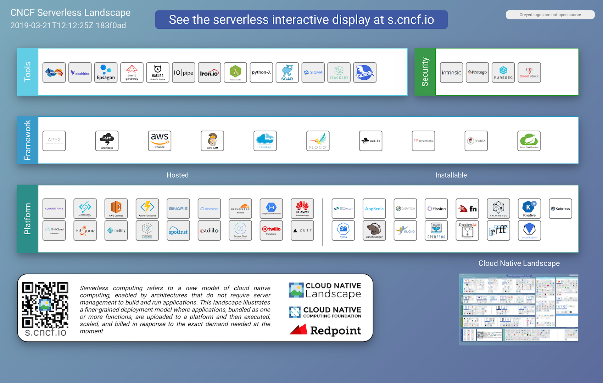

# 生态圈

## 云原生全景

图片来源：[https://landscape.cncf.io/](https://landscape.cncf.io/)。

## 云原生地图

图片来源：[https://github.com/cncf/landscape](https://github.com/cncf/landscape)。

## Serverless

图片来源：[https://s.cncf.io](https://s.cncf.io)。

