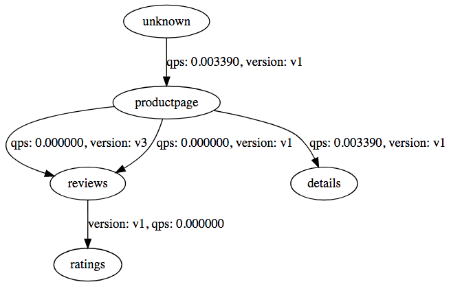

# Istio 安装部署

在安装 Istio 之前要确保 Kubernetes 集群（仅支持 v1.9.0 及以后版本）已部署并配置好本地的 kubectl 客户端。比如，使用 minikube：

```sh
minikube start --memory=4096 --kubernetes-version=v1.11.1 --vm-driver=hyperkit
```

## 下载 Istio

```sh
curl -L https://git.io/getLatestIstio | sh -
sudo apt-get install -y jq
ISTIO_VERSION=$(curl -L -s https://api.github.com/repos/istio/istio/releases/latest | jq -r .tag_name)
cd istio-${ISTIO_VERSION}
cp bin/istioctl /usr/local/bin
```

## 部署 Istio 服务

初始化 Helm Tiller：

```sh
kubectl create -f install/kubernetes/helm/helm-service-account.yaml
helm init --service-account tiller
```

然后使用 Helm 部署：

```sh
kubectl apply -f install/kubernetes/helm/istio/templates/crds.yaml
helm install install/kubernetes/helm/istio --name istio --namespace istio-system \
  --set ingress.enabled=true \
  --set gateways.enabled=true \
  --set galley.enabled=true \
  --set sidecarInjectorWebhook.enabled=true \
  --set mixer.enabled=true \
  --set prometheus.enabled=true \
  --set grafana.enabled=true \
  --set servicegraph.enabled=true \
  --set tracing.enabled=true \
  --set kiali.enabled=false
```

部署完成后，可以检查 isotio-system namespace 中的服务是否正常运行：

```sh
$  kubectl -n istio-system get pod
NAME                                        READY     STATUS    RESTARTS   AGE
grafana-5fb774bcc9-2rkng                    1/1       Running   0          6m
istio-citadel-5b956fdf54-5nb25              1/1       Running   0          6m
istio-egressgateway-6cff45b4db-gt8tr        1/1       Running   0          6m
istio-galley-699888c459-sgz7z               1/1       Running   0          6m
istio-ingress-fc79cc885-dvjqh               1/1       Running   0          6m
istio-ingressgateway-fc648887c-q5s5h        1/1       Running   0          6m
istio-pilot-6cd95f9cc4-fjdb5                2/2       Running   0          6m
istio-policy-75f75cc6fd-4mlhn               2/2       Running   0          6m
istio-sidecar-injector-6d59d46ff4-m79tl     1/1       Running   0          6m
istio-statsd-prom-bridge-7f44bb5ddb-phkh6   1/1       Running   0          6m
istio-telemetry-544b8d7dcf-mk5kw            2/2       Running   0          6m
istio-tracing-ff94688bb-7hmfb               1/1       Running   0          6m
prometheus-84bd4b9796-hcjwc                 1/1       Running   0          6m
servicegraph-6c6dbbf599-q4rxd               1/1       Running   0          6m

$ kubectl -n istio-system get service
NAME                       TYPE           CLUSTER-IP     EXTERNAL-IP    PORT(S)                                                                                                     AGE
grafana                    ClusterIP      10.0.150.84    <none>         3000/TCP                                                                                                    6m
istio-citadel              ClusterIP      10.0.9.108     <none>         8060/TCP,9093/TCP                                                                                           6m
istio-egressgateway        ClusterIP      10.0.168.237   <none>         80/TCP,443/TCP                                                                                              6m
istio-galley               ClusterIP      10.0.160.216   <none>         443/TCP,9093/TCP                                                                                            6m
istio-ingress              LoadBalancer   10.0.55.174    x.x.x.x        80:32000/TCP,443:32728/TCP                                                                                  6m
istio-ingressgateway       LoadBalancer   10.0.203.82    x.x.x.x        80:31380/TCP,443:31390/TCP,31400:31400/TCP,15011:31720/TCP,8060:31948/TCP,15030:32340/TCP,15031:31958/TCP   6m
istio-pilot                ClusterIP      10.0.195.162   <none>         15010/TCP,15011/TCP,8080/TCP,9093/TCP                                                                       6m
istio-policy               ClusterIP      10.0.14.130    <none>         9091/TCP,15004/TCP,9093/TCP                                                                                 6m
istio-sidecar-injector     ClusterIP      10.0.160.50    <none>         443/TCP                                                                                                     6m
istio-statsd-prom-bridge   ClusterIP      10.0.133.84    <none>         9102/TCP,9125/UDP                                                                                           6m
istio-telemetry            ClusterIP      10.0.247.30    <none>         9091/TCP,15004/TCP,9093/TCP,42422/TCP                                                                       6m
jaeger-agent               ClusterIP      None           <none>         5775/UDP,6831/UDP,6832/UDP                                                                                  6m
jaeger-collector           ClusterIP      10.0.29.72     <none>         14267/TCP,14268/TCP                                                                                         6m
jaeger-query               ClusterIP      10.0.19.250    <none>         16686/TCP                                                                                                   6m
prometheus                 ClusterIP      10.0.19.53     <none>         9090/TCP                                                                                                    6m
servicegraph               ClusterIP      10.0.251.76    <none>         8088/TCP                                                                                                    6m
tracing                    ClusterIP      10.0.62.176    <none>         80/TCP                                                                                                      6m
zipkin                     ClusterIP      10.0.158.231   <none>         9411/TCP                                                                                                    6m
```

## 网格扩展

Istio 还支持管理非 Kubernetes 应用。此时需要在应用所在的 VM 或者物理中部署 Istio，具体步骤请参考 <https://istio.io/docs/setup/kubernetes/additional-setup/mesh-expansion/>。注意，在部署前需要满足以下条件

- 待接入服务器必须能够通过 IP 接入网格中的服务端点。通常这需要 VPN 或者 VPC 的支持，或者容器网络为服务端点提供直接路由（非 NAT 或者防火墙屏蔽）。该服务器无需访问 Kubernetes 指派的集群 IP 地址。
- Istio 控制平面服务（Pilot、Mixer、Citadel）以及 Kubernetes 的 DNS 服务器必须能够从虚拟机进行访问，通常会使用[内部负载均衡器](https://kubernetes.io/docs/concepts/services-networking/service/#internal-load-balancer)（也可以使用 NodePort）来满足这一要求，在虚拟机上运行 Istio 组件，或者使用自定义网络配置。

部署好后，就可以向 Istio 注册应用，如

```sh
# istioctl register servicename machine-ip portname:port
$ istioctl -n onprem register mysql 1.2.3.4 3306
$ istioctl -n onprem register svc1 1.2.3.4 http:7000
```

## Prometheus、Grafana 和 Zipkin

等所有 Pod 启动后，可以通过 NodePort、负载均衡服务的外网 IP 或者 `kubectl proxy` 来访问这些服务。比如通过 `kubectl proxy` 方式，先启动 kubectl proxy

```sh
$ kubectl proxy
Starting to serve on 127.0.0.1:8001
```

通过 `http://localhost:8001/api/v1/namespaces/istio-system/services/grafana:3000/proxy/` 访问 Grafana 服务


通过 `http://localhost:8001/api/v1/namespaces/istio-system/services/servicegraph:8088/proxy/` 访问 ServiceGraph 服务，展示服务之间调用关系图



- `/force/forcegraph.html` As explored above, this is an interactive [D3.js](https://d3js.org/) visualization.
- `/dotviz` is a static [Graphviz](https://www.graphviz.org/) visualization.
- `/dotgraph` provides a [DOT](https://en.wikipedia.org/wiki/DOT_\(graph_description_language\)) serialization.
- `/d3graph` provides a JSON serialization for D3 visualization.
- `/graph` provides a generic JSON serialization.

通过 `http://localhost:8001/api/v1/namespaces/istio-system/services/zipkin:9411/proxy/` 访问 Zipkin 跟踪页面


通过 `http://localhost:8001/api/v1/namespaces/istio-system/services/prometheus:9090/proxy/` 访问 Prometheus 页面


