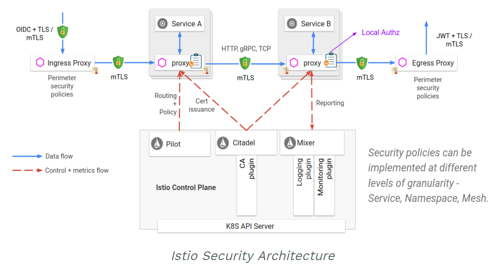

# Istio 安全管理

Istio 提供了 RBAC 訪問控制、雙向 TLS 認證以及密鑰管理等安全管理功能。

## RBAC

Istio Role-Based Access Control (RBAC) 提供了 namespace、service 以及 method 級別的訪問控制。其特性包括

- 簡單易用：提供基於角色的語意
- 支持認證：提供服務 - 服務和用戶 - 服務的認證
- 靈活：提供角色和角色綁定的自定義屬性



### 開啟 RBAC

通過 `RbacConfig` 來啟用 RBAC，其中 mode 支持如下選項：

- **OFF**: 停用 RBAC。
- **ON**: 為網格中的所有服務啟用 RBAC。
- **ON_WITH_INCLUSION**: 只對 `inclusion` 字段中包含的命名空間和服務啟用 RBAC。
- **ON_WITH_EXCLUSION**: 對網格內的所有服務啟用 RBAC，除 `exclusion` 字段中包含的命名空間和服務之外。

下面的例子為 `default` 命名空間開啟 RBAC：

```yaml
apiVersion: "config.istio.io/v1alpha2"
kind: RbacConfig
metadata:
  name: default
  namespace: istio-system
spec:
  mode: ON_WITH_INCLUSION
  inclusion:
    namespaces: ["default"]
```

### 訪問控制

Istio RBAC 提供了 ServiceRole 和 ServiceRoleBinding 兩種資源對象，並以 CustomResourceDefinition (CRD) 的方式管理。

- ServiceRole 定義了一個可訪問特定資源（namespace 之內）的服務角色，並支持以前綴通配符和後綴通配符的形式匹配一組服務
- ServiceRoleBinding 定義了賦予指定角色的綁定，即可以指定的角色和動作訪問服務

```yaml
apiVersion: "rbac.istio.io/v1alpha1"
kind: ServiceRole
metadata:
  name: products-viewer
  namespace: default
spec:
  rules:
  - services: ["products.default.svc.cluster.local"]
    methods: ["GET", "HEAD"]

---
apiVersion: "rbac.istio.io/v1alpha1"
kind: ServiceRoleBinding
metadata:
  name: test-binding-products
  namespace: default
spec:
  subjects:
  - user: "service-account-a"
  - user: "istio-ingress-service-account"
    properties:
    - request.auth.claims[email]: "a@foo.com"
    roleRef:
    kind: ServiceRole
    name: "products-viewer"
```

## 雙向 TLS

雙向 TLS 為服務間通信提供了 TLS 認證，並提供管理系統自動管理密鑰和證書的生成、分發、替換以及撤銷。


### 實現原理

Istio Auth 由三部分組成：

- 身份（Identity）：Istio 使用 Kubernetes service account 來識別服務的身份，格式為 `spiffe://<*domain*>/ns/<*namespace*>/sa/<*serviceaccount*>`
- 通信安全：端到端 TLS 通信通過服務器端和客戶端的 Envoy 容器完成
- 證書管理：Istio CA (Certificate Authority) 負責為每個 service account 生成 SPIFEE 密鑰和證書、分發到 Pod（通過 Secret Volume Mount 的形式）、定期輪轉（Rotate）以及必要時撤銷。對於 Kuberentes 之外的服務，CA 配合 Istio node agent 共同完成整個過程。

這樣，一個容器使用證書的流程為

- 首先，Istio CA 監聽 Kubernetes API，併為 service account 生成 SPIFFE 密鑰及證書，再以 secret 形式存儲到 Kubernetes 中
- 然後，Pod 創建時，Kubernetes API Server 將 secret 掛載到容器中
- 最後，Pilot 生成一個訪問控制的配置，定義哪些 service account 可以訪問服務，並分發給 Envoy
- 而當容器間通信時，Pod 雙方的 Envoy 就會基於訪問控制配置來作認證

### 最佳實踐

- 為不同團隊創建不同 namespace 分別管理
- 將 Istio CA 運行在單獨的 namespace 中，並且僅授予管理員權限

## 參考文檔

- [Istio Security 文檔](https://istio.io/docs/concepts/security/)
- [Istio Role-Based Access Control (RBAC)](https://istio.io/docs/concepts/security/)
- [Istio 雙向 TLS 文檔](https://istio.io/docs/concepts/security/#mutual-tls-authentication)
