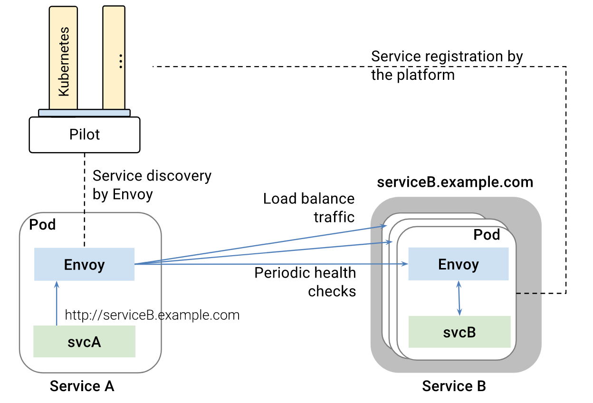
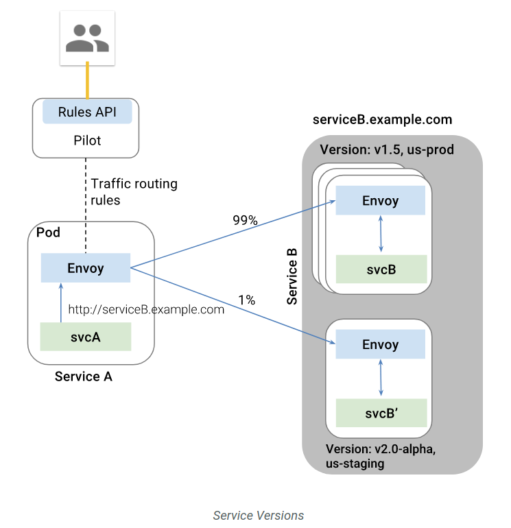

# Istio 流量管理

Istio 提供了强大的流量管理功能，如智能路由、服务发现与负载均衡、故障恢复、故障注入等。


流量管理的功能由 Pilot 配合 Envoy 负责，并接管进入和离开容器的所有流量：

- 流量管理的核心组件是 Pilot，负责管理和配置服务网格中的所有 Envoy 实例
- 而 Envoy 实例则负责维护负载均衡以及健康检查信息，从而允许其在目标实例之间智能分配流量，同时遵循其指定的路由规则


## API 版本

Istio 0.7.X 及以前版本仅支持 `config.istio.io/v1alpha2`，0.8.0 将其升级为 `networking.istio.io/v1alpha3`，并且重命名了流量管理的几个资源对象：

- RouteRule -> `VirtualService`：定义服务网格内对服务的请求如何进行路由控制 ，支持根据 host、sourceLabels 、http headers 等不同的路由方式，也支持百分比、超时、重试、错误注入等功能。
- DestinationPolicy -> `DestinationRule`：定义 `VirtualService` 之后的路由策略，包括断路器、负载均衡以及 TLS 等。
- EgressRule -> `ServiceEntry`：定义了服务网格之外的服务，支持两种类型：网格内部和网格外部。网格内的条目和其他的内部服务类似，用于显式的将服务加入网格。可以用来把服务作为服务网格扩展的一部分加入不受管理的基础设置（例如加入到基于 Kubernetes 的服务网格中的虚拟机）中。网格外的条目用于表达网格外的服务。对这种条目来说，双向 TLS 认证是禁止的，策略实现需要在客户端执行，而不像内部服务请求中的服务端执行。
- Ingress -> `Gateway`：定义边缘网络流量的负载均衡。

## 服务发现和负载均衡

为了接管流量，Istio 假设所有容器在启动时自动将自己注册到 Istio 中（通过自动或手动给 Pod 注入 Envoy sidecar 容器）。Envoy 收到外部请求后，会对请求作负载均衡，并支持轮询、随机和加权最少请求等负载均衡算法。除此之外，Envoy 还会以熔断机制定期检查服务后端容器的健康状态，自动移除不健康的容器和加回恢复正常的容器。容器内也可以返回 HTTP 503 显示将自己从负载均衡中移除。



### 流量接管

Istio 假定进入和离开服务网络的所有流量都会通过 Envoy 代理进行传输。Envoy sidecar 使用 iptables 把进入 Pod 和从 Pod 发出的流量转发到 Envoy 进程监听的端口（即 15001 端口）上：

```sh
*nat
:PREROUTING ACCEPT [0:0]
:INPUT ACCEPT [1:60]
:OUTPUT ACCEPT [482:44962]
:POSTROUTING ACCEPT [482:44962]
:ISTIO_INBOUND - [0:0]
:ISTIO_IN_REDIRECT - [0:0]
:ISTIO_OUTPUT - [0:0]
:ISTIO_REDIRECT - [0:0]
-A PREROUTING -p tcp -j ISTIO_INBOUND
-A OUTPUT -p tcp -j ISTIO_OUTPUT
-A ISTIO_INBOUND -p tcp -m tcp --dport 9080 -j ISTIO_IN_REDIRECT
-A ISTIO_IN_REDIRECT -p tcp -j REDIRECT --to-ports 15001
-A ISTIO_OUTPUT ! -d 127.0.0.1/32 -o lo -j ISTIO_REDIRECT
-A ISTIO_OUTPUT -m owner --uid-owner 1337 -j RETURN
-A ISTIO_OUTPUT -m owner --gid-owner 1337 -j RETURN
-A ISTIO_OUTPUT -d 127.0.0.1/32 -j RETURN
-A ISTIO_OUTPUT -j ISTIO_REDIRECT
-A ISTIO_REDIRECT -p tcp -j REDIRECT --to-ports 15001
```

## 故障恢复

Istio 提供了一系列开箱即用的故障恢复功能，如

- 超时处理
- 重试处理，如限制最大重试时间以及可变重试间隔
- 健康检查，如自动移除不健康的容器
- 请求限制，如并发请求数和并发连接数
- 熔断

这些功能均可以使用 VirtualService 动态配置。比如以下为用户 jason 的请求返回 500 （而其他用户均可正常访问）：

```yaml
apiVersion: networking.istio.io/v1alpha3
kind: VirtualService
metadata:
  name: ratings
spec:
  hosts:
  - ratings
  http:
  - match:
    - headers:
        cookie:
          regex: "^(.*?;)?(user=jason)(;.*)?$"
    fault:
      abort:
        percent: 100
        httpStatus: 500
    route:
    - destination:
        host: ratings
        subset: v1
  - route:
    - destination:
        host: ratings
        subset: v1
```

熔断示例：

```sh
cat <<EOF | istioctl create -f -
apiVersion: networking.istio.io/v1alpha3
kind: DestinationRule
metadata:
  name: httpbin
spec:
  host: httpbin
  trafficPolicy:
    connectionPool:
      tcp:
        maxConnections: 1
      http:
        http1MaxPendingRequests: 1
        maxRequestsPerConnection: 1
    outlierDetection:
      http:
        consecutiveErrors: 1
        interval: 1s
        baseEjectionTime: 3m
        maxEjectionPercent: 100
EOF
```

## 故障注入

Istio 支持为应用注入故障，以模拟实际生产中碰到的各种问题，包括

- 注入延迟（模拟网络延迟和服务过载）
- 注入失败（模拟应用失效）

这些故障均可以使用 VirtualService 动态配置。如以下配置 2 秒的延迟：

```yaml
apiVersion: networking.istio.io/v1alpha3
kind: VirtualService
metadata:
  name: ratings
spec:
  hosts:
  - ratings
  http:
  - fault:
      delay:
        percent: 100
        fixedDelay: 2s
    route:
    - destination:
        host: ratings
        subset: v1
```

## 金丝雀部署



首先部署 bookinfo，并配置默认路由为 v1 版本：

```sh
# 以下命令假设 bookinfo 示例程序已部署，如未部署，可以执行下面的命令
$ kubectl apply -f <(istioctl kube-inject -f samples/bookinfo/platform/kube/bookinfo.yaml)
# 此时，三个版本的 reviews 服务以负载均衡的方式轮询。

# 创建默认路由，全部请求转发到 v1
$ istioctl create -f samples/bookinfo/routing/route-rule-all-v1.yaml

$ kubectl get virtualservice reviews -o yaml
apiVersion: networking.istio.io/v1alpha3
kind: VirtualService
metadata:
  name: reviews
spec:
  hosts:
  - reviews
  http:
  - route:
    - destination:
        host: reviews
        subset: v1
```

### 示例一：将 10% 请求发送到 v2 版本而其余 90% 发送到 v1 版本

```sh
cat <<EOF | istioctl create -f -
apiVersion: networking.istio.io/v1alpha3
kind: VirtualService
metadata:
  name: reviews
spec:
  hosts:
    - reviews
  http:
  - route:
    - destination:
        host: reviews
        subset: v1
      weight: 75
    - destination:
        host: reviews
        subset: v2
      weight: 25
EOF
```

### 示例二：将 jason 用户的请求全部发到 v2 版本

```sh
cat <<EOF | istioctl replace -f -
apiVersion: networking.istio.io/v1alpha3
kind: VirtualService
metadata:
  name: ratings
spec:
  hosts:
  - ratings
  http:
  - match:
    - sourceLabels:
        app: reviews
        version: v2
      headers:
        end-user:
          exact: jason
EOF
```

### 示例三：全部切换到 v2 版本

```sh
cat <<EOF | istioctl replace -f -
apiVersion: networking.istio.io/v1alpha3
kind: VirtualService
metadata:
  name: reviews
spec:
  hosts:
  - reviews
  http:
  - route:
    - destination:
        host: reviews
        subset: v2
EOF
```

### 示例四：限制并发访问

```sh
cat <<EOF | istioctl create -f -
apiVersion: networking.istio.io/v1alpha3
kind: DestinationRule
metadata:
  name: reviews
spec:
  host: reviews
  subsets:
  - name: v1
    labels:
      version: v1
    trafficPolicy:
      connectionPool:
        tcp:
          maxConnections: 100
EOF
```

为了查看访问次数限制的效果，可以使用 [wrk](https://github.com/wg/wrk) 给应用加一些压力：

```sh
export BOOKINFO_URL=$(kubectl get po -n istio-system -l istio=ingress -o jsonpath={.items[0].status.hostIP}):$(kubectl get svc -n istio-system istio-ingress -o jsonpath={.spec.ports[0].nodePort})
wrk -t1 -c1 -d20s http://$BOOKINFO_URL/productpage
```

## Gateway

Istio 在部署时会自动创建一个 [Istio Gateway](https://istio.io/docs/reference/config/istio.networking.v1alpha3/#Gateway)，用来控制 Ingress 访问。

```sh
# prepare
kubectl apply -f <(istioctl kube-inject -f samples/httpbin/httpbin.yaml)
openssl req -x509 -nodes -days 365 -newkey rsa:2048 -keyout /tmp/tls.key -out /tmp/tls.crt -subj "/CN=httpbin.example.com"

# get ingress external IP (suppose load balancer service)
kubectl get svc istio-ingressgateway -n istio-system
export INGRESS_HOST=$(kubectl -n istio-system get service istio-ingressgateway -o jsonpath='{.status.loadBalancer.ingress[0].ip}')
export INGRESS_PORT=$(kubectl -n istio-system get service istio-ingressgateway -o jsonpath='{.spec.ports[?(@.name=="http")].port}')
export SECURE_INGRESS_PORT=$(kubectl -n istio-system get service istio-ingressgateway -o jsonpath='{.spec.ports[?(@.name=="https")].port}')

# create gateway
cat <<EOF | istioctl create -f -
apiVersion: networking.istio.io/v1alpha3
kind: Gateway
metadata:
  name: httpbin-gateway
spec:
  selector:
    istio: ingressgateway # use Istio default gateway implementation
  servers:
  - port:
      number: 80
      name: http
      protocol: HTTP
    hosts:
    - "httpbin.example.com"
EOF

# configure routes for the gateway
cat <<EOF | istioctl create -f -
apiVersion: networking.istio.io/v1alpha3
kind: VirtualService
metadata:
  name: httpbin
spec:
  hosts:
  - "httpbin.example.com"
  gateways:
  - httpbin-gateway
  http:
  - match:
    - uri:
        prefix: /status
    - uri:
        prefix: /delay
    route:
    - destination:
        port:
          number: 8000
        host: httpbin
EOF

# validate 200
curl --resolve httpbin.example.com:$INGRESS_PORT:$INGRESS_HOST -HHost:httpbin.example.com -I http://httpbin.example.com:$INGRESS_PORT/status/200

# invalidate 404
curl --resolve httpbin.example.com:$INGRESS_PORT:$INGRESS_HOST -HHost:httpbin.example.com -I http://httpbin.example.com:$INGRESS_PORT/headers
```

使用 TLS：

```sh
kubectl create -n istio-system secret tls istio-ingressgateway-certs --key /tmp/tls.key --cert /tmp/tls.crt

cat <<EOF | istioctl replace -f -
apiVersion: networking.istio.io/v1alpha3
kind: Gateway
metadata:
  name: httpbin-gateway
spec:
  selector:
    istio: ingressgateway # use istio default ingress gateway
  servers:
  - port:
      number: 80
      name: http
      protocol: HTTP
    hosts:
    - "httpbin.example.com"
  - port:
      number: 443
      name: https
      protocol: HTTPS
    tls:
      mode: SIMPLE
      serverCertificate: /etc/istio/ingressgateway-certs/tls.crt
      privateKey: /etc/istio/ingressgateway-certs/tls.key
    hosts:
    - "httpbin.example.com"
EOF


# validate 200
curl --resolve httpbin.example.com:$SECURE_INGRESS_PORT:$INGRESS_HOST -HHost:httpbin.example.com -I -k https://httpbin.example.com:$SECURE_INGRESS_PORT/status/200
```

## Egress 流量

默认情况下，Istio 接管了容器的内外网流量，从容器内部无法访问 Kubernetes 集群外的服务。可以通过 ServiceEntry 为需要的容器开放 Egress 访问，如

```yaml
$ cat <<EOF | istioctl create -f -
apiVersion: networking.istio.io/v1alpha3
kind: ServiceEntry
metadata:
  name: httpbin-ext
spec:
  hosts:
  - httpbin.org
  ports:
  - number: 80
    name: http
    protocol: HTTP
EOF

$ cat <<EOF | istioctl create -f -
apiVersion: networking.istio.io/v1alpha3
kind: VirtualService
metadata:
  name: httpbin-ext
spec:
  hosts:
    - httpbin.org
  http:
  - timeout: 3s
    route:
      - destination:
          host: httpbin.org
        weight: 100
EOF
```

需要注意的是 ServiceEntry 仅支持 HTTP、TCP 和 HTTPS，对于其他协议需要通过 `--includeIPRanges` 的方式设置 IP 地址范围，如

```sh
helm template @install/kubernetes/helm/istio@ --name istio --namespace istio-system --set global.proxy.includeIPRanges="10.0.0.1/24" -x @templates/sidecar-injector-configmap.yaml@ | kubectl apply -f -
```

## 流量镜像

```sh
cat <<EOF | istioctl replace -f -
apiVersion: networking.istio.io/v1alpha3
kind: VirtualService
metadata:
  name: httpbin
spec:
  hosts:
    - httpbin
  http:
  - route:
    - destination:
        host: httpbin
        subset: v1
      weight: 100
    mirror:
      host: httpbin
      subset: v2
EOF
```

## 参考文档

- [Istio traffic management overview](https://istio.io/docs/concepts/traffic-management/)
