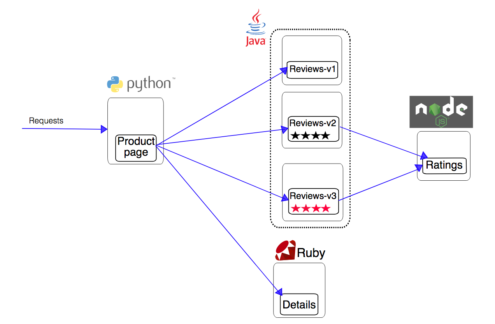
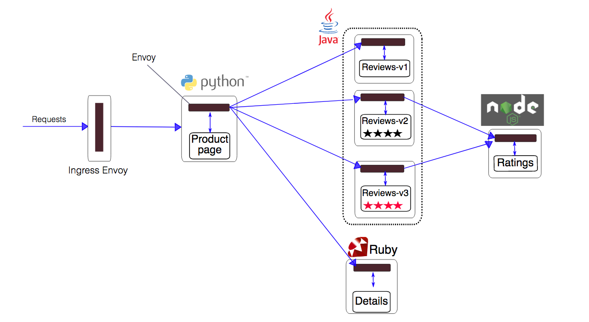

# Istio 和 Service Mesh

Istio 是 Google、IBM 和 Lyft 联合开源的服务网格（Service Mesh）框架，旨在解决大量微服务的发现、连接、管理、监控以及安全等问题。Istio 对应用是透明的，不需要改动任何服务代码就可以实现透明的服务治理。

Istio 的主要特性包括：

- HTTP、gRPC、WebSocket 和 TCP 网络流量的自动负载均衡
- 细粒度的网络流量行为控制， 包括丰富的路由规则、重试、故障转移和故障注入等
- 可选策略层和配置 API 支持访问控制、速率限制以及配额管理
- 自动度量、日志记录和跟踪所有进出的流量
- 强大的身份认证和授权机制实现服务间的安全通信

## Istio 原理

Istio 从逻辑上可以分为数据平面和控制平面：

- **数据平面**主要由一系列的智能代理（默认为 Envoy）组成，管理微服务之间的网络通信
- **控制平面**负责管理和配置代理来路由流量，并配置 Mixer 以进行策略部署和遥测数据收集

Istio 架构可以如下图所示


它主要由以下组件构成

- [Envoy](https://www.envoyproxy.io//)：Lyft 开源的高性能代理，用于调解服务网格中所有服务的入站和出站流量。它支持动态服务发现、负载均衡、TLS 终止、HTTP/2 和 gPRC 代理、熔断、健康检查、故障注入和性能测量等丰富的功能。Envoy 以 sidecar 的方式部署在相关的服务的 Pod 中，从而无需重新构建或重写代码。
- Mixer：负责访问控制、执行策略并从 Envoy 代理中收集遥测数据。Mixer 支持灵活的插件模型，方便扩展（支持 GCP、AWS、Prometheus、Heapster 等多种后端）。
- Pilot：动态管理 Envoy 实例的生命周期，提供服务发现、智能路由和弹性流量管理（如超时、重试）等功能。它将流量管理策略转化为 Envoy 数据平面配置，并传播到 sidecar 中。
- [Pilot](https://istio.io/zh/docs/concepts/traffic-management/#pilot-%E5%92%8C-envoy) 为 Envoy sidecar 提供服务发现功能，为智能路由（例如 A/B 测试、金丝雀部署等）和弹性（超时、重试、熔断器等）提供流量管理功能。它将控制流量行为的高级路由规则转换为特定于 Envoy 的配置，并在运行时将它们传播到 sidecar。Pilot 将服务发现机制抽象为符合 [Envoy 数据平面 API](https://github.com/envoyproxy/data-plane-api) 的标准格式，以便支持在多种环境下运行并保持流量管理的相同操作接口。
- Citadel 通过内置身份和凭证管理提供服务间和最终用户的身份认证。支持基于角色的访问控制、基于服务标识的策略执行等。


在数据平面上，除了 [Envoy](https://www.envoyproxy.io)，还可以选择使用 [nginxmesh](https://github.com/nginmesh/nginmesh)、[linkerd](https://linkerd.io/getting-started) 等作为网络代理。比如，使用 nginxmesh 时，Istio 的控制平面（Pilot、Mixer、Auth）保持不变，但用 Nginx Sidecar 取代 Envoy：


## 安装

Istio 的安装部署步骤见 [这里](istio-deploy.md)。

## 注入 Sidecar 容器前对 Pod 的要求

为 Pod 注入 Sidecar 容器后才能成为服务网格的一部分。Istio 要求 Pod 必须满足以下条件：

- Pod 要关联服务并且必须属于单一的服务，不支持属于多个服务的 Pod
- 端口必须要命名，格式为 `<协议>[-<后缀>]`，其中协议包括 `http`、`http2`、`grpc`、`mongo` 以及 `redis`。否则会被视为 TCP 流量
- 推荐所有 Deployment 中增加 `app` 标签，用来在分布式跟踪中添加上下文信息

## 示例应用

> 以下步骤假设命令行终端在 [安装部署](istio-deploy.md) 时下载的 `istio-${ISTIO_VERSION}` 目录中。

### 手动注入 sidecar 容器

在部署应用时，可以通过 `istioctl kube-inject` 给 Pod 手动插入 Envoy sidecar 容器，即

```sh
$  kubectl apply -f <(istioctl kube-inject --debug -f samples/bookinfo/platform/kube/bookinfo.yaml)
service "details" configured
deployment.extensions "details-v1" configured
service "ratings" configured
deployment.extensions "ratings-v1" configured
service "reviews" configured
deployment.extensions "reviews-v1" configured
deployment.extensions "reviews-v2" configured
deployment.extensions "reviews-v3" configured
service "productpage" configured
deployment.extensions "productpage-v1" configured
ingress.extensions "gateway" configured

$ kubectl apply -f samples/bookinfo/networking/bookinfo-gateway.yaml
```

原始应用如下图所示



`istioctl kube-inject` 在原始应用的每个 Pod 中插入了一个 Envoy 容器



服务启动后，可以通过 Gateway 地址 `http://<gateway-address>/productpage` 来访问 BookInfo 应用：

```sh
$ kubectl get svc istio-ingressgateway -n istio-system
kubectl get svc istio-ingressgateway -n istio-system
NAME                   TYPE           CLUSTER-IP    EXTERNAL-IP    PORT(S)                                                                                                     AGE
istio-ingressgateway   LoadBalancer   10.0.203.82   x.x.x.x        80:31380/TCP,443:31390/TCP,31400:31400/TCP,15011:31720/TCP,8060:31948/TCP,15030:32340/TCP,15031:31958/TCP   2h
```


默认情况下，三个版本的 reviews 服务以负载均衡的方式轮询。

### 自动注入 sidecar 容器

首先确认 `admissionregistration` API 已经开启：

```sh
$ kubectl api-versions | grep admissionregistration
admissionregistration.k8s.io/v1beta1
```

然后确认 istio-sidecar-injector 正常运行

```sh
# Conform istio-sidecar-injector is working
$ kubectl -n istio-system get deploy istio-sidecar-injector
NAME                     DESIRED   CURRENT   UP-TO-DATE   AVAILABLE   AGE
istio-sidecar-injector   1         1         1            1           4m
```

为需要自动注入 sidecar 的 namespace 加上标签 `istio-injection=enabled`：

```sh
# default namespace 没有 istio-injection 标签
$ kubectl get namespace -L istio-injection
NAME           STATUS        AGE       ISTIO-INJECTION
default        Active        1h
istio-system   Active        1h
kube-public    Active        1h
kube-system    Active        1h

# 打上 istio-injection=enabled 标签
$ kubectl label namespace default istio-injection=enabled
```

这样，在 default namespace 中创建 Pod 后自动添加 istio sidecar 容器。

## 参考文档

- <https://istio.io/>
- [Istio - A modern service mesh](https://istio.io/talks/istio_talk_gluecon_2017.pdf)
- <https://www.envoyproxy.io/>
- <https://github.com/nginmesh/nginmesh>
- [WHAT’S A SERVICE MESH? AND WHY DO I NEED ONE?](https://buoyant.io/2017/04/25/whats-a-service-mesh-and-why-do-i-need-one/)
- [A SERVICE MESH FOR KUBERNETES](https://buoyant.io/2016/10/04/a-service-mesh-for-kubernetes-part-i-top-line-service-metrics/)
- [Service Mesh Pattern](http://philcalcado.com/2017/08/03/pattern_service_mesh.html)
- [Request Routing and Policy Management with the Istio Service Mesh](http://blog.kubernetes.io/2017/10/request-routing-and-policy-management.html)
