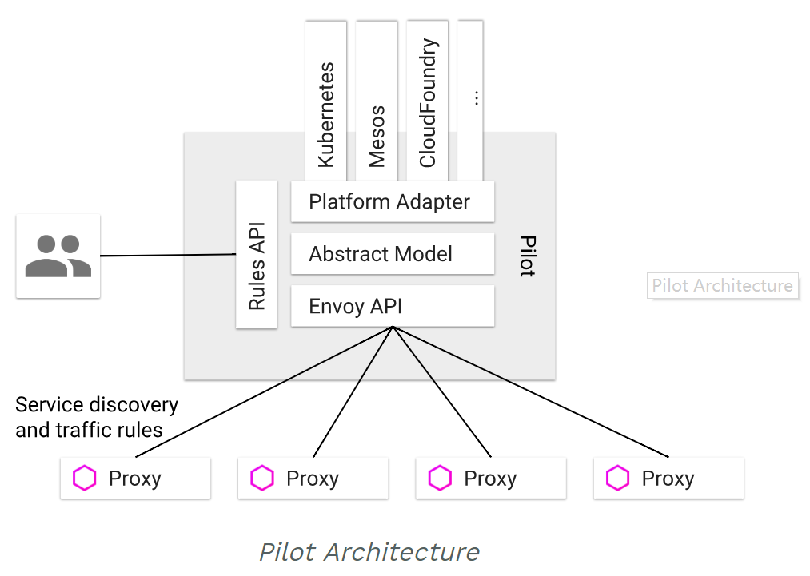
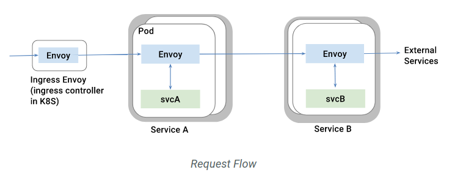

# Managing the ebb and flow of traffic

Istio is a pretty nifty tool when it comes to managing traffic. It can route on a dime, balance like a ballerina, and recover from failure with the resilience of a roly-poly bug. It even has a flair for the dramatic with its fault injection feature.


The duo responsible for these features is none other than Pilot and Envoy. They cater to all traffic going into and out of a container:

* As the heartbeat of the system, Pilot manages and configures all the Envoy instances within the service mesh.
* Envoy takes a more logistical role, maintaining load balancing and health check information. This enables it to evenly distribute traffic amongst target instances while strictly adhering to assigned routing rules.





## Upgrading the application programming interface (API)

In versions of Istio preceding 0.7.X, `config.istio.io/v1alpha2` was all that was available. With the release of 0.8.0, Istio designers elevated to `networking.istio.io/v1alpha3`. They also took the chance to rename a few traffic management resources:

* Say goodbye to RouteRule and shake hands with `VirtualService`. This feature now governs how service requests within the mesh are routed, taking factors like host, sourceLabels, and http headers into account. They've also got more tricks up their sleeve, including support for percentages, timeouts, retries, and error injection.
* DestinationPolicy got a facelift into `DestinationRule`. It's the guideline for routing strategies, including circuit breakers, load balancing, and Transport Layer Security (TLS).
* EgressRule made way for `ServiceEntry`. This cosmopolitan feature acknowledges services beyond the mesh walls, supporting two kinds: internal and external. Internal entries are akin to the in-house services, explicitly added to the mesh. External entries, on the other hand, signify services outside the mesh. When dealing with the latter, mutual TLS authentication is off-limits, and policy enforcement has to take place at the client end, unlike in-house services.
* Meet `Gateway`, the new Ingress. It's all about harmonizing border network traffic load.

## Service discovery and load balancing

In order to run the show, Istio presumes containers register with it upon launching (either manually or through the injection of an Envoy sidecar to the Pod). Once Envoy catches a request from the outside world, it executes load balancing. There are several balancing algorithms in its arsenal, such as round-robin, random, and smallest load. Moreover, Envoy regularly checks the health status of service back-end containers, automatically removing and restoring them in their times of illness and health respectively. Within the container, an HTTP 503 can also indicate its removal from load-balancing.


### Take charge of your traffic

Istio operates under the assumption that all traffic entering and exiting the service network is transported through an Envoy proxy. The Envoy sidecar, armed with iptables, redirects traffic coming to the Pod and from it to the Envoy process monitored port (more specifically, port 15001):

```bash
*nat
:PREROUTING ACCEPT [0:0]
:INPUT ACCEPT [1:60]
:OUTPUT ACCEPT [482:44962]
:POSTROUTING ACCEPT [482:44962]
:ISTIO_INBOUND - [0:0]
:ISTIO_IN_REDIRECT - [0:0]
:ISTIO_OUTPUT - [0:0]
:ISTIO_REDIRECT - [0:0]
-A PREROUTING -p tcp -j ISTIO_INBOUND
-A OUTPUT -p tcp -j ISTIO_OUTPUT
-A ISTIO_INBOUND -p tcp -m tcp --dport 9080 -j ISTIO_IN_REDIRECT
-A ISTIO_IN_REDIRECT -p tcp -j REDIRECT --to-ports 15001
-A ISTIO_OUTPUT ! -d 127.0.0.1/32 -o lo -j ISTIO_REDIRECT
-A ISTIO_OUTPUT -m owner --uid-owner 1337 -j RETURN
-A ISTIO_OUTPUT -m owner --gid-owner 1337 -j RETURN
-A ISTIO_OUTPUT -d 127.0.0.1/32 -j RETURN
-A ISTIO_OUTPUT -j ISTIO_REDIRECT
-A ISTIO_REDIRECT -p tcp -j REDIRECT --to-ports 15001
```

## Bouncing back from failures

In the face of adversity, Istio has a resilient set of recovery tools ready for deployment:

* A timeout feature to avoid excessive waiting.
* Retry procedures, with options to cap the maximum retry time and vary the retry intervals.
* Health checks to automatically sideline any unfit containers.
* Request limitations, such as the number of concurrent requests and connections.
* Circuit-breaking to stop the spread of problems.

These features are all conveniently adjustable via VirtualService. For the user named "Jason", you can set it to return 500, while other users can access normally:

```yaml
apiVersion: networking.istio.io/v1alpha3
kind: VirtualService
metadata:
  name: ratings
spec:
  hosts:
  - ratings
  http:
  - match:
    - headers:
        cookie:
          regex: "^(.*?;)?(user=jason)(;.*)?$"
    fault:
      abort:
        percent: 100
        httpStatus: 500
    route:
    - destination:
        host: ratings
        subset: v1
  - route:
    - destination:
        host: ratings
        subset: v1
```

And here's how you can handle circuit braking:

```bash
cat <<EOF | istioctl create -f -
apiVersion: networking.istio.io/v1alpha3
kind: DestinationRule
metadata:
  name: httpbin
spec:
  host: httpbin
  trafficPolicy:
    connectionPool:
      tcp:
        maxConnections: 1
      http:
        http1MaxPendingRequests: 1
        maxRequestsPerConnection: 1
    outlierDetection:
      http:
        consecutiveErrors: 1
        interval: 1s
        baseEjectionTime: 3m
        maxEjectionPercent: 100
EOF
```

## Stirring up trouble

Who says Istio is just about smooth sailing? It can also deliberately induce failure to simulate real-world problems that applications may encounter. These mess-maker features, which can be configured through VirtualService, include:

* Injecting delays for testing network latency and service overload.
* Forcefully failing to test how the application deals with failure.

You can create a 2-second delay with the following configuration:

```yaml
apiVersion: networking.istio.io/v1alpha3
kind: VirtualService
metadata:
  name: ratings
spec:
  hosts:
  - ratings
  http:
  - fault:
      delay:
        percent: 100
        fixedDelay: 2s
    route:
    - destination:
        host: ratings
        subset: v1
```

## Rolling out the red carpet for "Canary deployments"


Start off with deploying bookinfo and configuring the default route for version v1:

```bash
# The following commands assume that the bookinfo sample app is deployed. If not, you can deploy it using the commands below.
$ kubectl apply -f <(istioctl kube-inject -f samples/bookinfo/platform/kube/bookinfo.yaml)
# At this point, three versions of the reviews service rotate in a load balancing manner.

# Create a default route that forwards all requests to version v1.
$ istioctl create -f samples/bookinfo/routing/route-rule-all-v1.yaml

$ kubectl get virtualservice reviews -o yaml
apiVersion: networking.istio.io/v1alpha3
kind: VirtualService
metadata:
  name: reviews
spec:
  hosts:
  - reviews
  http:
  - route:
    - destination:
        host: reviews
        subset: v1
```

### Example 1: Route 10% of the traffic to version v2 and the remaining to version v1.

```bash
cat <<EOF | istioctl create -f -
apiVersion: networking.istio.io/v1alpha3
kind: VirtualService
metadata:
  name: reviews
spec:
  hosts:
    - reviews
  http:
  - route:
    - destination:
        host: reviews
        subset: v1
      weight: 75
    - destination:
        host: reviews
        subset: v2
      weight: 25
EOF
```

### Example 2: All requests from user "Jason" go to version v2.

```bash
cat <<EOF | istioctl replace -f -
apiVersion: networking.istio.io/v1alpha3
kind: VirtualService
metadata:
  name: ratings
spec:
  hosts:
  - ratings
  http:
  - match:
    - sourceLabels:
        app: reviews
        version: v2
      headers:
        end-user:
          exact: jason
EOF
```

### Example 3: Make the switch and move everything to version v2.

```bash
cat <<EOF | istioctl replace -f -
apiVersion: networking.istio.io/v1alpha3
kind: VirtualService
metadata:
  name: reviews
spec:
  hosts:
  - reviews
  http:
  - route:
    - destination:
        host: reviews
        subset: v2
EOF
```

### Example 4: Put a cap on concurrent access.

```bash
cat <<EOF | istioctl create -f -
apiVersion: networking.istio.io/v1alpha3
kind: DestinationRule
metadata:
  name: reviews
spec:
  host: reviews
  subsets:
  - name: v1
    labels:
      version: v1
    trafficPolicy:
      connectionPool:
        tcp:
          maxConnections: 100
EOF
```

To see the effect of limited access times, you can use [wrk](https://github.com/wg/wrk) to apply pressure to the application:

```bash
export BOOKINFO_URL=$(kubectl get po -n istio-system -l istio=ingress -o jsonpath={.items[0].status.hostIP}):$(kubectl get svc -n istio-system istio-ingress -o jsonpath={.spec.ports[0].nodePort})
wrk -t1 -c1 -d20s http://$BOOKINFO_URL/productpage
```

## The Gateway

At deployment, Istio automatically bootstraps an [Istio Gateway](https://istio.io/docs/reference/config/istio.networking.v1alpha3/#Gateway) to oversee Ingress access.

```bash
# prepare
kubectl apply -f <(istioctl kube-inject -f samples/httpbin/httpbin.yaml)
openssl req -x509 -nodes -days 365 -newkey rsa:2048 -keyout /tmp/tls.key -out /tmp/tls.crt -subj "/CN=httpbin.example.com"

# get ingress external IP (suppose load balancer service)
kubectl get svc istio-ingressgateway -n istio-system
export INGRESS_HOST=$(kubectl -n istio-system get service istio-ingressgateway -o jsonpath='{.status.loadBalancer.ingress[0].ip}')
export INGRESS_PORT=$(kubectl -n istio-system get service istio-ingressgateway -o jsonpath='{.spec.ports[?(@.name=="http")].port}')
export SECURE_INGRESS_PORT=$(kubectl -n istio-system get service istio-ingressgateway -o jsonpath='{.spec.ports[?(@.name=="https")].port}')

# create gateway
cat <<EOF | istioctl create -f -
apiVersion: networking.istio.io/v1alpha3
kind: Gateway
metadata:
  name: httpbin-gateway
spec:
  selector:
    istio: ingressgateway # use Istio default gateway implementation
  servers:
  - port:
      number: 80
      name: http
      protocol: HTTP
    hosts:
    - "httpbin.example.com"
EOF

# configure routes for the gateway
cat <<EOF | istioctl create -f -
apiVersion: networking.istio.io/v1alpha3
kind: VirtualService
metadata:
  name: httpbin
spec:
  hosts:
  - "httpbin.example.com"
  gateways:
  - httpbin-gateway
  http:
  - match:
    - uri:
        prefix: /status
    - uri:
        prefix: /delay
    route:
    - destination:
        port:
          number: 8000
        host: httpbin
EOF

# validate 200
curl --resolve httpbin.example.com:$INGRESS_PORT:$INGRESS_HOST -HHost:httpbin.example.com -I http://httpbin.example.com:$INGRESS_PORT/status/200

# invalidate 404
curl --resolve httpbin.example.com:$INGRESS_PORT:$INGRESS_HOST -HHost:httpbin.example.com -I http://httpbin.example.com:$INGRESS_PORT/headers
```

To use TLS:

```bash
kubectl create -n istio-system secret tls istio-ingressgateway-certs --key /tmp/tls.key --cert /tmp/tls.crt

cat <<EOF | istioctl replace -f -
apiVersion: networking.istio.io/v1alpha3
kind: Gateway
metadata:
  name: httpbin-gateway
spec:
  selector:
    istio: ingressgateway # use istio default ingress gateway
  servers:
  - port:
      number: 80
      name: http
      protocol: HTTP
    hosts:
    - "httpbin.example.com"
  - port:
      number: 443
      name: https
      protocol: HTTPS
    tls:
      mode: SIMPLE
      serverCertificate: /etc/istio/ingressgateway-certs/tls.crt
      privateKey: /etc/istio/ingressgateway-certs/tls.key
    hosts:
    - "httpbin.example.com"
EOF


# validate 200
curl --resolve httpbin.example.com:$SECURE_INGRESS_PORT:$INGRESS_HOST -HHost:httpbin.example.com -I -k https://httpbin.example.com:$SECURE_INGRESS_PORT/status/200
```

## Egress traffic

By default, Istio commands both incoming and outgoing container traffic, meaning containers cannot access services outside the Kubernetes cluster. However, with the help of ServiceEntry, certain containers can gain egress access.

```yaml
$ cat <<EOF | istioctl create -f -
apiVersion: networking.istio.io/v1alpha3
kind: ServiceEntry
metadata:
  name: httpbin-ext
spec:
  hosts:
  - httpbin.org
  ports:
  - number: 80
    name: http
    protocol: HTTP
EOF

$ cat <<EOF | istioctl create -f -
apiVersion: networking.istio.io/v1alpha3
kind: VirtualService
metadata:
  name: httpbin-ext
spec:
  hosts:
    - httpbin.org
  http:
  - timeout: 3s
    route:
      - destination:
          host: httpbin.org
        weight: 100
EOF
```

Note that the ServiceEntry feature only supports HTTP, TCP, and HTTPS. To address other protocols, IP ranges must be used through `--includeIPRanges`:

```bash
helm template @install/kubernetes/helm/istio@ --name istio --namespace istio-system --set global.proxy.includeIPRanges="10.0.0.1/24" -x @templates/sidecar-injector-configmap.yaml@ | kubectl apply -f -
```

## Looking in the mirror

```bash
cat <<EOF | istioctl replace -f -
apiVersion: networking.istio.io/v1alpha3
kind: VirtualService
metadata:
  name: httpbin
spec:
  hosts:
    - httpbin
  http:
  - route:
    - destination:
        host: httpbin
        subset: v1
      weight: 100
    mirror:
      host: httpbin
      subset: v2
EOF
```

## Reference documents

* [Istio traffic management overview](https://istio.io/docs/concepts/traffic-management/)
