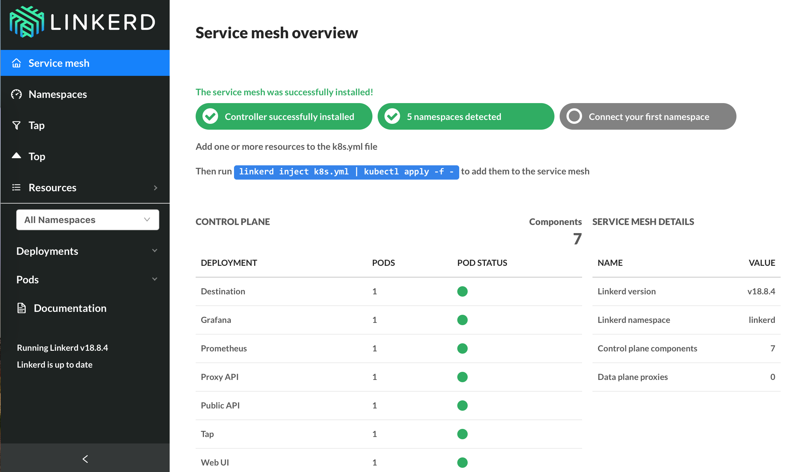

# Linkerd2 (Conduit)

Linkerd2 （曾命名为 [Conduit](https://conduit.io)） 是 Buoyant 公司推出的下一代轻量级服务网格框架，开源在 <https://github.com/linkerd/linkerd2>。与 linkerd 不同的是，它专用于 Kubernetes 集群中，并且比 linkerd 更轻量级（基于 Rust 和 Go，没有了 JVM 等大内存的开销），可以以 sidecar 的方式把代理服务跟实际服务的 Pod 运行在一起（这点跟 Istio 类似）。Linkerd2 的主要特性包括：

- 轻量级，速度快，每个代理容器仅占用 10mb RSS，并且额外延迟只有亚毫妙级
- 安全，基于 Rust，默认开启 TLS
- 端到端可视化
- 增强 Kubernetes 的可靠性、可视性以及安全性

## 部署

```sh
$ linkerd install | kubectl apply -f -
namespace/linkerd configured
serviceaccount/linkerd-controller configured
clusterrole.rbac.authorization.k8s.io/linkerd-linkerd-controller configured
clusterrolebinding.rbac.authorization.k8s.io/linkerd-linkerd-controller configured
serviceaccount/linkerd-prometheus configured
clusterrole.rbac.authorization.k8s.io/linkerd-linkerd-prometheus configured
clusterrolebinding.rbac.authorization.k8s.io/linkerd-linkerd-prometheus configured
service/api configured
service/proxy-api configured
deployment.extensions/controller configured
service/web configured
deployment.extensions/web configured
service/prometheus configured
deployment.extensions/prometheus configured
configmap/prometheus-config configured
service/grafana configured
deployment.extensions/grafana configured
configmap/grafana-config configured

$ kubectl -n linkerd get svc
NAME         TYPE        CLUSTER-IP     EXTERNAL-IP   PORT(S)             AGE
api          ClusterIP   10.0.173.27    <none>        8085/TCP            163m
grafana      ClusterIP   10.0.49.44     <none>        3000/TCP            163m
prometheus   ClusterIP   10.0.205.82    <none>        9090/TCP            163m
proxy-api    ClusterIP   10.0.170.201   <none>        8086/TCP            163m
web          ClusterIP   10.0.88.136    <none>        8084/TCP,9994/TCP   163m

$ kubectl -n linkerd get pod          
NAME                          READY     STATUS    RESTARTS   AGE
controller-67489d768d-75wjz   5/5       Running   0          163m
grafana-5df745d8b8-pv6tf      2/2       Running   0          163m
prometheus-d96f9bf89-2s6jg    2/2       Running   0          163m
web-5cd59f97b6-wf8nk          2/2       Running   0          57s
```

## Dashboard

```sh
$ linkerd dashboard
Linkerd dashboard available at:
http://127.0.0.1:37737/api/v1/namespaces/linkerd/services/web:http/proxy/
Grafana dashboard available at:
http://127.0.0.1:37737/api/v1/namespaces/linkerd/services/grafana:http/proxy/
Opening Linkerd dashboard in the default browser
```



## 示例应用

```sh
curl https://run.linkerd.io/emojivoto.yml \
  | linkerd inject - \
  | kubectl apply -f -
```

查看服务的网络流量统计情况：

```sh
linkerd -n emojivoto stat deployment
NAME       MESHED   SUCCESS      RPS   LATENCY_P50   LATENCY_P95   LATENCY_P99   TLS
emoji         1/1   100.00%   8.1rps           1ms           1ms           1ms    0%
vote-bot      1/1         -        -             -             -             -     -
voting        1/1    87.88%   1.1rps           1ms           1ms           1ms    0%
web           1/1    93.65%   2.1rps           1ms           9ms          88ms    0%
```

跟踪服务的网络流量

```sh
$ linkerd -n emojivoto tap deploy voting
req id=0:809 src=10.244.6.239:57202 dst=10.244.1.237:8080 :method=POST :authority=voting-svc.emojivoto:8080 :path=/emojivoto.v1.VotingService/VoteDoughnut
rsp id=0:809 src=10.244.6.239:57202 dst=10.244.1.237:8080 :status=200 latency=478µs
end id=0:809 src=10.244.6.239:57202 dst=10.244.1.237:8080 grpc-status=OK duration=7µs response-length=5B
req id=0:810 src=10.244.6.239:57202 dst=10.244.1.237:8080 :method=POST :authority=voting-svc.emojivoto:8080 :path=/emojivoto.v1.VotingService/VoteDoughnut
rsp id=0:810 src=10.244.6.239:57202 dst=10.244.1.237:8080 :status=200 latency=419µs
end id=0:810 src=10.244.6.239:57202 dst=10.244.1.237:8080 grpc-status=OK duration=8µs response-length=5B
```

## 参考文档

- [A SERVICE MESH FOR KUBERNETES](https://buoyant.io/2016/10/04/a-service-mesh-for-kubernetes-part-i-top-line-service-metrics/)
- [Service Mesh Pattern](http://philcalcado.com/2017/08/03/pattern_service_mesh.html)
- <https://linkerd.io/2/overview/>

