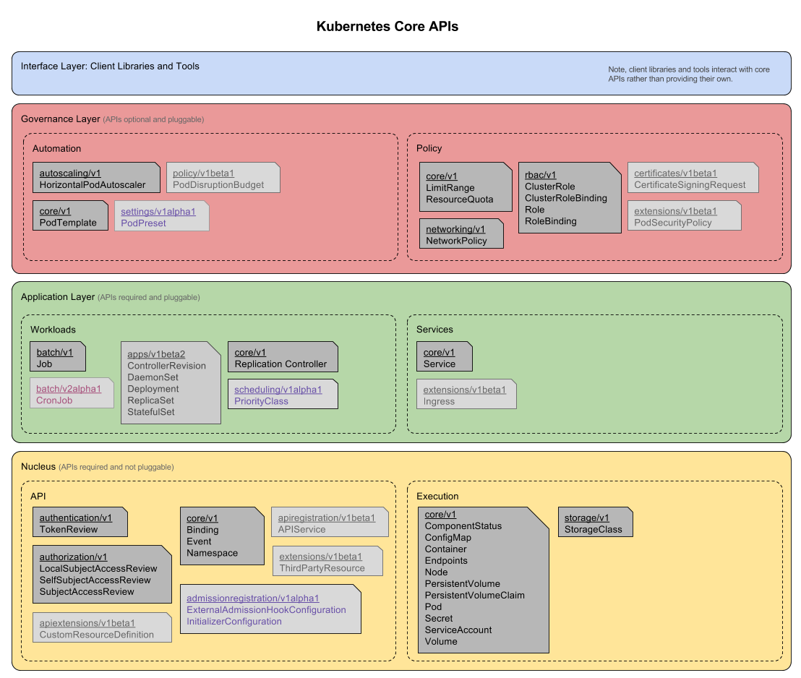

# Kubernetes 架构

Kubernetes 最初源于谷歌内部的 Borg，提供了面向应用的容器集群部署和管理系统。Kubernetes 的目标旨在消除编排物理 / 虚拟计算，网络和存储基础设施的负担，并使应用程序运营商和开发人员完全将重点放在以容器为中心的原语上进行自助运营。Kubernetes 也提供稳定、兼容的基础（平台），用于构建定制化的 workflows 和更高级的自动化任务。
Kubernetes 具备完善的集群管理能力，包括多层次的安全防护和准入机制、多租户应用支撑能力、透明的服务注册和服务发现机制、内建负载均衡器、故障发现和自我修复能力、服务滚动升级和在线扩容、可扩展的资源自动调度机制、多粒度的资源配额管理能力。
Kubernetes 还提供完善的管理工具，涵盖开发、部署测试、运维监控等各个环节。

## Borg 简介

Borg 是谷歌内部的大规模集群管理系统，负责对谷歌内部很多核心服务的调度和管理。Borg 的目的是让用户能够不必操心资源管理的问题，让他们专注于自己的核心业务，并且做到跨多个数据中心的资源利用率最大化。

Borg 主要由 BorgMaster、Borglet、borgcfg 和 Scheduler 组成，如下图所示

* BorgMaster 是整个集群的大脑，负责维护整个集群的状态，并将数据持久化到 Paxos 存储中；
* Scheduer 负责任务的调度，根据应用的特点将其调度到具体的机器上去；
* Borglet 负责真正运行任务（在容器中）；
* borgcfg 是 Borg 的命令行工具，用于跟 Borg 系统交互，一般通过一个配置文件来提交任务。

## Kubernetes 架构

Kubernetes 借鉴了 Borg 的设计理念，比如 Pod、Service、Labels 和单 Pod 单 IP 等。Kubernetes 的整体架构跟 Borg 非常像，如下图所示

Kubernetes 主要由以下几个核心组件组成：

- etcd 保存了整个集群的状态；
- kube-apiserver 提供了资源操作的唯一入口，并提供认证、授权、访问控制、API 注册和发现等机制；
- kube-controller-manager 负责维护集群的状态，比如故障检测、自动扩展、滚动更新等；
- kube-scheduler 负责资源的调度，按照预定的调度策略将 Pod 调度到相应的机器上；
- kubelet 负责维持容器的生命周期，同时也负责 Volume（CVI）和网络（CNI）的管理；
- Container runtime 负责镜像管理以及 Pod 和容器的真正运行（CRI），默认的容器运行时为 Docker；
- kube-proxy 负责为 Service 提供 cluster 内部的服务发现和负载均衡；

除了核心组件，还有一些推荐的 Add-ons：

- kube-dns 负责为整个集群提供 DNS 服务
- Ingress Controller 为服务提供外网入口
- Heapster 提供资源监控
- Dashboard 提供 GUI
- Federation 提供跨可用区的集群
- Fluentd-elasticsearch 提供集群日志采集、存储与查询

### 分层架构

Kubernetes 设计理念和功能其实就是一个类似 Linux 的分层架构，如下图所示

* 核心层：Kubernetes 最核心的功能，对外提供 API 构建高层的应用，对内提供插件式应用执行环境
* 应用层：部署（无状态应用、有状态应用、批处理任务、集群应用等）和路由（服务发现、DNS 解析等）
* 管理层：系统度量（如基础设施、容器和网络的度量），自动化（如自动扩展、动态 Provision 等）以及策略管理（RBAC、Quota、PSP、NetworkPolicy 等）
* 接口层：kubectl 命令行工具、客户端 SDK 以及集群联邦
* 生态系统：在接口层之上的庞大容器集群管理调度的生态系统，可以划分为两个范畴
  * Kubernetes 外部：日志、监控、配置管理、CI、CD、Workflow、FaaS、OTS 应用、ChatOps 等
  * Kubernetes 内部：CRI、CNI、CVI、镜像仓库、Cloud Provider、集群自身的配置和管理等

### 核心组件

### 核心 API

### 生态系统

关于分层架构，可以关注下 Kubernetes 社区正在推进的 [Kubernetes architectural roadmap](https://github.com/kubernetes/community/tree/master/sig-architecture)。

## 参考文档

- [Kubernetes design and architecture](https://github.com/kubernetes/community/blob/master/contributors/design-proposals/architecture/architecture.md)
- <http://queue.acm.org/detail.cfm?id=2898444>
- <http://static.googleusercontent.com/media/research.google.com/zh-CN//pubs/archive/43438.pdf>
- <http://thenewstack.io/kubernetes-an-overview>
- [Kubernetes Architecture SIG](https://github.com/kubernetes/community/tree/master/sig-architecture)
