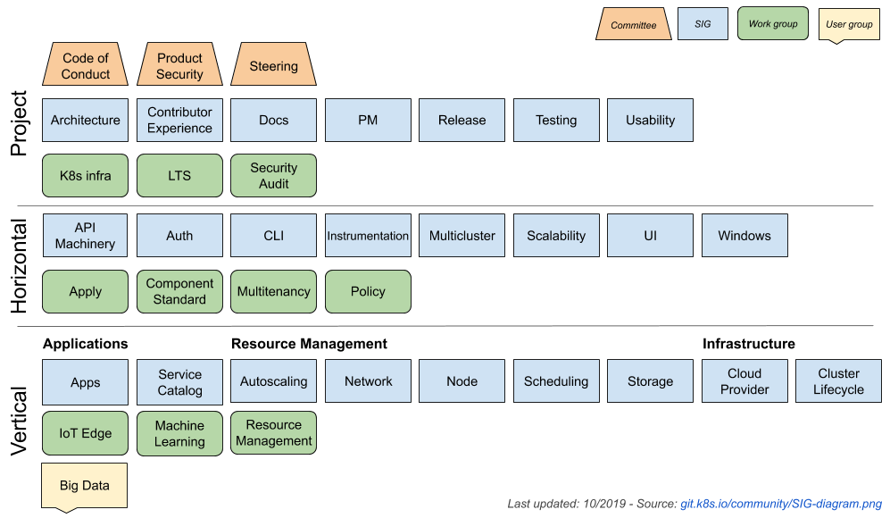

# Community Contributions

Contributing to the thriving Kubernetes community can take many forms, including reporting coding bugs, making problem corrections and feature implementations, adding or fixing documentation, and helping users troubleshoot issues.

## Community Structure

The Kubernetes community is divided into three key parts:

* [Steering committee](http://blog.kubernetes.io/2017/10/kubernetes-community-steering-committee-election-results.html)
* [Special Interest Groups (SIG)](https://github.com/kubernetes/community/blob/master/sig-list.md)
* [Working Groups (WG)](https://github.com/kubernetes/community/blob/master/sig-list.md#master-working-group-list)

A picture is worth a thousand words - have a look at the following chart to understand the Kubernetes community better:



## Contributing to the Main Branch through Pull Requests

If changes need to be made to the Kubernetes code, you can submit a Pull Request (PR) to the main branch of Kubernetes. This follows the standard Github workflow:


Here are some strategies to expedite the merging of your PR:

* Use small, separable commits for different features, and even separate Pull Requests for them.
* Document logic where necessary to explain changes.
* Adhere to code conventions, referring to the [Coding Conventions](https://github.com/kubernetes/community/blob/master/contributors/guide/coding-conventions.md), [API Conventions](https://github.com/kubernetes/community/blob/master/contributors/devel/sig-architecture/api-conventions.md) and [kubectl Conventions](https://github.com/kubernetes/community/blob/master/contributors/devel/sig-cli/kubectl-conventions.md) guidelines as needed.
* Ensure the modified part passes local unit and functional tests.
* Make use of [Bot commands](https://prow.k8s.io/command-help) to set correct labels or retry failed tests.

## Pull Requests to Release Branches

Issues in release branches are usually first fixed in the main branch (sending a Pull Request there and merging it after code review) then cherry-picked into an older branch (like `release-1.7`).

For the main branch’s PR, once the `cherrypick-candidate` label is added by the reviewer, the cherry-picking into the older branch can start. But first, you'll need to install [hub](https://github.com/github/hub), a tool provided by Github:

```bash
# on macOS
brew install hub

# on others
go get github.com/github/hub
```

Then run the script below to automatically cherry-pick and send a PR to the desired branch. In this example, `upstream/release-1.7` is the target release branch and `51870` is the PR number:

```bash
hack/cherry_pick_pull.sh upstream/release-1.7 51870
```

Follow the instructions in the output afterward. If errors occur during merging, manually merge conflicts in a separate terminal and execute `git add . && git am --continue`, then continue until the PR is successfully submitted.

Bear in mind: Each PR submitted to a release branch requires routine code reviews and approval from the release manager of the corresponding version. Lists of all release managers for every version can be found [here](https://github.com/kubernetes/sig-release/blob/master/release-managers.md).

## Useful Resources

Encountered difficulties in making community contributions? Feel free to refer to these guidelines:

* [**Kubernetes Contributor Community**](https://kubernetes.io/community/)
* [**Kubernetes Contributor Guide**](https://github.com/kubernetes/community/tree/master/contributors/guide)
* [**Kubernetes Developer Guide**](https://github.com/kubernetes/community/tree/master/contributors/devel)
* [**Kubernetes Contributor Documentation**](https://www.kubernetes.dev/docs/)
* [Special Interest Groups](https://github.com/kubernetes/community)
* [Feature Tracking and Backlog](https://github.com/kubernetes/features)
* [Community Expectations](https://github.com/kubernetes/community/blob/master/contributors/guide/expectations.md)
* [Kubernetes release managers](https://github.com/kubernetes/sig-release/blob/master/release-managers.md)