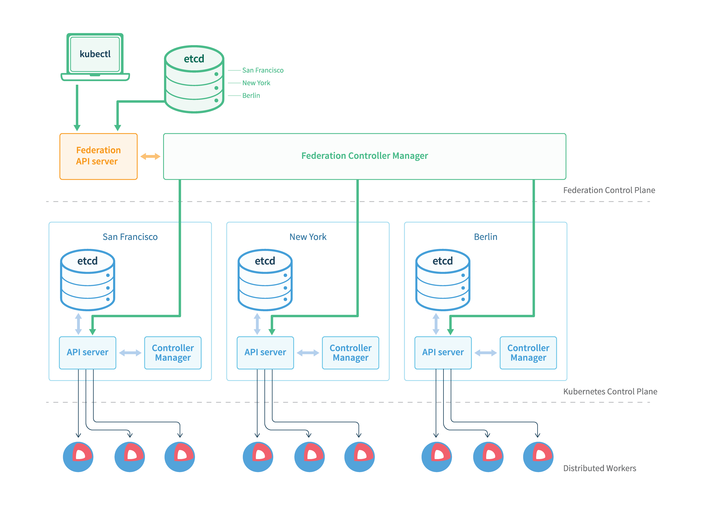

# Federation

K8s在1.3版本里发布了beta版的Federation功能。在云计算环境中，服务的作用距离范围从近到远一般可以有：同主机（Host，Node）、跨主机同可用区（Available Zone）、跨可用区同地区（Region）、跨地区同服务商（Cloud Service Provider）、跨云平台。K8s的设计定位是单一集群在同一个地域内，因为同一个地区的网络性能才能满足K8s的调度和计算存储连接要求。而联合集群服务就是为提供跨Region跨服务商K8s集群服务而设计的。Federation需要Cloud Provider的支持，如GCE或者AWS。

每个Federation有自己的分布式存储、API Server和Controller Manager。用户可以通过Federation的API Server注册该Federation的成员K8s Cluster。当用户通过Federation的API Server创建、更改API对象时，Federation API Server会在自己所有注册的子K8s Cluster都创建一份对应的API对象。在提供业务请求服务时，K8s Federation会先在自己的各个子Cluster之间做负载均衡，而对于发送到某个具体K8s Cluster的业务请求，会依照这个K8s Cluster独立提供服务时一样的调度模式去做K8s Cluster内部的负载均衡。而Cluster之间的负载均衡是通过域名服务的负载均衡来实现的。


所有的设计都尽量不影响K8s Cluster现有的工作机制，这样对于每个子K8s集群来说，并不需要更外层的有一个K8s Federation，也就是意味着所有现有的K8s代码和机制不需要因为Federation功能有任何变化。



Federation主要包括三个组件

- federation-apiserver：类似kube-apiserver，但提供的是跨集群的REST API
- federation-controller-manager：类似kube-controller-manager，但提供多集群状态的同步机制
- kubefed：Federation管理命令行工具

## Federation创建

```sh
kubefed init fellowship \
    --host-cluster-context=rivendell \
    --dns-provider="google-clouddns" \
    --dns-zone-name="example.com." \
    --apiserver-enable-basic-auth=true \
    --apiserver-enable-token-auth=true
```

## 参考文档

- [Kubernetes federation](https://kubernetes.io/docs/concepts/cluster-administration/federation/)
- [kubefed](https://kubernetes.io/docs/tasks/federation/set-up-cluster-federation-kubefed/)