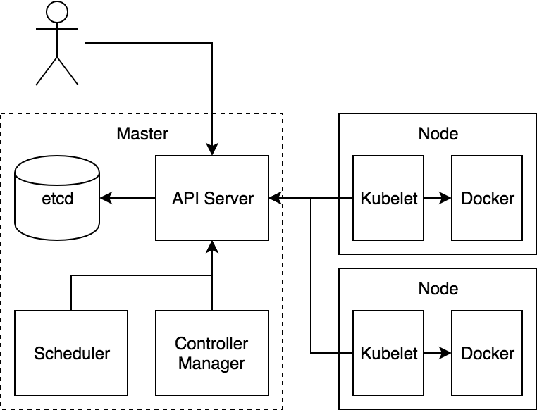
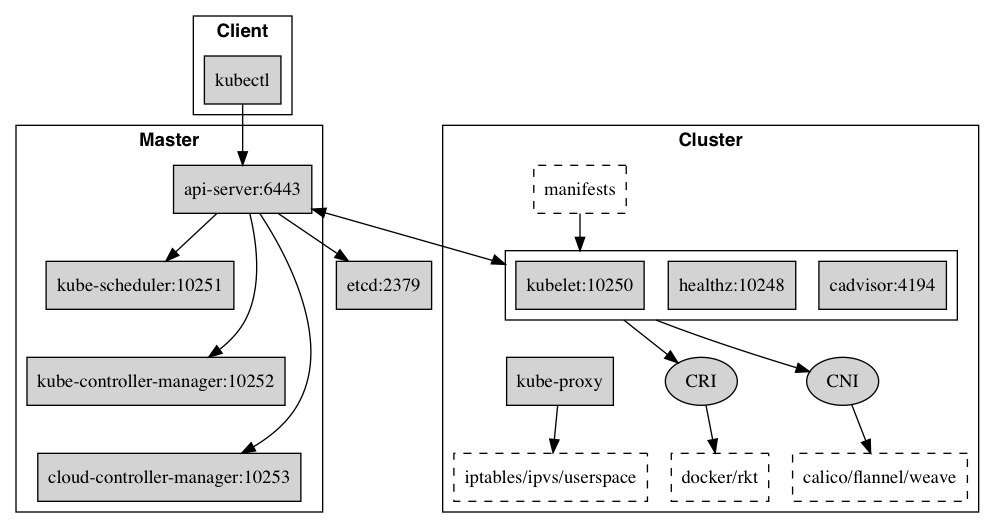

# 核心组件

Kubernetes 主要由以下几个核心组件组成:

- etcd 保存了整个集群的状态；
- apiserver 提供了资源操作的唯一入口，并提供认证、授权、访问控制、API 注册和发现等机制；
- controller manager 负责维护集群的状态，比如故障检测、自动扩展、滚动更新等；
- scheduler 负责资源的调度，按照预定的调度策略将 Pod 调度到相应的机器上；
- kubelet 负责维护容器的生命周期，同时也负责 Volume（CVI）和网络（CNI）的管理；
- Container runtime 负责镜像管理以及 Pod 和容器的真正运行（CRI）；
- kube-proxy 负责为 Service 提供 cluster 内部的服务发现和负载均衡；

## 组件通信

Kubernetes 多组件之间的通信原理为

- apiserver 负责 etcd 存储的所有操作，且只有 apiserver 才直接操作 etcd 集群
- apiserver 对内（集群中的其他组件）和对外（用户）提供统一的 REST API，其他组件均通过 apiserver 进行通信
  - controller manager、scheduler、kube-proxy 和 kubelet 等均通过 apiserver watch API 监测资源变化情况，并对资源作相应的操作
  - 所有需要更新资源状态的操作均通过 apiserver 的 REST API 进行
- apiserver 也会直接调用 kubelet API（如 logs, exec, attach 等），默认不校验 kubelet 证书，但可以通过 `--kubelet-certificate-authority` 开启（而 GKE 通过 SSH 隧道保护它们之间的通信）

比如典型的创建 Pod 的流程为

1. 用户通过 REST API 创建一个 Pod
2. apiserver 将其写入 etcd
3. scheduluer 检测到未绑定 Node 的 Pod，开始调度并更新 Pod 的 Node 绑定
4. kubelet 检测到有新的 Pod 调度过来，通过 container runtime 运行该 Pod
5. kubelet 通过 container runtime 取到 Pod 状态，并更新到 apiserver 中

## 端口号

### Master node(s)

| Protocol | Direction | Port Range | Purpose                          |
| -------- | --------- | ---------- | -------------------------------- |
| TCP      | Inbound   | 6443*      | Kubernetes API server            |
| TCP      | Inbound   | 8080       | Kubernetes API insecure server   |
| TCP      | Inbound   | 2379-2380  | etcd server client API           |
| TCP      | Inbound   | 10250      | Kubelet API                      |
| TCP      | Inbound   | 10251      | kube-scheduler healthz           |
| TCP      | Inbound   | 10252      | kube-controller-manager healthz  |
| TCP      | Inbound   | 10253      | cloud-controller-manager healthz |
| TCP      | Inbound   | 10255      | Read-only Kubelet API            |
| TCP      | Inbound   | 10256      | kube-proxy healthz               |

### Worker node(s)

| Protocol | Direction | Port Range  | Purpose               |
| -------- | --------- | ----------- | --------------------- |
| TCP      | Inbound   | 4194        | Kubelet cAdvisor      |
| TCP      | Inbound   | 10248       | Kubelet healthz       |
| TCP      | Inbound   | 10249       | kube-proxy metrics    |
| TCP      | Inbound   | 10250       | Kubelet API           |
| TCP      | Inbound   | 10255       | Read-only Kubelet API |
| TCP      | Inbound   | 10256       | kube-proxy healthz    |
| TCP      | Inbound   | 30000-32767 | NodePort Services**   |

## 参考文档

- [Master-Node communication](https://kubernetes.io/docs/concepts/architecture/master-node-communication/)
- [Core Kubernetes: Jazz Improv over Orchestration](https://blog.heptio.com/core-kubernetes-jazz-improv-over-orchestration-a7903ea92ca)
- [Installing kubeadm](https://kubernetes.io/docs/setup/independent/install-kubeadm/#check-required-ports)
