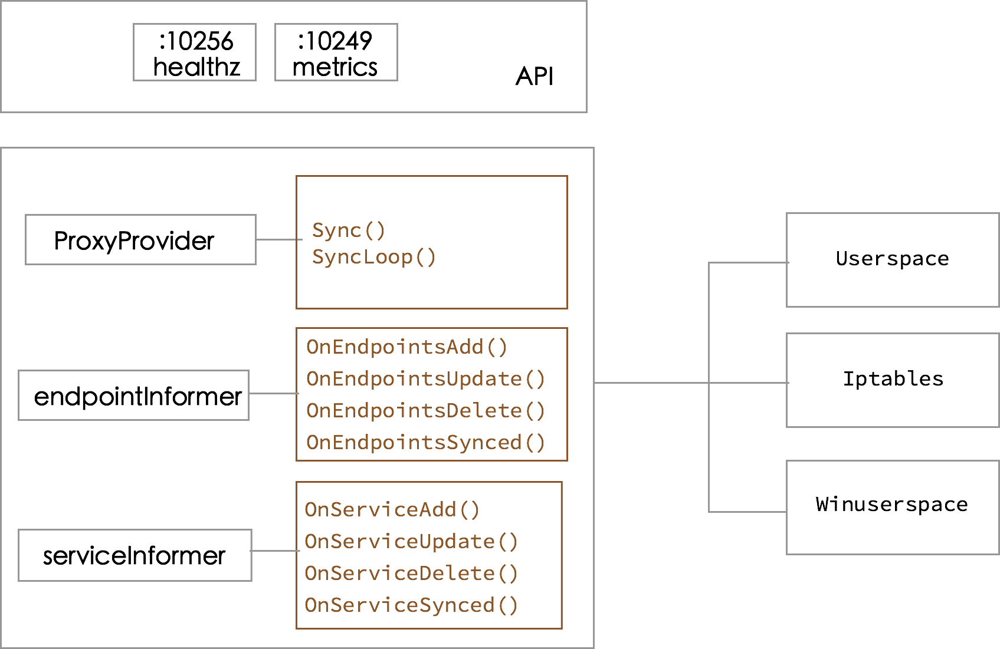

# kube-proxy

每台机器上都运行一个 kube-proxy 服务，它监听 API server 中 service 和 endpoint 的变化情况，并通过 iptables 等来为服务配置负载均衡（仅支持 TCP 和 UDP）。

kube-proxy 可以直接运行在物理机上，也可以以 static pod 或者 daemonset 的方式运行。

kube-proxy 当前支持以下几种实现

- userspace：最早的负载均衡方案，它在用户空间监听一个端口，所有服务通过 iptables 转发到这个端口，然后在其内部负载均衡到实际的 Pod。该方式最主要的问题是效率低，有明显的性能瓶颈。
- iptables：目前推荐的方案，完全以 iptables 规则的方式来实现 service 负载均衡。该方式最主要的问题是在服务多的时候产生太多的 iptables 规则，非增量式更新会引入一定的时延，大规模情况下有明显的性能问题
- ipvs：为解决 iptables 模式的性能问题，v1.11 新增了 ipvs 模式（v1.8 开始支持测试版，并在 v1.11 GA），采用增量式更新，并可以保证 service 更新期间连接保持不断开
- winuserspace：同 userspace，但仅工作在 windows 节点上

注意：使用 ipvs 模式时，需要预先在每台 Node 上加载内核模块 `nf_conntrack_ipv4`, `ip_vs`, `ip_vs_rr`, `ip_vs_wrr`, `ip_vs_sh` 等。

```sh
# load module <module_name>
modprobe -- ip_vs
modprobe -- ip_vs_rr
modprobe -- ip_vs_wrr
modprobe -- ip_vs_sh
modprobe -- nf_conntrack_ipv4

# to check loaded modules, use
lsmod | grep -e ip_vs -e nf_conntrack_ipv4
# or
cut -f1 -d " "  /proc/modules | grep -e ip_vs -e nf_conntrack_ipv4
```

## Iptables 示例


(图片来自[cilium/k8s-iptables-diagram](https://github.com/cilium/k8s-iptables-diagram))

```sh
# Masquerade
-A KUBE-MARK-DROP -j MARK --set-xmark 0x8000/0x8000
-A KUBE-MARK-MASQ -j MARK --set-xmark 0x4000/0x4000
-A KUBE-POSTROUTING -m comment --comment "kubernetes service traffic requiring SNAT" -m mark --mark 0x4000/0x4000 -j MASQUERADE

# clusterIP and publicIP
-A KUBE-SERVICES ! -s 10.244.0.0/16 -d 10.98.154.163/32 -p tcp -m comment --comment "default/nginx: cluster IP" -m tcp --dport 80 -j KUBE-MARK-MASQ
-A KUBE-SERVICES -d 10.98.154.163/32 -p tcp -m comment --comment "default/nginx: cluster IP" -m tcp --dport 80 -j KUBE-SVC-4N57TFCL4MD7ZTDA
-A KUBE-SERVICES -d 12.12.12.12/32 -p tcp -m comment --comment "default/nginx: loadbalancer IP" -m tcp --dport 80 -j KUBE-FW-4N57TFCL4MD7ZTDA

# Masq for publicIP
-A KUBE-FW-4N57TFCL4MD7ZTDA -m comment --comment "default/nginx: loadbalancer IP" -j KUBE-MARK-MASQ
-A KUBE-FW-4N57TFCL4MD7ZTDA -m comment --comment "default/nginx: loadbalancer IP" -j KUBE-SVC-4N57TFCL4MD7ZTDA
-A KUBE-FW-4N57TFCL4MD7ZTDA -m comment --comment "default/nginx: loadbalancer IP" -j KUBE-MARK-DROP

# Masq for nodePort
-A KUBE-NODEPORTS -p tcp -m comment --comment "default/nginx:" -m tcp --dport 30938 -j KUBE-MARK-MASQ
-A KUBE-NODEPORTS -p tcp -m comment --comment "default/nginx:" -m tcp --dport 30938 -j KUBE-SVC-4N57TFCL4MD7ZTDA

# load balance for each endpoints
-A KUBE-SVC-4N57TFCL4MD7ZTDA -m comment --comment "default/nginx:" -m statistic --mode random --probability 0.33332999982 -j KUBE-SEP-UXHBWR5XIMVGXW3H
-A KUBE-SVC-4N57TFCL4MD7ZTDA -m comment --comment "default/nginx:" -m statistic --mode random --probability 0.50000000000 -j KUBE-SEP-TOYRWPNILILHH3OR
-A KUBE-SVC-4N57TFCL4MD7ZTDA -m comment --comment "default/nginx:" -j KUBE-SEP-6QCC2MHJZP35QQAR

# endpoint #1
-A KUBE-SEP-6QCC2MHJZP35QQAR -s 10.244.3.4/32 -m comment --comment "default/nginx:" -j KUBE-MARK-MASQ
-A KUBE-SEP-6QCC2MHJZP35QQAR -p tcp -m comment --comment "default/nginx:" -m tcp -j DNAT --to-destination 10.244.3.4:80

# endpoint #2
-A KUBE-SEP-TOYRWPNILILHH3OR -s 10.244.2.4/32 -m comment --comment "default/nginx:" -j KUBE-MARK-MASQ
-A KUBE-SEP-TOYRWPNILILHH3OR -p tcp -m comment --comment "default/nginx:" -m tcp -j DNAT --to-destination 10.244.2.4:80

# endpoint #3
-A KUBE-SEP-UXHBWR5XIMVGXW3H -s 10.244.1.2/32 -m comment --comment "default/nginx:" -j KUBE-MARK-MASQ
-A KUBE-SEP-UXHBWR5XIMVGXW3H -p tcp -m comment --comment "default/nginx:" -m tcp -j DNAT --to-destination 10.244.1.2:80
```

如果服务设置了 `externalTrafficPolicy: Local` 并且当前 Node 上面没有任何属于该服务的 Pod，那么在 `KUBE-XLB-4N57TFCL4MD7ZTDA` 中会直接丢掉从公网 IP 请求的包：

```sh
-A KUBE-XLB-4N57TFCL4MD7ZTDA -m comment --comment "default/nginx: has no local endpoints" -j KUBE-MARK-DROP
```

## ipvs 示例

[Kube-proxy IPVS mode](https://github.com/kubernetes/kubernetes/blob/master/pkg/proxy/ipvs/README.md) 列出了各种服务在 IPVS 模式下的工作原理。


```sh
$ ipvsadm -ln
IP Virtual Server version 1.2.1 (size=4096)
Prot LocalAddress:Port Scheduler Flags
  -> RemoteAddress:Port           Forward Weight ActiveConn InActConn
TCP  10.0.0.1:443 rr persistent 10800
  -> 192.168.0.1:6443             Masq    1      1          0
TCP  10.0.0.10:53 rr
  -> 172.17.0.2:53                Masq    1      0          0
UDP  10.0.0.10:53 rr
  -> 172.17.0.2:53                Masq    1      0          0
```

注意，IPVS 模式也会使用 iptables 来执行 SNAT 和 IP 伪装（MASQUERADE），并使用 ipset 来简化 iptables 规则的管理：

| ipset 名                       | 成员                                                         | 用途                                                         |
| ------------------------------ | ------------------------------------------------------------ | ------------------------------------------------------------ |
| KUBE-CLUSTER-IP                | All service IP + port                                        | Mark-Masq for cases that `masquerade-all=true` or `clusterCIDR` specified |
| KUBE-LOOP-BACK                 | All service IP + port + IP                                   | masquerade for solving hairpin purpose                       |
| KUBE-EXTERNAL-IP               | service external IP + port                                   | masquerade for packages to external IPs                      |
| KUBE-LOAD-BALANCER             | load balancer ingress IP + port                              | masquerade for packages to load balancer type service        |
| KUBE-LOAD-BALANCER-LOCAL       | LB ingress IP + port with `externalTrafficPolicy=local`      | accept packages to load balancer with `externalTrafficPolicy=local` |
| KUBE-LOAD-BALANCER-FW          | load balancer ingress IP + port with `loadBalancerSourceRanges` | package filter for load balancer with `loadBalancerSourceRanges` specified |
| KUBE-LOAD-BALANCER-SOURCE-CIDR | load balancer ingress IP + port + source CIDR                | package filter for load balancer with `loadBalancerSourceRanges` specified |
| KUBE-NODE-PORT-TCP             | nodeport type service TCP port                               | masquerade for packets to nodePort(TCP)                      |
| KUBE-NODE-PORT-LOCAL-TCP       | nodeport type service TCP port with `externalTrafficPolicy=local` | accept packages to nodeport service with `externalTrafficPolicy=local` |
| KUBE-NODE-PORT-UDP             | nodeport type service UDP port                               | masquerade for packets to nodePort(UDP)                      |
| KUBE-NODE-PORT-LOCAL-UDP       | nodeport type service UDP port with`externalTrafficPolicy=local` | accept packages to nodeport service with`externalTrafficPolicy=local` |

## 启动 kube-proxy 示例

```sh
kube-proxy --kubeconfig=/var/lib/kubelet/kubeconfig --cluster-cidr=10.240.0.0/12 --feature-gates=ExperimentalCriticalPodAnnotation=true --proxy-mode=iptables
```

## kube-proxy 工作原理

kube-proxy 监听 API server 中 service 和 endpoint 的变化情况，并通过 userspace、iptables、ipvs 或 winuserspace 等 proxier 来为服务配置负载均衡（仅支持 TCP 和 UDP）。



## kube-proxy 不足

kube-proxy 目前仅支持 TCP 和 UDP，不支持 HTTP 路由，并且也没有健康检查机制。这些可以通过自定义 [Ingress Controller](../plugins/ingress.md) 的方法来解决。
