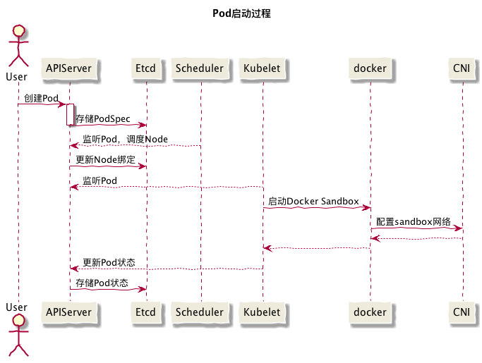

# kubelet工作原理

如下kubelet内部组件结构图所示，Kubelet由许多内部组件构成

- Kubelet API，包括10250端口的认证API、4194端口的cAdvisor API、10255端口的只读API以及10248端口的健康检查API
- syncLoop：从API或者manifest目录接收Pod更新，发送到podWorkers处理，大量使用channel处理来处理异步请求
- 辅助的manager，如cAdvisor、PLEG、Volume Manager等，处理syncLoop以外的其他工作
- CRI：容器执行引擎接口，负责与container runtime shim通信
- 容器执行引擎，如dockershim、rkt等（注：rkt暂未完成CRI的迁移）
- 网络插件，目前支持CNI和kubenet


## Pod启动流程



## 访问 Node Summary API

通过 Kubelet 的 10255 端口可以查询 Node 的汇总指标。有两种访问方式

- 在集群内部可以直接访问 kubelet 的 10255 端口，比如 `http://<node-name>:10255/stats/summary`
- 在集群外部可以借助 `kubectl proxy` 来访问，比如

```sh
kubectl proxy&
curl http://localhost:8001/api/v1/proxy/nodes/<node-name>:10255/stats/summary
```
