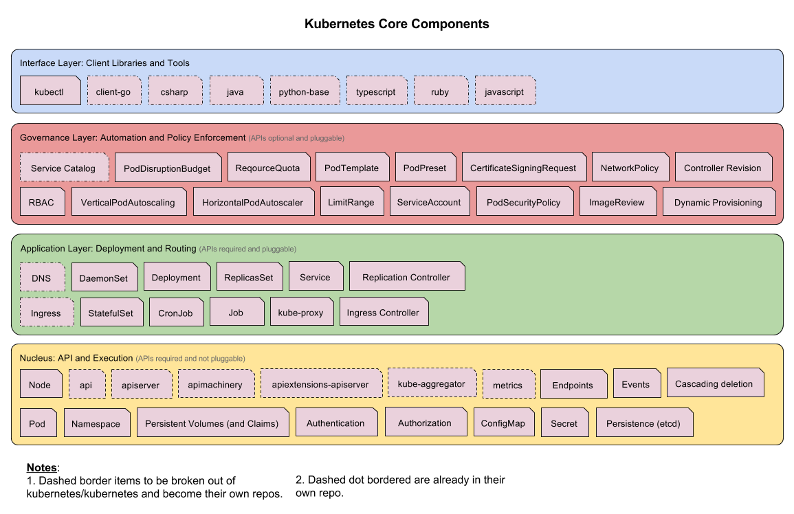

# Architectural Principles

Kubernetes, originally sourced from Google's in-house tool Borg, offers a container-centric, application-oriented cluster deployment, and management system. Its ultimate goal is to alleviate the burdensome orchestration of physical/virtual computing, networking, and storage infrastructure, allowing app operators and developers to focus fully on self-operation with container-centric primitives. Furthermore, Kubernetes offers a stable and compatible platform for crafting custom workflows and advanced automation tasks. Impressively, it possesses robust cluster management capabilities, including multilevel security defenses and admission mechanisms, support for multi-tenant apps, transparent service registration and discovery mechanisms, built-in load balancers, fault detection and self-repair mechanisms, service rolling upgrades and online expansion, scalable automatic resource scheduling mechanisms and multi-granularity resource quota management capabilities. Besides, Kubernetes features a comprehensive suite of management tools, covering the entire course of development, deployment testing, and operational monitoring.

## An Introduction to Borg

Borg serves as Google's internal large-scale cluster management system, handling the scheduling and management of many of Google's core services. Borg aims to let users put aside resource management concerns, allowing them to concentrate on their primary businesses while maximizing resource use across multiple data centers. 

The Borg system mainly consists of BorgMaster, Borglet, borgcfg, and Scheduler, as shown in the following diagram

* BorgMaster is the brain of the whole cluster, maintaining the overall cluster status and persisting data into Paxos storage;
* The Scheduler is responsible for task scheduling, assigning specific tasks to specific machines based on application characteristics;
* Borglet is tasked with the actual running of tasks (in containers);
* borgcfg is Borg’s command-line tool for interacting with the Borg system, usually by submitting tasks through a configuration file.

## Kubernetes Architecture

Bringing Borg's design philosophy into play, including concepts such as Pod, Service, Labels, and single Pod single IP, the overall architecture of Kubernetes is strikingly similar to Borg's, as can be seen in the picture below

Kubernetes mainly comprises the following core components:

* etcd stores the whole cluster's state;
* kube-apiserver offers a unique entry for resource operations, and supplies authentication, authorization, access control, API registration, and discovery mechanisms;
* kube-controller-manager is tasked with maintaining the cluster's state, handling tasks like fault detection, automatic expansion, rolling updates, etc.;
* kube-scheduler is responsible for resource scheduling, allocating Pods to respective machines following predetermined scheduling strategies;
* kubelet is in charge of container lifecycle maintenance, along with Volume (CVI) and network (CNI) management;
* Container runtime handles image management and the actual running of Pods and containers (CRI), with Docker being the default container runtime;
* kube-proxy provides service discovery and load balancing within the cluster for Service entities;

Other than core components, there are some recommended add-ons:

* kube-dns provides the entire cluster with DNS services
* Ingress Controller provides external entrances for services
* Heapster offers resource monitoring
* Dashboard provides GUI
* Federation provides clusters that span availability zones
* Fluentd-elasticsearch provides cluster log collection, storage, and query

### Layered Architecture

Kubernetes' design principles and functions mirror a Linux-style layered architecture, as the diagram below depicts

* Core layer: Kubernetes offers core functions, providing an API for building higher-level applications externally and offering a plugin-style application execution environment internally.
* Application layer: Includes deployment (stateless applications, stateful applications, batch processing tasks, cluster applications, etc.) and routing (service discovery, DNS resolution, etc.)
* Management layer: Measures system metrics (such as infrastructure, containers, and network metrics), enhances automation (like automatic scaling, dynamic provisioning, etc.), and manages policies (like RBAC, Quota, PSP, NetworkPolicy, etc.)
* Interface layer: Includes the kubectl command-line tool, client SDK, and cluster federation.
* Ecosystem: Above the interface layer lies a vast ecosystem of container cluster management scheduling, divisible into two realms:
  * External to Kubernetes: Logging, monitoring, configuration management, CI, CD, workflow, FaaS, OTS applications, ChatOps, etc.
  * Internal to Kubernetes: CRI, CNI, CVI, image repositories, Cloud Provider, cluster's configuration and management, etc.

### Core Components

### Core API

### Ecosystem

For more information on the layered architecture, be sure to look into the [Kubernetes architectural roadmap](https://github.com/kubernetes/community/tree/master/sig-architecture) that the Kubernetes community is currently promoting.

## References

* [Kubernetes design and architecture](https://github.com/kubernetes/community/blob/master/contributors/design-proposals/architecture/architecture.md)
* [http://queue.acm.org/detail.cfm?id=2898444](http://queue.acm.org/detail.cfm?id=2898444)
* [http://static.googleusercontent.com/media/research.google.com/zh-CN//pubs/archive/43438.pdf](http://static.googleusercontent.com/media/research.google.com/zh-CN//pubs/archive/43438.pdf)
* [http://thenewstack.io/kubernetes-an-overview](http://thenewstack.io/kubernetes-an-overview)
* [Kubernetes Architecture SIG](https://github.com/kubernetes/community/tree/master/sig-architecture)
