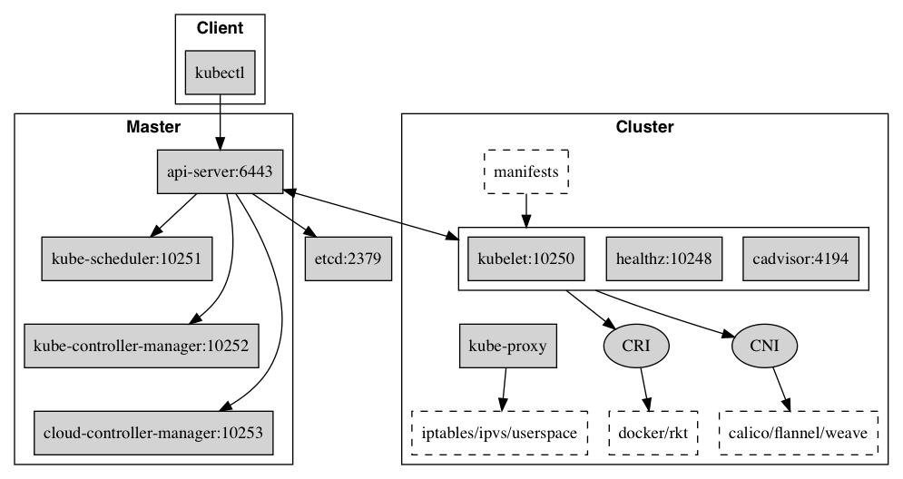

# Core Components

Kubernetes is mainly composed of the following core components:

* Etcd that preserves the state of the whole cluster;
* API Server offers a unique entrance for resource operations, providing mechanisms such as authentication, authorization, access control, API registration and discovery;
* Controller Manager that maintains the state of the cluster, such as fault detection, automatic expansion, rolling updates, etc.;
* Scheduler that manages the allocation of resources, scheduling Podes to the corresponding machines based on the predetermined scheduling strategies;
* Kubelet that maintains the lifecycle of containers, as well as managing Volumes (CVI) and networks (CNI);
* Container Runtime, being responsible for image management and the actual operation of Pods and containers (CRI);
* Kube-proxy, providing service discovery and load balancing within the cluster for the service.

## Component Communication

The principle of communication between multiple components in Kubernetes is described as follows:

* API Server manages all operations with the etcd storage, while it’s the only one that operates the etcd cluster directly.
* API Server provides a unified REST API for the inside (other components in the cluster) and the outside (users), and all other components communicate with each other through the API Server.
  * Controller Manager, Scheduler, Kube-proxy, Kubelet, etc., all watch the changes in the resources through the watch API of the API Server, and manipulate the resources accordingly.
  * All operations that require updating the status of resources happen through the REST API of the API Server.
* API Server also directly calls Kubelet API (such as logs, exec, attach, etc.), does not verify the Kubelet certificate by default, but can be turned on with `--kubelet-certificate-authority` (while GKE protects their communication through SSH tunnel).

The typical flow of creating a Pod goes as follows:

1. A user creates a Pod via REST API
2. API Server writes into etcd
3. Scheduler checks unbound node Pod, begins scheduling and updates the node binding of the Pod
4. Kubelet detects a new scheduled Pod and runs it via Container Runtime
5. Kubelet gets the status of Pod via Container Runtime and updates it to API Server

## Port Numbers

### Master node\(s\)

| Protocol | Direction | Port Range | Purpose |
| :--- | :--- | :--- | :--- |
| TCP | Inbound | 6443\* | Kubernetes API server |
| TCP | Inbound | 8080 | Kubernetes API insecure server |
| TCP | Inbound | 2379-2380 | etcd server client API |
| TCP | Inbound | 10250 | Kubelet API |
| TCP | Inbound | 10251 | kube-scheduler healthz |
| TCP | Inbound | 10252 | kube-controller-manager healthz |
| TCP | Inbound | 10253 | cloud-controller-manager healthz |
| TCP | Inbound | 10255 | Read-only Kubelet API |
| TCP | Inbound | 10256 | kube-proxy healthz |

### Worker node\(s\)

| Protocol | Direction | Port Range | Purpose |
| :--- | :--- | :--- | :--- |
| TCP | Inbound | 4194 | Kubelet cAdvisor |
| TCP | Inbound | 10248 | Kubelet healthz |
| TCP | Inbound | 10249 | kube-proxy metrics |
| TCP | Inbound | 10250 | Kubelet API |
| TCP | Inbound | 10255 | Read-only Kubelet API |
| TCP | Inbound | 10256 | kube-proxy healthz |
| TCP | Inbound | 30000-32767 | NodePort Services\*\* |

## Version Support Strategy

## Active Versions

The Kubernetes community currently maintains the latest three minor versions (such as 1.21.x, 1.20.x, 1.19.x), and each minor version has a one-year patch support cycle (9 months before 1.18). Patches for active versions are released approximately once a month, and the detailed release schedule can be found [here](https://github.com/kubernetes/website/blob/main/content/en/releases/patch-releases.md#upcoming-monthly-releases).

## Version Compatibility

* In a HA cluster, all kube-apiserver instances can only have a minor version difference at most (e.g., some are 1.21, some are 1.20)
* Kubelet can have up to two minor versions difference with kube-apiserver (like when kube-apiserver is 1.21, kubelet can be 1.21, 1.20, 1.19)
* Kube-controller-manager, kube-scheduler, and cloud-controller-manager can only have a minor version difference with kube-apiserver (like when kube-apiserver is 1.21, kube-controller-manager is 1.20)

## Upgrade Order

When upgrading the Kubernetes cluster (e.g., from 1.20.1 to 1.21.1), the following upgrade order and dependencies should be ensured:

* Before upgrading, make sure that the ValidatingWebhookConfiguration and MutatingWebhookConfiguration are upgraded to the latest API version (compatible with the new and old versions of kube-apiserver)
* All instances of kube-apiserver actually need to be upgraded before other components (like kube-controller-manager)
* Kube-controller-manager, kube-scheduler, and cloud-controller-manager can only be upgraded after kube-apiserver is upgraded
* Kubelet can only be upgraded after kube-apiserver is upgraded, and before upgrading, you need to `kubectl drain <node>` (i.e., kubelet does not support minor version upgrades locally)
* Kube-proxy needs to ensure that it is the same version as the kubelet on the same node.

## Reference Documents

* [Master-Node communication](https://kubernetes.io/docs/concepts/architecture/master-node-communication/)
* [Core Kubernetes: Jazz Improv over Orchestration](https://blog.heptio.com/core-kubernetes-jazz-improv-over-orchestration-a7903ea92ca)
* [Installing kubeadm](https://kubernetes.io/docs/setup/independent/install-kubeadm/#check-required-ports)
* [Version Skew Policy](https://kubernetes.io/releases/version-skew-policy/#supported-component-upgrade-order)