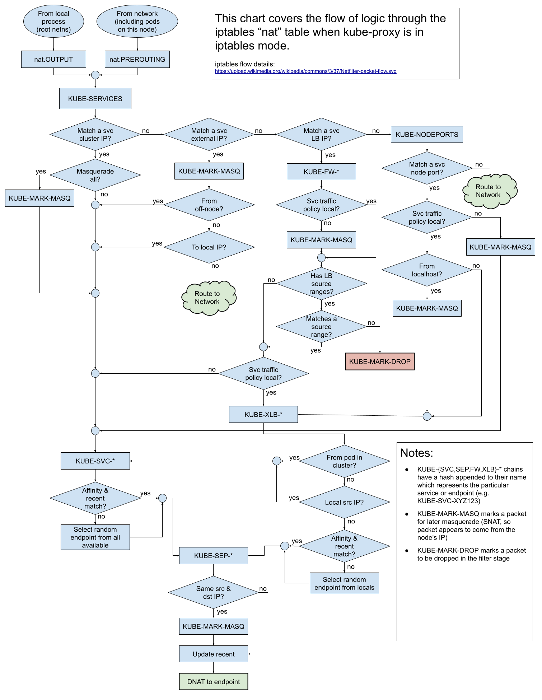

# Unraveling kube-proxy

A service known as kube-proxy operates on each machine, attentively observing the variations in the service and endpoint within the API server. Kube-proxy configures load balancing for services via mechanisms like iptables, keeping in mind that it only supports TCP and UDP. 

Kube-proxy can function directly on a physical machine, or operate in the style of a static pod or daemonset.

There are a few modes of operation available for kube-proxy:

* userspace: This is the earliest load balancing scheme. It operates on a port in user space, forwarding all services via iptables to this port. Inside, it handles load balancing to the actual Pod. Its most significant drawback is its inefficiency, creating an evident performance bottleneck.
* iptables: This is the currently recommended scheme. It brings service load balancing into existence using iptables rules alone. The trouble with this approach is that an exorbitant number of iptables rules may result in service overload, and non-incremental updates can introduce certain delays. In extensive situations, performance degradation is quite significant.
* ipvs: In order to counteract the performance problems of the iptables mode, ipvs mode was introduced in version v1.11 (support for test version began in v1.8, and it was introduced to the GA in v1.11). It updates incrementally and maintains connection consistency during service updates.
* winuserspace: Operating just like userspace, it only works on windows nodes.

When using ipvs mode, you will need to preload the kernel modules `nf_conntrack_ipv4`, `ip_vs`, `ip_vs_rr`, `ip_vs_wrr`, `ip_vs_sh`, etc., on each Node.

Check the diagram below for an illustration of Kube-proxy iptables


The image is from [cilium/k8s-iptables-diagram](https://github.com/cilium/k8s-iptables-diagram)

Now let's check out the Kube-proxy NAT Diagram



The image is from [kube-proxy iptables "nat" control flow](https://docs.google.com/drawings/d/1MtWL8qRTs6PlnJrW4dh8135_S9e2SaawT410bJuoBPk/edit)

In [Kube-proxy IPVS mode](https://github.com/kubernetes/kubernetes/blob/master/pkg/proxy/ipvs/README.md), you can find a detailed explanation of how different services work under IPVS mode.


Note that IPVS mode also uses iptables for tasks like SNAT and IP Masquerading (MASQUERADE), and uses ipset to simplify the management of iptables rules.

Let's look at how to start kube-proxy with this example:

```bash
kube-proxy --kubeconfig=/var/lib/kubelet/kubeconfig --cluster-cidr=10.240.0.0/12 --feature-gates=ExperimentalCriticalPodAnnotation=true --proxy-mode=iptables
```

To better understand how kube-proxy works:

kube-proxy monitors the changes in the service and endpoint within the API server. It configures load balancing (only supporting TCP and UDP) for services using proxiers such as userspace, iptables, ipvs, or winuserspace.


There are, however, some shortcomings of kube-proxy. It currently only supports TCP and UDP, and does not support HTTP routing or a health check mechanism. But these gaps can be closed by customizing an [Ingress Controller](../../extension/ingress/).