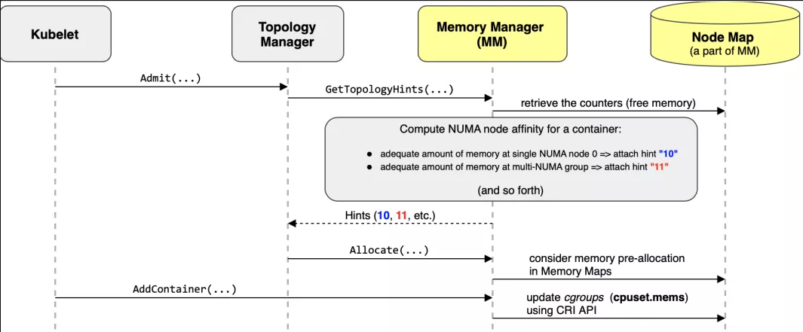

# Kubelet: The Heart of a Kubernetes Node

Each Node in a Kubernetes cluster runs a Kubelet service process that listens by default on port 10250. Kubelet receives and executes instructions from the Master node, managing Pods and their corresponding containers. The Kubelet process on each Node registers its node information to the API Server, regularly reports its Node's resource usage to the Master node, and monitors the Node and its containers’ resources through cAdvisor.

## Node Management in a Nutshell

Node management is mainly about node self-registration and updating their status:

* Kubelets can choose whether or not to register themselves with the API Server by setting the --register-node parameter at startup.
* If a Kubelet opts out of self-registration mode, users will need to manually configure Node resource information and inform the Kubelet of the API Server's location in their cluster.
* Upon starting, a Kubelet registers its Node information via the API Server and sends updates to it regularly. In response, the API Server writes this information into the etcd knowledge base.

## Managing Pods and Their Menagerie

### Getting a Pod Manifest

Kubelet works through a job description known as a PodSpec, described by a YAML or JSON object. Kubelet takes a collection of PodSpecs—which are provided through different mechanisms and mainly via apiserver—ensuring that Pods described in these PodSpecs are running healthily.

There are several ways of providing Kubelet with the list of Pods that need to be run on a node:

* File: Files in the configuration directory specified by the --config startup parameter (default:`/etc/kubernetes/manifests/`). This file is rechecked every 20 seconds (configurable).
* HTTP Endpoint (URL): Set by the --manifest-url startup parameter. This endpoint is checked every 20 seconds (configurable).
* API Server: Kubelet synchronizes the Pod list by listening to the etcd directory through the API Server.
* HTTP Server: Kubelet listens to HTTP requests and responds with a simple API to submit a new Pod list.

### Retrieving Pod List and Creating a Pod via the API Server

Using a Watch-List method via the API Server client (created when Kubelet starts), Kubelet monitors the "/registry/nodes/$node_name" and "/registry/pods" directories, loading any acquired information into its local cache.

Kubelet listens to etcd, and any operations against Pods get picked up by Kubelet. When it detects a new Pod bound to its Node, Kubelet creates the Pod as per its list’s instructions.

If a Pod on its Node has been modified, Kubelet responds accordingly. For instance, when a container in a Pod is deleted, Kubelet uses a DockerClient to remove the container. If a Pod on its Node is detected as deleted, Kubelet deletes the corresponding Pod and uses DockerClient to remove the containers within it.

Upon reading received information, if a Pod needs to be created or modified, Kubelet performs the following operations:

* Creates a data directory for the Pod;
* Reads the Pod list from the API Server;
* Mounts an external volume for the Pod;
* Downloads any Secrets used by the Pod;
* Checks Pods that are already running on the node. If a Pod does not have any containers or its Pause container is not running, it stops all the processes running inside the Pod’s containers. If there are containers within the Pod that needs to be deleted, these are removed;
* Creates a container for each Pod using the "kubernetes/pause" image. The Pause container takes over the network of all other containers in the Pod. Each time a new Pod is created, Kubelet first launches a Pause container, then proceeds to create other containers.
* Performs the following processes for each container in the Pod:
  1. Calculates a hash value for the container, and queries Docker for the corresponding container hash value using the container's name. If a container is found but the hash values are different, it terminates the Docker container process and the associated Pause container process. If the hash values match, no further action is taken;
  2. If a container has been stopped and does not have a specified restartPolicy, no further action is taken;
  3. The DockerClient downloads the container image and then runs the container.

### Static Pods

Any Pod that is created without using the API Server is known as a Static Pod. Kubelet reports the state of Static Pods to the API Server, which then creates a Mirror Pod to match the Static Pod. The state of the Mirror Pod accurately reflects the state of the Static Pod. When a Static Pod is deleted, its corresponding Mirror Pod is also removed.

## Health Check for Containers

Pods use two types of probes to verify a container's health status:

* \(1\) LivenessProbe: This determines if a container is healthy and tells Kubelet when a container is in an unhealthy state. If the LivenessProbe detects an unhealthy container, Kubelet deletes the container and deals with it according to the container’s restart policy. If a container does not include a LivenessProbe, Kubelet assumes the LivenessProbe’s response will always be “Success”.
* \(2\) ReadinessProbe: This checks if a container is ready to receive requests after startup. If the ReadinessProbe fails, the Pod's status is amended. The Endpoint Controller removes the Endpoint entry that contains the IP address of the Pod that houses the inspected container from the Service's Endpoint.

Kubelet utilizes the LivenessProbe in the containers periodically to diagnose the health status of containers. The LivenessProbe has three implementation methods:

* ExecAction: Runs a command within a container—if the command’s exit status code is 0, the container is deemed healthy;
* TCPSocketAction: performs a TCP check using the container’s IP address and port number—if the port is accessible, the container is considered healthy;
* HTTPGetAction: Uses the container’s IP address, port number, and route to call the HTTP GET method—if the response status code is greater than or equal to 200 and less than 400, the container is deemed to be in a healthy state.

LivenessProbe and ReadinessProbe probes are included in the spec.containers of the Pod definition.

## Keeping tabs on Resources with cAdvisor

In a Kubernetes cluster, the performance of applications can be monitored at various levels - containers, Pods, Service, and at the level of the entire cluster. The Heapster project provides a basic monitoring platform for Kubernetes cluster, functioning as a cluster-level monitoring and event data aggregator. Heapster runs as a Pod in the cluster and, through Kubelet, discovers all Nodes in the cluster and inspects how the Nodes utilize resources. Kubelet uses cAdvisor to acquire data about its Node and the containers therein. Heapster groups this information by associated labels and pushes it to a configurable backend for storage and visual representation. Supported backends include InfluxDB (using Grafana for visualization) and Google Cloud Monitoring.

cAdvisor, an open-source tool for container resource usage and performance analysis, is integrated into the Kubelet. When a Kubelet is started, cAdvisor is also fired up. Each cAdvisor monitors only one Node, automatically finding all containers running on that Node and gathering statistics on CPU, memory, filesystem, and network usage. Through the Root container on its Node, cAdvisor collects and analyzes comprehensive usage statistics for the Node.

cAdvisor exposes a simple UI through port 4194 of the Node it is housed in.

## Memory Manager Strategies

Introduced as an Alpha feature in Kubelet v1.21, Memory Manager Strategies provisions NUMA memory for Pods. Kubelet includes the --memory-manager-policy configuration for this feature, supporting two strategies:

- The default strategy is "none", which is equivalent to the Memory Manager Strategy feature being turned off;
- "Static" strategy: Allocates NUMA memory for Pods and ensures that Guaranteed Pods are reserved enough memory (Kubelet visits the '/var/lib/kubelet/memory_manager_state' file for status).



## Kubelet Eviction: Ensuring Resource Availability

Kubelet monitors resource usage and employs an eviction mechanism to prevent the exhaustion of compute and storage resources. During eviction, Kubelet stops all of a Pod’s containers and sets the PodPhase to Failed.

Kubelet checks regularly (`housekeeping-interval`) whether the system's resources have reached the configured eviction thresholds, which include:

| Eviction Signal | Description |
| :--- | :--- |
| `memory.available` |`memory.available` := `node.status.capacity[memory]` - `node.stats.memory.workingSet`. Technique to compute this is found [here].(<https://kubernetes.io/docs/tasks/administer-cluster/memory-available.sh>)
| `nodefs.available` | `nodefs.available` := `node.stats.fs.available`. This includes Kubelet Volumes, logs, etc.
| `nodefs.inodesFree` | `nodefs.inodesFree` := `node.stats.fs.inodesFree`.|
| `imagefs.available` | `imagefs.available` := `node.stats.runtime.imagefs.available`. This includes images and writable layers of containers.
| `imagefs.inodesFree` | `imagefs.inodesFree` := `node.stats.runtime.imagefs.inodesFree`.

These eviction thresholds can be set as a percentage or an absolute value, e.g.,

```bash
--eviction-hard=memory.available<500Mi,nodefs.available<1Gi,imagefs.available<100Gi
--eviction-minimum-reclaim="memory.available=0Mi,nodefs.available=500Mi,imagefs.available=2Gi"
--system-reserved=memory=1.5Gi
```

These eviction signals can be divided into soft and hard eviction:

* Soft Eviction: Used in conjunction with eviction grace periods (eviction-soft-grace-period and eviction-max-pod-grace-period). An eviction only takes place if the system resource reaches the soft eviction threshold and the grace period has elapsed.
* Hard Eviction: An eviction is immediately executed once the system resource crosses the hard eviction threshold.

Eviction actions involve reclaiming node resources and evicting user Pods:

* Reclaiming Node Resources
  * If the imagefs threshold is configured:
    * If the nodefs threshold is exceeded: Delete stopped Pods
    * If the imagefs threshold is exceeded: Delete unused images
  * If the imagefs threshold is not configured:
    * If the nodefs threshold is exceeded: Cleanse resources in the order of deleting stopped Pods and unused images
* Evicting User Pods
  * Eviction order: BestEffort, Burstable, Guaranteed
  * If the imagefs threshold is configured:
    * If the nodefs threshold is exceeded: Eviction based on nodefs usage (local volume + logs)
    * If the imagefs threshold is exceeded: Eviction based on imagefs usage (writable container layers)
  * If the imagefs threshold is not configured:
    * If the nodefs threshold is exceeded: Evicts based on total disk usage (local volume + logs + writable container layers)

In addition to eviction, Kubelet supports an array of container and image garbage collection options that will eventually get replaced by eviction:

| Garbage Collection Parameter | Eviction Parameter | Explanation |
| :--- | :--- | :--- |
| `--image-gc-high-threshold` | `--eviction-hard` or `--eviction-soft` | Existing eviction thresholds can trigger image garbage

## Kubelet API

The [Kubelet API](https://github.com/kubernetes/kubernetes/blob/master/pkg/kubelet/server/server.go#L93-L102) can be accessed through its exposed port or `kubectl get --raw /api/v1/nodes/$NODE/proxy/`. Some commonly used APIs include:

* `/metrics` - Query Kubelet metrics

* `/metrics/cadvisor` - Query Cadvisor metrics (including node and container metrics)

* `/metrics/resource` - Query resource usage metrics (including CPU and memory)

* `/metrics/probes` - Query probe metrics

* `/stats/summary` - Query node and Pod summary indicators

* `/pods` - Query the list of Pods

* `/logs` - Query node or container logs

* `/containerLogs/{podNamespace}/{podID}/{containerName}` - Query container logs

* `configz` - Query Kubelet configuration

* `/run`, `/exec`, `/attach`, and
