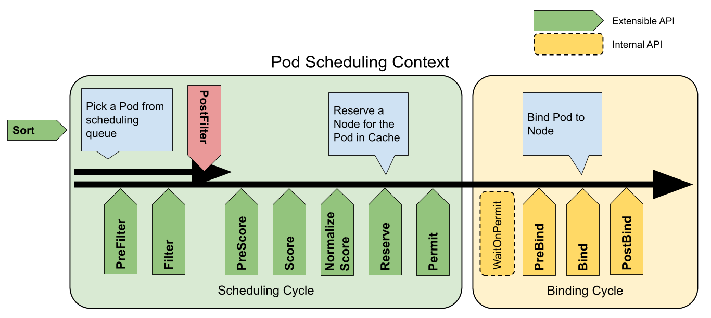

# kube-scheduler

kube-scheduler 负责分配调度 Pod 到集群内的节点上，它监听 kube-apiserver，查询还未分配 Node 的 Pod，然后根据调度策略为这些 Pod 分配节点（更新 Pod 的 `NodeName` 字段）。

调度器需要充分考虑诸多的因素：

* 公平调度
* 资源高效利用
* QoS
* affinity 和 anti-affinity
* 数据本地化（data locality）
* 内部负载干扰（inter-workload interference）
* deadlines

## 指定 Node 节点调度

有三种方式指定 Pod 只运行在指定的 Node 节点上

* nodeSelector：只调度到匹配指定 label 的 Node 上
* nodeAffinity：功能更丰富的 Node 选择器，比如支持集合操作
* podAffinity：调度到满足条件的 Pod 所在的 Node 上

### nodeSelector 示例

首先给 Node 打上标签

```bash
kubectl label nodes node-01 disktype=ssd
```

然后在 daemonset 中指定 nodeSelector 为 `disktype=ssd`：

```yaml
spec:
  nodeSelector:
    disktype: ssd
```

### nodeAffinity 示例

nodeAffinity 目前支持两种：requiredDuringSchedulingIgnoredDuringExecution 和 preferredDuringSchedulingIgnoredDuringExecution，分别代表必须满足条件和优选条件。比如下面的例子代表调度到包含标签 `kubernetes.io/e2e-az-name` 并且值为 e2e-az1 或 e2e-az2 的 Node 上，并且优选还带有标签 `another-node-label-key=another-node-label-value` 的 Node。

```yaml
apiVersion: v1
kind: Pod
metadata:
  name: with-node-affinity
spec:
  affinity:
    nodeAffinity:
      requiredDuringSchedulingIgnoredDuringExecution:
        nodeSelectorTerms:
        - matchExpressions:
          - key: kubernetes.io/e2e-az-name
            operator: In
            values:
            - e2e-az1
            - e2e-az2
      preferredDuringSchedulingIgnoredDuringExecution:
      - weight: 1
        preference:
          matchExpressions:
          - key: another-node-label-key
            operator: In
            values:
            - another-node-label-value
  containers:
  - name: with-node-affinity
    image: gcr.io/google_containers/pause:2.0
```

### podAffinity 示例

podAffinity 基于 Pod 的标签来选择 Node，仅调度到满足条件 Pod 所在的 Node 上，支持 podAffinity 和 podAntiAffinity。这个功能比较绕，以下面的例子为例：

* 如果一个 “Node 所在 Zone 中包含至少一个带有 `security=S1` 标签且运行中的 Pod”，那么可以调度到该 Node
* 不调度到 “包含至少一个带有 `security=S2` 标签且运行中 Pod” 的 Node 上

```yaml
apiVersion: v1
kind: Pod
metadata:
  name: with-pod-affinity
spec:
  affinity:
    podAffinity:
      requiredDuringSchedulingIgnoredDuringExecution:
      - labelSelector:
          matchExpressions:
          - key: security
            operator: In
            values:
            - S1
        topologyKey: failure-domain.beta.kubernetes.io/zone
    podAntiAffinity:
      preferredDuringSchedulingIgnoredDuringExecution:
      - weight: 100
        podAffinityTerm:
          labelSelector:
            matchExpressions:
            - key: security
              operator: In
              values:
              - S2
          topologyKey: kubernetes.io/hostname
  containers:
  - name: with-pod-affinity
    image: gcr.io/google_containers/pause:2.0
```

## Taints 和 tolerations

Taints 和 tolerations 用于保证 Pod 不被调度到不合适的 Node 上，其中 Taint 应用于 Node 上，而 toleration 则应用于 Pod 上。

目前支持的 taint 类型

* NoSchedule：新的 Pod 不调度到该 Node 上，不影响正在运行的 Pod
* PreferNoSchedule：soft 版的 NoSchedule，尽量不调度到该 Node 上
* NoExecute：新的 Pod 不调度到该 Node 上，并且删除（evict）已在运行的 Pod。Pod 可以增加一个时间（tolerationSeconds），

然而，当 Pod 的 Tolerations 匹配 Node 的所有 Taints 的时候可以调度到该 Node 上；当 Pod 是已经运行的时候，也不会被删除（evicted）。另外对于 NoExecute，如果 Pod 增加了一个 tolerationSeconds，则会在该时间之后才删除 Pod。

比如，假设 node1 上应用以下几个 taint

```bash
kubectl taint nodes node1 key1=value1:NoSchedule
kubectl taint nodes node1 key1=value1:NoExecute
kubectl taint nodes node1 key2=value2:NoSchedule
```

下面的这个 Pod 由于没有 tolerate`key2=value2:NoSchedule` 无法调度到 node1 上

```yaml
tolerations:
- key: "key1"
  operator: "Equal"
  value: "value1"
  effect: "NoSchedule"
- key: "key1"
  operator: "Equal"
  value: "value1"
  effect: "NoExecute"
```

而正在运行且带有 tolerationSeconds 的 Pod 则会在 600s 之后删除

```yaml
tolerations:
- key: "key1"
  operator: "Equal"
  value: "value1"
  effect: "NoSchedule"
- key: "key1"
  operator: "Equal"
  value: "value1"
  effect: "NoExecute"
  tolerationSeconds: 600
- key: "key2"
  operator: "Equal"
  value: "value2"
  effect: "NoSchedule"
```

注意，DaemonSet 创建的 Pod 会自动加上对 `node.alpha.kubernetes.io/unreachable` 和 `node.alpha.kubernetes.io/notReady` 的 NoExecute Toleration，以避免它们因此被删除。

## 优先级调度

从 v1.8 开始，kube-scheduler 支持定义 Pod 的优先级，从而保证高优先级的 Pod 优先调度。并从 v1.11 开始默认开启。

> 注：在 v1.8-v1.10 版本中的开启方法为
>
> * apiserver 配置 `--feature-gates=PodPriority=true` 和 `--runtime-config=scheduling.k8s.io/v1alpha1=true`
> * kube-scheduler 配置 `--feature-gates=PodPriority=true`

在指定 Pod 的优先级之前需要先定义一个 PriorityClass（非 namespace 资源），如

```yaml
apiVersion: v1
kind: PriorityClass
metadata:
  name: high-priority
value: 1000000
globalDefault: false
description: "This priority class should be used for XYZ service pods only."
```

其中

* `value` 为 32 位整数的优先级，该值越大，优先级越高
* `globalDefault` 用于未配置 PriorityClassName 的 Pod，整个集群中应该只有一个 PriorityClass 将其设置为 true

然后，在 PodSpec 中通过 PriorityClassName 设置 Pod 的优先级：

```yaml
apiVersion: v1
kind: Pod
metadata:
  name: nginx
  labels:
    env: test
spec:
  containers:
  - name: nginx
    image: nginx
    imagePullPolicy: IfNotPresent
  priorityClassName: high-priority
```

## 多调度器

如果默认的调度器不满足要求，还可以部署自定义的调度器。并且，在整个集群中还可以同时运行多个调度器实例，通过 `podSpec.schedulerName` 来选择使用哪一个调度器（默认使用内置的调度器）。

```yaml
apiVersion: v1
kind: Pod
metadata:
  name: nginx
  labels:
    app: nginx
spec:
  # 选择使用自定义调度器 my-scheduler
  schedulerName: my-scheduler
  containers:
  - name: nginx
    image: nginx:1.10
```

调度器的示例参见 [这里](../../extension/scheduler.md)。

## 调度器扩展

### 调度插件

从 1.19 开始，你可以借助 [Scheduling Framework](https://kubernetes.io/docs/concepts/scheduling-eviction/scheduling-framework/) 以插件的形式扩展调度器。如下图所示，就是 Pod 调度上下文以及调度框架公开的扩展点：



通过调度器配置文件 [Scheduler Configuration](https://kubernetes.io/docs/reference/scheduling/config/)，你可以配置 kube-scheduler 中的不同调度阶段，比如

```yaml
apiVersion: kubescheduler.config.k8s.io/v1beta1
kind: KubeSchedulerConfiguration
clientConnection:
  kubeconfig: "/etc/kubernetes/scheduler.conf"
profiles:
- schedulerName: default-scheduler
  plugins:
    score:
      enabled:
      - name: NetworkTraffic
      disabled:
      - name: "*"
  pluginConfig:
  - name: NetworkTraffic
    args:
      prometheusAddress: "http://prometheus-1616380099-server.monitor"
      networkInterface: "ens192"
      timeRangeInMinutes: 3
```

### 存储容量评分（v1.33 Alpha）

Kubernetes v1.33 引入了存储容量评分（Storage Capacity Scoring）这一 Alpha 特性，通过扩展 VolumeBinding 插件来增强基于节点存储容量的 Pod 调度。

#### 主要功能

- 在调度决策中考虑节点的存储容量
- 根据可用存储空间的多少对节点进行优先级排序
- 支持动态卷供应和资源优化
- 特别适用于需要本地持久化卷的工作负载

#### 使用场景

1. **本地持久化卷供应** - 为需要本地存储的应用选择最适合的节点
2. **资源利用率最大化** - 通过策略性放置工作负载提高存储利用率
3. **运营成本优化** - 通过高效的节点存储分配降低运营成本

#### 配置方法

该特性默认禁用，需要在调度器启动时开启功能特性：

```bash
kube-scheduler --feature-gates=StorageCapacityScoring=true
```

通过 VolumeBinding 插件配置存储容量评分策略：

```yaml
apiVersion: kubescheduler.config.k8s.io/v1
kind: KubeSchedulerConfiguration
profiles:
- schedulerName: default-scheduler
  pluginConfig:
  - name: VolumeBinding
    args:
      # 配置存储利用率和得分的对应关系
      shape:
      - utilization: 0     # 0% 利用率对应 0 分
        score: 0
      - utilization: 100   # 100% 利用率对应 10 分（优先选择存储使用率高的节点）
        score: 10
```

#### 注意事项

- 该特性取代了之前的 `VolumeCapacityPriority` 功能
- 默认配置优先选择可用存储容量更大的节点
- 目前处于 Alpha 阶段，生产环境使用需谨慎

### Dynamic Resource Allocation (DRA) 调度支持

从 Kubernetes v1.26 开始，调度器原生支持 Dynamic Resource Allocation (DRA)，为设备资源提供更灵活的调度能力。

#### DRA 调度特性

**v1.33 中的 DRA 调度增强：**

1. **设备感知调度** - 调度器可以根据设备的可用性、特性和状态进行 Pod 调度决策
2. **优先级列表支持** - 当 Pod 指定多个可接受的设备备选方案时，调度器按优先级顺序尝试分配最佳设备
3. **设备污点和容忍度** - 支持通过设备污点机制防止 Pod 调度到不合适的设备上
4. **分区设备调度** - 调度器能够识别和调度可分区的设备资源

#### DRA 调度工作流程

1. **筛选阶段 (Filter)**：
   - 检查节点是否有足够的设备资源满足 ResourceClaim
   - 验证设备污点和 Pod 容忍度的匹配关系
   - 确认设备驱动程序的兼容性

2. **评分阶段 (Score)**：
   - 根据设备利用率对节点进行评分
   - 优先选择有更好设备配置的节点
   - 考虑设备的地理位置和网络拓扑

3. **绑定阶段 (Bind)**：
   - 通过 DRA 驱动程序分配具体的设备
   - 更新 ResourceClaim 状态
   - 确保设备资源的原子性分配

#### 配置示例

启用 DRA 调度功能：

```bash
kube-scheduler --feature-gates=DynamicResourceAllocation=true
```

调度器配置：

```yaml
apiVersion: kubescheduler.config.k8s.io/v1
kind: KubeSchedulerConfiguration
profiles:
- schedulerName: default-scheduler
  plugins:
    filter:
      enabled:
      - name: DynamicResources
    score:
      enabled:
      - name: DynamicResources
  pluginConfig:
  - name: DynamicResources
    args:
      # DRA 调度策略配置
      scoringStrategy:
        type: LeastAllocated  # 优先选择资源分配较少的节点
```

#### Pod 使用 DRA 资源的调度

```yaml
apiVersion: v1
kind: Pod
metadata:
  name: gpu-workload
spec:
  schedulerName: default-scheduler
  containers:
  - name: ml-training
    image: tensorflow/tensorflow:latest-gpu
    resources:
      claims:
      - name: gpu-resource
  resourceClaims:
  - name: gpu-resource
    source:
      resourceClaimName: my-gpu-claim
```

当调度此 Pod 时，调度器会：

1. 查找有可用 GPU 设备的节点
2. 检查设备兼容性和约束
3. 选择最优节点并分配设备

详细的插件开发步骤请参考 [Creating a kube-scheduler plugin](https://medium.com/@juliorenner123/k8s-creating-a-kube-scheduler-plugin-8a826c486a1) 和 [kubernetes-sigs/scheduler-plugins](https://github.com/kubernetes-sigs/scheduler-plugins)。

### 调度策略

> 注意，调度策略只在 1.23 之前的版本中支持。从 1.23 开始，用户需要切换到上述调度插件的方式。

kube-scheduler 还支持使用 `--policy-config-file` 指定一个调度策略文件来自定义调度策略，比如

```javascript
{
"kind" : "Policy",
"apiVersion" : "v1",
"predicates" : [
    {"name" : "PodFitsHostPorts"},
    {"name" : "PodFitsResources"},
    {"name" : "NoDiskConflict"},
    {"name" : "MatchNodeSelector"},
    {"name" : "HostName"}
    ],
"priorities" : [
    {"name" : "LeastRequestedPriority", "weight" : 1},
    {"name" : "BalancedResourceAllocation", "weight" : 1},
    {"name" : "ServiceSpreadingPriority", "weight" : 1},
    {"name" : "EqualPriority", "weight" : 1}
    ],
"extenders":[
    {
        "urlPrefix": "http://127.0.0.1:12346/scheduler",
        "apiVersion": "v1beta1",
        "filterVerb": "filter",
        "prioritizeVerb": "prioritize",
        "weight": 5,
        "enableHttps": false,
        "nodeCacheCapable": false
    }
    ]
}
```

## 其他影响调度的因素

* 如果 Node Condition 处于 MemoryPressure，则所有 BestEffort 的新 Pod（未指定 resources limits 和 requests）不会调度到该 Node 上
* 如果 Node Condition 处于 DiskPressure，则所有新 Pod 都不会调度到该 Node 上
* 为了保证 Critical Pods 的正常运行，当它们处于异常状态时会自动重新调度。Critical Pods 是指
  * annotation 包括 `scheduler.alpha.kubernetes.io/critical-pod=''`
  * tolerations 包括 `[{"key":"CriticalAddonsOnly", "operator":"Exists"}]`
  * priorityClass 为 `system-cluster-critical` 或者 `system-node-critical`

## 启动 kube-scheduler 示例

```bash
kube-scheduler --address=127.0.0.1 --leader-elect=true --kubeconfig=/etc/kubernetes/scheduler.conf
```

## kube-scheduler 工作原理

kube-scheduler 调度原理：

```text
For given pod:

    +---------------------------------------------+
    |               Schedulable nodes:            |
    |                                             |
    | +--------+    +--------+      +--------+    |
    | | node 1 |    | node 2 |      | node 3 |    |
    | +--------+    +--------+      +--------+    |
    |                                             |
    +-------------------+-------------------------+
                        |
                        |
                        v
    +-------------------+-------------------------+

    Pred. filters: node 3 doesn't have enough resource

    +-------------------+-------------------------+
                        |
                        |
                        v
    +-------------------+-------------------------+
    |             remaining nodes:                |
    |   +--------+                 +--------+     |
    |   | node 1 |                 | node 2 |     |
    |   +--------+                 +--------+     |
    |                                             |
    +-------------------+-------------------------+
                        |
                        |
                        v
    +-------------------+-------------------------+

    Priority function:    node 1: p=2
                          node 2: p=5

    +-------------------+-------------------------+
                        |
                        |
                        v
            select max{node priority} = node 2
```

kube-scheduler 调度分为两个阶段，predicate 和 priority

* predicate：过滤不符合条件的节点
* priority：优先级排序，选择优先级最高的节点

predicates 策略

* PodFitsPorts：同 PodFitsHostPorts
* PodFitsHostPorts：检查是否有 Host Ports 冲突
* PodFitsResources：检查 Node 的资源是否充足，包括允许的 Pod 数量、CPU、内存、GPU 个数以及其他的 OpaqueIntResources
* HostName：检查 `pod.Spec.NodeName` 是否与候选节点一致
* MatchNodeSelector：检查候选节点的 `pod.Spec.NodeSelector` 是否匹配
* NoVolumeZoneConflict：检查 volume zone 是否冲突
* MaxEBSVolumeCount：检查 AWS EBS Volume 数量是否过多（默认不超过 39）
* MaxGCEPDVolumeCount：检查 GCE PD Volume 数量是否过多（默认不超过 16）
* MaxAzureDiskVolumeCount：检查 Azure Disk Volume 数量是否过多（默认不超过 16）
* MatchInterPodAffinity：检查是否匹配 Pod 的亲和性要求
* NoDiskConflict：检查是否存在 Volume 冲突，仅限于 GCE PD、AWS EBS、Ceph RBD 以及 ISCSI
* GeneralPredicates：分为 noncriticalPredicates 和 EssentialPredicates。noncriticalPredicates 中包含 PodFitsResources，EssentialPredicates 中包含 PodFitsHost，PodFitsHostPorts 和 PodSelectorMatches。
* PodToleratesNodeTaints：检查 Pod 是否容忍 Node Taints
* CheckNodeMemoryPressure：检查 Pod 是否可以调度到 MemoryPressure 的节点上
* CheckNodeDiskPressure：检查 Pod 是否可以调度到 DiskPressure 的节点上
* NoVolumeNodeConflict：检查节点是否满足 Pod 所引用的 Volume 的条件

priorities 策略

* SelectorSpreadPriority：优先减少节点上属于同一个 Service 或 Replication Controller 的 Pod 数量
* InterPodAffinityPriority：优先将 Pod 调度到相同的拓扑上（如同一个节点、Rack、Zone 等）
* LeastRequestedPriority：优先调度到请求资源少的节点上
* BalancedResourceAllocation：优先平衡各节点的资源使用
* NodePreferAvoidPodsPriority：alpha.kubernetes.io/preferAvoidPods 字段判断, 权重为 10000，避免其他优先级策略的影响
* NodeAffinityPriority：优先调度到匹配 NodeAffinity 的节点上
* TaintTolerationPriority：优先调度到匹配 TaintToleration 的节点上
* ServiceSpreadingPriority：尽量将同一个 service 的 Pod 分布到不同节点上，已经被 SelectorSpreadPriority 替代 \[默认未使用\]
* EqualPriority：将所有节点的优先级设置为 1\[默认未使用\]
* ImageLocalityPriority：尽量将使用大镜像的容器调度到已经下拉了该镜像的节点上 \[默认未使用\]
* MostRequestedPriority：尽量调度到已经使用过的 Node 上，特别适用于 cluster-autoscaler\[默认未使用\]

> **代码入口路径**
>
> 在release-1.9及之前的代码入口在plugin/cmd/kube-scheduler，从release-1.10起，kube-scheduler的核心代码迁移到pkg/scheduler目录下面，入口也迁移到cmd/kube-scheduler

## 参考文档

* [Pod Priority and Preemption](https://kubernetes.io/docs/concepts/configuration/pod-priority-preemption/)
* [Configure Multiple Schedulers](https://kubernetes.io/docs/tasks/administer-cluster/configure-multiple-schedulers/)
* [Taints and Tolerations](https://kubernetes.io/docs/concepts/configuration/taint-and-toleration/)
* [Advanced Scheduling in Kubernetes](https://kubernetes.io/blog/2017/03/advanced-scheduling-in-kubernetes/)
