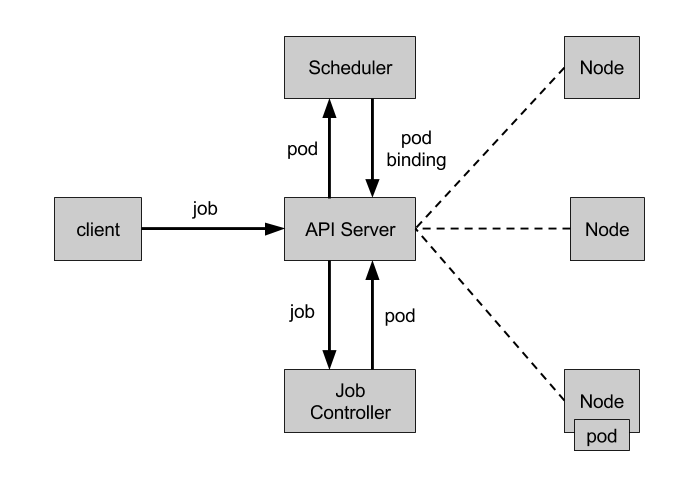

# Job

Job 负责批量处理短暂的一次性任务 \(short lived one-off tasks\)，即仅执行一次的任务，它保证批处理任务的一个或多个 Pod 成功结束。

## API 版本对照表

| Kubernetes 版本 | Batch API 版本 | 默认开启 |
| :--- | :--- | :--- |
| v1.5+ | batch/v1 | 是 |

## Job 类型

Kubernetes 支持以下几种 Job：

* 非并行 Job：通常创建一个 Pod 直至其成功结束
* 固定结束次数的 Job：设置 `.spec.completions`，创建多个 Pod，直到 `.spec.completions` 个 Pod 成功结束
* 带有工作队列的并行 Job：设置 `.spec.Parallelism` 但不设置 `.spec.completions`，当所有 Pod 结束并且至少一个成功时，Job 就认为是成功

根据 `.spec.completions` 和 `.spec.Parallelism` 的设置，可以将 Job 划分为以下几种 pattern：

| Job 类型 | 使用示例 | 行为 | completions | Parallelism |
| :--- | :--- | :--- | :--- | :--- |
| 一次性 Job | 数据库迁移 | 创建一个 Pod 直至其成功结束 | 1 | 1 |
| 固定结束次数的 Job | 处理工作队列的 Pod | 依次创建一个 Pod 运行直至 completions 个成功结束 | 2+ | 1 |
| 固定结束次数的并行 Job | 多个 Pod 同时处理工作队列 | 依次创建多个 Pod 运行直至 completions 个成功结束 | 2+ | 2+ |
| 并行 Job | 多个 Pod 同时处理工作队列 | 创建一个或多个 Pod 直至有一个成功结束 | 1 | 2+ |

## Job Controller

Job Controller 负责根据 Job Spec 创建 Pod，并持续监控 Pod 的状态，直至其成功结束。如果失败，则根据 restartPolicy（只支持 OnFailure 和 Never，不支持 Always）决定是否创建新的 Pod 再次重试任务。



## Job Spec 格式

* spec.template 格式同 Pod
* RestartPolicy 仅支持 Never 或 OnFailure
* 单个 Pod 时，默认 Pod 成功运行后 Job 即结束
* `.spec.completions` 标志 Job 结束需要成功运行的 Pod 个数，默认为 1
* `.spec.parallelism` 标志并行运行的 Pod 的个数，默认为 1
* `spec.activeDeadlineSeconds` 标志失败 Pod 的重试最大时间，超过这个时间不会继续重试
* `.spec.completionMode` 完成模式，支持 NonIndexed（默认）和 Indexed
* `.spec.backoffLimitPerIndex` （v1.33+ 稳定）为索引化 Job 设置每个索引的回退限制
* `.spec.maxFailedIndexes` （v1.33+ 稳定）限制索引化 Job 中允许失败的最大索引数
* `.spec.successPolicy` （v1.33+ 稳定）定义 Job 成功完成的条件
* `.spec.suspend` （v1.21+ 稳定）暂停 Job 的执行

一个简单的例子：

```yaml
apiVersion: batch/v1
kind: Job
metadata:
  name: pi
spec:
  template:
    metadata:
      name: pi
    spec:
      containers:
      - name: pi
        image: perl
        command: ["perl",  "-Mbignum=bpi", "-wle", "print bpi(2000)"]
      restartPolicy: Never
```

```bash
# 创建 Job
$ kubectl create -f ./job.yaml
job "pi" created
# 查看 Job 的状态
$ kubectl describe job pi
Name:        pi
Namespace:    default
Selector:    controller-uid=cd37a621-5b02-11e7-b56e-76933ddd7f55
Labels:        controller-uid=cd37a621-5b02-11e7-b56e-76933ddd7f55
        job-name=pi
Annotations:    <none>
Parallelism:    1
Completions:    1
Start Time:    Tue, 27 Jun 2017 14:35:24 +0800
Pods Statuses:    0 Running / 1 Succeeded / 0 Failed
Pod Template:
  Labels:    controller-uid=cd37a621-5b02-11e7-b56e-76933ddd7f55
        job-name=pi
  Containers:
   pi:
    Image:    perl
    Port:
    Command:
      perl
      -Mbignum=bpi
      -wle
      print bpi(2000)
    Environment:    <none>
    Mounts:        <none>
  Volumes:        <none>
Events:
  FirstSeen    LastSeen    Count    From        SubObjectPath    Type        Reason            Message
  ---------    --------    -----    ----        -------------    --------    ------            -------
  2m        2m        1    job-controller            Normal        SuccessfulCreate    Created pod: pi-nltxv

# 使用'job-name=pi'标签查询属于该 Job 的 Pod
# 注意不要忘记'--show-all'选项显示已经成功（或失败）的 Pod
$ kubectl get pod --show-all -l job-name=pi
NAME       READY     STATUS      RESTARTS   AGE
pi-nltxv   0/1       Completed   0          3m

# 使用 jsonpath 获取 pod ID 并查看 Pod 的日志
$ pods=$(kubectl get pods --selector=job-name=pi --output=jsonpath={.items..metadata.name})
$ kubectl logs $pods
3.141592653589793238462643383279502...
```

固定结束次数的 Job 示例

```yaml
apiVersion: batch/v1
kind: Job
metadata:
  name: busybox
spec:
  completions: 3
  template:
    metadata:
      name: busybox
    spec:
      containers:
      - name: busybox
        image: busybox
        command: ["echo", "hello"]
      restartPolicy: Never
```

## Indexed Job

通常，当使用 Job 来运行分布式任务时，用户需要一个单独的系统来在 Job 的不同 worker Pod 之间分配任务。比如，设置一个工作队列，逐一给每个 Pod 分配任务。Kubernetes v1.21 新增的 Indexed Job 会给每个任务分配一个数值索引，并通过 annotation `batch.kubernetes.io/job-completion-index` 暴露给每个 Pod。使用方法为在 Job spec 中设置 `completionMode: Indexed`。

### 索引化 Job 的回退限制 (v1.33.0 Stable)

从 Kubernetes v1.33.0 开始，支持为索引化 Job 的每个索引设置独立的回退限制。这个特性专门为"令人尴尬的并行"（embarrassingly parallel）工作负载设计，其中每个索引代表独立的任务。

#### 功能优势

- **精细化失败控制**：防止单个失败的索引消耗整个 Job 的失败预算
- **独立重试机制**：每个索引可以独立重试，不影响其他索引的执行
- **更好的容错性**：支持部分索引失败的场景，提高整体 Job 的成功率

#### 配置参数

- `backoffLimitPerIndex`：控制每个索引的重试次数
- `maxFailedIndexes`：（可选）限制总的失败索引数量
- 可以与 Pod 失败策略结合使用，实现更高级的错误处理

#### 基本示例

```yaml
apiVersion: batch/v1
kind: Job
metadata:
  name: indexed-job-with-backoff
spec:
  completionMode: Indexed
  completions: 10
  parallelism: 10
  backoffLimitPerIndex: 1    # 每个索引最多重试1次
  maxFailedIndexes: 5        # 最多允许5个索引失败
  template:
    spec:
      containers:
      - name: worker
        image: busybox
        command: 
        - sh
        - -c
        - |
          INDEX=${JOB_COMPLETION_INDEX}
          echo "Processing index $INDEX"
          # 模拟某些索引可能失败的情况
          if [ $((INDEX % 3)) -eq 0 ]; then
            echo "Index $INDEX: simulating failure"
            exit 1
          else
            echo "Index $INDEX: success"
            exit 0
          fi
      restartPolicy: Never
```

#### 实际应用场景

1. **多测试套件执行**：运行多个独立的测试套件，单个套件失败不影响其他套件
2. **批量数据处理**：处理多个数据文件，某个文件处理失败不影响其他文件
3. **并行计算任务**：执行多个独立的计算任务，具有一定的失败容忍度

#### 配置建议

- 对于需要高可靠性的任务，设置较高的 `backoffLimitPerIndex` 值
- 使用 `maxFailedIndexes` 控制整体失败率，避免过多失败索引
- 结合 Pod 失败策略可以根据不同的失败原因采取不同的重试策略

## Job 成功策略 (v1.33.0 GA)

从 Kubernetes v1.33.0 开始，Job 成功策略正式达到正式版本（GA）。这个特性专为批处理工作负载设计，如科学仿真、AI/ML 和高性能计算（HPC）。它允许指定哪些 Pod 索引或数量必须成功完成，支持部分 Job 完成的场景。

### 功能特点

- **仅适用于索引化 Job**：只能在 `completionMode: Indexed` 的 Job 中使用
- **灵活的成功条件**：可以根据成功的索引数量或特定的索引来定义成功
- **早期退出**：一旦满足成功条件，Job 会立即停止所有 Pod
- **支持领导者-跟随者模式**：适用于只需要特定索引成功的场景

### 基本示例：单个索引成功

```yaml
apiVersion: batch/v1
kind: Job
metadata:
  name: single-index-success
spec:
  completionMode: Indexed
  completions: 5
  parallelism: 5
  successPolicy:
    rules:
    - succeededCount: 1  # 只需要一个 Pod 成功即可
  template:
    spec:
      containers:
      - name: worker
        image: busybox
        command: ["sh", "-c", "echo Processing index $JOB_COMPLETION_INDEX && sleep $((RANDOM % 60))"]
      restartPolicy: Never
```

### 高级示例：领导者索引成功

```yaml
apiVersion: batch/v1
kind: Job
metadata:
  name: leader-follower-job
spec:
  completionMode: Indexed
  completions: 10
  parallelism: 3
  successPolicy:
    rules:
    - succeededIndexes: "0"    # 索引 0 作为领导者必须成功
      succeededCount: 1
  template:
    spec:
      containers:
      - name: worker
        image: busybox
        command: 
        - sh
        - -c
        - |
          INDEX=${JOB_COMPLETION_INDEX}
          if [ $INDEX -eq 0 ]; then
            echo "Leader processing index $INDEX"
            # 领导者逻辑
            sleep 30
          else
            echo "Follower processing index $INDEX"
            # 跟随者逻辑
            sleep 10
          fi
      restartPolicy: Never
```

### 组合条件示例

```yaml
apiVersion: batch/v1
kind: Job
metadata:
  name: complex-success-policy
spec:
  completionMode: Indexed
  completions: 10
  parallelism: 3
  successPolicy:
    rules:
    - succeededIndexes: "0-2,5"  # 特定索引必须成功
    - succeededCount: 6          # 或者至少6个Pod成功
  template:
    spec:
      containers:
      - name: worker
        image: busybox
        command: ["sh", "-c", "echo Processing index $JOB_COMPLETION_INDEX && sleep 10"]
      restartPolicy: Never
```

### 应用场景

1. **科学仿真**：多个实验中只需要部分结果成功即可
2. **AI/ML 训练**：分布式训练中需要特定节点成功
3. **高性能计算**：并行计算任务中只需要部分结果
4. **批量数据处理**：在大规模数据处理中允许部分失败
5. **领导者-跟随者模式**：只需要领导者节点成功完成任务

### 技术细节

- **条件检查**：Job Controller 会在满足成功策略时添加 `SuccessCriteriaMet` 条件
- **Pod 终止**：成功条件达成后，所有正在运行的 Pod 会被终止
- **资源优化**：避免不必要的计算资源浪费

### 最佳实践

- **仅用于索引化 Job**：确保设置 `completionMode: Indexed`
- **合理设置成功条件**：根据业务需求设置合适的 `succeededCount` 或 `succeededIndexes`
- **结合失败策略**：可与 `backoffLimitPerIndex` 和 `maxFailedIndexes` 结合使用
- **监控 Job 状态**：通过 Job conditions 监控成功条件的达成

## Pod 自动清理

TTL 控制器用来自动清理已经结束的 Pod，如处于 Complete 或 Failed 状态的 Job。Pod 停止之后的 TTL 可以通过 `.spec.ttlSecondsAfterFinished` 来设置。

注意，该特性要求集群中各节点（包括控制节点）的时间一致，比如在所有节点中运行 NTP 服务。

## 暂停和重启 Job

从 v1.21 开始，可通过 `.spec.suspend` 暂停和重启 Job：

```yaml
apiVersion: batch/v1
kind: Job
metadata:
  name: myjob
spec:
  suspend: true
  parallelism: 1
  completions: 5
  template:
    spec:
      ...
```

当 Job 暂停后，Job conditions 中会新增一条 Job 暂停的事件：

```sh
$ kubectl get jobs/myjob -o yaml
apiVersion: batch/v1
kind: Job
# .metadata and .spec omitted
status:
  conditions:
  - lastProbeTime: "2021-02-05T13:14:33Z"
    lastTransitionTime: "2021-02-05T13:14:33Z"
    status: "True"
    type: Suspended
  startTime: "2021-02-05T13:13:48Z"
```

## Bare Pods

所谓 Bare Pods 是指直接用 PodSpec 来创建的 Pod（即不在 ReplicaSets 或者 ReplicationCtroller 的管理之下的 Pods）。这些 Pod 在 Node 重启后不会自动重启，但 Job 则会创建新的 Pod 继续任务。所以，推荐使用 Job 来替代 Bare Pods，即便是应用只需要一个 Pod。

## 参考文档

* [Jobs - Run to Completion](https://kubernetes.io/docs/concepts/workloads/controllers/jobs-run-to-completion/)
