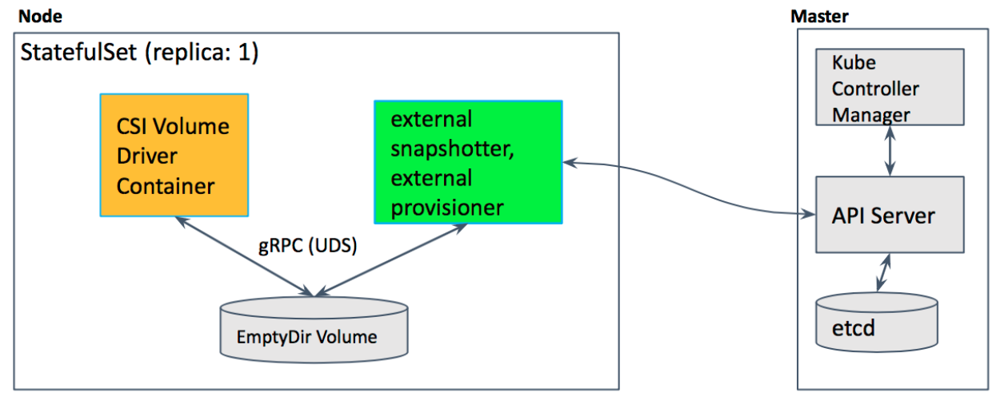

# PersistentVolume

PersistentVolume \(PV\) 和 PersistentVolumeClaim \(PVC\) 提供了方便的持久化卷：PV 提供网络存储资源，而 PVC 请求存储资源。这样，设置持久化的工作流包括配置底层文件系统或者云数据卷、创建持久性数据卷、最后创建 PVC 来将 Pod 跟数据卷关联起来。PV 和 PVC 可以将 pod 和数据卷解耦，pod 不需要知道确切的文件系统或者支持它的持久化引擎。

## Volume 生命周期

Volume 的生命周期包括 5 个阶段

1. Provisioning，即 PV 的创建，可以直接创建 PV（静态方式），也可以使用 StorageClass 动态创建
2. Binding，将 PV 分配给 PVC
3. Using，Pod 通过 PVC 使用该 Volume，并可以通过准入控制 StorageObjectInUseProtection（1.9 及以前版本为 PVCProtection）阻止删除正在使用的 PVC
4. Releasing，Pod 释放 Volume 并删除 PVC
5. Reclaiming，回收 PV，可以保留 PV 以便下次使用，也可以直接从云存储中删除
6. Deleting，删除 PV 并从云存储中删除后段存储

根据这 5 个阶段，Volume 的状态有以下 4 种

* Available：可用
* Bound：已经分配给 PVC
* Released：PVC 解绑但还未执行回收策略
* Failed：发生错误

## API 版本对照表

| Kubernetes 版本 | PV/PVC 版本 | StorageClass 版本 |
| :--- | :--- | :--- |
| v1.5-v1.6 | core/v1 | storage.k8s.io/v1beta1 |
| v1.7+ | core/v1 | storage.k8s.io/v1 |

## PV

PersistentVolume（PV）是集群之中的一块网络存储。跟 Node 一样，也是集群的资源。PV 跟 Volume \(卷\) 类似，不过会有独立于 Pod 的生命周期。比如一个 NFS 的 PV 可以定义为

```yaml
apiVersion: v1
kind: PersistentVolume
metadata:
  name: pv0003
spec:
  capacity:
    storage: 5Gi
  accessModes:
    - ReadWriteOnce
  persistentVolumeReclaimPolicy: Recycle
  nfs:
    path: /tmp
    server: 172.17.0.2
```

PV 的访问模式（accessModes）有三种：

* ReadWriteOnce（RWO）：是最基本的方式，可读可写，但只支持被单个节点挂载。
* ReadOnlyMany（ROX）：可以以只读的方式被多个节点挂载。
* ReadWriteMany（RWX）：这种存储可以以读写的方式被多个节点共享。不是每一种存储都支持这三种方式，像共享方式，目前支持的还比较少，比较常用的是 NFS。在 PVC 绑定 PV 时通常根据两个条件来绑定，一个是存储的大小，另一个就是访问模式。

PV 的回收策略（persistentVolumeReclaimPolicy，即 PVC 释放卷的时候 PV 该如何操作）也有三种

* Retain，不清理, 保留 Volume（需要手动清理）
* Recycle，删除数据，即 `rm -rf /thevolume/*`（只有 NFS 和 HostPath 支持）
* Delete，删除存储资源，比如删除 AWS EBS 卷（只有 AWS EBS, GCE PD, Azure Disk 和 Cinder 支持）

## StorageClass

上面通过手动的方式创建了一个 NFS Volume，这在管理很多 Volume 的时候不太方便。Kubernetes 还提供了 [StorageClass](https://kubernetes.io/docs/user-guide/persistent-volumes/#storageclasses) 来动态创建 PV，不仅节省了管理员的时间，还可以封装不同类型的存储供 PVC 选用。

StorageClass 包括四个部分

* provisioner：指定 Volume 插件的类型，包括内置插件（如 `kubernetes.io/glusterfs`）和外部插件（如 [external-storage](https://github.com/kubernetes-incubator/external-storage/tree/master/ceph/cephfs) 提供的 `ceph.com/cephfs`）。
* mountOptions：指定挂载选项，当 PV 不支持指定的选项时会直接失败。比如 NFS 支持 `hard` 和 `nfsvers=4.1` 等选项。
* parameters：指定 provisioner 的选项，比如 `kubernetes.io/aws-ebs` 支持 `type`、`zone`、`iopsPerGB` 等参数。
* reclaimPolicy：指定回收策略，同 PV 的回收策略。

在使用 PVC 时，可以通过 `DefaultStorageClass` 准入控制设置默认 StorageClass, 即给未设置 storageClassName 的 PVC 自动添加默认的 StorageClass。而默认的 StorageClass 带有 annotation `storageclass.kubernetes.io/is-default-class=true`。

| Volume Plugin | Internal Provisioner | Config Example |
| :--- | :--- | :--- |
| AWSElasticBlockStore | ✓ | [AWS](https://kubernetes.io/docs/concepts/storage/storage-classes/#aws) |
| AzureFile | ✓ | [Azure File](https://kubernetes.io/docs/concepts/storage/storage-classes/#azure-file) |
| AzureDisk | ✓ | [Azure Disk](https://kubernetes.io/docs/concepts/storage/storage-classes/#azure-disk) |
| CephFS | - | - |
| Cinder | ✓ | [OpenStack Cinder](https://kubernetes.io/docs/concepts/storage/storage-classes/#openstack-cinder) |
| FC | - | - |
| FlexVolume | - | - |
| Flocker | ✓ | - |
| GCEPersistentDisk | ✓ | [GCE](https://kubernetes.io/docs/concepts/storage/storage-classes/#gce) |
| Glusterfs | ✓ | [Glusterfs](https://kubernetes.io/docs/concepts/storage/storage-classes/#glusterfs) |
| iSCSI | - | - |
| PhotonPersistentDisk | ✓ | - |
| Quobyte | ✓ | [Quobyte](https://kubernetes.io/docs/concepts/storage/storage-classes/#quobyte) |
| NFS | - | - |
| RBD | ✓ | [Ceph RBD](https://kubernetes.io/docs/concepts/storage/storage-classes/#ceph-rbd) |
| VsphereVolume | ✓ | [vSphere](https://kubernetes.io/docs/concepts/storage/storage-classes/#vsphere) |
| PortworxVolume | ✓ | [Portworx Volume](https://kubernetes.io/docs/concepts/storage/storage-classes/#portworx-volume) |
| ScaleIO | ✓ | [ScaleIO](https://kubernetes.io/docs/concepts/storage/storage-classes/#scaleio) |
| StorageOS | ✓ | [StorageOS](https://kubernetes.io/docs/concepts/storage/storage-classes/#storageos) |
| Local | - | [Local](https://kubernetes.io/docs/concepts/storage/storage-classes/#local) |

#### 修改默认 StorageClass

取消原来的默认 StorageClass

```bash
kubectl patch storageclass <default-class-name> -p '{"metadata": {"annotations":{"storageclass.kubernetes.io/is-default-class":"false"}}}'
```

标记新的默认 StorageClass

```bash
kubectl patch storageclass <your-class-name> -p '{"metadata": {"annotations":{"storageclass.kubernetes.io/is-default-class":"true"}}}'
```

#### GCE 示例

> 单个 GCE 节点最大支持挂载 16 个 Google Persistent Disk。开启 `AttachVolumeLimit` 特性后，根据节点的类型最大可以挂载 128 个。

```yaml
kind: StorageClass
apiVersion: storage.k8s.io/v1
metadata:
  name: slow
provisioner: kubernetes.io/gce-pd
parameters:
  type: pd-standard
  zone: us-central1-a
```

#### Glusterfs 示例

```yaml
apiVersion: storage.k8s.io/v1
kind: StorageClass
metadata:
  name: slow
provisioner: kubernetes.io/glusterfs
parameters:
  resturl: "http://127.0.0.1:8081"
  clusterid: "630372ccdc720a92c681fb928f27b53f"
  restauthenabled: "true"
  restuser: "admin"
  secretNamespace: "default"
  secretName: "heketi-secret"
  gidMin: "40000"
  gidMax: "50000"
  volumetype: "replicate:3"
```

#### OpenStack Cinder 示例

```yaml
kind: StorageClass
apiVersion: storage.k8s.io/v1
metadata:
  name: gold
provisioner: kubernetes.io/cinder
parameters:
  type: fast
  availability: nova
```

#### Ceph RBD 示例

```yaml
apiVersion: storage.k8s.io/v1
  kind: StorageClass
  metadata:
    name: fast
  provisioner: kubernetes.io/rbd
  parameters:
    monitors: 10.16.153.105:6789
    adminId: kube
    adminSecretName: ceph-secret
    adminSecretNamespace: kube-system
    pool: kube
    userId: kube
    userSecretName: ceph-secret-user
```

### Local Volume

Local Volume 允许将 Node 本地的磁盘、分区或者目录作为持久化存储使用。注意，Local Volume 不支持动态创建，使用前需要预先创建好 PV。

```yaml
apiVersion: v1
kind: PersistentVolume
metadata:
  name: example-pv
spec:
  capacity:
    storage: 100Gi
  # volumeMode field requires BlockVolume Alpha feature gate to be enabled.
  volumeMode: Filesystem
  accessModes:
  - ReadWriteOnce
  persistentVolumeReclaimPolicy: Delete
  storageClassName: local-storage
  local:
    path: /mnt/disks/ssd1
  nodeAffinity:
    required:
      nodeSelectorTerms:
      - matchExpressions:
        - key: kubernetes.io/hostname
          operator: In
          values:
          - example-node
---
kind: StorageClass
apiVersion: storage.k8s.io/v1
metadata:
  name: local-storage
provisioner: kubernetes.io/no-provisioner
volumeBindingMode: WaitForFirstConsumer
```

推荐配置

* 对于需要强 IO 隔离的场景，推荐使用整块磁盘作为 Volume
* 对于需要容量隔离的场景，推荐使用分区作为 Volume
* 避免在集群中重新创建同名的 Node（无法避免时需要先删除通过 Affinity 引用该 Node 的 PV）
* 对于文件系统类型的本地存储，推荐使用 UUID （如 `ls -l /dev/disk/by-uuid`）作为系统挂载点
* 对于无文件系统的块存储，推荐生成一个唯一 ID 作软链接（如 `/dev/dis/by-id`）。这可以保证 Volume 名字唯一，并不会与其他 Node 上面的同名 Volume 混淆

## PVC

PV 是存储资源，而 PersistentVolumeClaim \(PVC\) 是对 PV 的请求。PVC 跟 Pod 类似：Pod 消费 Node 资源，而 PVC 消费 PV 资源；Pod 能够请求 CPU 和内存资源，而 PVC 请求特定大小和访问模式的数据卷。

```yaml
kind: PersistentVolumeClaim
apiVersion: v1
metadata:
  name: myclaim
spec:
  accessModes:
    - ReadWriteOnce
  resources:
    requests:
      storage: 8Gi
  storageClassName: slow
  selector:
    matchLabels:
      release: "stable"
    matchExpressions:
      - {key: environment, operator: In, values: [dev]}
```

PVC 可以直接挂载到 Pod 中：

```yaml
kind: Pod
apiVersion: v1
metadata:
  name: mypod
spec:
  containers:
    - name: myfrontend
      image: dockerfile/nginx
      volumeMounts:
      - mountPath: "/var/www/html"
        name: mypd
  volumes:
    - name: mypd
      persistentVolumeClaim:
        claimName: myclaim
```

## 扩展 PV 空间

> ExpandPersistentVolumes 在 v1.8 开始 Alpha，v1.11 升级为 Beta 版。

v1.8 开始支持扩展 PV 空间，支持在不丢失数据和重启容器的情况下扩展 PV 的大小。注意， **当前的实现仅支持不需要调整文件系统大小（XFS、Ext3、Ext4）的 PV，并且只支持以下几种存储插件** ：

* AzureDisk
* AzureFile
* gcePersistentDisk
* awsElasticBlockStore
* Cinder
* glusterfs
* rbd
* Portworx

开启扩展 PV 空间的功能需要配置

* 开启 `ExpandPersistentVolumes` 功能，即配置 `--feature-gates=ExpandPersistentVolumes=true`
* 开启准入控制插件 `PersistentVolumeClaimResize`，它只允许扩展明确配置 `allowVolumeExpansion=true` 的 StorageClass，比如

```yaml
kind: StorageClass
apiVersion: storage.k8s.io/v1
metadata:
  name: gluster-vol-default
provisioner: kubernetes.io/glusterfs
parameters:
  resturl: "http://192.168.10.100:8080"
  restuser: ""
  secretNamespace: ""
  secretName: ""
allowVolumeExpansion: true
```

这样，用户就可以修改 PVC 中请求存储的大小（如通过 `kubectl edit` 命令）请求更大的存储空间。

## 块存储（Raw Block Volume）

Kubernetes v1.9 新增了 Alpha 版的 Raw Block Volume，可通过设置 `volumeMode: Block`（可选项为 `Filesystem` 和 `Block`）来使用块存储。

> 注意：使用前需要为 kube-apiserver、kube-controller-manager 和 kubelet 开启 `BlockVolume` 特性，即添加命令行选项 `--feature-gates=BlockVolume=true,...`。

支持块存储的 PV 插件包括

* Local Volume
* fc
* iSCSI
* Ceph RBD
* AWS EBS
* GCE PD
* AzureDisk
* Cinder

使用示例

```yaml
# Persistent Volumes using a Raw Block Volume
apiVersion: v1
kind: PersistentVolume
metadata:
  name: block-pv
spec:
  capacity:
    storage: 10Gi
  accessModes:
    - ReadWriteOnce
  volumeMode: Block
  persistentVolumeReclaimPolicy: Retain
  fc:
    targetWWNs: ["50060e801049cfd1"]
    lun: 0
    readOnly: false
---
# Persistent Volume Claim requesting a Raw Block Volume
apiVersion: v1
kind: PersistentVolumeClaim
metadata:
  name: block-pvc
spec:
  accessModes:
    - ReadWriteOnce
  volumeMode: Block
  resources:
    requests:
      storage: 10Gi
---
# Pod specification adding Raw Block Device path in container
apiVersion: v1
kind: Pod
metadata:
  name: pod-with-block-volume
  annotations:
    # apparmor should be unconfied for mounting the device inside container.
    container.apparmor.security.beta.kubernetes.io/fc-container: unconfined
spec:
  containers:
    - name: fc-container
      image: fedora:26
      command: ["/bin/sh", "-c"]
      args: ["tail -f /dev/null"]
      securityContext:
        capabilities:
          # CAP_SYS_ADMIN is required for mount() syscall.
          add: ["SYS_ADMIN"]
      volumeDevices:
        - name: data
          devicePath: /dev/xvda
  volumes:
    - name: data
      persistentVolumeClaim:
        claimName: block-pvc
```

## StorageObjectInUseProtection

> 准入控制 StorageObjectInUseProtection 在 v1.11 版本 GA。

当开启准入控制 StorageObjectInUseProtection（`--admission-control=StorageObjectInUseProtection`）时，删除使用中的 PV 和 PVC 后，它们会等待使用者删除后才删除（而不是之前的立即删除）。而在使用者删除之前，它们会一直处于 Terminating 状态。

## PersistentVolume 资源泄漏防护（v1.33 GA）

Kubernetes v1.33 引入了防止 PersistentVolume 资源泄漏的功能，该功能在无序删除 PV 和 PVC 时防止存储资源泄漏，现已正式稳定（GA）。

### 主要特性

* **防止存储泄漏** - 当 PV 在 PVC 之前被删除时，确保底层存储资源得到正确回收
* **自动资源清理** - 通过 finalizer 机制确保存储后端资源在删除确认后才从 PV 中移除
* **CSI 兼容性** - 专门为使用 CSI external-provisioner 的动态存储卷设计

### 技术实现

该功能通过在 CSI 动态创建的 PV 上添加 finalizer 来实现：

```yaml
apiVersion: v1
kind: PersistentVolume
metadata:
  finalizers:
  - kubernetes.io/pv-protection
  - external-provisioner.volume.kubernetes.io/finalizer  # CSI 防泄漏 finalizer
spec:
  # PV 规格...
```

### 使用要求

要启用此功能，需要满足以下条件：

1. **Kubernetes 版本** - 升级到 v1.33 或更高版本
2. **CSI external-provisioner** - 使用 v5.0.1 或更高版本
3. **存储类型** - 仅适用于使用 CSI external-provisioner 动态创建的存储卷

### 工作原理

1. 当使用 CSI StorageClass 创建 PVC 时，动态创建的 PV 会自动添加防泄漏 finalizer
2. 如果 PV 在 PVC 之前被删除，finalizer 会阻止 PV 的最终删除
3. CSI external-provisioner 确保底层存储资源被正确释放后，才会移除 finalizer
4. 只有在存储后端确认删除完成后，PV 才会被最终删除

### 限制

* 该功能不适用于静态创建的 PV
* 不适用于使用树内（in-tree）存储插件的 PV
* 仅针对使用 CSI external-provisioner 的动态存储卷

### 最佳实践

* 升级集群到 Kubernetes v1.33+
* 确保 CSI external-provisioner 使用最新版本
* 验证动态创建的 PV 包含正确的 finalizer
* 监控存储资源的回收状态，确保没有泄漏

## 拓扑感知动态调度

拓扑感知动态存储卷调度（topology-aware dynamic provisioning）是 v1.12 版本的一个 Beta 特性，用来支持在多可用区集群中动态创建和调度持久化存储卷。目前的实现支持以下几种存储：

* AWS EBS
* Azure Disk
* GCE PD \(including Regional PD\)
* CSI \(alpha\) - currently only the GCE PD CSI driver has implemented topology support

## 存储容量感知调度（v1.33 Alpha）

Kubernetes v1.33 引入了存储容量感知调度特性，该特性与 kube-scheduler 的存储容量评分功能配合使用，能够根据节点的存储容量状况来优化 Pod 的调度决策。

### 主要特性

* **智能存储调度** - 调度器在做出调度决策时会考虑节点的存储容量情况
* **动态卷优化** - 特别适用于需要动态创建本地持久化卷的场景
* **资源效率提升** - 通过合理分配存储资源，提高集群整体的资源利用率

### 与调度器集成

该特性主要通过 kube-scheduler 的 VolumeBinding 插件实现：

* 扩展了调度器的评分机制，在选择节点时考虑存储容量
* 支持根据可用存储空间对节点进行优先级排序
* 可配置优先选择存储容量高或低的节点

### 适用场景

1. **本地存储工作负载** - 需要大量本地存储的应用，如数据库和存储服务
2. **存储敏感应用** - 对存储性能和可用性有特殊要求的应用
3. **资源优化** - 希望最大化存储资源利用率的集群环境

要使用此特性，需要在 kube-scheduler 中启用 `StorageCapacityScoring` 功能特性，详见调度器文档中的相关配置。

使用示例

```yaml
# set WaitForFirstConsumer in storage class
kind: StorageClass
apiVersion: storage.k8s.io/v1
metadata:
  name: topology-aware-standard
provisioner: kubernetes.io/gce-pd
volumeBindingMode: WaitForFirstConsumer
parameters:
  type: pd-standard

# Refer storage class
apiVersion: apps/v1
kind: StatefulSet
metadata:
  name: web
spec:
  serviceName: "nginx"
  replicas: 2
  selector:
    matchLabels:
      app: nginx
  template:
    metadata:
      labels:
        app: nginx
    spec:
      affinity:
        nodeAffinity:
          requiredDuringSchedulingIgnoredDuringExecution:
            nodeSelectorTerms:
            - matchExpressions:
              - key: failure-domain.beta.kubernetes.io/zone
                operator: In
                values:
                - us-central1-a
                - us-central1-f
        podAntiAffinity:
          requiredDuringSchedulingIgnoredDuringExecution:
          - labelSelector:
              matchExpressions:
              - key: app
                operator: In
                values:
                - nginx
            topologyKey: failure-domain.beta.kubernetes.io/zone
      containers:
      - name: nginx
        image: gcr.io/google_containers/nginx-slim:0.8
        ports:
        - containerPort: 80
          name: web
        volumeMounts:
        - name: www
          mountPath: /usr/share/nginx/html
        - name: logs
          mountPath: /logs
 volumeClaimTemplates:
  - metadata:
      name: www
    spec:
      accessModes: [ "ReadWriteOnce" ]
      storageClassName: topology-aware-standard
      resources:
        requests:
          storage: 10Gi
  - metadata:
      name: logs
    spec:
      accessModes: [ "ReadWriteOnce" ]
      storageClassName: topology-aware-standard
      resources:
        requests:
          storage: 1Gi
```

然后查看 PV，可以发现它们创建在不同的可用区内

```bash
$ kubectl get pv -o=jsonpath='{range .items[*]}{.spec.claimRef.name}{"\t"}{.metadata.labels.failure\-domain\.beta\.kubernetes\.io/zone}{"\n"}{end}'
www-web-0       us-central1-f
logs-web-0      us-central1-f
www-web-1       us-central1-a
logs-web-1      us-central1-a
```

## 卷数据填充器（Volume Populators，v1.33 GA）

卷数据填充器是 Kubernetes v1.33 正式稳定（GA）的特性，允许用户使用自定义资源作为 PersistentVolumeClaim 的数据源，实现灵活的卷数据初始化。

### 主要特性

* **自定义数据源** - 支持使用任意自定义资源作为 PVC 的数据源
* **无需填充 Pod** - v1.33 版本引入了基于插件的函数，可选择性地跳过创建填充 Pod
* **灵活的数据填充** - 支持多种数据填充模式和清理策略
* **AnyVolumeDataSource 默认启用** - `AnyVolumeDataSource` 特性门控在 v1.33 中默认启用

### 基本用法

使用 `dataSourceRef` 字段指定自定义资源作为数据源：

```yaml
apiVersion: v1
kind: PersistentVolumeClaim
metadata:
  name: populated-pvc
spec:
  accessModes:
    - ReadWriteOnce
  resources:
    requests:
      storage: 1Gi
  storageClassName: example-storageclass
  dataSourceRef:
    apiGroup: provider.example.com
    kind: Provider
    name: provider1
```

### 卷填充器插件接口

v1.33 版本为卷填充器插件引入了新的函数接口：

#### 核心函数

* **`PopulateFn()`** - 执行数据填充逻辑的主要函数
* **`PopulateCompleteFn()`** - 检查数据填充是否完成
* **`PopulateCleanupFn()`** - 清理填充过程中的临时资源

#### 扩展功能

* **变更器函数** - 允许插件修改 Kubernetes 资源
* **指标处理** - 支持自定义指标收集和报告
* **资源清理** - 在 PVC 删除时自动清理临时资源

### 实现示例

```yaml
# 自定义数据源资源
apiVersion: provider.example.com/v1
kind: Provider
metadata:
  name: provider1
spec:
  sourceURL: "https://example.com/data.tar.gz"
  extractPath: "/data"
---
# 使用自定义数据源的 PVC
apiVersion: v1
kind: PersistentVolumeClaim
metadata:
  name: app-data
spec:
  accessModes:
    - ReadWriteOnce
  resources:
    requests:
      storage: 5Gi
  storageClassName: fast-ssd
  dataSourceRef:
    apiGroup: provider.example.com
    kind: Provider
    name: provider1
```

### 优势

1. **灵活性** - 支持从任意自定义资源初始化存储卷
2. **可扩展性** - 开发者可以创建特定的数据填充逻辑
3. **高效性** - 新的插件接口减少了资源开销
4. **自动化** - 支持自动清理和错误处理

### 常见用例

* **数据库初始化** - 从备份或模板初始化数据库存储卷
* **应用数据预填充** - 为应用预装配置文件或静态资源
* **多环境数据同步** - 在不同环境间同步数据状态
* **备份恢复** - 从备份系统恢复数据到新的存储卷

### 注意事项

* 需要相应的卷填充器控制器支持特定的自定义资源类型
* 数据填充过程可能需要一定时间，Pod 调度会等待填充完成
* 确保自定义资源和 PVC 在同一命名空间中

## 存储快照

存储快照是 v1.12 新增的 Alpha 特性，用来支持给存储卷创建快照。支持的插件包括

* [GCE Persistent Disk CSI Driver](https://github.com/kubernetes-sigs/gcp-compute-persistent-disk-csi-driver)
* [OpenSDS CSI Driver](https://docs.opensds.io/guides/user-guides/csi/ceph-csi/)
* [Ceph RBD CSI Driver](https://github.com/ceph/ceph-csi)
* [Portworx CSI Driver](https://docs.portworx.com/portworx-csi-driver/)



在使用前需要开启特性开关 VolumeSnapshotDataSource。

使用示例：

```yaml
# create snapshot
apiVersion: snapshot.storage.k8s.io/v1alpha1
kind: VolumeSnapshot
metadata:
  name: new-snapshot-demo
  namespace: demo-namespace
spec:
  snapshotClassName: csi-snapclass
  source:
    name: mypvc
    kind: PersistentVolumeClaim

# import from snapshot
apiVersion: snapshot.storage.k8s.io/v1alpha1
kind: VolumeSnapshotContent
metadata:
  name: static-snapshot-content
spec:
  csiVolumeSnapshotSource:
    driver: com.example.csi-driver
    snapshotHandle: snapshotcontent-example-id
  volumeSnapshotRef:
    kind: VolumeSnapshot
    name: static-snapshot-demo
    namespace: demo-namespace

# provision volume from snapshot
apiVersion: v1
kind: PersistentVolumeClaim
metadata:
  name: pvc-restore
  Namespace: demo-namespace
spec:
  storageClassName: csi-storageclass
  dataSource:
    name: new-snapshot-demo
    kind: VolumeSnapshot
    apiGroup: snapshot.storage.k8s.io
  accessModes:
    - ReadWriteOnce
  resources:
    requests:
      storage: 1Gi
```

## 参考文档

* [Kubernetes Persistent Volumes](https://kubernetes.io/docs/concepts/storage/persistent-volumes/)
* [Kubernetes Storage Classes](https://kubernetes.io/docs/concepts/storage/storage-classes/)
* [Dynamic Volume Provisioning](https://kubernetes.io/docs/concepts/storage/dynamic-provisioning/)
* [Kubernetes CSI Documentation](https://kubernetes-csi.github.io/docs/)
* [Volume Snapshots Documentation](https://kubernetes.io/docs/concepts/storage/volume-snapshots/)
