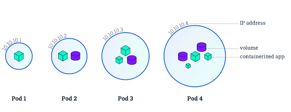

# Pod

Pod is a group of closely related containers that share IPC and Network namespaces, and it is the basic unit for scheduling in Kubernetes. The design concept of Pod is to support multiple containers sharing network and file system within a Pod, which can be combined to provide services through inter-process communication and file sharing.



Characteristics of Pod:

- Contains multiple containers that share IPC and Network namespaces, allowing direct communication via localhost.
- All containers within a Pod have access to shared Volumes, enabling access to shared data.
- No fault tolerance: Once directly created Pods are scheduled and bound to Nodes, they will not be rescheduled even if the Node fails (instead, they will be automatically deleted). Therefore, it is recommended to use controllers such as Deployment or DaemonSet for fault tolerance.
- Graceful termination: When a Pod is deleted, its processes inside receive SIGTERM signals first and wait for a certain period of time (grace period) before being forcefully stopped if they are still running.
- Privileged containers (configured through SecurityContext) have permissions to modify system configurations (widely used in network plugins).

> Kubernetes v1.8+ supports sharing PID namespace between containers. It requires docker >= 1.13.1 with kubelet configured as `--docker-disable-shared-pid=false`.
>
> In Kubernetes v1.10+, `--docker-disable-shared-pid` has been deprecated. To enable PID namespace sharing, set ShareProcessNamespace in v1.PodSpec as true as shown below:
>
> ```yaml
> spec:
> shareProcessNamespace: true
> ```

## Pod Definition

Describe the running environment and desired state of a Pod and its containers through YAML or JSON. For example, a simple nginx pod can be defined as follows:

```yaml
apiVersion: v1
kind: Pod
metadata:
  name: nginx
  labels:
    app: nginx
spec:
  containers:
    - name: nginx
      image: nginx
      ports:
        - containerPort: 80

```

> In production environments, it is recommended to use controllers such as Deployment, StatefulSet, Job, or CronJob to create Pods instead of directly creating Pods.

### Docker Image Support

Currently, Kubernetes only allows the use of Docker images to create containers but it does not support all the behaviors defined by [Dockerfile](https://docs.docker.com/engine/reference/builder/). This can be seen in the table below:

| Dockerfile Directive | Description | Supported | Notes |
| :--- | :--- | :--- | :--- |
| ENTRYPOINT | Launch command | Yes | containerSpec.command |
| CMD | Argument list for command | Yes | containerSpec.args |
| ENV | Environment variables | Yes | containerSpec.env |
| EXPOSE | Port exposed outside | No | Use containerSpec.ports.containerPort instead |
| VOLUME | Data volume | Yes | Use volumes and volumeMounts |
| USER | Process running user and user group | Yes | securityContext.runAsUser/supplementalGroups |
| WORKDIR | Working directory | Yes | containerSpec.workingDir |
| STOPSIGNAL | Signal sent to process when stopping the container | Yes | SIGKILL |
| HEALTHCHECK | Health check | No | Use livenessProbe and readinessProbe instead |
| SHELL | SHELL to run the launch command | No | Use default SHELL for the image launch command |

## Pod Lifecycle

Kubernetes abstracts the status of Pod using `PodStatus.Phase` (but doesn't directly reflect all container statuses). Possible Phases include:

* Pending: The Pod has been created by the API Server, but one or more containers have not yet been created, including the process of downloading the image over the network.
* Running: All containers in the Pod have been created and scheduled on the Node, but at least one container is still running or starting.
* Succeeded: After the Pod is scheduled on the Node, all run successfully and will not restart.
* Failed: All containers in the Pod have been terminated, but at least one container has exited with failure (i.e., the exit code is not 0 or was terminated by the system).
* Unknown: The status is unknown because the Pod cannot be obtained normally due to some reasons, usually because the apiserver cannot communicate with the kubelet.

The `restartPolicy` in PodSpec can be set to determine whether to restart the exited Pod. The options include `Always`, `OnFailure`, and `Never`. For instance:

* Single container Pod, when the container exits successfully, different `restartPolicy` actions are:
  * Always: Restart Container; Pod `phase` remains Running.
  * OnFailure: Pod `phase` becomes Succeeded.
  * Never: Pod `phase` becomes Succeeded.
* Single container Pod, when the container exits on failure, different `restartPolicy` actions are:
  * Always: Restart Container; Pod `phase` remains Running.
  * OnFailure: Restart Container; Pod `phase` remains Running.
  * Never: Pod `phase` becomes Failed.
* 2-container Pod, when one container is running and the other exits on failure, different `restartPolicy` actions are
  * Always: Restart Container; Pod `phase` remains Running.
  * OnFailure: Restart Container; Pod `phase` remains Running.
  * Never: Do not restart Container; Pod `phase` remains Running.
* 2-container Pod, when one container stops and the other exits on failure, different `restartPolicy` actions are
  * Always: Restart Container; Pod `phase` remains Running.
  * OnFailure: Restart Container; Pod `phase` remains Running.
  * Never: Pod `phase` becomes Failed.
* Single container Pod, when the container is
memory-poor (OOM), different `restartPolicy` actions are
  * Always: Restart Container; Pod `phase` remains Running.
  * OnFailure: Restart Container; Pod `phase` remains Running.
  * Never: Record the failure event; Pod `phase` becomes Failed.
* Pod is still running, but disk access is unavailable
  * Terminate all containers
  * Pod `phase` becomes Failed
  * If the Pod is managed by a controller, a new one will be recreated and scheduled on another node.
* Pod is running, but Node is inaccessible due to network partition failure,
  * Node controller waits for Node event timeout
  * Node controller sets Pod `phase` to Failed.
  * If the Pod is managed by a controller, a new one will be recreated and scheduled on another Node.

## Using Volume

The Volume can provide persistent storage for containers, like this:

```yaml
apiVersion: v1
kind: Pod
metadata:
  name: redis
spec:
  containers:
  - name: redis
    image: redis
    volumeMounts:
    - name: redis-storage
      mountPath: /data/redis
  volumes:
  - name: redis-storage
    emptyDir: {}
```

Refer to [Volume](volume.md) for more methods to mount storage volumes.

## Private Image

When using a private image, you need to create a docker registry secret and reference it in the container.

Create docker registry secret:

```bash
kubectl create secret docker-registry regsecret --docker-server=<your-registry-server> --docker-username=<your-name> --docker-password=<your-pword> --docker-email=<your-email>
```

When referencing the docker registry secret, there are two optional ways:

The first is to reference the secret directly in the Pod description file:

```yaml
apiVersion: v1
kind: Pod
metadata:
  name: private-reg
spec:
  containers:
    - name: private-reg-container
      image: dregistry.azurecr.io/acr-auth-example
  imagePullSecrets:
    - name: acr-auth
```

The second is to add the secret to the service account and then reference it through the service account (usually the default service account of a namespace):

```bash
$ kubectl get secrets myregistrykey
$ kubectl patch serviceaccount default -p '{"imagePullSecrets": [{"name": "myregistrykey"}]}'
$ kubectl get serviceaccounts default -o yaml
apiVersion: v1
kind: ServiceAccount
metadata:
  creationTimestamp: 2015-08-07T22:02:39Z
  name: default
  namespace: default
  selfLink: /api/v1/namespaces/default/serviceaccounts/default
  uid: 052fb0f4-3d50-11e5-b066-42010af0d7b6
secrets:
- name: default-token-uudge
imagePullSecrets:
- name: myregistrykey
```

## RestartPolicy

Three types of RestartPolicy are supported

* Always: When the container is inoperative, Kubelet restarts the container automatically. This is the default RestartPolicy value.
* OnFailure: When the container terminates and the exit code is not 0, Kubelet restarts.
* Never: No matter what the circumstance, Kubelet will not restart the container.

Note, the restart here means a local restart on the Node where the Pod is located and will not be scheduled on other nodes.

## Environment Variables

Environment variables provide important resources for containers, including basic information about the container and Pod, and information about services in the cluster:

\(1\) hostname

The `HOSTNAME` environment variable saves the Pod's hostname.

(2) Basic information of the container and Pod

The name, namespace, IP of the Pod, as well as the resource limits for the container, etc. can be obtained and stored in environment variables using the [Downward API](https://kubernetes.io/docs/tasks/inject-data-application/downward-api-volume-expose-pod-information/).

```yaml
apiVersion: v1
kind: Pod
metadata:
  name: test
spec:
  containers:
    - name: test-container
      image: gcr.io/google_containers/busybox
      command: ["sh", "-c"]
      args:
      - env
      resources:
        requests:
          memory: "32Mi"
          cpu: "125m"
        limits:
          memory: "64Mi"
          cpu: "250m"
      env:
        - name: MY_NODE_NAME
          valueFrom:
            fieldRef:
              fieldPath: spec.nodeName
        - name: MY_POD_NAME
          valueFrom:
            fieldRef:
              fieldPath: metadata.name
        - name: MY_POD_NAMESPACE
          valueFrom:
            fieldRef:
              fieldPath: metadata.namespace
        - name: MY_POD_IP
          valueFrom:
            fieldRef:
              fieldPath: status.podIP
        - name: MY_POD_SERVICE_ACCOUNT
          valueFrom:
            fieldRef:
              fieldPath: spec.serviceAccountName
        - name: MY_CPU_REQUEST
          valueFrom:
            resourceFieldRef:
              containerName: test-container
              resource: requests.cpu
  restartPolicy: Never
```

\(3\) Information about services in the cluster

The environment variables of the container can also reference the information of all services created before the container runs. For example, the default Kubernetes service corresponds to the following environment variables:

```bash
KUBERNETES_PORT_443_TCP_ADDR=10.0.0.1
KUBERNETES_SERVICE_HOST=10.0.0.1
KUBERNETES_SERVICE_PORT=443
KUBERNETES_SERVICE_PORT_HTTPS=443
KUBERNETES_PORT=tcp://10.0.0.1:443
KUBERNETES_PORT_443_TCP=tcp://10.0.0.1:443
KUBERNETES_PORT_443_TCP_PROTO=tcp
KUBERNETES_PORT_443_TCP_PORT=443
```

Due to the limitations of environment variable creation order (the environment variable does not include services created later), it is recommended to use [DNS]() to resolve services.

## Pulling Strategy of Images

Kubernetes supports three image pull policies:

* Always: The system will pull the image from the repository regardless of whether it exists locally or not. If the image has changed, it overrides the existing one. Otherwise, it leaves the local image unchanged.
* Never: The system only uses local images and won't pull from the repository. If the local image is missing, the Pod will fail to run.
* IfNotPresent: The system will only pull from the repository if the local image doesn't exist. This is the default value for the ImagePullPolicy.

Important Notes:

* The default setting is `IfNotPresent`, but for images with the `:latest` tag, the default is `Always`.
* Docker verifies during the image pull process. If the MD5 hash of the image hasn't changed, it won't pull the image data.
* In a production environment, the usage of the `:latest` tag should be avoided as much as possible, while in a development environment, the `:latest` tag can be used to automatically pull the latest images.

## DNS Access Strategy

By setting the dnsPolicy parameter, you can control how the containers in a pod access DNS.

* ClusterFirst: It prioritizes queries based on the cluster domain suffix (for example, `default.svc.cluster.local`) via kube-dns (the default policy)
* Default: It prioritizes queries from the DNS configured within the Node.

## Using the Host's IPC (Inter-Process Communication) Namespace

By setting `spec.hostIPC` to true, your Pod can use the host's IPC namespace. By default, this is set to false.

## Using the Host's Network Namespace

By setting `spec.hostNetwork` to true, your Pod can use the host's network namespace. By default, this is set to false.

## Using the Host's PID (Process ID) Space

By setting `spec.hostPID` to true, your Pod can use the host's PID namespace. By default, this is set to false.

```yaml
apiVersion: v1
kind: Pod
metadata:
  name: busybox1
  labels:
    name: busybox
spec:
  hostIPC: true
  hostPID: true
  hostNetwork: true
```

## Setting the Pod's hostname

The hostname of a Pod is set by the `spec.hostname` parameter. If it's not specified, the value of the `metadata.name` parameter is used as the Pod's hostname.

## Setting the Pod's Subdomain

The `spec.subdomain` parameter can be used to set a Pod's subdomain. By default, this is blank.

For instance, to specify the hostname as busybox-2 and subdomain as default-subdomain, the full domain name becomes `busybox-2.default-subdomain.default.svc.cluster.local`. This can also be shortened to `busybox-2.default-subdomain.default`:

```yaml
apiVersion: v1
kind: Pod
metadata:
  name: busybox2
  labels:
    name: busybox
spec:
  hostname: busybox-2
  subdomain: default-subdomain
  containers:
  - image: busybox
    command:
      - sleep
      - "3600"
    name: busybox
```

Important Notes:

* By default, the DNS generates an A record for the Pod in the format `pod-ip-address.my-namespace.pod.cluster.local`, like `1-2-3-4.default.pod.cluster.local`
* In the above example, you also need to create a headless service named `default-subdomain` (the same name as subdomain) in the default namespace. Otherwise, other Pods won't be able to access this Pod via the full domain name - only the Pod itself would be able to do so.

```yaml
kind: Service
apiVersion: v1
metadata:
  name: default-subdomain
spec:
  clusterIP: None
  selector:
    name: busybox
  ports:
  - name: foo # Actually, no port is needed.
    port: 1234
    targetPort: 1234
```

Be aware, you must set at least one service port for the headless service (headless `spec.ports`), even if it seems like it is not needed, to enable the full domain name function for communication between Pods.

## Setting the Pod's DNS Options

```yaml
apiVersion: v1
kind: Pod
metadata:
  namespace: default
  name: dns-example
spec:
  containers:
    - name: test
      image: nginx
  dnsPolicy: "None"
  dnsConfig:
    nameservers:
      - 1.2.3.4
    searches:
      - ns1.svc.cluster.local
      - my.dns.search.suffix
    options:
      - name: ndots
        value: "2"
      - name: edns0
```

## Resource Limits

Kubernetes uses cgroups to limit the computational resources of containers, such as CPU and memory, including requests (scheduling the pod to a node with enough resources. If the criteria cannot be met, the scheduling will fail) and limits:

* `spec.containers[].resources.limits.cpu`: The CPU limit, which can briefly exceed, and the container won't be stopped
* `spec.containers[].resources.limits.memory`: The memory limit, which can't be exceeded; if it is, the container may be terminated or moved to another machine with enough resources
* `spec.containers[].resources.limits.ephemeral-storage`: The limit for ephemeral storage (container writable layer, logs, and EmptyDir, etc); when this limit is exceeded, the Pod will be evicted
* `spec.containers[].resources.requests.cpu`: CPU request, is the basis for scheduling CPU resources, which can exceed
* `spec.containers[].resources.requests.memory`: Memory request, is the basis for scheduling memory resources, which can exceed; but if it does, the container may be among the first to be cleaned up when the Node's memory is insufficient
* `spec.containers[].resources.requests.ephemeral-storage`: Request for ephemeral storage (container writable layer, logs, and EmptyDir, etc); it's used as a basis for scheduling container storage

A few important points:

* The unit for CPU is the number of CPUs. `millicpu (m)` is used to represent situations when you have less than one CPU, eg. `500m = 500millicpu = 0.5cpu`, and one CPU is equivalent to
  * a vCPU on AWS
  * a Core on GCP
  * a vCore on Azure
  * a hyper-threading on a physical machine
* The units for memory include `E, P, T, G, M, K, Ei, Pi, Ti, Gi, Mi, Ki`, etc.
* Starting from v1.10, you can set the `kubelet --cpu-manager-policy=static` for Guaranteed Pods (meaning that requests.cpu and limits.cpu are equal) to bind CPU (through cpuset cgroups).

## Health Check

To ensure that the container is functioning properly after being deployed, Kubernetes offers two probes (Probes) to detect the status of the container:

* LivenessProbe: Detects whether the application is healthy. If it's unhealthy, it deletes and recreates the container.
* ReadinessProbe: Checks whether the application has started and is serving normally. If it's not fully functional, it won't receive traffic from Kubernetes Services, i.e., the Pod will be removed from the Service endpoint.

Kubernetes supports three methods for executing probes:

* exec: Executes a command in the container. If the command exit code is `0`, it means the probe succeeded; otherwise, it generally indicates a failure
* tcpSocket: Performs a TCP check on the specified container IP and port. If the port is open, it means the probe succeeded; otherwise, it suggests a failure
* httpGet: Performs an HTTP Get request on the specified container IP, port, and path. If the returned status code is in the `[200,400)` range, it means the probe succeeded, otherwise, it suggests a failure

## Init Container

A Pod can have multiple containers, and while applications run inside these containers, there can be one or more Init containers that start before the application containers. Init containers perform their tasks of initialization before all the other containers run (run-to-completion).

If a Pod has multiple Init containers specified, they will run sequentially one by one. Every Init container must succeed before the next one can run. When all the Init containers have completed their tasks successfully, Kubernetes starts the Pod and runs the application containers in the usual manner.

As Init containers can have separate images from the application containers, there are several benefits to setting init container startup related code:

* They can contain and run utility tools, which are not recommended to be included in the application's container image on security grounds.
* They can contain utility tools and customized codes for installation, which is not allowed in the application image. For instance, there is no need to create an image FROM another image, you just need to use tools like sed, awk, python, or dig during the installation process.
* Application images can separate and offload the tasks of creating and deploying roles, thereby obviating the need to build a separate image to combine them.
* They use Linux Namespace, so they have a distinct filesystem view from the application containers. This means they can access Secrets that are denied to application containers.
* They complete their tasks before the application containers start, and while application containers run concurrently. Hence, Init containers offer a simple way to block or delay the launch of application containers until all the preconditions have been met.

The maximum value between the following two is selected as the resource calculation for Init containers:

* The maximum value of resource usage among all Init containers
* The sum of resource usage of all containers in the Pod

Init containers' restart strategy:

* If the Init container's execution fails and the Pod's restartPolicy is set to Never, the Pod will be in a failed state. Otherwise, it will keep retrying all Init containers until each has succeeded.
* If the Pod abruptly exits, when it is pulled again, the Init containers will also be re-executed. Hence, the tasks performed in the Init containers should be idempotent (they can be applied multiple times without changing the result beyond the initial application).

## Container Lifecycle Hooks

Container Lifecycle Hooks listen to specific events in the container's lifecycle and execute the registered callback functions when these events occur. Kubernetes supports two kinds of hooks:

* postStart: Executes immediately after a container is created, but note that it is performed asynchronously and cannot be guaranteed to run before the ENTRYPOINT. If it fails, the container will be killed, and whether it is restarted depends on the RestartPolicy
* preStop: Executes prior to the termination of a container, often used for resource cleanup. If this fails, the container will also be killed

The callback function of the hook supports two methods:

* exec: Executes a command in the container. If the command's exit status code is `0`, it means the execution was successful, otherwise it indicates a failure
* httpGet: Sends a GET request to a specified URL. If the returned HTTP status code is in the `[200, 400)` window, it means the request was successful, otherwise it indicates a failure

## Using Capabilities

By default, containers are run in a non-privileged manner, for example, they cannot create virtual network adapters, or configure virtual networks from within.

Kubernetes provides a mechanism to alter [Capabilities](http://man7.org/linux/man-pages/man7/capabilities.7.html), allowing you to add to or remove from containers as needed. For example, the configuration below adds the `CAP_NET_ADMIN` and removes the `CAP_KILL` from the container.

```yaml
apiVersion: v1
kind: Pod
metadata:
  name: cap-pod
spec:
  containers:
  - name: friendly-container
    image: "alpine:3.4"
    command: ["/bin/sleep", "3600"]
    securityContext:
      capabilities:
        add:
        - NET_ADMIN
        drop:
        - KILL
```

## Limiting Network Bandwidth

You can limit the network bandwidth of a Pod by adding the `kubernetes.io/ingress-bandwidth` and `kubernetes.io/egress-bandwidth` annotations to the Pod

```yaml
apiVersion: v1
kind: Pod
metadata:
  name: qos
  annotations:
    kubernetes.io/ingress-bandwidth: 3M
    kubernetes.io/egress-bandwidth: 4M
spec:
  ...
```

## Scheduling Pods to Specific Nodes

You can schedule Pods to preferred nodes through nodeSelector, nodeAffinity, podAffinity, and Taints & tolerations.

You can also set the nodeName parameter to schedule the Pod to a specific node.

For example, with nodeSelector, you can first label the node:

```bash
kubectl label nodes <your-node-name> disktype=ssd
```

Next, specify that you want the Pod to run only on nodes with the `disktype=ssd` label:

```yaml
apiVersion: v1
kind: Pod
metadata:
  name: nginx
  labels:
    env: test
spec:
  containers:
  - name: nginx
    image: nginx
    imagePullPolicy: IfNotPresent
  nodeSelector:
    disktype: ssd
```

For the usage methods of nodeAffinity, podAffinity, and Taints & tolerations, please refer to the [Scheduler chapter](../components/scheduler.md).

## Custom hosts

By default, the containers' `/etc/hosts` is automatically generated by kubelet, and only includes localhost and podName. Modifying `/etc/hosts` directly within the container is not recommended, as it will be overwritten when the Pod starts or restarts.

From v1.7 onwards, you can add to hosts' content through `pod.Spec.HostAliases`, for example:

```yaml
apiVersion: v1
kind: Pod
metadata:
  name: hostaliases-pod
spec:
  hostAliases:
  - ip: "127.0.0.1"
    hostnames:
    - "foo.local"
    - "bar.local"
  - ip: "10.1.2.3"
    hostnames:
    - "foo.remote"
    - "bar.remote"
  containers:
  - name: cat-hosts
    image: busybox
    command:
    - cat
    args:
    - "/etc/hosts"
```

## HugePages

```yaml
apiVersion: v1
kind: Pod
metadata:
  generateName: hugepages-volume-
spec:
  containers:
  - image: fedora:latest
    command:
    - sleep
    - inf
    name: example
    volumeMounts:
    - mountPath: /hugepages
      name: hugepage
    resources:
      limits:
        hugepages-2Mi: 100Mi
  volumes:
  - name: hugepage
    emptyDir:
      medium: HugePages
```

## Sysctls

```yaml
apiVersion: v1
kind: Pod
metadata:
  name: sysctl-example
spec:
  securityContext:
    sysctls:
    - name: kernel.shm_rmid_forced
      value: "0"
    - name: net.ipv4.route.min_pmtu
      value: "552"
    - name: kernel.msgmax
      value: "65536"
  ...
```

## Pod Timezone

```yaml
apiVersion: v1
kind: Pod
metadata:
  name: sh
  namespace: default
spec:
  containers:
  - image: alpine
    stdin: true
    tty: true
    volumeMounts:
    - mountPath: /etc/localtime
      name: time
      readOnly: true
  volumes:
  - hostPath:
      path: /etc/localtime
      type: ""
    name: time
```

## References

* [What is Pod?](https://kubernetes.io/docs/concepts/workloads/pods/pod/)
* [Kubernetes Pod Lifecycle](https://kubernetes.io/docs/concepts/workloads/pods/pod-lifecycle/)
* [DNS Pods and Services](https://kubernetes.io/docs/concepts/services-networking/dns-pod-service/)
