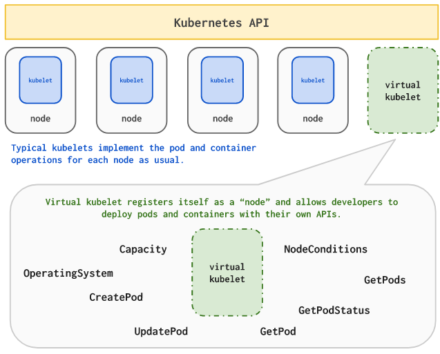

# Kubernetes on Azure

Azure 容器服务 (AKS) 是 Microsoft Azure 最近发布的一个托管的 Kubernetes 服务（预览版），它独立于现有的 Azure Container Service （ACS）。借助 AKS 用户无需具备容器业务流程的专业知识就可以快速、轻松的部署和管理容器化的应用程序。AKS 支持自动升级和自动故障修复，按需自动扩展或缩放资源池，消除了用户管理和维护 Kubernetes 集群的负担。并且集群管理本身是免费的，Azure 只收取容器底层的虚拟机的费用。

ACS 是 Microsoft Azure 在 2015 年推出的容器服务，支持 Kubernetes、DCOS 以及 Dockers Swarm 等多种容器编排工具。并且 ACS 的核心功能是开源的，用户可以通过 https://github.com/Azure/acs-engine 来查看和下载使用。

## AKS

### 基本使用

以下文档假设用户已经安装好了 Azure CLI ，如未安装可以参考 [这里](https://docs.microsoft.com/en-us/cli/azure/install-azure-cli?view=azure-cli-latest) 操作。

在创建 AKS 集群之前，首先需要开启容器服务

```sh
# Enable AKS
az provider register -n Microsoft.ContainerService
```

然后创建一个资源组（Resource Group）用来管理所有相关资源

```sh
# Create Resource Group
az group create --name group1 --location centralus
```

接下来就可以创建 AKS 集群了

```sh
# Create aks
az aks create --resource-group group1 --name myK8sCluster --node-count 3 --generate-ssh-keys
```

稍等一会，集群创建好后安装并配置 kubectl

```sh
# Install kubectl
az aks install-cli

# Configure kubectl
az aks get-credentials --resource-group=group1 --name=myK8sCluster
```

> 注意使用 azure-cli 2.0.24 版本时，`az aks get-credentials` 命令可能会失败，解决方法是升级到更新版本，或回退到 2.0.23 版本。

### 访问 Dashboard

```sh
# Create dashboard
az aks browse --resource-group group1 --name myK8SCluster
```

### 手动扩展或收缩集群

```sh
az aks scale --resource-group=group1 --name=myK8SCluster --agent-count 5
```

### 升级集群

```sh
# 查询当前集群的版本以及可升级的版本
az aks get-versions --name myK8sCluster --resource-group group1 --output table

# 升级到 1.11.3 版本
az aks upgrade --name myK8sCluster --resource-group group1 --kubernetes-version 1.11.3
```

下图动态展示了一个部署 v1.7.7 版本集群并升级到 v1.8.1 的过程：


### 使用 Helm

当然也可以使用其他 Kubernetes 社区提供的工具和服务，比如使用 Helm 部署 Nginx Ingress 控制器

```sh
helm init --client-only
helm install stable/nginx-ingress
```

### 删除集群

当集群不再需要时，可以删除集群

```sh
az group delete --name group1 --yes --no-wait
```

## acs-engine

虽然未来 AKS 是 Azure 容器服务的下一代主打产品，但用户可能还是希望可以自己管理容器集群以保证足够的灵活性（比如自定义 master 服务等）。这时用户可以使用开源的 [acs-engine](https://github.com/Azure/acs-engine) 来创建和管理自己的集群。acs-engine 其实就是 ACS 的核心部分，提供了一个部署和管理 Kubernetes、Swarm 和 DC/OS 集群的命令行工具。它通过将容器集群描述文件转化为一组 ARM（Azure Resource Manager）模板来建立容器集群。

在 acs-engine 中，每个集群都通过一个 json 文件来描述，比如一个 Kubernetes 集群可以描述为

```sh
{
  "apiVersion": "vlabs",
  "properties": {
    "orchestratorProfile": {
      "orchestratorType": "Kubernetes",
      "orchestratorRelease": "1.12",
      "kubernetesConfig": {
        "networkPolicy": "",
        "enableRbac": true
      }
    },
    "masterProfile": {
      "count": 1,
      "dnsPrefix": "",
      "vmSize": "Standard_D2_v2"
    },
    "agentPoolProfiles": [
      {
        "name": "agentpool1",
        "count": 3,
        "vmSize": "Standard_D2_v2",
        "availabilityProfile": "AvailabilitySet"
      }
    ],
    "linuxProfile": {
      "adminUsername": "azureuser",
      "ssh": {
        "publicKeys": [
          {
            "keyData": ""
          }
        ]
      }
    },
    "servicePrincipalProfile": {
      "clientId": "",
      "secret": ""
    }
  }
}
```

orchestratorType 指定了部署集群的类型，目前支持三种

- Kubernetes
- Swarm
- DCOS

而创建集群的步骤也很简单

```sh
# create a new resource group.
az group create --name myResourceGroup  --location "centralus"

# start deploy the kubernetes
acs-engine deploy --resource-group myResourceGroup --subscription-id <subscription-id> --auto-suffix --api-model kubernetes.json --location centralus --dns-prefix <dns-prefix>

# setup kubectl
export KUBECONFIG="$(pwd)/_output/<name-with-suffix>/kubeconfig/kubeconfig.centralus.json"
kubectl get node
```

### 开启 RBAC

RBAC 默认是不可以开启的，可以通过设置 enableRbac 开启

```json
     "kubernetesConfig": {
        "enableRbac": true
      }
```

### 自定义 Kubernetes 版本

acs-engine 基于 hyperkube 来部署 Kubernetes 服务，所以只需要使用自定义的 hyperkube 镜像即可。

```json
{
	"kubernetesConfig": {
		"customHyperkubeImage": "docker.io/feisky/hyperkube-amd64:v1.12.1"
	}
}
```

hyperkube 镜像可以从 Kubernetes 源码编译，编译步骤为

```sh
# Build Kubernetes
bash build/run.sh make KUBE_FASTBUILD=true ARCH=amd64

# Build docker image for hyperkube
cd cluster/images/hyperkube
make VERSION=v1.12.x-dev
cd ../../..

# push docker image
docker tag gcr.io/google-containers/hyperkube-amd64:v1.12.x-dev feisky/hyperkube-amd64:v1.12.x-dev
docker push feisky/hyperkube-amd64:v1.12.x-dev
```

### 添加 Windows 节点

可以通过设置 osType 来添加 Windows 节点（完整示例见 [这里](https://github.com/Azure/acs-engine/blob/master/examples/windows/kubernetes.json)）

```json
    "agentPoolProfiles": [
      {
        "name": "windowspool2",
        "count": 2,
        "vmSize": "Standard_D2_v2",
        "availabilityProfile": "AvailabilitySet",
        "osType": "Windows"
      }
    ],
    "windowsProfile": {
      "adminUsername": "azureuser",
      "adminPassword": "replacepassword1234$"
    },
```

### 使用 GPU

设置 vmSize 为 `Standard_NC*` 或  `Standard_NV*` 会自动配置 GPU，并自动安装所需要的 NVDIA 驱动。

### 自定义网络插件

acs-engine 默认使用 kubenet 网络插件，并通过用户自定义的路由以及 IP-forwarding 转发 Pod 网络。此时，Pod 网络与 Node 网络在不同的子网中，Pod 不受 VNET 管理。

用户还可以使用 [Azure CNI plugin](https://github.com/Azure/azure-container-networking) 插件将 Pod 连接到 Azure VNET 中

```json
"properties": {
    "orchestratorProfile": {
      "orchestratorType": "Kubernetes",
      "kubernetesConfig": {
        "networkPolicy": "azure"
      }
    }
}
```

也可以使用 calico 网络插件

```json
"properties": {
    "orchestratorProfile": {
      "orchestratorType": "Kubernetes",
      "kubernetesConfig": {
        "networkPolicy": "calico"
      }
    }
}
```

## Azure Container Registry

在 AKS 预览版发布的同时，Azure 还同时发布了 Azure Container Registry（ACR）服务，用于托管用户的私有镜像。

```sh
# Create ACR
az acr create --resource-group myResourceGroup --name <acrName> --sku Basic --admin-enabled true

# Login
az acr login --name <acrName>

# Tag the image.
az acr list --resource-group myResourceGroup --query "[].{acrLoginServer:loginServer}" --output table
docker tag azure-vote-front <acrLoginServer>/azure-vote-front:redis-v1

# push image
docker push <acrLoginServer>/azure-vote-front:redis-v1

# List images.
az acr repository list --name <acrName> --output table
```

## Virtual Kubelet

Azure 容器实例（ACI）提供了在 Azure 中运行容器的最简捷方式，它不需要用户配置任何虚拟机或其它高级服务。ACI 适用于快速突发式增长和资源调整的业务，但其本身的功能相对比较简单。 [Virtual Kubelet](https://github.com/virtual-kubelet/virtual-kubelet) 可以将 ACI 作为 Kubernetes 集群的一个无限 Node 使用，这样就无需考虑 Node 数量的问题，ACI 会根据运行容器自动管理集群资源。



可以使用 Helm 来部署 Virtual Kubelet：

```sh
RELEASE_NAME=virtual-kubelet
CHART_URL=https://github.com/virtual-kubelet/virtual-kubelet/raw/master/charts/virtual-kubelet-0.4.0.tgz

helm install "$CHART_URL" --name "$RELEASE_NAME" --namespace kube-system --set env.azureClientId=<YOUR-AZURECLIENTID-HERE>,env.azureClientKey=<YOUR-AZURECLIENTKEY-HERE>,env.azureTenantId=<YOUR-AZURETENANTID-HERE>,env.azureSubscriptionId=<YOUR-AZURESUBSCRIPTIONID-HERE>,env.aciResourceGroup=<YOUR-ACIRESOURCEGROUP-HERE>,env.nodeName=aci, env.nodeOsType=<Linux|Windows>,env.nodeTaint=azure.com/aci
```

在开启 RBAC 的集群中，还需要给 virtual-kubelet 开启对应的权限。最简单的方法是给 service account `kube-system:default ` 设置 admin 权限（不推荐生产环境这么设置，应该设置具体的权限），比如

```sh
kubectl create clusterrolebinding virtual-kubelet-cluster-admin-binding --clusterrole=cluster-admin --serviceaccount=kube-system:default
```

部署成功后，会发现集群中会出现一个新的名为 `aci` 的 Node：

```sh
$ kubectl get nodes aci
NAME      STATUS    ROLES     AGE       VERSION
aci       Ready     agent     34s       v1.8.3
```

此时，就可以通过 ** 指定 nodeName 或者容忍 taint `azure.com/aci=NoSchedule` 调度 ** 到 ACI 上面。比如

```yaml
apiVersion: v1
kind: Pod
metadata:
  name: nginx
spec:
  containers:
  - image: nginx
    imagePullPolicy: Always
    name: nginx
    resources:
      requests:
        memory: 100M
        cpu: 1
    ports:
    - containerPort: 80
      name: http
      protocol: TCP
    - containerPort: 443
      name: https
  dnsPolicy: ClusterFirst
  nodeName: aci
```

## 参考文档

- [AKS – Managed Kubernetes on Azure](https://www.reddit.com/r/AZURE/comments/7d7diz/ama_aks_managed_kubernetes_on_azure/)
- [Azure Container Service (AKS)](https://docs.microsoft.com/en-us/azure/aks/)
- [Azure/acs-engine Github](https://github.com/Azure/acs-engine)
- [acs-engine/examples](https://github.com/Azure/acs-engine/tree/master/examples)
