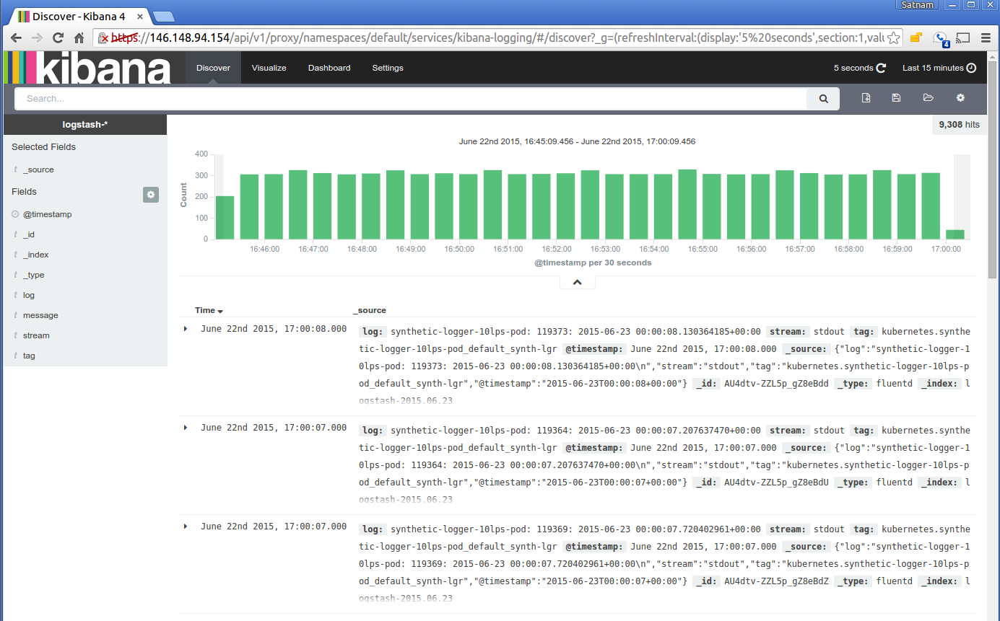

# Kubernetes日志

ELK可谓是容器日志收集、处理和搜索的黄金搭档:

- Logstash（或者Fluentd）负责收集日志
- Elasticsearch存储日志并提供搜索
- Kibana负责日志查询和展示

注意：Kubernetes默认使用fluentd（以DaemonSet的方式启动）来收集日志，并将收集的日志发送给elasticsearch。

**小提示**

在使用`cluster/kube-up.sh`部署集群的时候，可以设置`KUBE_LOGGING_DESTINATION`环境变量自动部署Elasticsearch和Kibana，并使用fluentd收集日志(配置参考[addons/fluentd-elasticsearch](https://github.com/kubernetes/kubernetes/tree/master/cluster/addons/fluentd-elasticsearch))：

```sh
KUBE_LOGGING_DESTINATION=elasticsearch
KUBE_ENABLE_NODE_LOGGING=true
cluster/kube-up.sh
```

如果使用GCE或者GKE的话，还可以[将日志发送给Google Cloud Logging](https://kubernetes.io/docs/user-guide/logging/stackdriver/)，并可以集成Google Cloud Storage和BigQuery。

如果需要集成其他的日志方案，还可以自定义docker的log driver，将日志发送到splunk或者awslogs等。

## 部署方法

由于Fluentd daemonset只会调度到带有标签`kubectl label nodes --all beta.kubernetes.io/fluentd-ds-ready=true`的Node上，需要给Node设置标签

```sh
kubectl label nodes --all beta.kubernetes.io/fluentd-ds-ready=true
```

然后下载manifest部署：

```sh
$ git clone https://github.com/kubernetes/kubernetes
$ cd cluster/addons/fluentd-elasticsearch
$ kubectl apply -f .
clusterrole "elasticsearch-logging" configured
clusterrolebinding "elasticsearch-logging" configured
replicationcontroller "elasticsearch-logging-v1" configured
service "elasticsearch-logging" configured
serviceaccount "elasticsearch-logging" configured
clusterrole "fluentd-es" configured
clusterrolebinding "fluentd-es" configured
daemonset "fluentd-es-v1.24" configured
serviceaccount "fluentd-es" configured
deployment "kibana-logging" configured
service "kibana-logging" configured
```

注意：Kibana容器第一次启动的时候会用较长的时间（Optimizing and caching bundles for kibana and statusPage. This may take a few minutes），可以通过日志观察初始化的情况

```sh
$ kubectl -n kube-system logs kibana-logging-1237565573-p88lm -f
```

## 访问Kibana

可以从`kubectl cluster-info`的输出中找到Kibana服务的访问地址，注意需要在浏览器中导入apiserver证书才可以认证：

```sh
$ kubectl cluster-info | grep Kibana
Kibana is running at https://10.0.4.3:6443/api/v1/namespaces/kube-system/services/kibana-logging/proxy
```

这里采用另外一种方式，使用kubectl代理来访问（不需要导入证书）：

```sh
# 启动代理
kubectl proxy --address='0.0.0.0' --port=8080 --accept-hosts='^*$' &
```

然后打开`http://<master-ip>:8080/api/v1/proxy/namespaces/kube-system/services/kibana-logging/app/kibana#`。在 Settings -> Indices 页面创建一个 index，选中 Index contains time-based events，使用默认的 `logstash-*` pattern，点击 Create。



## Filebeat

除了Fluentd和Logstash，还可以使用[Filebeat](https://www.elastic.co/products/beats/filebeat)来收集日志，使用方法可以参考[使用Filebeat收集Kubernetes中的应用日志](http://rootsongjc.github.io/blogs/kubernetes-filebeat/)。

## 参考文档

- [Logging Agent For Elasticsearch](https://github.com/kubernetes/kubernetes/tree/master/cluster/addons/fluentd-elasticsearch)
- [Logging Using Elasticsearch and Kibana](https://kubernetes.io/docs/tasks/debug-application-cluster/logging-elasticsearch-kibana/)
