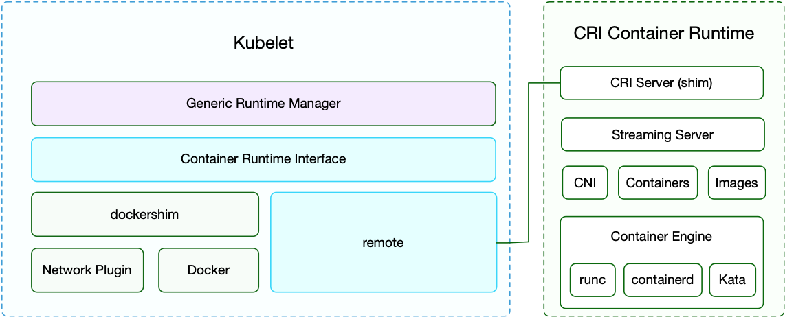

# Plug in and Go with the CRI

The Container Runtime Interface (CRI), first introduced in Kubernetes v1.5, is a game-changer in the handling of container runtimes. By "unplugging" the Kubelet from the container runtime and restructuring internal interfaces to focus on Sandbox and Container formats, it's taken container runtime accessibility and modularity to the next level. With CRI, image management and container management each receive dedicated services, streamlining the process further.


The CRI project began way back with the v1.4 release, culminating in its first test version with v1.5. Since then, the CRI has spawned numerous external container runtimes, such as Frakti and cri-o, hitting a high note in v1.7 with the introduction of cri-containerd support, dramatically improving container management via Containerd.

After integrating with CRI, the Kubelet now more sleekly resembles the following:



## Understanding the CRI Interface

CRI, built upon gRPC, delivers two separate services: RuntimeService and ImageService – geared towards container runtime and image management, respectively. The definitions of these services have been segmented across different Kubernetes versions for optimal efficiency.

In the CRI realm, the Kubelet serves as the client whereas the container runtime acts as the CRI server (more specifically, the gRPC server), often referred to as the CRI shim. This server must listen to the local Unix Socket for smooth operations (or use the tcp format if you're on Windows).

### Building a CRI-based Container Runtime

Developing a new container runtime is as simple as setting up a new gRPC Server for the CRI that includes both RuntimeService and ImageService. This server should be configured to listen via a local Unix socket (for Linux) or in a tcp format (for Windows).

Below is a simplified example of how you might set this up:

```go
import (
    // Import required packages
    "google.golang.org/grpc"
    runtime "k8s.io/kubernetes/pkg/kubelet/apis/cri/runtime/v1alpha2"
)

type Service struct {
    ...
}

func main() {
    service := &Service{}
    s := grpc.NewServer(
      grpc.MaxRecvMsgSize(maxMsgSize),
      grpc.MaxSendMsgSize(maxMsgSize))
    runtime.RegisterRuntimeServiceServer(s, service)
    runtime.RegisterImageServiceServer(s, service)
    lis, err := net.Listen("unix", "/var/run/runtime.sock")
    if err != nil {
        log.Fatalf("Failed to create listener: %v", err)
    }
    go s.Serve(lis)

    // Insert additional code here
}
```

For Streaming APIs (Exec, PortForward, Attach), the CRI demands that the container runtime returns a URL of a streaming server so Kubelet can effectively redirect API Server requests. 


Your go-to guide for detailed implementation methods are [dockershim](https://github.com/kubernetes/kubernetes/tree/master/pkg/kubelet/dockershim) and [cri-o](https://github.com/kubernetes-incubator/cri-o).

### Configuring the Kubelet

When launching kubelet, simply enter the path of the Unix Socket file where the container runtime is listening.

```bash
kubelet --container-runtime=remote --container-runtime-endpoint=unix:///var/run/runtime.sock --image-service-endpoint=unix:///var/run/runtime.sock
```

## The Container Runtime

Numerous container engines based on CRI have sprung up over the years, each with its unique edge and unique capabilities. Let's name a few:

* Docker: The trusted workhorse; its core code is housed within Kubelet.
* OCI Container Runtime has two community-led implementations – Containerd which supports Kubernetes v1.7+ and CRI-O, supports Kubernetes v1.6+
* [PouchContainer](https://github.com/alibaba/pouch): Alibaba's open-source "fat" container engine.
* [Frakti](https://github.com/kubernetes/frakti): Supports Kubernetes v1.6+ and offers a hybrid runtime combining hypervisor and Docker—perfect for running untrusted applications such as multi-tenancy and NFV.

Here's a quick breakdown of the main players:

| **CRI Container Runtime** | **Maintainer** | **Primary Features** | **Container Engine** |
| :--- | :--- | :--- | :--- |
| **Dockershim** | Kubernetes | Built-in, latest features | docker |
| **cri-o** | Kubernetes | OCI standard, no Docker needed | OCI (runc, kata, gVisor…) |
| **cri-containerd** | Containerd | Containerd-based, no Docker needed | OCI (runc, kata, gVisor…) |
| **Frakti** | Kubernetes | Virtualization containers | hyperd, docker |
| **rktlet** | Kubernetes | rk support | rkt |
| **PouchContainer** | Alibaba | Rich containers | OCI (runc, kata…) |
| **Virtlet** | Mirantis | VM and QCOW2 images | Libvirt (KVM) |

### Introducing Containerd

Containerd has an intriguing history with the CRI. In versions 1.0 and earlier, it replaced dockershim and Docker daemon with cri-containerd + containerd. Containerd 1.1, however, simplified this process further by integrating cri-containerd right within Containerd itself, materializing into a single CRI plugin.


This self-contained CRI plugin implements both the Image Service and Runtime Service parts of the Kubelet CRI interface. Additionally, it cleverly utilizes internal interfaces to manage containers and images and employs the CNI plugin to configure the Pod’s network.


## Introducing RuntimeClass

v1.12 also introduced us to RuntimeClass - a new API object designed to support multiple container runtimes like Kata Containers/gVisor + runc, Windows Process isolation + Hyper-V isolation containers.

This RuntimeClass object is an actionable runtime object that can be accessed after enabling the `RuntimeClass` feature and creating the RuntimeClass CRD.

```bash
kubectl apply -f https://github.com/kubernetes/kubernetes/tree/master/cluster/addons/runtimeclass/runtimeclass_crd.yaml
```

Here's how you can define a RuntimeClass object:

```yaml
apiVersion: node.k8s.io/v1alpha1  # RuntimeClass is in the node.k8s.io API group
kind: RuntimeClass
metadata:
  name: myclass  # Simply name to reference the RuntimeClass
  # RuntimeClass is a non-namespaced resource
spec:
  runtimeHandler: myconfiguration  # The name of the corresponding CRI configuration
```

To specify a RuntimeClass in a Pod, here’s a sample:

```yaml
apiVersion: v1
kind: Pod
metadata:
  name: mypod
spec:
  runtimeClassName: myclass
  # ...
```

## Further Reading

* [Runtime Class Documentation](https://kubernetes.io/docs/concepts/containers/runtime-class/#runtime-class)
* [Sandbox Isolation Level Decision](https://docs.google.com/document/d/1fe7lQUjYKR0cijRmSbH_y0_l3CYPkwtQa5ViywuNo8Q/preview)
