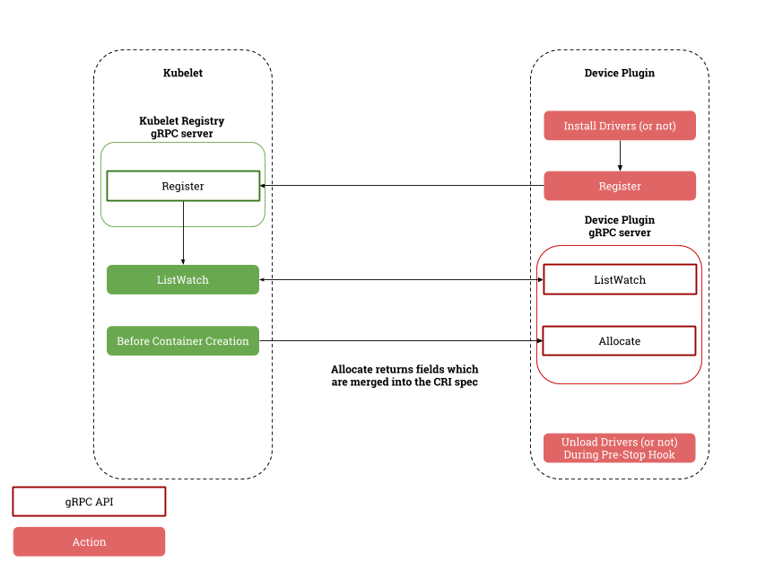

# Turbocharging Kubernetes with Device Plugins

Since the launch of version v1.8, Kubernetes has infused a shot of adrenaline in its operations with the introduction of Device Plugins – an alpha version tool designed to bolster support for various devices, such as GPUs, FPGAs, high-performance NICs, InfiniBand, and more. As a result, hardware manufacturers can now simply execute a proprietary device plugin in line with the Device Plugin interface, thereby eliminating the need to fine-tune the Kubernetes core code.

> The potency of this feature got a subsequent boost when it was upgraded to Beta version in v1.10.

## Inner Workings of Device Plugins

Before putting these Device Plugins to good use, one must first activate the DevicePlugins feature. This can be done by configuring the `--feature-gates=DevicePlugins=true` (which, by default, is switched off).

Device Plugins are, in essence, a [gPRC interface](https://github.com/kubernetes/community/blob/master/contributors/design-proposals/resource-management/device-plugin.md) that requires the implementation of methods like `ListAndWatch()` and `Allocate()`. It calls for the monitoring of the gRPC Server's Unix Socket in the `/var/lib/kubelet/device-plugins/` directory, such as `/var/lib/kubelet/device-plugins/nvidiaGPU.sock`. In rolling out your Device Plugins, bear in mind that:

* The plugin must be registered with Kubelet via `/var/lib/kubelet/device-plugins/kubelet.sock` upon launch, supplying along with the Unix Socket of the plugin, the API version number, and the plugin name (formatted as `vendor-domain/resource`, such as `nvidia.com/gpu`). Kubelet will then expose these devices in the Node status for future use by the scheduler.
* Post-launch, the plugin must continually broadcast its lineup to Kubelet, allocate devices as and when required, and maintain real-time device status monitoring.
* The plugin's vigil on Kubelet status must remain constant post-launch, and it should re-register itself following a Kubelet restart. After initializing, for instance, Kubelet will wipe clean the `/var/lib/kubelet/device-plugins/` directory – plugin authors can therefore keep watch to see if the unix socket they're monitoring gets deleted and re-register themselves in response to such an event.



Normally, it is recommended that these Device Plugins be rolled out in the form of DaemonSets, and that `/var/lib/kubelet/device-plugins` be mounted into the containers as a volume. That said, they can also be implemented manually, but this comes without the fallback option of automatic failure recovery.

## NVIDIA GPU Plugin

NVIDIA has developed an advanced GPU device plugin based on the Device Plugins interface [NVIDIA/k8s-device-plugin](https://github.com/NVIDIA/k8s-device-plugin). 

To compile:

```bash
git clone https://github.com/NVIDIA/k8s-device-plugin
cd k8s-device-plugin
docker build -t nvidia-device-plugin:1.0.0 .
```

To deploy:

```bash
kubectl apply -f https://raw.githubusercontent.com/NVIDIA/k8s-device-plugin/master/nvidia-device-plugin.yml
```

To request GPU resources when creating a Pod:

```yaml
apiVersion: v1
kind: Pod
metadata:
  name: pod1
spec:
  restartPolicy: OnFailure
  containers:
  - image: nvidia/cuda
    name: pod1-ctr
    command: ["sleep"]
    args: ["100000"]

    resources:
      limits:
        nvidia.com/gpu: 1
```

Please Note: **When using this plugin, ensure the configuration of [**nvidia-docker 2.0**](https://github.com/NVIDIA/nvidia-docker/)**, and set `nvidia` as the default runtime (i.e., configure the docker daemon's options as `--default-runtime=nvidia`)**. The installation of nvidia-docker 2.0 (presented here for Ubuntu Xenial, while other systems can refer to [here](http://nvidia.github.io/nvidia-docker/)) looks something like this:

```bash
# Configure repository
curl -L https://nvidia.github.io/nvidia-docker/gpgkey | \
sudo apt-key add -
sudo tee /etc/apt/sources.list.d/nvidia-docker.list <<< \
"deb https://nvidia.github.io/libnvidia-container/ubuntu16.04/amd64 /
deb https://nvidia.github.io/nvidia-container-runtime/ubuntu16.04/amd64 /
deb https://nvidia.github.io/nvidia-docker/ubuntu16.04/amd64 /"
sudo apt-get update

# Install nvidia-docker 2.0
sudo apt-get install nvidia-docker2
sudo pkill -SIGHUP dockerd

# Check installation
docker run --runtime=nvidia --rm nvidia/cuda nvidia-smi
```

## GCP GPU Plugin

GCP has also sprung up a GPU device plugin – however, it's designed exclusively for Google Container Engine. For more details, do check out [GoogleCloudPlatform/container-engine-accelerators](https://github.com/GoogleCloudPlatform/container-engine-accelerators).

## Additional Reading

* [Device Manager Proposal](https://github.com/kubernetes/community/blob/master/contributors/design-proposals/resource-management/device-plugin.md)
* [Device Plugins](https://kubernetes.io/docs/concepts/cluster-administration/device-plugins/)
* [NVIDIA device plugin for Kubernetes](https://github.com/NVIDIA/k8s-device-plugin)
* [NVIDIA Container Runtime for Docker](https://github.com/NVIDIA/nvidia-docker)
