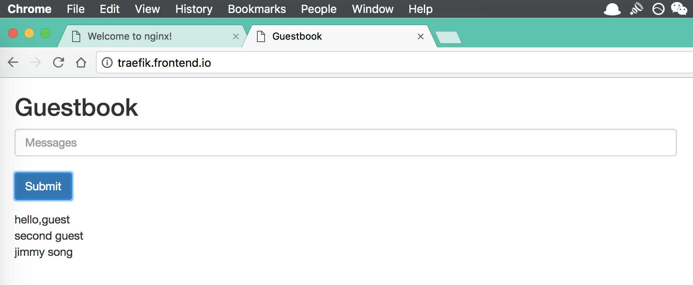

# Making Sense of Traefik Ingress

[Traefik](https://traefik.io/) is a revolutionary open-source tool known for its skills in reverse proxying and load balancing. It constantly keeps tabs on the changes occurring in the backend and accordingly adjusts the service configuration—All by itself! Probably the best software in the market, it has an integrative nature that is fully compatible with popular microservice systems. This compatibility allows for dynamic automation of configuration settings. As of now, it supports Docker, Swarm, Marathon, Mesos, Kubernetes, Consul, Etcd, Zookeeper, BoltDB and Rest API backend models.


Here's a quick look at its arsenal:

* Crafted in Golang, it's a breeze to deploy
* Speedy (85% of nginx's speed)
* Harmonious with various backends (Docker, Swarm, Kubernetes, Marathon, Mesos, Consul, Etcd, etc.)
* Easy management with built-in Web UI, Metrics, and Let's Encrypt support
* Dynamic automatic configuration
* Highly available in cluster mode
* Backs [Proxy Protocol](https://www.haproxy.org/download/1.8/doc/proxy-protocol.txt)

## Ingress: A Brief Overview

In elementary terms, ingress is like a gateway from the outside world into the Kubernetes cluster. It acts like a dispatcher for user URL requests to various services. Ingress exudes qualities of load balancing reverse proxy servers like nginx, apache, etc., along with rule definition capabilities i.e., it can handle URL routing information. Ingress controller comes into play for refreshing these routing details.

The Ingress Controller is best understood as a watchdog. It communicates with the Kubernetes API constantly, keeping track of the changes in the backend such as additions or reductions of service or pod. On receiving these change details, the Ingress Controller couples it with the Ingress mentioned below, creates a configuration, updates the reverse proxy load balancer, and refreshes its configuration—thus functioning as a service discovery.

## Firing Up Traefik Using Helm

```bash
# Prepping domain, user and password.
$ export USER=user
$ export DOMAIN=ingress.feisky.xyz
$ htpasswd -c auth $USER
New password:
Re-type new password:
Adding password for user user
$ PASSWORD=$(cat auth| awk -F: '{print $2}')

# Helm deployment.
helm install stable/traefik --name --namespace kube-system --set rbac.enabled=true,acme.enabled=true,dashboard.enabled=true,acme.staging=false,acme.email=admin@$DOMAIN,dashboard.domain=ui.$DOMAIN,ssl.enabled=true,acme.challengeType=http-01,dashboard.auth.basic.$USER=$PASSWORD
```

After a brief wait, the traefik Pod will be up and running:

```bash
$ kubectl -n kube-system get pod -l app=traefik
NAME                       READY     STATUS    RESTARTS   AGE
traefik-65d8dc4489-k97cg   1/1       Running   0          5m

$ kubectl -n kube-system get ingress
NAME                HOSTS                   ADDRESS   PORTS     AGE
traefik-dashboard   ui.ingress.feisky.xyz             80        25m

$ kubectl -n kube-system get svc traefik
NAME      TYPE           CLUSTER-IP    EXTERNAL-IP     PORT(S)                      AGE
traefik   LoadBalancer   10.0.206.26   172.20.0.115    80:31662/TCP,443:32618/TCP   24m
```

One of these methods of either configuring DNS resolution (Mapping a CNAME record domain to Ingress Controller service's external IP), modifying `/etc/hosts` to include domain mapping data (refer to the test section below), or using `xip.io` can be employed to access the needed service(s) directly via the configured domain. For instance, the Dashboard service above can be accessed through the domain `ui.ingress.feisky.xyz`.


Here, the yellow fragment on the left shows all rules, while the green bit on the right displays all backends.

## Ingress In Action: A More Comprehensive Example

Next, let's see a more complex example. **Creating an ingress named `traefik-ingress`**, file-name-traefik.yaml

```yaml
apiVersion: extensions/v1beta1
kind: Ingress
metadata:
  name: traefik-ingress
  annotations:
    kubernetes.io/ingress.class: traefik
spec:
  rules:
  - host: traefik.nginx.io
    http:
      paths:
      - path: /
        backend:
          serviceName: nginx
          servicePort: 80
  - host: traefik.frontend.io
    http:
      paths:
      - path: /
        backend:
          serviceName: frontend
          servicePort: 80
```

Points to note:

* The `backend` should be configured with the service name that started in the default namespace
* `path` is the path after the URL address, like `traefik.frontend.io/path`
* It's advisable to use a host name similar to `service-name.filed1.filed2.domain-name`: It makes service differentiation easier

Make sure to modify the service name and port based on whatever you've deployed in your environment. When a new service is added, modify this file and update it using `kubectl replace -f traefik.yaml`.

## Testing

Execute the following on any node in the cluster. For instance, if you wish to access the path "/" of nginx.

```bash
$ curl -H Host:traefik.nginx.io http://172.20.0.115/
<!DOCTYPE html>
<html>
<head>
<title>Welcome to nginx!</title>
<style>
    body {
        width: 35em;
        margin: 0 auto;
        font-family: Tahoma, Verdana, Arial, sans-serif;
    }
</style>
</head>
<body>
<h1>Welcome to nginx!</h1>
<p>If you see this page, the nginx web server is successfully installed and
working. Further configuration is required.</p>

<p>For online documentation and support please refer to
<a href="http://nginx.org/">nginx.org</a>.<br/>
Commercial support is available at
<a href="http://nginx.com/">nginx.com</a>.</p>

<p><em>Thank you for using nginx.</em></p>
</body>
</html>
```

For external access in your Kubernetes cluster, you need to handle DNS settings or add lines to your local host's files:

```bash
172.20.0.115 traefik.nginx.io
172.20.0.115 traefik.frontend.io
```

This means all traffic going to these addresses will be sent to the machine with the IP `172.20.0.115`: the host machine running traefik. Traefik reads the 'Host' parameter from HTTP request headers and forwards the traffic traffic to the corresponding service mentioned in the Ingress configuration.




## Further Reading

* [A Brief on Traefik](http://www.tuicool.com/articles/ZnuEfay)
* [Guestbook example](https://github.com/kubernetes/examples/tree/master/guestbook)