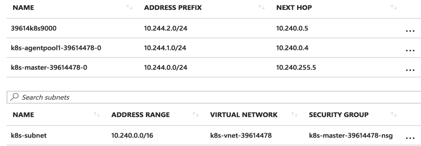

# Networking Plug-ins

## Network Model

* IP-per-Pod: Each Pod has an individual IP address, with all containers within the Pod sharing a network namespace.
* All Pods within the cluster are part of a directly connected, flat network, accessible by IP.
  * All containers can directly access each other without the need for NAT.
  * All Nodes and containers can directly access each other without the need for NAT.
  * The IP a container sees itself as identical to the IPs that other containers see.
* Service cluster IP can only be accessed within the cluster. External requests require access through NodePort, LoadBalance or Ingress.

## Official Plug-ins

Current Kubernetes supports the following two plug-ins:

* kubenet: a network plug-in based on CNI bridge (which expands on port mapping and traffic shaping of the bridge plug-in) and is currently the recommended default plug-in.
* CNI: CNI network plug-in. Users are required to put network configurations into `/etc/cni/net.d` directory and place the CNI plug-in's binary file into `/opt/cni/bin`.
* ~~exec: a third-party executable to set up the container network configuration. This was removed in v1.6, see~~ [~~kubernetes\#39254~~](https://github.com/kubernetes/kubernetes/pull/39254).

## kubenet

kubenet is a network plug-in based on CNI bridge. It creates a pair of veth pairs for each container and connects them to the cbr0 bridge. kubenet has developed numerous functionalities based on the bridge plug-in, including:

* Using the host-local IPAM plug-in to assign IP addresses to containers and regularly releasing assigned but unused IP addresses.
* Setting sysctl `net.bridge.bridge-nf-call-iptables = 1`.
* Creating SNAT rules for Pod IPs.
  * `-A POSTROUTING ! -d 10.0.0.0/8 -m comment --comment "kubenet: SNAT for outbound traffic from cluster" -m addrtype ! --dst-type LOCAL -j MASQUERADE`.
* Enabling the hairpin and promisc modes of the bridge, allowing the Pod to access its Service IP (i.e., accessing the Pod itself again after NAT).

  ```bash
  -A OUTPUT -j KUBE-DEDUP
  -A KUBE-DEDUP -p IPv4 -s a:58:a:f4:2:1 -o veth+ --ip-src 10.244.2.1 -j ACCEPT
  -A KUBE-DEDUP -p IPv4 -s a:58:a:f4:2:1 -o veth+ --ip-src 10.244.2.0/24 -j DROP
  ```

* Managing HostPort and setting up port mapping.
* Traffic shaping, supporting Pod network bandwidth limit settings through Annotation such as `kubernetes.io/ingress-bandwidth` and `kubernetes.io/egress-bandwidth`.

The below diagram illustrates the principle of Pods' inter-communication in multi-node Kubernetes on Azure:


When Pods from different nodes communicate with each other, they will be forwarded to the correct node through the route configured by the cloud platform or switch:



In the future, the kubenet plug-in will transition to standard CNI plug-ins (such as ptp). For more details on the plan, please refer [here](https://docs.google.com/document/d/1glJLMHrE2eqwRrAN4fdsz4Vg3R1Iqt6bm5GJQ4GdjlQ/edit#).

## CNI plug-in

To install CNI:

```bash
cat <<EOF> /etc/yum.repos.d/kubernetes.repo
[kubernetes]
name=Kubernetes
baseurl=http://yum.kubernetes.io/repos/kubernetes-el7-x86_64
enabled=1
gpgcheck=1
repo_gpgcheck=1
gpgkey=https://packages.cloud.google.com/yum/doc/yum-key.gpg
       https://packages.cloud.google.com/yum/doc/rpm-package-key.gpg
EOF

yum install -y kubernetes-cni
```

To configure the CNI brunt plugging:

```bash
    mkdir -p /etc/cni/net.d
cat >/etc/cni/net.d/10-mynet.conf <<-EOF
{
    "cniVersion": "0.3.0",
    "name": "mynet",
    "type": "bridge",
    "bridge": "cni0",
    "isGateway": true,
    "ipMasq": true,
    "ipam": {
        "type": "host-local",
        "subnet": "10.244.0.0/16",
        "routes": [
            {"dst": "0.0.0.0/0"}
        ]
    }
}
EOF
cat >/etc/cni/net.d/99-loopback.conf <<-EOF
{
    "cniVersion": "0.3.0",
    "type": "loopback"
}
EOF
```

Please refer to the [CNI Network Plugin](cni.md) for more information about CNI network plugins.

## [Flannel](flannel.md)

[Flannel](https://github.com/coreos/flannel/blob/master/Documentation/kube-flannel.yml) is a network plug-in providing overlay network for Kubernetes. It is based on Linux TUN/TAP, using UDP to encapsulate IP packets to create an overlay network and relying on etcd to maintain the network allocation status.

```bash
kubectl create -f https://github.com/coreos/flannel/raw/master/Documentation/kube-flannel-rbac.yml
kubectl create -f https://github.com/coreos/flannel/raw/master/Documentation/kube-flannel.yml
```

## [Weaver Net](weave.md)

Weave Net is a multi-host container networking scheme that supports a decentralized control plane. The wRouters on each host establish Full Mesh TCP links and use Gossip to synchronize control information. This approach eliminates the need for a centralized K/V Store, reducing the complexity of deployment to some extent. Weave calls it "data-centric" rather than "algorithm-centric" like RAFT or Paxos.

On the data plane, Weave implements L2 Overlay through UDP encapsulation. Encapsulation supports two modes, one is the sleeve mode that runs in user space, and the other is the fastpath mode that runs in kernel space. Sleeve mode captures data packets on the Linux bridge through the pcap device and the wRouter completes the UDP encapsulation. It supports encryption of L2 traffic and also supports Partial Connection, but there is a significant performance loss. Fastpath mode is like OVS's odp, encapsulating VxLAN and completing forwarding. wRouter does not directly participate in forwarding, but controls forwarding by issuing odp flow tables. This mode can significantly improve throughput, but does not support encryption and other advanced features.

```bash
kubectl apply -f https://git.io/weave-kube
```

## [Calico](calico.md)

[Calico](https://www.projectcalico.org/) is a three-layer data center network solution based on BGP (no Overlay needed), and has good integration with OpenStack, Kubernetes, AWS, GCE and other IaaS and container platforms.

Calico implements a high-efficiency vRouter on each computing node to be responsible for data forwarding, and each vRouter propagates the routing information of the workloads running on it throughout the Calico network by the BGP protocol - for small-scale deployment, they can be directly connected; for large-scale deployment, this can be achieved through the specified BGP route reflector. Thus, the data traffic between all workloads is interconnected through IP routing. The networking of Calico nodes can directly utilize the network structure of the data center (whether it's L2 or L3), without the need for additional NAT, tunneling, or Overlay Network.

In addition, Calico provides rich and flexible network Policy based on iptables, ensuring Workload multi-tenant isolation, security group and other accessibility restriction functions through ACLs on various nodes.

```bash
kubectl apply -f http://docs.projectcalico.org/v2.1/getting-started/kubernetes/installation/hosted/kubeadm/1.6/calico.yaml
```

## [OVN](ovn-kubernetes.md)

[OVN (Open Virtual Network)](https://www.ovn.org/en/) is OVS's native virtualization network scheme, aimed at solving the performance problems of traditional SDN architecture (such as Neutron DVR).

OVN offers two networking schemes for Kubernetes:

* Overlay: Containers are connected via ovs overlay.
* Underlay: Connecting containers within VM to the same network where VM is located (under development).

The configuration of the container network is achieved through OVN's CNI plugin.

## [Contiv](contiv.md)

[Contiv](http://contiv.github.io) is Cisco's open-source container networking solution. It mainly provides network management based on Policy, and is integrated with mainstream container orchestration systems. Contiv's primary advantage is that it directly provides multi-tenant networking and supports L2 (VLAN), L3 (BGP), Overlay (VXLAN), and Cisco's own ACI.

## [Romana](romana.md)

Romana is an open-source project proposed in 2016 by Panic Networks. It aims to solve the overhead of Overlay solutions having on the network using the route-aggregation approach.

## [OpenContrail](opencontrail.md)

OpenContrail is an open-source network virtualization platform launched by Juniper, and its commercial version is Contrail. It primarily consists of controllers and vRouters.

* The controller provides configuration, control, and analysis capabilities for virtual networks.
* vRouter provides distributed routing, responsible for the creation of virtual routers, virtual networks, and data forwarding.

In particular, vRouter supports three modes

* Kernel vRouter: similar to ovs kernel module
* DPDK vRouter: similar to ovs-dpdk
* Netronome Agilio Solution (commercial product): supports DPDK, SR-IOV and Express Virtio (XVIO)

[Juniper/contrail-kubernetes](https://github.com/Juniper/contrail-kubernetes) provides Kubernetes integration, including:

* kubelet network plugin based on the kubernetes v1.6 already removed [exec network plugin](https://github.com/kubernetes/kubernetes/pull/39254)
* kube-network-manager listens to the kubernetes API and configures network policy based on label information

## [Midonet](https://github.com/feiskyer/kubernetes-handbook/tree/549e0e3c9ba0175e64b2d4719b5a46e9016d532b/network/midonet/index.md)

[Midonet](https://www.midonet.org/) is a network visualization solution for OpenStack, which is open-source by Midokura Company.

* In terms of components, Midonet utilizes Zookeeper + Cassandra to build a distributed database to store the status of VPC resources - Network State DB Cluster, and distributes controllers in forwarding devices (including vswitch and L3 Gateway) locally - Midolman (Quagga bgpd is also on L3 Gateway). The device forwarding retains ovs kernel as a fast datapath. It can be seen that Midonet, like DragonFlow and OVN, is inspired by the idea of OVS-Neutron-Agent and distributes controllers locally on devices, embedding their resource database between the neutron plug-in and device agent as a super controller.
* In terms of interfaces, the NSDB is REST API between NSDB and Neutron, and RPC between Midolman and NSDB, there is not much to talk about here. In terms of controller's southward aspect, Midolman did not use OpenFlow and OVSDB. They got rid of the user space vswitchd and ovsdb-server and directly operated the ovs datapath in the kernel space via Linux netlink mechanism.

## Host Network

The simplest network model is to share the host's network namespace among containers and use the host's network protocol stack. In this way, no additional configuration is needed, and the containers can share all the network resources of the host.

Advantages

* Simple, no additional configuration required.
* Efficient, no additional overheads like NAT.

Disadvantages

* No network isolation at all.
* Container and Host's port number may conflict.
* Any network configuration within the container will affect the entire host.

> Note: HostNetwork is set in the Pod configuration file, and kubelet still needs to be configured to use the CNI or kubenet plug-in (kubenet by default) when it starts.

## Others

### [ipvsi](https://github.com/feiskyer/kubernetes-handbook/tree/549e0e3c9ba0175e64b2d4719b5a46e9016d532b/network/ipvs/index.md)

Kubernetes v1.8 already supports ipvs load balancing mode (alpha version).

### [Canal](https://github.com/tigera/canal)

[Canal](https://github.com/tigera/canal) is a unified network plug-in jointly released by Flannel and Calico. It provides a CNI network plug-in and supports network policy.

### [kuryr-kubernetes](https://github.com/openstack/kuryr-kubernetes)

[kuryr-kubernetes](https://github.com/openstack/kuryr-kubernetes) is a Neutron network plug-in integrated by OpenStack. It mainly consists of two parts, Controller and CNI plugin, and also provides Service integration based on Neutron LBaaS.

### [Cilium](https://github.com/cilium/cilium)

[Cilium](https://github.com/cilium/cilium) is a high-performance container network solution, based on eBPF and XDP, provides CNI and CNM plug-in.

The project homepage is [https://github.com/cilium/cilium](https://github.com/cilium/cilium).

### [kope](https://github.com/kopeio/kope-routing)

[kope](https://github.com/kopeio/kope-routing) is a project aimed at simplifying Kubernetes' network configuration. It supports three modes:

* Layer2: automatically configures the route for each Node
* Vxlan: configure vxlan connections for hosts and establish connections between hosts and Pods (through vxlan interface and ARP entry)
* ipsec: encrypted link

The project homepage is [https://github.com/kopeio/kope-routing](https://github.com/kopeio/kope-routing).

### [Kube-router](https://github.com/cloudnativelabs/kube-router)

[Kube-router](https://github.com/cloudnativelabs/kube-router) is a network plug-in based on BGP and provides optional ipvs service discovery (replaces kube-proxy) and network policy functions.

Deployment of Kube-router:

```bash
kubectl apply -f https://raw.githubusercontent.com/cloudnativelabs/kube-router/master/daemonset/kubeadm-kuberouter.yaml
```

Deployment of Kube-router and replacing kube-proxy (This function is actually not needed anymore, as kube-proxy has built-in support for ipvs mode):

```bash
kubectl apply -f https://raw.githubusercontent.com/cloudnativelabs/kube-router/master/daemonset/kubeadm-kuberouter-all-features.yaml
# Remove kube-proxy
kubectl -n kube-system delete ds kube-proxy
docker run --privileged --net=host gcr.io/google_containers/kube-proxy-amd64:v1.7.3 kube-proxy --cleanup-iptables
```
