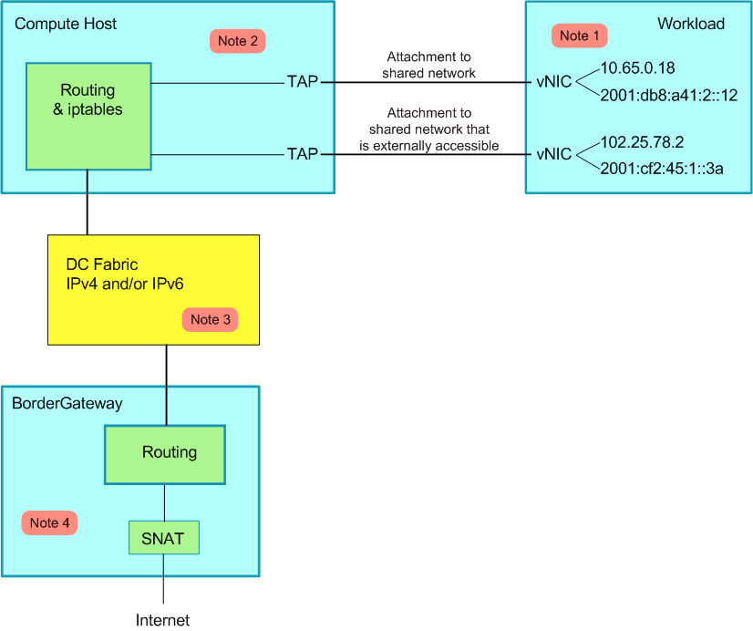

# Calico

[Calico](https://www.projectcalico.org/) is a pure layer 3 networking solution for data centers that does away with the need for overlay networks. It integrates smoothly with various IaaS and container platforms, such as OpenStack, Kubernetes, AWS, and GCE.

On each compute node, Calico uses a Linux Kernel-based highly efficient vRouter to handle data forwarding. Each vRouter uses the BGP protocol to propagate routing information regarding the workloads running atop it across the entire Calico network—small deployments can interconnect directly, whereas large-scale ones may use designated BGP route reflectors to manage this process. This ensures that all traffic between workloads is interconnected through IP routing. Calico's network can leverage the data center's existing network architecture, either L2 or L3, removing the need for additional NAT, tunnels, or overlay networks.

Moreover, Calico offers a rich and flexible network Policy based on iptables, which ensures workload multi-tenancy isolation, security groups, and other connectivity restrictions through ACLs on each node.

## Calico Architecture


Calico is chiefly comprised of Felix, etcd, the BGP client, and BGP Route Reflectors:

1. Felix, the Calico Agent, runs on each node housing workloads and primarily takes care of routing and ACL configurations to ensure endpoint connectivity;
2. etcd, a distributed key-value store, is responsible for maintaining the consistency of network metadata and ensuring the accuracy of the Calico network status;
3. BGP Client (BIRD), mainly distributes the routing information inserted into the Kernel by Felix throughout the current Calico network to assure effective communication between workloads;
4. BGP Route Reflector (BIRD), used in large-scale deployments, forsakes the mesh mode where all nodes are interconnected in favor of centralized route distribution via one or more BGP Route Reflectors.
5. calico/calico-ipam, primarily used as a Kubernetes CNI plugin.



## IP-in-IP

Calico's control plane design requires that the physical network be an L2 Fabric, which allows vRouters to be directly reachable without having to consider physical devices as the next hop. To support L3 Fabric, Calico introduced the IP-in-IP option.

## Calico CNI

See [https://github.com/projectcalico/cni-plugin](https://github.com/projectcalico/cni-plugin).

## Calico CNM

Calico implements Docker CNM networking using Pools and Profiles:

1. Pool, defines a range of IP resources available for the Docker Network, such as: 10.0.0.0/8 or 192.168.0.0/16;
2. Profile, a collection of Docker Network Policies made up of tags and rules; each Profile by default has a tag with the same name as the Profile, and each Profile can have multiple tags, saved in List format.

For implementation, see [https://github.com/projectcalico/libnetwork-plugin](https://github.com/projectcalico/libnetwork-plugin).

## Calico Kubernetes

For Kubernetes clusters created with kubeadm, the following configurations are necessary when installing calico:

* `--pod-network-cidr=192.168.0.0/16`
* `--service-cidr=10.96.0.0/12` (cannot overlap with Calico's network)

Then run

```bash
kubectl apply -f https://docs.projectcalico.org/v3.1/getting-started/kubernetes/installation/hosted/rbac-kdd.yaml
kubectl apply -f https://docs.projectcalico.org/v3.1/getting-started/kubernetes/installation/hosted/kubernetes-datastore/calico-networking/1.7/calico.yaml
```

For more detailed customization methods, see [https://docs.projectcalico.org/v3.0/getting-started/kubernetes](https://docs.projectcalico.org/v3.0/getting-started/kubernetes).

This will initiate Calico-etcd in Pods and start bird6, felix, and confd on all Nodes, configuring the CNI network to the calico plugin:


```bash
# Calico related processes
$ ps -ef | grep calico | grep -v grep
root      9012  8995  0 14:51 ?        00:00:00 /bin/sh -c /usr/local/bin/etcd --name=calico --data-dir=/var/etcd/calico-data --advertise-client-urls=http://$CALICO_ETCD_IP:6666 --listen-client-urls=http://0.0.0.0:6666 --listen-peer-urls=http://0.0.0.0:6667
# continues...
```

```bash
# CNI network plugin configuration
$ cat /etc/cni/net.d/10-calico.conf
# config block...
```


## Limitations of Calico

* Since it operates at layer 3, it does not support VRF.
* It lacks multi-tenant network isolation capabilities, which can pose network security issues in multi-tenant contexts.
* Calico's control plane design requires the physical network to be an L2 Fabric, such that vRouters are directly reachable.

 **Reference Documents** 

* [https://xuxinkun.github.io/2016/07/22/cni-cnm/](https://xuxinkun.github.io/2016/07/22/cni-cnm/)
* [https://www.projectcalico.org/](https://www.projectcalico.org/)
* [http://blog.dataman-inc.com/shurenyun-docker-133/](http://blog.dataman-inc.com/shurenyun-docker-133/)