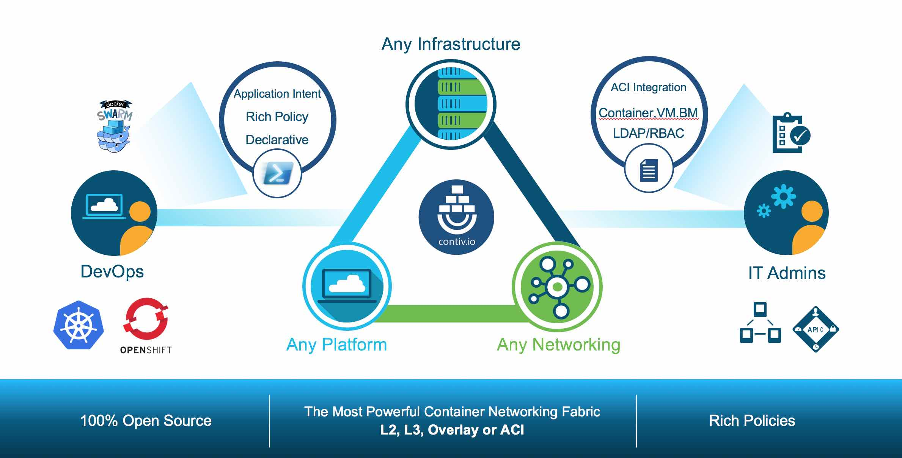
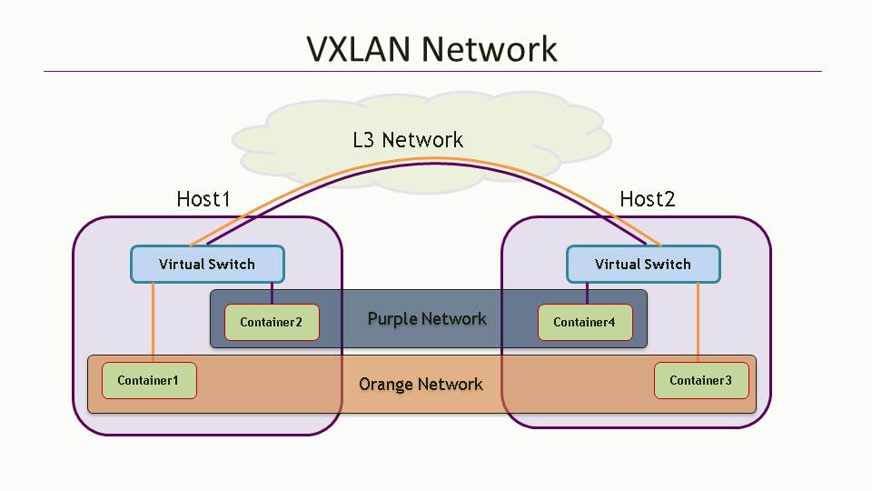

# Contiv: Cisco's Open-Source Container Networking Solution

[Contiv](http://contiv.github.io) comes straight out of Cisco's labs, an open-source container networking solution designed for heterogeneous container deployments across virtual machines, bare metals, and both public and private clouds. It also integrates seamlessly with mainstream container orchestration systems. Contiv's primary strength lies in offering multi-tenant networks with support for various networking modes such as L2 (VLAN), L3 (BGP), Overlay (VXLAN), and Cisco's proprietary ACI.

> Note: The Contiv project is no longer actively maintained. Users are advised to switch to other, more active projects.



Key Features:
* Native support for Tenants, with each Tenant being a virtual routing and forwarding (VRF)
* Two network modes:
  * L2 VLAN Bridged
  * Routed network, e.g., vxlan, BGP, ACI
* Network Policy features, including Bandwidth and Isolation





## Integration with Kubernetes

For Ansible deployments, visit [https://github.com/kubernetes/contrib/tree/master/ansible/roles/contiv](https://github.com/kubernetes/contrib/tree/master/ansible/roles/contiv).

```bash
export VERSION=1.0.0-beta.3
curl -L -O https://github.com/contiv/install/releases/download/$VERSION/contiv-$VERSION.tgz
tar xf contiv-$VERSION.tgz
cd ~/contiv/contiv-$VERSION/install/k8s
netctl --netmaster http://$netmaster:9999 global set --fwd-mode routing

cd ~/contiv/contiv-$VERSION
install/k8s/install.sh -n 10.87.49.77 -v b -w routing

# check contiv pods
export NETMASTER=http://10.87.49.77:9999
netctl global info

# create a network
# netctl network create --encap=vlan --pkt-tag=3280 --subnet=10.100.100.215-10.100.100.220/27 --gateway=10.100.100.193 vlan3280
netctl net create -t default --subnet=20.1.1.0/24 default-net

# create BGP connections to each of the nodes
netctl bgp create devstack-77 --router-ip="30.30.30.77/24" --as="65000" --neighbor-as="65000" --neighbor="30.30.30.2"
netctl bgp create devstack-78 --router-ip="30.30.30.78/24" --as="65000" --neighbor-as="65000" --neighbor="30.30.30.2"
netctl bgp create devstack-71 --router-ip="30.30.30.79/24" --as="65000" --neighbor-as="65000" --neighbor="30.30.30.2"

# then create pod with label "io.contiv.network"
```

**References**

* [https://github.com/contiv/netplugin](https://github.com/contiv/netplugin)
* [http://blogs.cisco.com/cloud/introducing-contiv-1-0](http://blogs.cisco.com/cloud/introducing-contiv-1-0)
* [Kubernetes and Contiv on Bare-Metal with L3/BGP](http://blog.michali.net/2017/03/20/kubernetes-and-contiv-on-bare-metal-with-l3bgp/)

---

# Contiv: A Glimpse into Cisco's Container Networking Mastery

[Contiv](http://contiv.github.io) is a brainchild of Cisco, designed as a resourceful and open-source networking framework for containers. This flexible solution cuts across various platforms from virtual machines and bare metal servers to both flavors of clouds—public and private. It's crafted to work effortlessly with popular container orchestration tools, boasting an edge with its direct multi-tenant network offerings and compatibility with L2 (VLAN), L3 (BGP), Overlay (VXLAN), not to forget Cisco's own ACI technology.

> Heads-up: Contiv is no longer on the active roster for updates. Users might want to explore other solutions on the move.


Essential Highlights:
* Native multi-tenant support—think of it as each Tenant owning a personalized VRF
* Dual network modes to choose from:
  * L2 VLAN Bridged mode
  * The routed network affair, with flavors like vxlan, BGP, and ACI
* Network policies that cater to setting Bandwidth caps and ensuring Isolation


## Embarking on the Kubernetes Journey with Contiv

Ansible aficionados can find deployment scripts at [https://github.com/kubernetes/contrib/tree/master/ansible/roles/contiv](https://github.com/kubernetes/contrib/tree/master/ansible/roles/contiv).

```bash
export VERSION=1.0.0-beta.3
curl -L -O https://github.com/contiv/install/releases/download/$VERSION/contiv-$VERSION.tgz
tar xf contiv-$VERSION.tgz
cd ~/contiv/contiv-$VERSION/install/k8s
netctl --netmaster http://$netmaster:9999 global set --fwd-mode routing

cd ~/contiv/contiv-$VERSION
install/k8s/install.sh -n 10.87.49.77 -v b -w routing

# check contiv pods
export NETMASTER=http://10.87.49.77:9999
netctl global info

# Spin up a network
# netctl network create --encap=vlan --pkt-tag=3280 --subnet=10.100.100.215-10.100.100.220/27 --gateway=10.100.100.193 vlan3280
netctl net create -t default --subnet=20.1.1.0/24 default-net

# Establish BGP connections to the crew of nodes
netctl bgp create devstack-77 --router-ip="30.30.30.77/24" --as="65000" --neighbor-as="65000" --neighbor="30.30.30.2"
netctl bgp create devstack-78 --router-ip="30.30.30.78/24" --as="65000" --neighbor-as="65000" --neighbor="30.30.30.2"
netctl bgp create devstack-71 --router-ip="30.30.30.79/24" --as="65000" --neighbor-as="65000" --neighbor="30.30.30.2"

# And... action! Create your pod with the label "io.contiv.network"
```

**Supplementary Reads**

* [https://github.com/contiv/netplugin](https://github.com/contiv/netplugin)
* [Lighting up the Cloud with Contiv 1.0](http://blogs.cisco.com/cloud/introducing-contiv-1-0)
* [Bare-Metal Performance: Kubernetes and Contiv with L3/BGP](http://blog.michali.net/2017/03/20/kubernetes-and-contiv-on-bare-metal-with-l3bgp/)