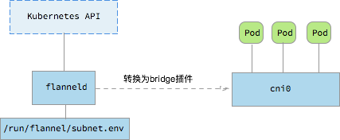

# Flannel: Simplified Virtual Networking for Containers

[Flannel](https://github.com/coreos/flannel) is a virtual networking solution for containers which works by assigning a subnet to each host, effectively enabling inter-container communication. It operates on the Linux TUN/TAP, encapsulates IP packets in UDP to build an overlay network, and uses etcd to track how the network is allotted across various machines.

## Understanding Flannel's Mechanics

On the control plane, the local `flanneld` instance is responsible for synchronizing local and other hosts' subnet information from a remote ETCD cluster, and allocating IP addresses to pods. On the data plane, Flannel employs Backends—such as UDP encapsulation—to implement an L3 Overlay, allowing either the standard TUN device or a VxLAN device to be selected.

```javascript
{
    "Network": "10.0.0.0/8",
    "SubnetLen": 20,
    "SubnetMin": "10.10.0.0",
    "SubnetMax": "10.99.0.0",
    "Backend": {
        "Type": "udp",
        "Port": 7890
    }
}
```


In addition to UDP, Flannel supports a variety of other Backends:

* udp: User-space UDP encapsulation, defaulting to port 8285. Because the wrapping and unwrapping of packets occur in user space, this can impact performance.
* vxlan: VXLAN encapsulation requires the configuration of VNI, a Port (default 8472), and [GBP](https://github.com/torvalds/linux/commit/3511494ce2f3d3b77544c79b87511a4ddb61dc89).
* host-gw: Direct routing which updates the routing table of the host with the container network's routes; applicable only to layer-2 networks that are directly reachable.
* aws-vpc: Creates routes using the Amazon VPC route table, suited for containers running on AWS.
* gce: Creates routes using the Google Compute Engine Network; all instances need to enable IP forwarding and is suitable for containers running on GCE.
* ali-vpc: Creates routes using the Alibaba Cloud VPC route table, suitable for containers running on Alibaba Cloud.

## Integration with Docker

```bash
source /run/flannel/subnet.env
docker daemon --bip=${FLANNEL_SUBNET} --mtu=${FLANNEL_MTU} &
```

## Integration with CNI

The CNI Flannel plugin translates the Flannel network configuration into the bridge plugin configuration and invokes the bridge plugin to configure the container netns networking. For instance, the following Flannel configuration

```javascript
{
    "name": "mynet",
    "type": "flannel",
    "delegate": {
        "bridge": "mynet0",
        "mtu": 1400
    }
}
```

would be transformed by the CNI Flannel plugin into

```javascript
{
    "name": "mynet",
    "type": "bridge",
    "mtu": 1472,
    "ipMasq": false,
    "isGateway": true,
    "ipam": {
        "type": "host-local",
        "subnet": "10.1.17.0/24"
    }
}
```

## Kubernetes Integration

Before using Flannel, it's necessary to set up `kube-controller-manager --allocate-node-cidrs=true --cluster-cidr=10.244.0.0/16`.

```bash
kubectl apply -f https://raw.githubusercontent.com/coreos/flannel/master/Documentation/kube-flannel.yml
```

This command launches a Flannel container and sets up the CNI network plugin:

```bash
$ ps -ef | grep flannel | grep -v grep
root      3625  3610  0 13:57 ?        00:00:00 /opt/bin/flanneld --ip-masq --kube-subnet-mgr
root      9640  9619  0 13:51 ?        00:00:00 /bin/sh -c set -e -x; cp -f /etc/kube-flannel/cni-conf.json /etc/cni/net.d/10-flannel.conf; while true; do sleep 3600; done

$ cat /etc/cni/net.d/10-flannel.conf
{
  "name": "cbr0",
  "type": "flannel",
  "delegate": {
    "isDefaultGateway": true
  }
}
```



Flanneld automatically connects to the Kubernetes API, configures the local Flannel network subnet based on `node.Spec.PodCIDR`, and sets up the containers' vxlan and associated subnet routes.

```bash
$ cat /run/flannel/subnet.env
FLANNEL_NETWORK=10.244.0.0/16
FLANNEL_SUBNET=10.244.0.1/24
FLANNEL_MTU=1410
FLANNEL_IPMASQ=true

$ ip -d link show flannel.1
12: flannel.1: <BROADCAST,MULTICAST,UP,LOWER_UP> mtu 1410 qdisc noqueue state UNKNOWN mode DEFAULT group default
    link/ether 8e:5a:0d:07:0f:0d brd ff:ff:ff:ff:ff:ff promiscuity 0
    vxlan id 1 local 10.146.0.2 dev ens4 srcport 0 0 dstport 8472 nolearning ageing 300 udpcsum addrgenmode eui64
```


## Advantages

* Easy to configure and convenient to use
* Well-integrated with cloud platforms, offering no additional performance loss with VPC solutions

## Limitations

* VXLAN mode has poor support for zero-downtime restarts

> When running with a backend other than udp, the kernel is providing the data path with flanneld acting as the control plane. As such, flanneld can be restarted (even to do an upgrade) without disturbing existing flows. However, in the case of vxlan backend, this needs to be done within a few seconds as ARP entries can start to timeout requiring the flannel daemon to refresh them. Also, to avoid interruptions during restart, the configuration must not be changed (e.g., VNI, --iface values).

**References**

* [https://github.com/coreos/flannel](https://github.com/coreos/flannel)
* [https://coreos.com/flannel/docs/latest/](https://coreos.com/flannel/docs/latest/)