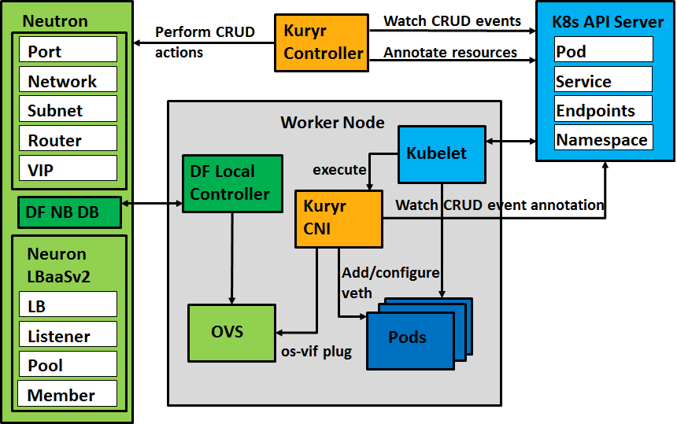
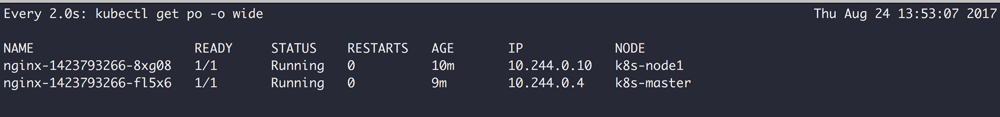
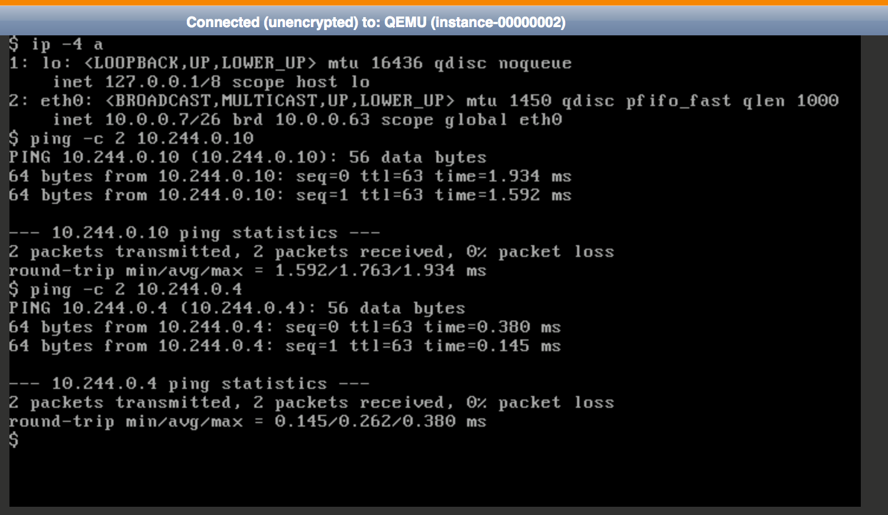

# Kuryr

Kuryr is a sub-project of OpenStack Neutron aimed at providing networking integration between OpenStack and Kubernetes. By implementing native Neutron-based networking within Kubernetes, Kuryr-Kubernetes facilitates co-location of OpenStack VMs and Kubernetes Pods on the same subnet. It also allows for the utilization of Neutron L3 and Security Groups for routing and security purposes, such as blocking specific source ports, and integrates services through Neutron LBaaS.



Kuryr-Kubernetes consists of two main components:

1. **Kuryr Controller**: The Controller primarily monitors changes in Kubernetes resources through the Kubernetes API and manages sub-resources and resources allocation accordingly.
2. **Kuryr CNI**: This binds the networks to Pods based on the resources allocated by the Kuryr Controller.

## devstack Deployment

The simplest way to deploy a single-node environment is by using devstack:

```bash
$ git clone https://git.openstack.org/openstack-dev/devstack
$ ./devstack/tools/create-stack-user.sh
$ sudo su stack

$ git clone https://git.openstack.org/openstack-dev/devstack
$ git clone https://git.openstack.org/openstack/kuryr-kubernetes
$ cp kuryr-kubernetes/devstack/local.conf.sample devstack/local.conf

# start install
$ ./devstack/stack.sh
```

Upon successful deployment, verify the installation:

```bash
$ source /devstack/openrc admin admin
$ openstack service list
+----------------------------------+------------------+------------------+
| ID                               | Name             | Type             |
+----------------------------------+------------------+------------------+
| 091e3e2813cc4904b74b60c41e8a98b3 | kuryr-kubernetes | kuryr-kubernetes |
| 2b6076dd5fc04bf180e935f78c12d431 | neutron          | network          |
| b598216086944714aed2c233123fc22d | keystone         | identity         |
+----------------------------------+------------------+------------------+

$ kubectl get nodes
NAME        STATUS    AGE       VERSION
localhost   Ready     2m        v1.6.2
```

## Multi-Node Deployment

In this section, we explain how to use `DevStack` and `Kubespray` to establish a simple test environment.

### Environment Resources and Preparation

Prepare two physical machines, with the operating system for this test being `CentOS 7.x`, which will operate on a flat network.

| IP Address 1 | Role              |
| ------------ | ----------------- |
| 172.24.0.34  | controller, k8s-master |
| 172.24.0.80  | compute1, k8s-node1   |
| 172.24.0.81  | compute2, k8s-node2   |

Update the CentOS 7.x packages on each node:

```text
$ sudo yum --enablerepo=cr update -y
```

Then, disable firewalld and SELinux to prevent potential issues:

```text
$ sudo setenforce 0
$ sudo systemctl disable firewalld && sudo systemctl stop firewalld
```

### OpenStack Controller Installation

First, access `172.24.0.34 (controller)` and run the following commands.

Then, create the DevStack-specific user:

```text
$ sudo useradd -s /bin/bash -d /opt/stack -m stack
$ echo "stack ALL=(ALL) NOPASSWD: ALL" | sudo tee /etc/sudoers.d/stack
```

Switch to that user to create OpenStack:

```text
$ sudo su - stack
```

Download DevStack:

```text
$ git clone https://git.openstack.org/openstack-dev/devstack
$ cd devstack
```

Add a `local.conf` file to describe the deployment details:

```text
[[local|localrc]]
HOST_IP=172.24.0.34
GIT_BASE=https://github.com

ADMIN_PASSWORD=passwd
DATABASE_PASSWORD=passwd
RABBIT_PASSWORD=passwd
SERVICE_PASSWORD=passwd
SERVICE_TOKEN=passwd
MULTI_HOST=1
```

> Modify HOST_IP to your own IP.

Finally, start the deployment with the following command:

```text
$ ./stack.sh
```

### OpenStack Compute Installation

Access `172.24.0.80 (compute)` and `172.24.0.81 (node2)` and execute the commands provided.

Then, create the DevStack-specific user:

```text
$ sudo useradd -s /bin/bash -d /opt/stack -m stack
$ echo "stack ALL=(ALL) NOPASSWD: ALL" | sudo tee /etc/sudoers.d/stack
```

Switch to that user to create OpenStack:

```text
$ sudo su - stack
```

Download DevStack:

```text
$ git clone https://git.openstack.org/openstack-dev/devstack
$ cd devstack
```

Add a `local.conf` file to describe the deployment details:

```text
[[local|localrc]]
HOST_IP=172.24.0.80
GIT_BASE=https://github.com
MULTI_HOST=1
LOGFILE=/opt/stack/logs/stack.sh.log
ADMIN_PASSWORD=passwd
DATABASE_PASSWORD=passwd
RABBIT_PASSWORD=passwd
SERVICE_PASSWORD=passwd
DATABASE_TYPE=mysql

SERVICE_HOST=172.24.0.34
MYSQL_HOST=$SERVICE_HOST
RABBIT_HOST=$SERVICE_HOST
GLANCE_HOSTPORT=$SERVICE_HOST:9292
ENABLED_SERVICES=n-cpu,q-agt,n-api-meta,c-vol,placement-client
NOVA_VNC_ENABLED=True
NOVNCPROXY_URL="http://$SERVICE_HOST:6080/vnc_auto.html"
VNCSERVER_LISTEN=$HOST_IP
VNCSERVER_PROXYCLIENT_ADDRESS=$VNCSERVER_LISTEN
```

> Modify HOST_IP to your machine's location. Modify SERVICE_HOST to the Master's IP.

Finally, start the deployment with the following command:

```text
$ ./stack.sh
```

### Creating a Kubernetes Cluster Environment

Ensure all nodes can SSH into each other without a password, then enter `172.24.0.34 (k8s-master)` and run the following commands.

Install required packages:

```text
$ sudo yum -y install software-properties-common ansible git gcc python-pip python-devel libffi-devel openssl-devel
$ sudo pip install -U kubespray
```

Create a kubespray configuration file:

```text
$ cat <<EOF>  ~/.kubespray.yml
kubespray_git_repo: "https://github.com/kubernetes-incubator/kubespray.git"
# Logging options
loglevel: "info"
EOF
```

Use kubespray-cli to generate the environment's `inventory` file and modify certain content:

```text
$ sudo -i
$ kubespray prepare --masters master --etcds master --nodes node1
```

Edit `/root/.kubespray/inventory/inventory.cfg` to modify:

```text
[all]
master  ansible_host=172.24.0.34 ansible_user=root ip=172.24.0.34
node1    ansible_host=172.24.0.80 ansible_user=root ip=172.24.0.80
node2    ansible_host=172.24.0.81 ansible_user=root ip=172.24.0.81

[kube-master]
master

[kube-node]
master
node1
node2

[etcd]
master

[k8s-cluster:children]
kube-node
kube-master
```

Then, deploy with kubespray-cli:

```text
$ kubespray deploy --verbose -u root -k .ssh/id_rsa -n calico
```

After some time, the deployment will complete. Check that nodes are up:

```text
$ kubectl get no
NAME      STATUS         AGE       VERSION
master    Ready,master   2m        v1.7.4
node1     Ready          2m        v1.7.4
node2     Ready          2m        v1.7.4
```

To facilitate Kuryr Controller's access to the K8s API Server, modify `/etc/kubernetes/manifests/kube-apiserver.yml` by adding:

```text
- "--insecure-bind-address=0.0.0.0"
- "--insecure-port=8080"
```

> Bind insecurely to 0.0.0.0 and open port 8080.

### Installing OpenStack Kuryr Controller

Go to `172.24.0.34 (controller)` and execute the commands listed.

First, install required packages on the node:

```text
$ sudo yum -y install  gcc libffi-devel python-devel openssl-devel install python-pip
```

Download and install kuryr-kubernetes:

```text
$ git clone http://git.openstack.org/openstack/kuryr-kubernetes
$ pip install -e kuryr-kubernetes
```

Create `kuryr.conf` in the `/etc/kuryr` directory:

```text
$ cd kuryr-kubernetes
$ ./tools/generate_config_file_samples.sh
$ sudo mkdir -p /etc/kuryr/
$ sudo cp etc/kuryr.conf.sample /etc/kuryr/kuryr.conf
```

Use the OpenStack Dashboard to create projects by entering `http://172.24.0.34` in the browser and following the steps below.

1. Create k8s project.
2. Create kuryr-kubernetes service and add k8s project member to service project.
3. Within that project, add Security Groups—see [kuryr-kubernetes manually](https://docs.openstack.org/kuryr-kubernetes/latest/installation/manual.html).
4. Within that project, add a pod_subnet subnet.
5. Within that project, add a service_subnet subnet.

After that, modify `/etc/kuryr/kuryr.conf` by adding:

```text
[DEFAULT]
use_stderr = true
bindir = /usr/local/libexec/kuryr

[kubernetes]
api_root = http://172.24.0.34:8080

[neutron]
auth_url = http://172.24.0.34/identity
username = admin
user_domain_name = Default
password = admin
project_name = service
project_domain_name = Default
auth_type = password

[neutron_defaults]
ovs_bridge = br-int
pod_security_groups = {id_of_secuirity_group_for_pods}
pod_subnet = {id_of_subnet_for_pods}
project = {id_of_project}
service_subnet = {id_of_subnet_for_k8s_services}
```

Run the kuryr-k8s-controller:

```text
$ kuryr-k8s-controller --config-file /etc/kuryr/kuryr.conf&
```

### Installing Kuryr-CNI

Access `172.24.0.80 (node1)` and `172.24.0.81 (node2)` and run the commands provided.

Install required packages on the node:

```text
$ sudo yum -y install  gcc libffi-devel python-devel openssl-devel python-pip
```

Install Kuryr-CNI for kubelet use:

```text
$ git clone http://git.openstack.org/openstack/kuryr-kubernetes
$ sudo pip install -e kuryr-kubernetes
```

Create `kuryr.conf` in `/etc/kuryr` directory:

```text
$ cd kuryr-kubernetes
$ ./tools/generate_config_file_samples.sh
$ sudo mkdir -p /etc/kuryr/
$ sudo cp etc/kuryr.conf.sample /etc/kuryr/kuryr.conf
```

Modify `/etc/kuryr/kuryr.conf` by adding:

```text
[DEFAULT]
use_stderr = true
bindir = /usr/local/libexec/kuryr
[kubernetes]
api_root = http://172.24.0.34:8080
```

Create CNI bin and Conf directories:

```text
$ sudo mkdir -p /opt/cni/bin
$ sudo ln -s $(which kuryr-cni) /opt/cni/bin/
$ sudo mkdir -p /etc/cni/net.d/
```

Add a `/etc/cni/net.d/10-kuryr.conf` CNI configuration file:

```text
{
    "cniVersion": "0.3.0",
    "name": "kuryr",
    "type": "kuryr-cni",
    "kuryr_conf": "/etc/kuryr/kuryr.conf",
    "debug": true
}
```

Finally, reload the daemon and restart the kubelet service:

```text
$ sudo systemctl daemon-reload && systemctl restart kubelet.service
```

## Testing Results

Create a Pod and an OpenStack VM to communicate with each other: 





## Reference Documents

* [Kuryr kubernetes documentation](https://docs.openstack.org/kuryr-kubernetes/latest/index.html)

---

# Bridging Clouds with Kubernetes: Introducing Kuryr

Imagine orchestrating your containers with Kubernetes while also managing your virtual machines under the OpenStack framework—welcome to the innovative world of Kuryr. Kuryr is a cutting-edge convergence tool aimed at interlinking the advanced networking capacities of OpenStack Neutron with the robust orchestration that Kubernetes offers. This allows for a seamless interaction between Virtual Machines (VMs) managed by OpenStack and containerized Pods orchestrated by Kubernetes, all under the same virtual network umbrella.

One of the most notable advantages of this integration is that it allows VMs and Pods to share subnets, making cross-management and networking immensely simplified. Access control, security policies, and routing, typically managed by Neutron's L3 protocols and Security Groups, extend their coverage to include Pods alongside VMs.

Kuryr nests within the Kubernetes environment by adopting two pivotal roles:

1. **Kuryr Controller**: This is an observant guardian that continually scrutinizes the Kubernetes API for any changes pertaining to resource needs. As soon as it detects a shift, it leaps into action, adjusting resource allocation as needed.
2. **Kuryr CNI**: This component acts on the commands of the Kuryr Controller, adeptly connecting assigned networks to the Pods that require them.

## Getting Started with devstack

For enthusiasts eager to dive into a single-node setup, devstack is the gateway to get your hands-on experience with Kuryr:

```bash
# Clone and prepare devstack
$ git clone https://git.openstack.org/openstack-dev/devstack
$ ./devstack/tools/create-stack-user.sh
$ sudo su stack

# Grab a fresh copy of devstack and Kuryr-Kubernetes
$ git clone https://git.openstack.org/openstack-dev/devstack
$ git clone https://git.openstack.org/openstack/kuryr-kubernetes
$ cp kuryr-kubernetes/devstack/local.conf.sample devstack/local.conf

# Kick off the install process
$ ./devstack/stack.sh
```

Verification post-installation is a breeze:

```bash
# Load the OpenStack credentials
$ source /devstack/openrc admin admin
# Enumerate the OpenStack services to spot Kuryr
$ openstack service list
+----------------------------------+------------------+------------------+
| ID                               | Name             | Type             |
+----------------------------------+------------------+------------------+
| ...                              | kuryr-kubernetes | kuryr-kubernetes |
| ...                              | neutron          | network          |
| ...                              | keystone         | identity         |
+----------------------------------+------------------+------------------+

# Make sure your Kubernetes nodes are alive and kicking
$ kubectl get nodes
NAME        STATUS    AGE       VERSION
localhost   Ready     2m        v1.6.2
```

## Crafting a Multi-Node Paradise

For a more elaborate setup using `DevStack` and `Kubespray`, it's as straightforward as setting up a classic high-school science experiment. Begin by preparing two trusty server-side companions with `CentOS 7.x` as the brain of operations. After a simple update dance for your CentOS packages, turn off the watchdogs—firewalld and SELinux—to ensure smooth sailing ahead.

Deployment involves cloning devstack again, with each node snuggling up to its individual configuration file and the deployment chugging along smoothly.

Now the magic happens—bringing Kubernetes into the mix. Using `Kubespray`, you’ll fashion a Kubernetes cluster environment as easily as baking a pie. With SSH keys in hand, seamlessly jump between your nodes, smoothening any creases with Ansible and laying down the orchestration tunes.

As the final act, Kuryr takes the stage. The Kuryr Controller tiptoes into each node, escorted by its loyal `kuryr.conf` configuration file that details the harmony needed between Kubernetes and OpenStack networking.

Secure, connect, and bask in the glory of a successful multi-node adventure.

## Putting It All to the Test

Illustrations of Pods whimpering in harmony with OpenStack VMs decorate your dashboard, a testament to your engineering prowess. The fruits of your labor yield seamless connectivity under the protective gaze of Kuryr.

## A Tome of Knowledge

A knight never goes into battle without his sword, and likewise, a Kuryr architect should never dive into deployment without the sacred scrolls of knowledge. Fear not! The Kuryr kubernetes documentation is your grimoire, your book of spells to conquer the realms of cloud and container networking. 

* [Kuryr kubernetes documentation](https://docs.openstack.org/kuryr-kubernetes/latest/index.html)

Don your mantle, join the Kuryr crusade, and weave the networks of tomorrow.