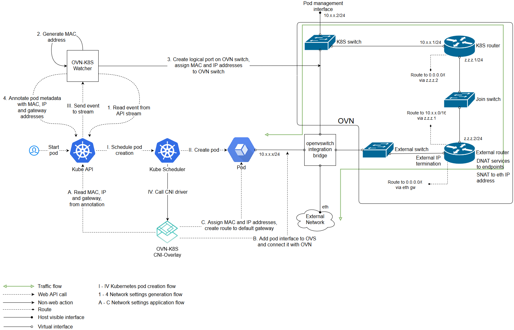

# OVN: Orchestrating Your Container Network

[ovn-kubernetes](https://github.com/openvswitch/ovn-kubernetes) is a network plugin for ovs OVN, which supports two modes: underlay and overlay.

* underlay: The container operates within a virtual machine while ovs runs on the physical machine that hosts the virtual machine, with OVN bridging the container network to the virtual machine network.
* overlay: OVN connects containers across all nodes through a logical overlay network; in this scenario, ovs is able to run directly on either a physical or a virtual machine.

## Overlay Mode



### Configuring the Master

```bash
# start ovn
/usr/share/openvswitch/scripts/ovn-ctl start_northd
/usr/share/openvswitch/scripts/ovn-ctl start_controller

# start ovnkube
nohup sudo ovnkube -k8s-kubeconfig kubeconfig.yaml -net-controller \
 -loglevel=4 \
 -k8s-apiserver="http://$CENTRAL_IP:8080" \
 -logfile="/var/log/openvswitch/ovnkube.log" \
 -init-master=$NODE_NAME -cluster-subnet="$CLUSTER_IP_SUBNET" \
 -service-cluster-ip-range=$SERVICE_IP_SUBNET \
 -nodeport \
 -nb-address="tcp://$CENTRAL_IP:6631" \
 -sb-address="tcp://$CENTRAL_IP:6632" 2>&1 &
```

### Configuring the Node

```bash
nohup sudo ovnkube -k8s-kubeconfig kubeconfig.yaml -loglevel=4 \
    -logfile="/var/log/openvswitch/ovnkube.log" \
    -k8s-apiserver="http://$CENTRAL_IP:8080" \
    -init-node="$NODE_NAME"  \
    -nodeport \
    -nb-address="tcp://$CENTRAL_IP:6631" \
    -sb-address="tcp://$CENTRAL_IP:6632" -k8s-token="$TOKEN" \
    -init-gateways \
    -service-cluster-ip-range=$SERVICE_IP_SUBNET \
    -cluster-subnet=$CLUSTER_IP_SUBNET 2>&1 &
```

### CNI Plugin Mechanics

#### ADD Operation

* Retrieve ip/mac/gateway from `ovn` annotation.
* Configure interface and routing within the container's netns.
* Add ovs port.

```bash
ovs-vsctl add-port br-int veth_outside \
  --set interface veth_outside \
    external_ids:attached_mac=mac_address \
    external_ids:iface-id=namespace_pod \
    external_ids:ip_address=ip_address
```

#### DEL Operation

```bash
ovs-vsctl del-port br-int port
```

## Underlay Mode

This mode has not been implemented yet.

## OVN Installation Method

All nodes set up package repositories and install common dependencies:

```bash
sudo apt-get install apt-transport-https
echo "deb https://packages.wand.net.nz $(lsb_release -sc) main" | sudo tee /etc/apt/sources.list.d/wand.list
sudo curl https://packages.wand.net.nz/keyring.gpg -o /etc/apt/trusted.gpg.d/wand.gpg
sudo apt-get update

sudo apt-get build-dep dkms
sudo apt-get install python-six openssl python-pip -y
sudo -H pip install --upgrade pip

sudo apt-get install openvswitch-datapath-dkms -y
sudo apt-get install openvswitch-switch openvswitch-common -y
sudo -H pip install ovs
```

The Master node also installs ovn-central:

```bash
sudo apt-get install ovn-central ovn-common ovn-host -y
```

The Node installs ovn-host:

```bash
sudo apt-get install ovn-host ovn-common -y
```

## Reference Documents

* [https://github.com/openvswitch/ovn-kubernetes](https://github.com/openvswitch/ovn-kubernetes)

---

# Step 2: Rephrasing for Popular Science Publication

# OVN: The Maestro of Container Networking

Imagine a world where containers (think digital shipping containers for software) can seamlessly communicate across different machines, be they bulky hardware or sleek virtual environments. Enter [ovn-kubernetes](https://github.com/openvswitch/ovn-kubernetes), the conductor that orchestrates this symphony of networks with its handy network plugin for ovs OVN. This crafty tool supports two distinct networking modes to suit different setups: underlay and overlay.

- *underlay* mode is like a bridge. It's where the containers, tucked inside virtual machines, chat over a network managed by ovs on the hosts' actual physical servers. It connects container talk to virtual machine talk.

- *overlay* mode, on the other hand, creates a network of invisible tunnels that allow containers on different nodes to mingle as if they were at the same grand ball. And in this case, ovs doesn't care whether it's hobnobbing with physical machines or virtual ones.

## Setting up the Stage with Overlay Mode

To give you a visual, here's a slick diagram indicating how this all fits together in overlay mode:


### Master Node Configuration - The Lead Conductor

To kick things off on the master node (the lead conductor), you'd punch in some commands to stir the OVN components awake, followed by summoning the `ovnkube` (the orchestra), set to take commands and start the performance.

### Individual Node Tuning - The Orchestra Members

Similarly, the individual nodes (each an orchestra member with their own instrument) receive their tuning instructions. They get set up to join in the network serenade, ready to perform in harmony with the master node's direction.

### The Maestro's Tools: CNI Plugin Operations

The Container Network Interface (CNI) plugin conducts two vital operations:

- The **ADD** operation, akin to guiding a musician to their seat, involves configuring network interfaces and paths for the containers so they can join the ensemble.
  
- The **DELETE** operation is like gently ushering a musician offstage after their performance, removing their association with the network orchestra.

## Underlay Mode - Rehearsals Pending

This mode's music sheets are still being written. Stay tuned, as they say.

## Installing OVN: Setting Up the Concert Hall

All nodes, whether they're master nodes or not, need to set up with the essentials. They'll install OVN similar to how you'd set up chairs and music stands before a concert.

And that's it! With the installation complete, the nodes are ready, instruments tuned, for the container network concert that is OVN.

## Encore

For those who want to delve deeper or play along, check out the original score at [ovn-kubernetes](https://github.com/openvswitch/ovn-kubernetes).