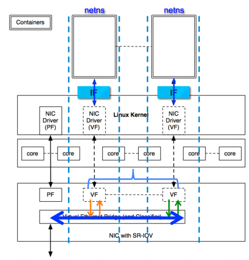

# SR-IOV Technology: A Hardware-Based Virtualization Solution to Enhance Performance and Scalability

SR-IOV technology is a hardware-based virtualization solution that can significantly improve both performance and scalability.

> The SR-IOV standard facilitates efficient sharing of PCIe (Peripheral Component Interconnect Express) devices among virtual machines. This technology is implemented in hardware, which allows for I/O performance that rivals native, non-virtualized environments. The SR-IOV specification outlines a new standard that enables newly created devices to connect virtual machines directly to I/O devices (the SR-IOV specification is defined and maintained by the PCI-SIG at [http://www.pcisig.com](http://www.pcisig.com)). A single I/O resource can be shared by numerous virtual machines. The shared device provides dedicated resources, as well as utilizes shared common resources. As a result, each virtual machine has access to unique resources. Therefore, PCIe devices (like Ethernet ports) with SR-IOV enabled and the right hardware and OS support can appear as multiple separate physical devices, each with their own PCIe configuration space.

SR-IOV is primarily used in virtualization but can also be applied to containers.



## SR-IOV Configuration

```bash
modprobe ixgbevf
lspci -Dvmm|grep -B 1 -A 4 Ethernet
echo 2 > /sys/bus/pci/devices/0000:82:00.0/sriov_numvfs
# check ifconfig -a. You should see a number of new interfaces created, starting with “eth”, e.g. eth4
```

## Docker SR-IOV Network Plugin

Intel has developed an SR-IOV network plugin for Docker, with the source code hosted at [https://github.com/clearcontainers/sriov](https://github.com/clearcontainers/sriov). It supports both runc and clearcontainer.

## CNI Plugin

Intel maintains an [SR-IOV CNI plugin](https://github.com/Intel-Corp/sriov-cni), which is a fork from [hustcat/sriov-cni](https://github.com/hustcat/sriov-cni), and extends support for DPDK.

The project homepage can be found at [https://github.com/Intel-Corp/sriov-cni](https://github.com/Intel-Corp/sriov-cni).

## Advantages

* Excellent performance
* Does not consume computing resources

## Disadvantages

* Limited number of VFs (Virtual Functions)
* Hardware binding does not support container migration

**Reference Documents**

* [http://blog.scottlowe.org/2009/12/02/what-is-sr-iov/](http://blog.scottlowe.org/2009/12/02/what-is-sr-iov/)
* [https://github.com/clearcontainers/sriov](https://github.com/clearcontainers/sriov)
* [https://software.intel.com/en-us/articles/single-root-inputoutput-virtualization-sr-iov-with-linux-containers](https://software.intel.com/en-us/articles/single-root-inputoutput-virtualization-sr-iov-with-linux-containers)
* [http://jason.digitalinertia.net/exposing-docker-containers-with-sr-iov/](http://jason.digitalinertia.net/exposing-docker-containers-with-sr-iov/)
