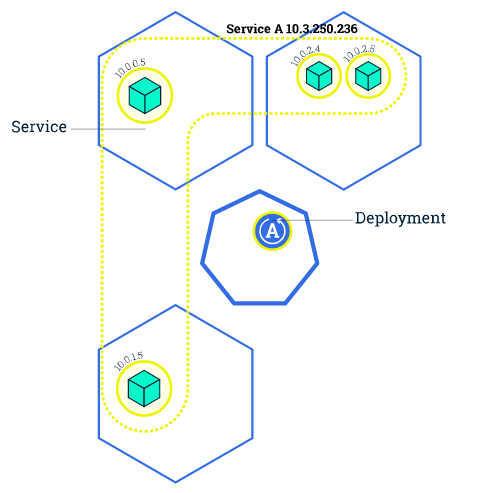
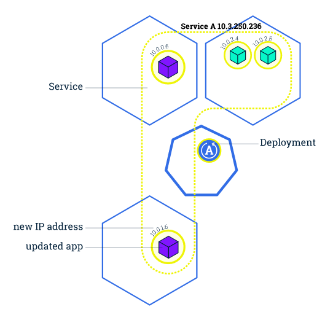
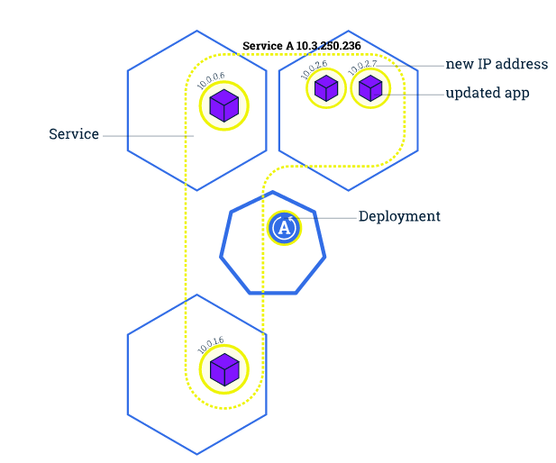

# Kubernetes 201

## 扩展应用

通过修改 Deployment 中副本的数量（replicas），可以动态扩展或收缩应用：


这些自动扩展的容器会自动加入到 service 中，而收缩回收的容器也会自动从 service 中删除。

```sh
$ kubectl scale --replicas=3 deployment/nginx-app
$ kubectl get deploy
NAME        DESIRED   CURRENT   UP-TO-DATE   AVAILABLE   AGE
nginx-app   3         3         3            3           10m
```

## 滚动升级

滚动升级（Rolling Update）通过逐个容器替代升级的方式来实现无中断的服务升级：

```
kubectl rolling-update frontend-v1 frontend-v2 --image=image:v2
```








在滚动升级的过程中，如果发现了失败或者配置错误，还可以随时回滚：

```
kubectl rolling-update frontend-v1 frontend-v2 --rollback
```

需要注意的是，`kubectl rolling-update` 只针对 ReplicationController。对于更新策略是 RollingUpdate 的 Deployment（Deployment 可以在 spec 中设置更新策略为 RollingUpdate，默认就是 RollingUpdate），更新应用后会自动滚动升级：

```yaml
  spec:
    replicas: 3
    selector:
      matchLabels:
        run: nginx-app
    strategy:
      rollingUpdate:
        maxSurge: 1
        maxUnavailable: 1
      type: RollingUpdate
```

而更新应用的话，就可以直接用 `kubectl set` 命令：

```sh
kubectl set image deployment/nginx-app nginx-app=nginx:1.9.1
```

滚动升级的过程可以用 `rollout` 命令查看:

```sh
$ kubectl rollout status deployment/nginx-app
Waiting for rollout to finish: 2 out of 3 new replicas have been updated...
Waiting for rollout to finish: 2 of 3 updated replicas are available...
Waiting for rollout to finish: 2 of 3 updated replicas are available...
Waiting for rollout to finish: 2 of 3 updated replicas are available...
Waiting for rollout to finish: 2 of 3 updated replicas are available...
Waiting for rollout to finish: 2 of 3 updated replicas are available...
deployment "nginx-app" successfully rolled out
```

Deployment 也支持回滚：

```sh
$ kubectl rollout history deployment/nginx-app
deployments "nginx-app"
REVISION	CHANGE-CAUSE
1		<none>
2		<none>

$ kubectl rollout undo deployment/nginx-app
deployment "nginx-app" rolled back
```

## 资源限制

Kubernetes 通过 cgroups 提供容器资源管理的功能，可以限制每个容器的 CPU 和内存使用，比如对于刚才创建的 deployment，可以通过下面的命令限制 nginx 容器最多只用 50% 的 CPU 和 128MB 的内存：

```sh
$ kubectl set resources deployment nginx-app -c=nginx --limits=cpu=500m,memory=128Mi
deployment "nginx" resource requirements updated
```

这等同于在每个 Pod 中设置 resources limits：

```yaml
apiVersion: v1
kind: Pod
metadata:
  labels:
    app: nginx
  name: nginx
spec:
  containers:
    - image: nginx
      name: nginx
      resources:
        limits:
          cpu: "500m"
          memory: "128Mi"
```

## 健康检查

Kubernetes 作为一个面向应用的集群管理工具，需要确保容器在部署后确实处在正常的运行状态。Kubernetes 提供了两种探针（Probe，支持 exec、tcpSocket 和 http 方式）来探测容器的状态：

- LivenessProbe：探测应用是否处于健康状态，如果不健康则删除并重新创建容器
- ReadinessProbe：探测应用是否启动完成并且处于正常服务状态，如果不正常则不会接收来自 Kubernetes Service 的流量

对于已经部署的 deployment，可以通过 `kubectl edit deployment/nginx-app` 来更新 manifest，增加健康检查部分：

```yaml
apiVersion: extensions/v1beta1
kind: Deployment
metadata:
  labels:
    app: nginx
  name: nginx-default
spec:
  replicas: 3
  selector:
    matchLabels:
      app: nginx
  template:
    metadata:
      labels:
        app: nginx
    spec:
      containers:
      - image: nginx
        imagePullPolicy: Always
        name: http
        resources: {}
        terminationMessagePath: /dev/termination-log
        terminationMessagePolicy: File
        resources:
          limits:
            cpu: "500m"
            memory: "128Mi"
        livenessProbe:
          httpGet:
            path: /
            port: 80
          initialDelaySeconds: 15
          timeoutSeconds: 1
        readinessProbe:
          httpGet:
            path: /
            port: 80
          initialDelaySeconds: 5
          timeoutSeconds: 1
```
