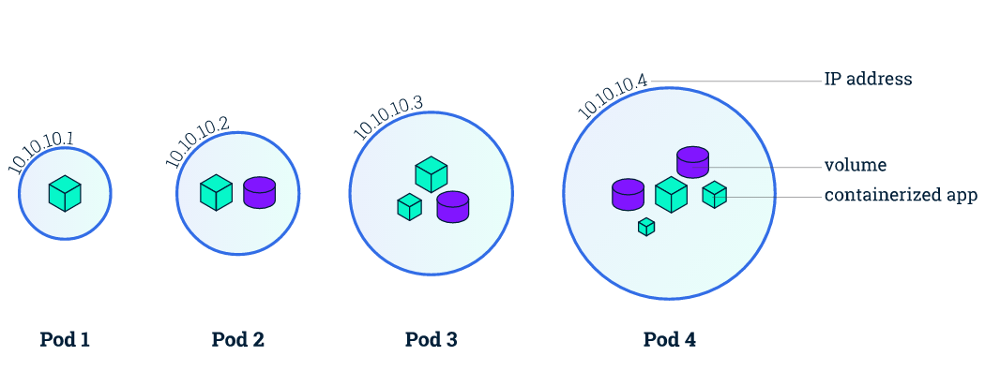

# Kubernetes 基本概念

## Container

Container（容器）是一種便攜式、輕量級的操作系統級虛擬化技術。它使用 namespace 隔離不同的軟件運行環境，並通過鏡像自包含軟件的運行環境，從而使得容器可以很方便的在任何地方運行。

由於容器體積小且啟動快，因此可以在每個容器鏡像中打包一個應用程序。這種一對一的應用鏡像關係擁有很多好處。使用容器，不需要與外部的基礎架構環境綁定, 因為每一個應用程序都不需要外部依賴，更不需要與外部的基礎架構環境依賴。完美解決了從開發到生產環境的一致性問題。

容器同樣比虛擬機更加透明，這有助於監測和管理。尤其是容器進程的生命週期由基礎設施管理，而不是被進程管理器隱藏在容器內部。最後，每個應用程序用容器封裝，管理容器部署就等同於管理應用程序部署。

其他容器的優點還包括

- 敏捷的應用程序創建和部署: 與虛擬機鏡像相比，容器鏡像更易用、更高效。
- 持續開發、集成和部署: 提供可靠與頻繁的容器鏡像構建、部署和快速簡便的回滾（鏡像是不可變的）。
- 開發與運維的關注分離: 在構建/發佈時即創建容器鏡像，從而將應用與基礎架構分離。
- 開發、測試與生產環境的一致性: 在筆記本電腦上運行和雲中一樣。
- 可觀測：不僅顯示操作系統的信息和度量，還顯示應用自身的信息和度量。
- 雲和操作系統的分發可移植性: 可運行在 Ubuntu, RHEL, CoreOS, 物理機, GKE 以及其他任何地方。
- 以應用為中心的管理: 從傳統的硬件上部署操作系統提升到操作系統中部署應用程序。
- 鬆耦合、分佈式、彈性伸縮、微服務: 應用程序被分成更小，更獨立的模塊，並可以動態管理和部署 - 而不是運行在專用設備上的大型單體程序。
- 資源隔離：可預測的應用程序性能。
- 資源利用：高效率和高密度。

## Pod

Kubernetes 使用 Pod 來管理容器，每個 Pod 可以包含一個或多個緊密關聯的容器。

Pod 是一組緊密關聯的容器集合，它們共享 PID、IPC、Network 和 UTS namespace，是 Kubernetes 調度的基本單位。Pod 內的多個容器共享網絡和文件系統，可以通過進程間通信和文件共享這種簡單高效的方式組合完成服務。



在 Kubernetes 中，所有對象都使用 manifest（yaml 或 json）來定義，比如一個簡單的 nginx 服務可以定義為 nginx.yaml，它包含一個鏡像為 nginx 的容器：

```yaml
apiVersion: v1
kind: Pod
metadata:
  name: nginx
  labels:
    app: nginx
spec:
  containers:
  - name: nginx
    image: nginx
    ports:
    - containerPort: 80
```

## Node

Node 是 Pod 真正運行的主機，可以是物理機，也可以是虛擬機。為了管理 Pod，每個 Node 節點上至少要運行 container runtime（比如 docker 或者 rkt）、`kubelet` 和 `kube-proxy` 服務。


## Namespace

Namespace 是對一組資源和對象的抽象集合，比如可以用來將系統內部的對象劃分為不同的項目組或用戶組。常見的 pods, services, replication controllers 和 deployments 等都是屬於某一個 namespace 的（默認是 default），而 node, persistentVolumes 等則不屬於任何 namespace。

## Service

Service 是應用服務的抽象，通過 labels 為應用提供負載均衡和服務發現。匹配 labels 的 Pod IP 和端口列表組成 endpoints，由 kube-proxy 負責將服務 IP 負載均衡到這些 endpoints 上。

每個 Service 都會自動分配一個 cluster IP（僅在集群內部可訪問的虛擬地址）和 DNS 名，其他容器可以通過該地址或 DNS 來訪問服務，而不需要了解後端容器的運行。


```yaml
apiVersion: v1
kind: Service
metadata:
  name: nginx
spec:
  ports:
  - port: 8078 # the port that this service should serve on
    name: http
    # the container on each pod to connect to, can be a name
    # (e.g. 'www') or a number (e.g. 80)
    targetPort: 80
    protocol: TCP
  selector:
    app: nginx
```

## Label

Label 是識別 Kubernetes 對象的標籤，以 key/value 的方式附加到對象上（key 最長不能超過 63 字節，value 可以為空，也可以是不超過 253 字節的字符串）。

Label 不提供唯一性，並且實際上經常是很多對象（如 Pods）都使用相同的 label 來標誌具體的應用。

Label 定義好後其他對象可以使用 Label Selector 來選擇一組相同 label 的對象（比如 ReplicaSet 和 Service 用 label 來選擇一組 Pod）。Label Selector 支持以下幾種方式：

- 等式，如 `app=nginx` 和 `env!=production`
- 集合，如 `env in (production, qa)`
- 多個 label（它們之間是 AND 關係），如 `app=nginx,env=test`

## Annotations

Annotations 是 key/value 形式附加於對象的註解。不同於 Labels 用於標誌和選擇對象，Annotations 則是用來記錄一些附加信息，用來輔助應用部署、安全策略以及調度策略等。比如 deployment 使用 annotations 來記錄 rolling update 的狀態。
