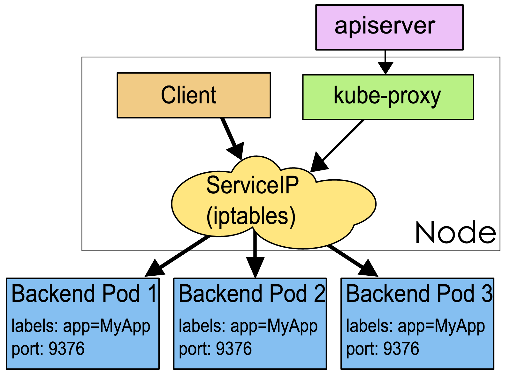

# Kubernetes Fundamental Concepts

## Container

A container is a lightweight, portable, OS-level virtualization technology that utilizes namespaces to isolate various software execution environments. Containers come with their runtime environments encapsulated within images, making them easily deployable anywhere.

Due to the small size and rapid startup of containers, each container image can contain a single application—this one-to-one application-to-image relationship brings many benefits. Containers do not require binding to any external infrastructure since each application is self-contained, with no outside dependencies needed. This effectively solves the consistency problems from development all the way to production.

Containers are also more transparent than virtual machines, aiding in their monitoring and management. Notably, the container life cycle is managed by the infrastructure, as opposed to being concealed within the container by a process manager. Lastly, managing container deployments is essentially managing application deployments.

Other advantages of containers include:

* Agile application creation and deployment: Container images are easier and more efficient to work with compared to virtual machine images.
* Continuous development, integration, and deployment: Provide reliable and frequent container image build and deployment with quick and easy rollbacks (because images are immutable).
* Dev and Ops separation of concerns: Create container images at build/release time, thus decoupling applications from infrastructure.
* Environment consistency across development, testing, and production: Runs the same on a laptop as it does in the cloud.
* Observability: Not only surface OS-level information and metrics but also application health and other metrics.
* Portability across clouds and OS distributions: Run on Ubuntu, RHEL, CoreOS, on-prem, Google Kubernetes Engine, and anywhere else.
* Application-centric management: Elevate from deploying OSes on hardware to running applications on an OS.
* Loosely coupled, distributed, elastic, liberate microservices architectures: Applications are broken into smaller, independent chunks and can be managed dynamically—not monolithic stacks running on one big single-purpose machine.
* Resource isolation: Predictable application performance.
* Resource utilization: High efficiency and density.

## Pod

Kubernetes employs Pods to orchestrate containers, with each Pod capable of holding one or more closely related containers.

A Pod is a collection of containers that are tightly linked, sharing IPC and Network namespaces, and it is the basic unit that Kubernetes schedules. Containers within a Pod share network and file systems, which allows them to carry out service tasks through a simple and efficient method of inter-process communication and file sharing.


In Kubernetes, all objects are defined using manifest files (yaml or json). For example, a simple nginx service can be defined in an nginx.yaml file containing a container with the nginx image:

```yaml
apiVersion: v1
kind: Pod
metadata:
  name: nginx
  labels:
    app: nginx
spec:
  containers:
  - name: nginx
    image: nginx
    ports:
    - containerPort: 80
```

## Node

A Node is the actual host where Pods run and can be either a physical or a virtual machine. To manage Pods, each Node has to run at least a container runtime such as docker or rkt, `kubelet`, and `kube-proxy` services.


## Namespace

A Namespace is an abstract collection of a set of resources and objects, such as for separating internal system objects into different project or user groups. Common entities like pods, services, replication controllers, and deployments belong to a namespace (default is `default`), whereas nodes and persistentVolumes do not belong to any namespace.

## Service

A Service is an abstraction that provides load balancing and service discovery for applications, using labels. A list of Pod IPs and ports matching the labels form the endpoints, which `kube-proxy` manages to load-balance across these endpoints.

Each Service is automatically assigned a cluster IP (a virtual address accessible only within the cluster) and DNS name. Other containers can access the service using this address or DNS name, without needing to be aware of the backend containers running it.



```yaml
apiVersion: v1
kind: Service
metadata:
  name: nginx
spec:
  ports:
  - port: 8078 # the port that this service should serve on
    name: http
    # the container on each pod to connect to, can be a name
    # (e.g. 'www') or a number (e.g. 80)
    targetPort: 80
    protocol: TCP
  selector:
    app: nginx
```

## Label

Labels are tags that identify Kubernetes objects, attached to objects in a key/value format (where key length cannot exceed 63 bytes, and value can be empty or a string not exceeding 253 bytes).

Labels do not denote uniqueness and are often used by many objects (like Pods) to signify a particular application.

Once labels are defined, other objects may use a Label Selector to select a set of objects with the same label (for example, ReplicaSets and Services use labels to select a set of Pods). Label Selector supports the following types:

* Equality, like `app=nginx` and `env!=production`
* Set-based, like `env in (production, qa)`
* Multiple labels (which are ANDed together), like `app=nginx,env=test`

## Annotations

Annotations are notes attached to objects in a key/value manner. Unlike labels, which are used to identify and select objects, annotations store additional information that assists with application deployment, security strategies, and scheduling policies, among others. For instance, deployments use annotations to keep track of the state of rolling updates.