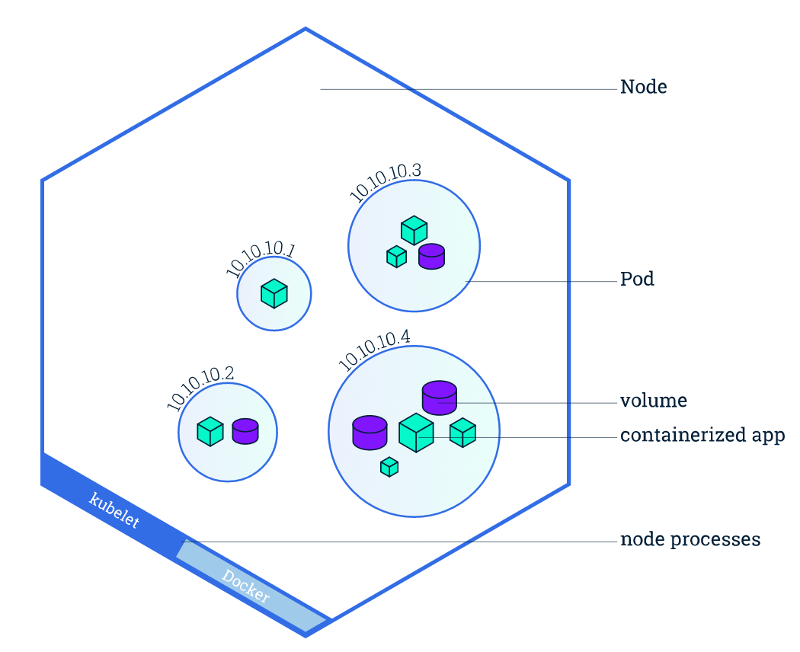

# Kubernetes基本概念

## Pod

Pod是一组紧密关联的容器集合，它们共享IPC、Network和UTC namespace，是Kubernetes调度的基本单位。Pod的设计理念是支持多个容器在一个Pod中共享网络和文件系统，可以通过进程间通信和文件共享这种简单高效的方式组合完成服务。


在Kubernetes中，所有对象都使用manifest（yaml或json）来定义，比如一个简单的nginx服务可以定义为nginx.yaml，它包含一个镜像为nginx的容器：

```yaml
apiVersion: v1
kind: Pod
metadata:
  name: nginx
  labels:
    app: nginx
spec:
  containers:
  - name: nginx
    image: nginx
    ports:
    - containerPort: 80
```

## Node

Node是Pod真正运行的主机，可以物理机，也可以是虚拟机。为了管理Pod，每个Node节点上至少要运行container runtime（比如docker或者rkt）、`kubelet`和`kube-proxy`服务。



## Service

Service是应用服务的抽象，通过labels为应用提供负载均衡和服务发现。匹配labels的Pod IP和端口列表组成endpoints，由kube-proxy负责将服务IP负载均衡到这些endpoints上。

每个Service都会自动分配一个cluster IP（仅在集群内部可访问的虚拟地址）和DNS名，其他容器可以通过该地址或DNS来访问服务，而不需要了解后端容器的运行。


```yaml
apiVersion: v1
kind: Service
metadata:
  name: nginx
spec:
  ports:
  - port: 8078 # the port that this service should serve on
    name: http
    # the container on each pod to connect to, can be a name
    # (e.g. 'www') or a number (e.g. 80)
    targetPort: 80
    protocol: TCP
  selector:
    app: nginx
```

## Label

Label是识别Kubernetes对象的标签，以key/value的方式附加到对象上（key最长不能超过63字节，value可以为空，也可以是不超过253字节的字符串）。

Label不提供唯一性，并且实际上经常是很多对象（如Pods）都使用相同的label来标志具体的应用。

Label定义好后其他对象可以使用Label Selector来选择一组相同label的对象（比如ReplicaSet和Service用label来选择一组Pod）。Label Selector支持以下几种方式：

- 等式，如`app=nginx`和`env!=production`
- 集合，如`env in (production, qa)`
- 多个label（它们之间是AND关系），如`app=nginx,env=test`

## Annotations

Annotations是key/value形式附加于对象的注解。不同于Labels用于标志和选择对象，Annotations则是用来记录一些附加信息，用来辅助应用部署、安全策略以及调度策略等。比如deployment使用annotations来记录rolling update的状态。

## Namespace

Namespace是对一组资源和对象的抽象集合，比如可以用来将系统内部的对象划分为不同的项目组或用户组。常见的pods, services, replication controllers和deployments等都是属于某一个namespace的（默认是default），而node, persistentVolumes等则不属于任何namespace。


