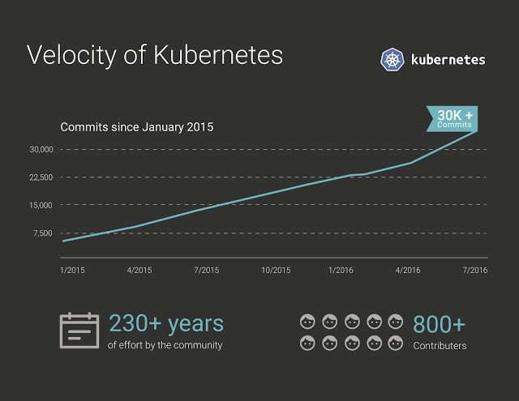

# Kubernetes简介

Kubernetes是谷歌开源的容器集群管理系统，是Google多年大规模容器管理技术Borg的开源版本，主要功能包括：

- 基于容器的应用部署、维护和滚动升级
- 负载均衡和服务发现
- 跨机器和跨地区的集群调度
- 自动伸缩
- 无状态服务和有状态服务
- 广泛的Volume支持
- 插件机制保证扩展性

Kubernetes发展非常迅速，已经成为容器编排领域的领导者。

## Kubernetes架构

Kubernetes主要由以下几个核心组件组成： 

- etcd保存了整个集群的状态；
- apiserver提供了资源操作的唯一入口，并提供认证、授权、访问控制、API注册和发现等机制；
- controller manager负责维护集群的状态，比如故障检测、自动扩展、滚动更新等；
- scheduler负责资源的调度，按照预定的调度策略将Pod调度到相应的机器上；
- kubelet负责维护容器的生命周期，同时也负责Volume（CVI）和网络（CNI）的管理；
- Container runtime负责镜像管理以及Pod和容器的真正运行（CRI）；
- kube-proxy负责为Service提供cluster内部的服务发现和负载均衡

