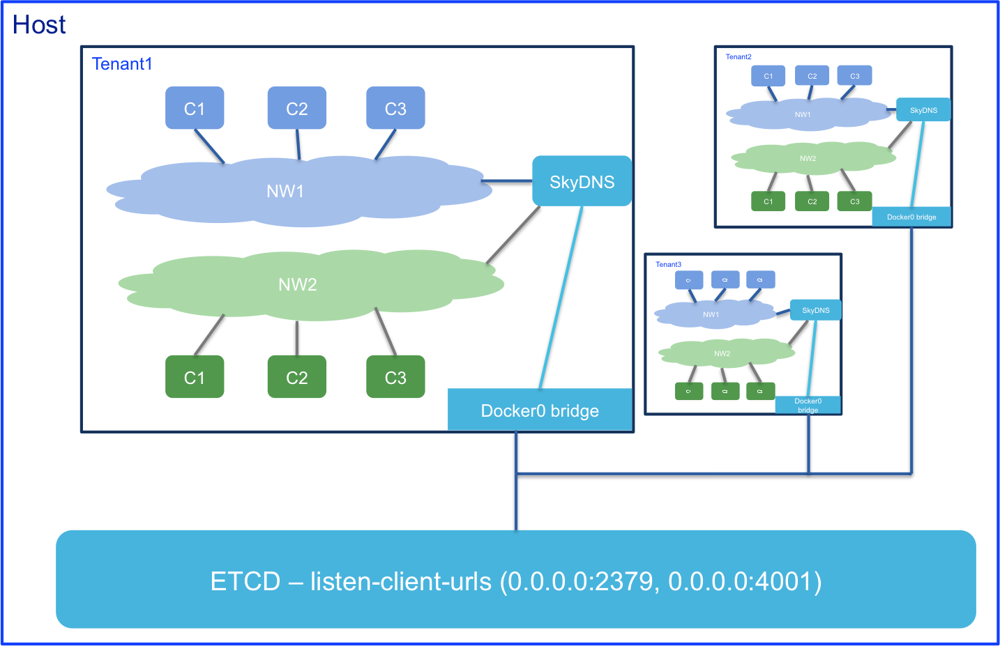
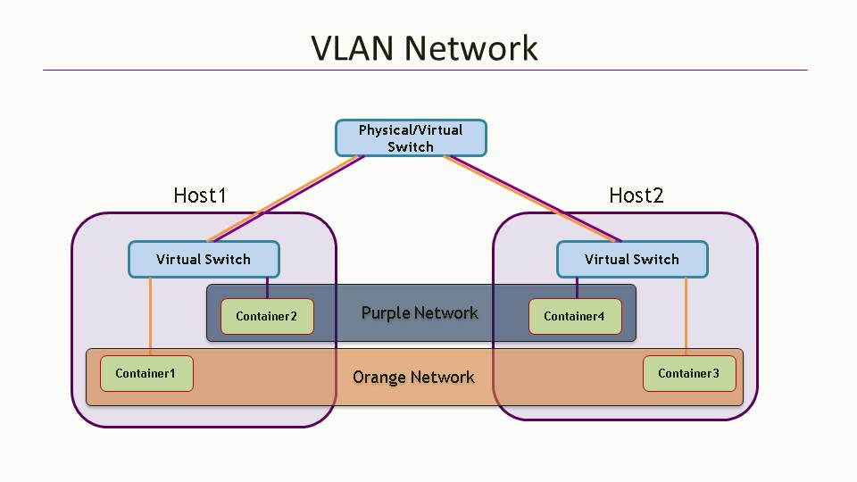

# Contiv

[Contiv](http://contiv.github.io)是思科开源的容器网络方案，是一个用于跨虚拟机、裸机、公有云或私有云的异构容器部署的开源容器网络架构，并与主流容器编排系统集成。Contiv最主要的优势是直接提供了多租户网络，并支持L2(VLAN), L3(BGP), Overlay (VXLAN)以及思科自家的ACI。


主要特征

- 原生的Tenant支持，一个Tenant就是一个virtual routing and forwarding (VRF)
- 两种网络模式
  - L2 VLAN Bridged
  - Routed network, e.g. vxlan, BGP, ACI
- Network Policy，如Bandwidth, Isolation等






## Kubernetes集成

Ansible部署见<https://github.com/kubernetes/contrib/tree/master/ansible/roles/contiv>。

```sh
export VERSION=1.0.0-beta.3
curl -L -O https://github.com/contiv/install/releases/download/$VERSION/contiv-$VERSION.tgz
tar xf contiv-$VERSION.tgz
cd ~/contiv/contiv-$VERSION/install/k8s
netctl --netmaster http://$netmaster:9999 global set --fwd-mode routing

cd ~/contiv/contiv-$VERSION
install/k8s/install.sh -n 10.87.49.77 -v b -w routing

# check contiv pods
export NETMASTER=http://10.87.49.77:9999
netctl global info

# create a network
# netctl network create --encap=vlan --pkt-tag=3280 --subnet=10.100.100.215-10.100.100.220/27 --gateway=10.100.100.193 vlan3280
netctl net create -t default --subnet=20.1.1.0/24 default-net

#  create BGP connections to each of the nodes
netctl bgp create devstack-77 --router-ip="30.30.30.77/24" --as="65000" --neighbor-as="65000" --neighbor="30.30.30.2"
netctl bgp create devstack-78 --router-ip="30.30.30.78/24" --as="65000" --neighbor-as="65000" --neighbor="30.30.30.2"
netctl bgp create devstack-71 --router-ip="30.30.30.79/24" --as="65000" --neighbor-as="65000" --neighbor="30.30.30.2"

# then create pod with label "io.contiv.network"
```


**参考文档**

- <http://contiv.github.io/>
- <https://github.com/contiv/netplugin>
- <http://blogs.cisco.com/cloud/introducing-contiv-1-0>
- [Kubernetes and Contiv on Bare-Metal with L3/BGP](http://blog.michali.net/2017/03/20/kubernetes-and-contiv-on-bare-metal-with-l3bgp/)
