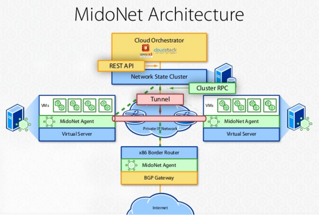
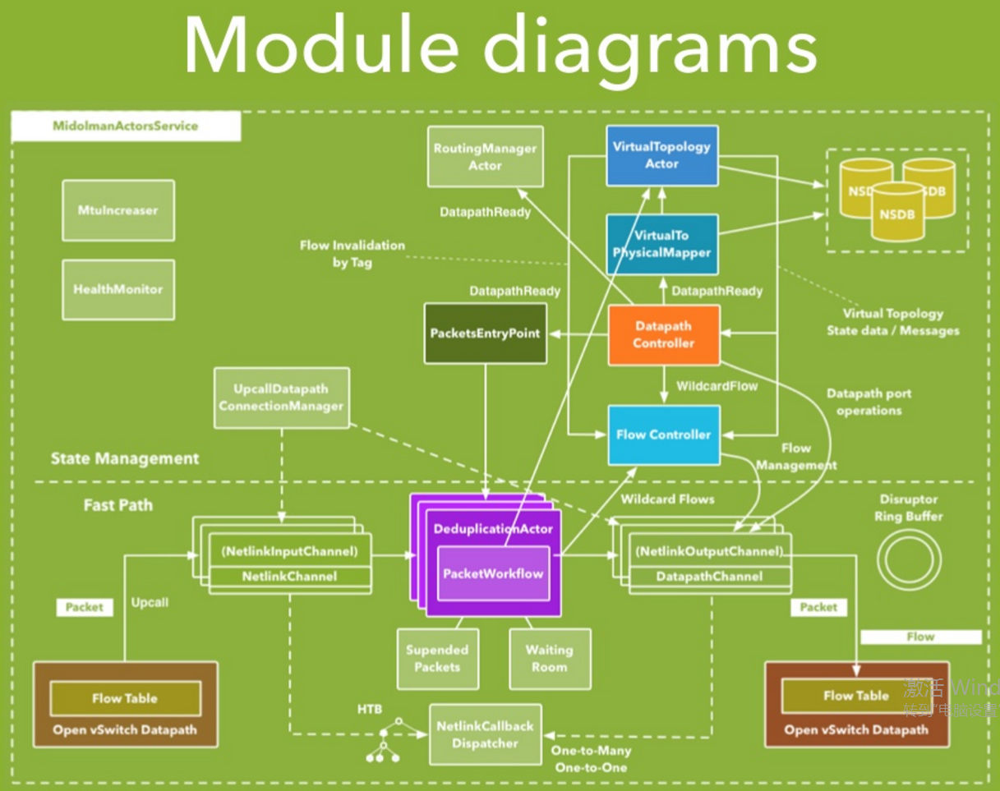

# Midonet

[Midonet](https://www.midonet.org/)是Midokura公司開源的OpenStack網絡虛擬化方案。

- 從組件來看，Midonet以Zookeeper+Cassandra構建分佈式數據庫存儲VPC資源的狀態——Network State DB Cluster，並將controller分佈在轉發設備（包括vswitch和L3 Gateway）本地——Midolman（L3 Gateway上還有quagga bgpd），設備的轉發則保留了ovs kernel作為fast datapath。可以看到，Midonet和DragonFlow、OVN一樣，在架構的設計上都是沿著OVS-Neutron-Agent的思路，將controller分佈到設備本地，並在neutron plugin和設備agent間嵌入自己的資源數據庫作為super controller。
- 從接口來看，NSDB與Neutron間是REST API，Midolman與NSDB間是RPC，這倆沒什麼好說的。Controller的南向方面，Midolman並沒有用OpenFlow和OVSDB，它幹掉了user space中的vswitchd和ovsdb-server，直接通過linux netlink機制操作kernel space中的ovs datapath。

## Docker/Kubernetes集成

Midonet作為[Kuryr](https://github.com/openstack/kuryr)的一個driver，通過[kuryr-libnetwork](https://github.com/openstack/kuryr-libnetwork)和[kuryr-kubernetes](https://github.com/openstack/kuryr-kubernetes)應用到容器中。

其他方法：

- Midonet通過<https://github.com/midonet/bees>，已不再更新。
- Midonet通過[k8s-midonet](https://github.com/midonet/k8s-midonet)與Kubernetes集成，已不再更新。

**參考文檔**

- <https://www.midonet.org/>
- <http://www.sdnlab.com/16974.html>
- <https://blog.midonet.org/introduction-mns-overlay-network-models-part-1-provider-router/>
- <https://blog.midonet.org/introduction-mns-overlay-network-models-part-2-tenant-routers-bridges/>
- <https://docs.midonet.org/docs/latest/reference-architecture/content/index.html>