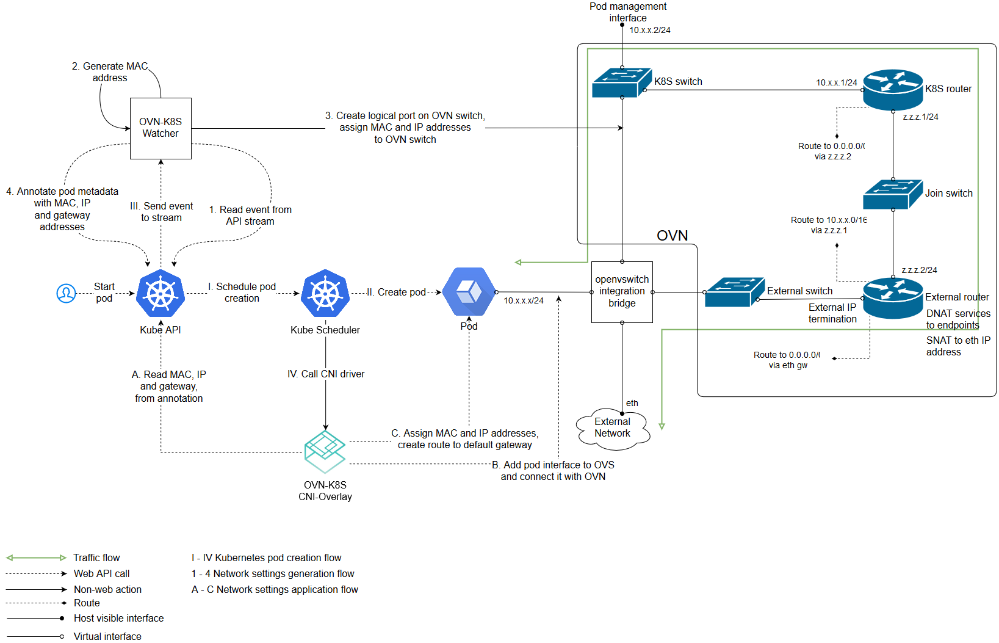

# Open Virtual Networking (OVN)

[ovn-kubernetes](https://github.com/openvswitch/ovn-kubernetes) 提供了一个ovs OVN 网络插件，支持 underlay 和 overlay 两种模式。

- underlay：容器运行在虚拟机中，而ovs则运行在虚拟机所在的物理机上，OVN将容器网络和虚拟机网络连接在一起
- overlay：OVN通过logical overlay network连接所有节点的容器，此时ovs可以直接运行在物理机或虚拟机上

## Overlay模式



### 配置master

```sh
# start ovn
/usr/share/openvswitch/scripts/ovn-ctl start_northd
/usr/share/openvswitch/scripts/ovn-ctl start_controller

# start ovnkube
nohup sudo ovnkube -k8s-kubeconfig kubeconfig.yaml -net-controller \
 -loglevel=4 \
 -k8s-apiserver="http://$CENTRAL_IP:8080" \
 -logfile="/var/log/openvswitch/ovnkube.log" \
 -init-master=$NODE_NAME -cluster-subnet="$CLUSTER_IP_SUBNET" \
 -service-cluster-ip-range=$SERVICE_IP_SUBNET \
 -nodeport \
 -nb-address="tcp://$CENTRAL_IP:6631" \
 -sb-address="tcp://$CENTRAL_IP:6632" 2>&1 &
```

### 配置Node

```sh
nohup sudo ovnkube -k8s-kubeconfig kubeconfig.yaml -loglevel=4 \
    -logfile="/var/log/openvswitch/ovnkube.log" \
    -k8s-apiserver="http://$CENTRAL_IP:8080" \
    -init-node="$NODE_NAME"  \
    -nodeport \
    -nb-address="tcp://$CENTRAL_IP:6631" \
    -sb-address="tcp://$CENTRAL_IP:6632" -k8s-token="$TOKEN" \
    -init-gateways \
    -service-cluster-ip-range=$SERVICE_IP_SUBNET \
    -cluster-subnet=$CLUSTER_IP_SUBNET 2>&1 &
```

### CNI插件原理

#### ADD操作

- 从`ovn` annotation获取ip/mac/gateway
- 在容器netns中配置接口和路由
- 添加ovs端口

```sh
ovs-vsctl add-port br-int veth_outside \
  --set interface veth_outside \
    external_ids:attached_mac=mac_address \
    external_ids:iface-id=namespace_pod \
    external_ids:ip_address=ip_address
```

#### DEL操作

```sh
ovs-vsctl del-port br-int port
```

## Underlay模式

暂未实现。

## OVN 安装方法

所有节点配置安装源并安装公共依赖

```sh
sudo apt-get install apt-transport-https
echo "deb https://packages.wand.net.nz $(lsb_release -sc) main" | sudo tee /etc/apt/sources.list.d/wand.list
sudo curl https://packages.wand.net.nz/keyring.gpg -o /etc/apt/trusted.gpg.d/wand.gpg
sudo apt-get update

sudo apt-get build-dep dkms
sudo apt-get install python-six openssl python-pip -y
sudo -H pip install --upgrade pip

sudo apt-get install openvswitch-datapath-dkms -y
sudo apt-get install openvswitch-switch openvswitch-common -y
sudo -H pip install ovs
```

Master 节点安装 ovn-central

```sh
sudo apt-get install ovn-central ovn-common ovn-host -y
```

Node 节点安装 ovn-host

```sh
sudo apt-get install ovn-host ovn-common -y
```

## 参考文档

- <https://github.com/openvswitch/ovn-kubernetes>
