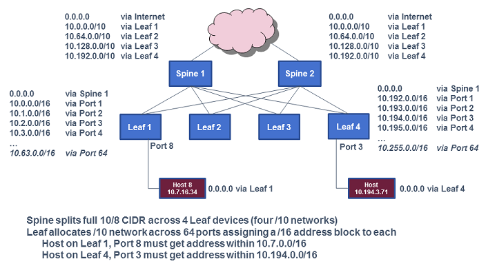

# Romana

Romana是Panic Networks在2016年提出的开源项目，旨在解决Overlay方案给网络带来的开销。

## Kubernetes部署

对使用kubeadm部署的Kubernetes集群：

```sh
kubectl apply -f https://raw.githubusercontent.com/romana/romana/master/docs/kubernetes/romana-kubeadm.yml
```

对使用kops部署的Kubernetes集群:

```sh
kubectl apply -f https://raw.githubusercontent.com/romana/romana/master/docs/kubernetes/romana-kops.yml
```

使用kops时要注意

- 设置网络插件使用CNI `--networking cni`
- 对于aws还提供`romana-aws`和`romana-vpcrouter`自动配置Node和Zone之间的路由

## 工作原理




- layer 3 networking，消除overlay带来的开销
- 基于iptables ACL的网络隔离
- 基于hierarchy CIDR管理Host/Tenant/Segment ID


## 优点

- 纯三层网络，性能好

## 缺点

- 基于IP管理租户，有规模上的限制
- 物理设备变更或地址规划变更麻烦

**参考文档**

- <http://romana.io/>
- [Romana basics](http://romana.io/how/romana_basics/)
- [Romana Github](https://github.com/romana/romana)
- [Romana 2.0](http://romana.readthedocs.io/en/latest/index.html)

