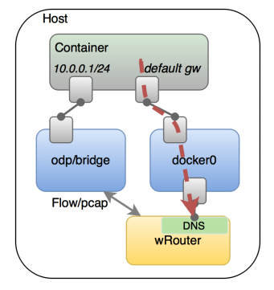
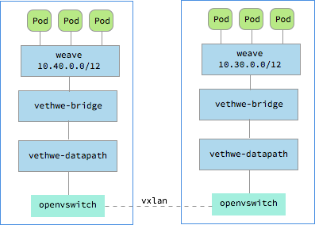

# Weave Net

Weave Net是一個多主機容器網絡方案，支持去中心化的控制平面，各個host上的wRouter間通過建立Full Mesh的TCP鏈接，並通過Gossip來同步控制信息。這種方式省去了集中式的K/V Store，能夠在一定程度上減低部署的複雜性，Weave將其稱為“data centric”，而非RAFT或者Paxos的“algorithm centric”。

數據平面上，Weave通過UDP封裝實現L2 Overlay，封裝支持兩種模式：

- 運行在user space的sleeve mode：通過pcap設備在Linux bridge上截獲數據包並由wRouter完成UDP封裝，支持對L2 traffic進行加密，還支持Partial Connection，但是性能損失明顯。
- 運行在kernal space的 fastpath mode：即通過OVS的odp封裝VxLAN並完成轉發，wRouter不直接參與轉發，而是通過下發odp 流表的方式控制轉發，這種方式可以明顯地提升吞吐量，但是不支持加密等高級功能。

Sleeve Mode:


Fastpath Mode:


關於Service的發佈，weave做的也比較完整。首先，wRouter集成了DNS功能，能夠動態地進行服務發現和負載均衡，另外，與libnetwork 的overlay driver類似，weave要求每個POD有兩個網卡，一個就連在lb/ovs上處理L2 流量，另一個則連在docker0上處理Service流量，docker0後面仍然是iptables作NAT。



Weave已經集成了主流的容器系統

- Docker: https://www.weave.works/docs/net/latest/plugin/
- Kubernetes: https://www.weave.works/docs/net/latest/kube-addon/
  - `kubectl apply -f https://git.io/weave-kube`
- CNI: https://www.weave.works/docs/net/latest/cni-plugin/
- Prometheus: https://www.weave.works/docs/net/latest/metrics/

## Weave Kubernetes

```sh
kubectl apply -n kube-system -f "https://cloud.weave.works/k8s/net?k8s-version=$(kubectl version | base64 | tr -d '\n')"
```

這會在所有Node上啟動Weave插件以及Network policy controller：

```sh
$ ps -ef | grep weave | grep -v grep
root     25147 25131  0 16:22 ?        00:00:00 /bin/sh /home/weave/launch.sh
root     25204 25147  0 16:22 ?        00:00:00 /home/weave/weaver --port=6783 --datapath=datapath --host-root=/host --http-addr=127.0.0.1:6784 --status-addr=0.0.0.0:6782 --docker-api= --no-dns --db-prefix=/weavedb/weave-net --ipalloc-range=10.32.0.0/12 --nickname=ubuntu-0 --ipalloc-init consensus=2 --conn-limit=30 --expect-npc 10.146.0.2 10.146.0.3
root     25669 25654  0 16:22 ?        00:00:00 /usr/bin/weave-npc
```

這樣，容器網絡為

- 所有容器都連接到weave網橋
- weave網橋通過veth pair連到內核的openvswitch模塊
- 跨主機容器通過openvswitch vxlan通信
- policy controller通過配置iptables規則為容器設置網絡策略



## Weave Scope

Weave Scope是一個容器監控和故障排查工具，可以方便的生成整個集群的拓撲並智能分組（Automatic Topologies and Intelligent Grouping）。

Weave Scope主要由scope-probe和scope-app組成

```
+--Docker host----------+
|  +--Container------+  |    .---------------.
|  |                 |  |    | Browser       |
|  |  +-----------+  |  |    |---------------|
|  |  | scope-app |<---------|               |
|  |  +-----------+  |  |    |               |
|  |        ^        |  |    |               |
|  |        |        |  |    '---------------'
|  | +-------------+ |  |
|  | | scope-probe | |  |
|  | +-------------+ |  |
|  |                 |  |
|  +-----------------+  |
+-----------------------+
```

## 優點

- 去中心化
- 故障自動恢復
- 加密通信
- Multicast networking

## 缺點

- UDP模式性能損失較大


**參考文檔**

- <https://github.com/weaveworks/weave>
- <https://www.weave.works/products/weave-net/>
- <https://github.com/weaveworks/scope>
- <https://www.weave.works/guides/monitor-docker-containers/>
- <http://www.sdnlab.com/17141.html>

