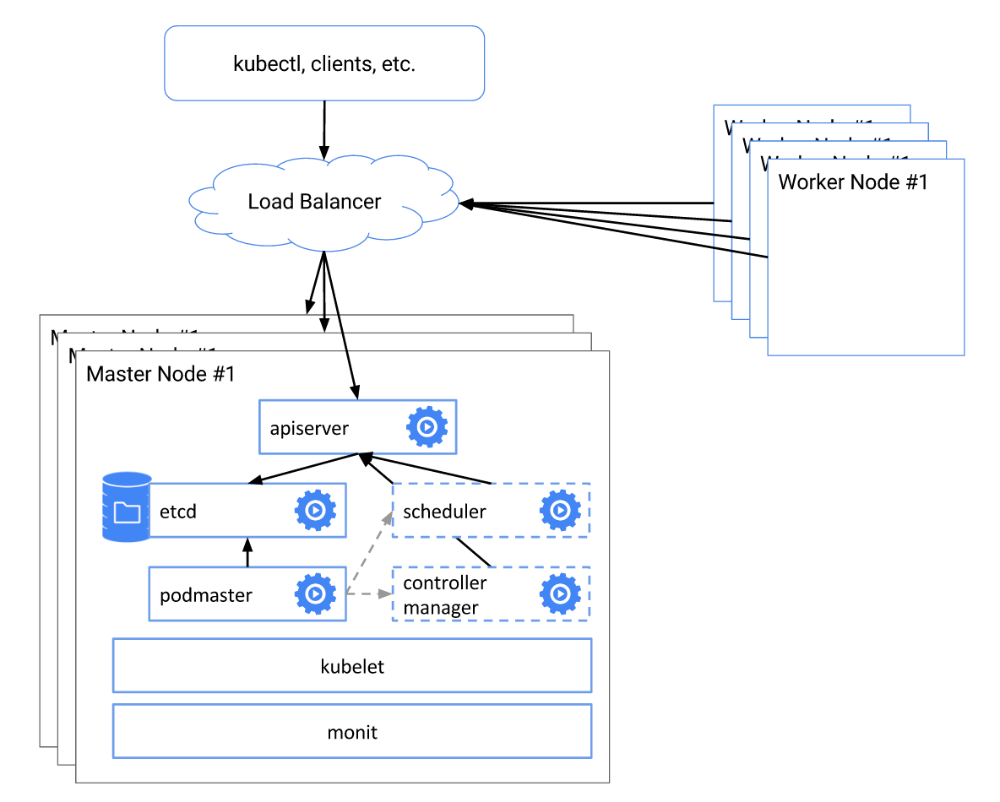

# Kubernetes HA

Kubernetes 從 1.5 開始，通過 `kops` 或者 `kube-up.sh` 部署的集群會自動部署一個高可用的系統，包括

- Etcd 集群模式
- kube-apiserver 負載均衡
- kube-controller-manager、kube-scheduler 和 cluster-autoscaler 自動選主（有且僅有一個運行實例）

如下圖所示



注意：以下步驟假設每臺機器上 Kubelet 和 Docker 已配置並處於正常運行狀態。

## Etcd 集群

安裝 cfssl

```sh
# On all etcd nodes
curl -o /usr/local/bin/cfssl https://pkg.cfssl.org/R1.2/cfssl_linux-amd64
curl -o /usr/local/bin/cfssljson https://pkg.cfssl.org/R1.2/cfssljson_linux-amd64
chmod +x /usr/local/bin/cfssl*

```

生成 CA certs:

```sh
# SSH etcd0
mkdir -p /etc/kubernetes/pki/etcd
cd /etc/kubernetes/pki/etcd
cat >ca-config.json <<EOF
{
    "signing": {
        "default": {
            "expiry": "43800h"
        },
        "profiles": {
            "server": {
                "expiry": "43800h",
                "usages": [
                    "signing",
                    "key encipherment",
                    "server auth",
                    "client auth"
                ]
            },
            "client": {
                "expiry": "43800h",
                "usages": [
                    "signing",
                    "key encipherment",
                    "client auth"
                ]
            },
            "peer": {
                "expiry": "43800h",
                "usages": [
                    "signing",
                    "key encipherment",
                    "server auth",
                    "client auth"
                ]
            }
        }
    }
}
EOF
cat >ca-csr.json <<EOF
{
    "CN": "etcd",
    "key": {
        "algo": "rsa",
        "size": 2048
    }
}
EOF
cfssl gencert -initca ca-csr.json | cfssljson -bare ca -

# generate client certs
cat >client.json <<EOF
{
    "CN": "client",
    "key": {
        "algo": "ecdsa",
        "size": 256
    }
}
EOF
cfssl gencert -ca=ca.pem -ca-key=ca-key.pem -config=ca-config.json -profile=client client.json | cfssljson -bare client
```

生成 etcd server/peer certs

```sh
# Copy files to other etcd nodes
mkdir -p /etc/kubernetes/pki/etcd
cd /etc/kubernetes/pki/etcd
scp root@<etcd0-ip-address>:/etc/kubernetes/pki/etcd/ca.pem .
scp root@<etcd0-ip-address>:/etc/kubernetes/pki/etcd/ca-key.pem .
scp root@<etcd0-ip-address>:/etc/kubernetes/pki/etcd/client.pem .
scp root@<etcd0-ip-address>:/etc/kubernetes/pki/etcd/client-key.pem .
scp root@<etcd0-ip-address>:/etc/kubernetes/pki/etcd/ca-config.json .

# Run on all etcd nodes
cfssl print-defaults csr > config.json
sed -i '0,/CN/{s/example\.net/'"$PEER_NAME"'/}' config.json
sed -i 's/www\.example\.net/'"$PRIVATE_IP"'/' config.json
sed -i 's/example\.net/'"$PUBLIC_IP"'/' config.json
cfssl gencert -ca=ca.pem -ca-key=ca-key.pem -config=ca-config.json -profile=server config.json | cfssljson -bare server
cfssl gencert -ca=ca.pem -ca-key=ca-key.pem -config=ca-config.json -profile=peer config.json | cfssljson -bare peer
```

最後運行 etcd，將如下的 yaml 配置寫入每臺 etcd 節點的 `/etc/kubernetes/manifests/etcd.yaml` 文件中，注意替換

- `<podname>` 為 etcd 節點名稱 （比如`etcd0`, `etcd1` 和 `etcd2`）
- `<etcd0-ip-address>`, `<etcd1-ip-address>` and `<etcd2-ip-address>` 為 etcd 節點的內網 IP 地址

```sh
cat >/etc/kubernetes/manifests/etcd.yaml <<EOF
apiVersion: v1
kind: Pod
metadata:
labels:
    component: etcd
    tier: control-plane
name: <podname>
namespace: kube-system
spec:
containers:
- command:
    - etcd --name ${PEER_NAME} \
    - --data-dir /var/lib/etcd \
    - --listen-client-urls https://${PRIVATE_IP}:2379 \
    - --advertise-client-urls https://${PRIVATE_IP}:2379 \
    - --listen-peer-urls https://${PRIVATE_IP}:2380 \
    - --initial-advertise-peer-urls https://${PRIVATE_IP}:2380 \
    - --cert-file=/certs/server.pem \
    - --key-file=/certs/server-key.pem \
    - --client-cert-auth \
    - --trusted-ca-file=/certs/ca.pem \
    - --peer-cert-file=/certs/peer.pem \
    - --peer-key-file=/certs/peer-key.pem \
    - --peer-client-cert-auth \
    - --peer-trusted-ca-file=/certs/ca.pem \
    - --initial-cluster etcd0=https://<etcd0-ip-address>:2380,etcd1=https://<etcd1-ip-address>:2380,etcd1=https://<etcd2-ip-address>:2380 \
    - --initial-cluster-token my-etcd-token \
    - --initial-cluster-state new
    image: gcr.io/google_containers/etcd-amd64:3.1.0
    livenessProbe:
    httpGet:
        path: /health
        port: 2379
        scheme: HTTP
    initialDelaySeconds: 15
    timeoutSeconds: 15
    name: etcd
    env:
    - name: PUBLIC_IP
    valueFrom:
        fieldRef:
        fieldPath: status.hostIP
    - name: PRIVATE_IP
    valueFrom:
        fieldRef:
        fieldPath: status.podIP
    - name: PEER_NAME
    valueFrom:
        fieldRef:
        fieldPath: metadata.name
    volumeMounts:
    - mountPath: /var/lib/etcd
    name: etcd
    - mountPath: /certs
    name: certs
hostNetwork: true
volumes:
- hostPath:
    path: /var/lib/etcd
    type: DirectoryOrCreate
    name: etcd
- hostPath:
    path: /etc/kubernetes/pki/etcd
    name: certs
EOF
```

> 注意：以上方法需要每個 etcd 節點都運行 kubelet。如果不想使用 kubelet，還可以通過 systemd 的方式來啟動 etcd：
>
> ```sh
> export ETCD_VERSION=v3.1.10
> curl -sSL https://github.com/coreos/etcd/releases/download/${ETCD_VERSION}/etcd-${ETCD_VERSION}-linux-amd64.tar.gz | tar -xzv --strip-components=1 -C /usr/local/bin/
> rm -rf etcd-$ETCD_VERSION-linux-amd64*
>
> touch /etc/etcd.env
> echo "PEER_NAME=$PEER_NAME" >> /etc/etcd.env
> echo "PRIVATE_IP=$PRIVATE_IP" >> /etc/etcd.env
>
> cat >/etc/systemd/system/etcd.service <<EOF
> [Unit]
> Description=etcd
> Documentation=https://github.com/coreos/etcd
> Conflicts=etcd.service
> Conflicts=etcd2.service
>
> [Service]
> EnvironmentFile=/etc/etcd.env
> Type=notify
> Restart=always
> RestartSec=5s
> LimitNOFILE=40000
> TimeoutStartSec=0
>
> ExecStart=/usr/local/bin/etcd --name ${PEER_NAME} \
>     --data-dir /var/lib/etcd \
>     --listen-client-urls https://${PRIVATE_IP}:2379 \
>     --advertise-client-urls https://${PRIVATE_IP}:2379 \
>     --listen-peer-urls https://${PRIVATE_IP}:2380 \
>     --initial-advertise-peer-urls https://${PRIVATE_IP}:2380 \
>     --cert-file=/etc/kubernetes/pki/etcd/server.pem \
>     --key-file=/etc/kubernetes/pki/etcd/server-key.pem \
>     --client-cert-auth \
>     --trusted-ca-file=/etc/kubernetes/pki/etcd/ca.pem \
>     --peer-cert-file=/etc/kubernetes/pki/etcd/peer.pem \
>     --peer-key-file=/etc/kubernetes/pki/etcd/peer-key.pem \
>     --peer-client-cert-auth \
>     --peer-trusted-ca-file=/etc/kubernetes/pki/etcd/ca.pem \
>     --initial-cluster etcd0=https://<etcd0-ip-address>:2380,etcd1=https://<etcd1-ip-address>:2380,etcd2=https://<etcd2-ip-address>:2380 \
>     --initial-cluster-token my-etcd-token \
>     --initial-cluster-state new
>
> [Install]
> WantedBy=multi-user.target
> EOF
>
> systemctl daemon-reload
> systemctl start etcd
> ```

## kube-apiserver

把 `kube-apiserver.yaml` 放到每臺 Master 節點的 `/etc/kubernetes/manifests/`，並把相關的配置放到 `/srv/kubernetes/`，即可由 kubelet 自動創建並啟動 apiserver:

- basic_auth.csv - basic auth user and password
- ca.crt - Certificate Authority cert
- known_tokens.csv - tokens that entities (e.g. the kubelet) can use to talk to the apiserver
- kubecfg.crt - Client certificate, public key
- kubecfg.key - Client certificate, private key
- server.cert - Server certificate, public key
- server.key - Server certificate, private key

> 注意：確保 kube-apiserver 配置 --etcd-quorum-read=true（v1.9 之後默認為 true）。

### kubeadm

如果使用 kubeadm 來部署集群的話，可以按照如下步驟配置：

```sh
# on master0
# deploy master0
cat >config.yaml <<EOF
apiVersion: kubeadm.k8s.io/v1alpha2
kind: MasterConfiguration
kubernetesVersion: v1.11.0
apiServerCertSANs:
- "LOAD_BALANCER_DNS"
api:
    controlPlaneEndpoint: "LOAD_BALANCER_DNS:LOAD_BALANCER_PORT"
etcd:
  local:
    extraArgs:
      listen-client-urls: "https://127.0.0.1:2379,https://CP0_IP:2379"
      advertise-client-urls: "https://CP0_IP:2379"
      listen-peer-urls: "https://CP0_IP:2380"
      initial-advertise-peer-urls: "https://CP0_IP:2380"
      initial-cluster: "CP0_HOSTNAME=https://CP0_IP:2380"
    serverCertSANs:
      - CP0_HOSTNAME
      - CP0_IP
    peerCertSANs:
      - CP0_HOSTNAME
      - CP0_IP
networking:
    # This CIDR is a Calico default. Substitute or remove for your CNI provider.
    podSubnet: "192.168.0.0/16"
EOF
kubeadm init --config=config.yaml

# copy TLS certs to other master nodes
CONTROL_PLANE_IPS="10.0.0.7 10.0.0.8"
for host in ${CONTROL_PLANE_IPS}; do
    scp /etc/kubernetes/pki/ca.crt "${USER}"@$host:
    scp /etc/kubernetes/pki/ca.key "${USER}"@$host:
    scp /etc/kubernetes/pki/sa.key "${USER}"@$host:
    scp /etc/kubernetes/pki/sa.pub "${USER}"@$host:
    scp /etc/kubernetes/pki/front-proxy-ca.crt "${USER}"@$host:
    scp /etc/kubernetes/pki/front-proxy-ca.key "${USER}"@$host:
    scp /etc/kubernetes/pki/etcd/ca.crt "${USER}"@$host:etcd-ca.crt
    scp /etc/kubernetes/pki/etcd/ca.key "${USER}"@$host:etcd-ca.key
    scp /etc/kubernetes/admin.conf "${USER}"@$host:
done


# on other master nodes
cat > kubeadm-config.yaml <<EOF
apiVersion: kubeadm.k8s.io/v1alpha2
kind: MasterConfiguration
kubernetesVersion: v1.11.0
apiServerCertSANs:
- "LOAD_BALANCER_DNS"
api:
    controlPlaneEndpoint: "LOAD_BALANCER_DNS:LOAD_BALANCER_PORT"
etcd:
  local:
    extraArgs:
      listen-client-urls: "https://127.0.0.1:2379,https://CP1_IP:2379"
      advertise-client-urls: "https://CP1_IP:2379"
      listen-peer-urls: "https://CP1_IP:2380"
      initial-advertise-peer-urls: "https://CP1_IP:2380"
      initial-cluster: "CP0_HOSTNAME=https://CP0_IP:2380,CP1_HOSTNAME=https://CP1_IP:2380"
      initial-cluster-state: existing
    serverCertSANs:
      - CP1_HOSTNAME
      - CP1_IP
    peerCertSANs:
      - CP1_HOSTNAME
      - CP1_IP
networking:
    # This CIDR is a calico default. Substitute or remove for your CNI provider.
    podSubnet: "192.168.0.0/16"
EOF
# move files
mkdir -p /etc/kubernetes/pki/etcd
mv /home/${USER}/ca.crt /etc/kubernetes/pki/
mv /home/${USER}/ca.key /etc/kubernetes/pki/
mv /home/${USER}/sa.pub /etc/kubernetes/pki/
mv /home/${USER}/sa.key /etc/kubernetes/pki/
mv /home/${USER}/front-proxy-ca.crt /etc/kubernetes/pki/
mv /home/${USER}/front-proxy-ca.key /etc/kubernetes/pki/
mv /home/${USER}/etcd-ca.crt /etc/kubernetes/pki/etcd/ca.crt
mv /home/${USER}/etcd-ca.key /etc/kubernetes/pki/etcd/ca.key
mv /home/${USER}/admin.conf /etc/kubernetes/admin.conf
# Run the kubeadm phase commands to bootstrap the kubelet:
kubeadm alpha phase certs all --config kubeadm-config.yaml
kubeadm alpha phase kubelet config write-to-disk --config kubeadm-config.yaml
kubeadm alpha phase kubelet write-env-file --config kubeadm-config.yaml
kubeadm alpha phase kubeconfig kubelet --config kubeadm-config.yaml
systemctl start kubelet
# Add the node to etcd cluster
CP0_IP=10.0.0.7
CP0_HOSTNAME=cp0
CP1_IP=10.0.0.8
CP1_HOSTNAME=cp1
KUBECONFIG=/etc/kubernetes/admin.conf kubectl exec -n kube-system etcd-${CP0_HOSTNAME} -- etcdctl --ca-file /etc/kubernetes/pki/etcd/ca.crt --cert-file /etc/kubernetes/pki/etcd/peer.crt --key-file /etc/kubernetes/pki/etcd/peer.key --endpoints=https://${CP0_IP}:2379 member add ${CP1_HOSTNAME} https://${CP1_IP}:2380
kubeadm alpha phase etcd local --config kubeadm-config.yaml
# Deploy the master components
kubeadm alpha phase kubeconfig all --config kubeadm-config.yaml
kubeadm alpha phase controlplane all --config kubeadm-config.yaml
kubeadm alpha phase mark-master --config kubeadm-config.yaml
```

kube-apiserver 啟動後，還需要為它們做負載均衡，可以使用雲平臺的彈性負載均衡服務或者使用 haproxy/lvs 等為 master 節點配置負載均衡。

## kube-controller-manager 和 kube-scheduler

kube-controller manager 和 kube-scheduler 需要保證任何時刻都只有一個實例運行，需要一個選主的過程，所以在啟動時要設置 `--leader-elect=true`，比如

```
kube-scheduler --master=127.0.0.1:8080 --v=2 --leader-elect=true
kube-controller-manager --master=127.0.0.1:8080 --cluster-cidr=10.245.0.0/16 --allocate-node-cidrs=true --service-account-private-key-file=/srv/kubernetes/server.key --v=2 --leader-elect=true
```

把  `kube-scheduler.yaml` 和 `kube-controller-manager.yaml` 放到每臺 master 節點的 `/etc/kubernetes/manifests/` 即可。

## kube-dns

kube-dns 可以通過 Deployment 的方式來部署，默認 kubeadm 會自動創建。但在大規模集群的時候，需要放寬資源限制，比如

```
dns_replicas: 6
dns_cpu_limit: 100m
dns_memory_limit: 512Mi
dns_cpu_requests 70m
dns_memory_requests: 70Mi
```

另外，也需要給 dnsmasq 增加資源，比如增加緩存大小到 10000，增加併發處理數量 `--dns-forward-max=1000` 等。

## kube-proxy

默認 kube-proxy 使用 iptables 來為 Service 作負載均衡，這在大規模時會產生很大的 Latency，可以考慮使用 [IPVS](https://docs.google.com/presentation/d/1BaIAywY2qqeHtyGZtlyAp89JIZs59MZLKcFLxKE6LyM/edit#slide=id.p3) 的替代方式（注意 IPVS 在 v1.9 中還是 beta 狀態）。

另外，需要注意配置 kube-proxy 使用 kube-apiserver 負載均衡的 IP 地址：

```sh
kubectl get configmap -n kube-system kube-proxy -o yaml > kube-proxy-сm.yaml
sed -i 's#server:.*#server: https://<masterLoadBalancerFQDN>:6443#g' kube-proxy-cm.yaml
kubectl apply -f kube-proxy-cm.yaml --force
# restart all kube-proxy pods to ensure that they load the new configmap
kubectl delete pod -n kube-system -l k8s-app=kube-proxy
```

## kubelet

kubelet 需要配置 kube-apiserver 負載均衡的 IP 地址

```sh
sudo sed -i 's#server:.*#server: https://<masterLoadBalancerFQDN>:6443#g' /etc/kubernetes/kubelet.conf
sudo systemctl restart kubelet
```

## 數據持久化

除了上面提到的這些配置，持久化存儲也是高可用 Kubernetes 集群所必須的。

- 對於公有云上部署的集群，可以考慮使用雲平臺提供的持久化存儲，比如 aws ebs 或者 gce persistent disk
- 對於物理機部署的集群，可以考慮使用 iSCSI、NFS、Gluster 或者 Ceph 等網絡存儲，也可以使用 RAID

## 參考文檔

- [Set up High-Availability Kubernetes Masters](https://kubernetes.io/docs/tasks/administer-cluster/highly-available-master/)
- [Creating Highly Available Clusters with kubeadm](https://kubernetes.io/docs/setup/independent/high-availability/)
- http://kubecloud.io/setup-ha-k8s-kops/
- https://github.com/coreos/etcd/blob/master/Documentation/op-guide/clustering.md
- [Kubernetes Master Tier For 1000 Nodes Scale](http://fuel-ccp.readthedocs.io/en/latest/design/k8s_1000_nodes_architecture.html)
- [Scaling Kubernetes to Support 50000 Services](https://docs.google.com/presentation/d/1BaIAywY2qqeHtyGZtlyAp89JIZs59MZLKcFLxKE6LyM/edit#slide=id.p3)
