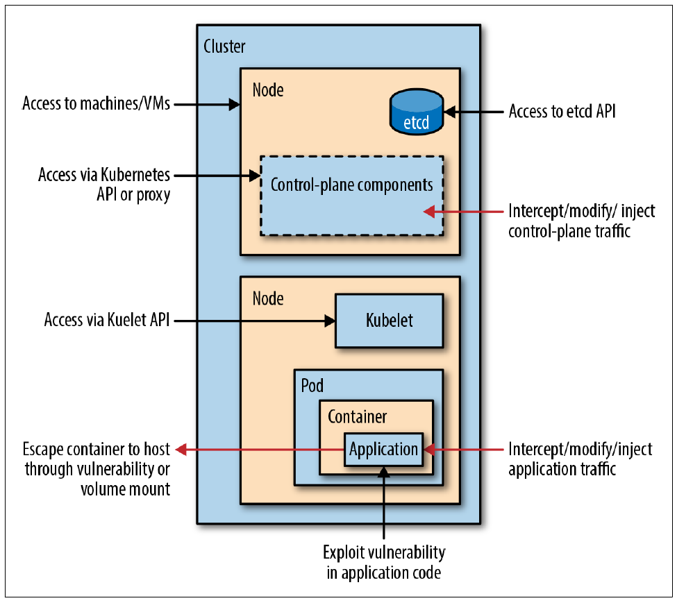

# 容器安全

从安全的角度来看，Kubernetes 中包含如下图所示的潜在攻击面：



（图片来自《Kubernetes Security - Operating Kubernetes Clusters and Applications Safely》）

为了保证集群以及容器应用的安全，Kubernetes 提供了多种安全机制，限制容器的行为，减少容器和集群的攻击面，保证整个系统的安全性。

- 集群安全，比如组件（如 kube-apiserver、etcd、kubelet 等）只开放安全 API并开启 TLS 认证、开启 RBAC 等；
- Security Context：限制容器的行为，包括 Capabilities、ReadOnlyRootFilesystem、Privileged、RunAsNonRoot、RunAsUser 以及 SELinuxOptions 等；
- Pod Security Policy：集群级的 Pod 安全策略，自动为集群内的 Pod 和 Volume 设置 Security Context；
- Sysctls：允许容器设置内核参数，分为安全 Sysctls 和非安全 Sysctls；
- AppArmor：限制应用的访问权限；
- Network Policies：精细控制容器应用和集群中的网络访问；
- Seccomp：Secure computing mode 的缩写，限制容器应用可执行的系统调用。

除此之外，推荐尽量使用较新版本的 Kubernetes，因为它们通常会包含常见安全问题的修复。你可以参考 [kubernetes-announce](https://groups.google.com/forum/#!forum/kubernetes-announce) 来查询最新的 Kubernetes 发布情况，也可以参考 [cvedetails.com](https://www.cvedetails.com/version-list/15867/34016/1/Kubernetes-Kubernetes.html) 查询 Kubernetes 各个版本的 CVE (Common Vulnerabilities and Exposures) 列表。

## 集群安全

- Kubernetes 组件（如 kube-apiserver、etcd、kubelet 等）只开放安全 API 并开启 TLS 认证。
- 开启 RBAC 授权，赋予容器应用最小权限，并开启 NodeRestriction 准入控制（限制 Kubelet 权限）。
  - RBAC 规则过多或者无法满足实际需要时，推荐使用 [Open Policy Agent (OPA)](https://www.openpolicyagent.org/) 配置更灵活的访问策略
- 开启 Secret 加密存储（Secret Encryption），并配置 etcd 的 TLS 认证；
- 禁止 Kubelet 的匿名访问和只读端口，开启 Kubelet 的证书轮替更新（Certificate Rotation）。
- 禁止默认 ServiceAccount 的 automountServiceAccountToken，并在需要时创建容器应用的专用 ServiceAccount。
- 禁止 Dashboard 的匿名访问，通过 RBAC 限制 Dashboard 的访问权限，并确保 Dashboard 仅可在内网访问（通过 kubectl proxy）。
- 定期运行 [CIS Kubernetes Benchmark](https://www.cisecurity.org/benchmark/kubernetes/)，确保集群的配置或更新符合最佳的安全实践（使用 [kube-bench](https://github.com/aquasecurity/kube-bench) 和 [kube-hunter](https://github.com/aquasecurity/kube-hunter)）。
- 在多租户场景中，还可以使用 Kata Containers、gVisor 等对容器进程进行强隔离，或者使用 Istio、Linkerd 等对容器应用之间的通信也进行自动加密。

## TLS 安全

为保障 TLS 安全，并避免 [Zombie POODLE and GOLDENDOODLE Vulnerabilities](https://blog.qualys.com/technology/2019/04/22/zombie-poodle-and-goldendoodle-vulnerabilities)，请为 TLS 1.2 禁止 CBC (Cipher Block Chaining) 模式。

你可以使用 <https://www.ssllabs.com/> 来测试 TLS 的安全问题。

## Security Context 和 Pod Security Policy

```yaml
apiVersion: extensions/v1beta1
kind: PodSecurityPolicy
metadata:
  name: restricted
  annotations:
    # Seccomp v1.11 使用 'runtime/default'，而 v1.10 及更早版本使用 'docker/default'
    seccomp.security.alpha.kubernetes.io/allowedProfileNames: 'runtime/default'
    seccomp.security.alpha.kubernetes.io/defaultProfileName:  'runtime/default'
    apparmor.security.beta.kubernetes.io/allowedProfileNames: 'runtime/default'
    apparmor.security.beta.kubernetes.io/defaultProfileName:  'runtime/default'
spec:
  privileged: false
  # Required to prevent escalations to root.
  allowPrivilegeEscalation: false
  # This is redundant with non-root + disallow privilege escalation,
  # but we can provide it for defense in depth.
  requiredDropCapabilities:
    - ALL
  # Allow core volume types.
  volumes:
    - 'configMap'
    - 'emptyDir'
    - 'projected'
    - 'secret'
    - 'downwardAPI'
    # Assume that persistentVolumes set up by the cluster admin are safe to use.
    - 'persistentVolumeClaim'
  hostNetwork: false
  hostIPC: false
  hostPID: false
  runAsUser:
    # Require the container to run without root privileges.
    rule: 'MustRunAsNonRoot'
  seLinux:
    # This policy assumes the nodes are using AppArmor rather than SELinux.
    rule: 'RunAsAny'
  supplementalGroups:
    rule: 'MustRunAs'
    ranges:
      # Forbid adding the root group.
      - min: 1
        max: 65535
  fsGroup:
    rule: 'MustRunAs'
    ranges:
      # Forbid adding the root group.
      - min: 1
        max: 65535
  readOnlyRootFilesystem: false
```

完整参考见[这里](../concepts/security-context.md)。

## Sysctls

Sysctls 允许容器设置内核参数，分为安全 Sysctls 和非安全 Sysctls

- 安全 Sysctls：即设置后不影响其他 Pod 的内核选项，只作用在容器 namespace 中，默认开启。包括以下几种
  - `kernel.shm_rmid_forced`
  - `net.ipv4.ip_local_port_range`
  - `net.ipv4.tcp_syncookies`
- 非安全 Sysctls：即设置好有可能影响其他 Pod 和 Node 上其他服务的内核选项，默认禁止。如果使用，需要管理员在配置 kubelet 时开启，如 `kubelet --experimental-allowed-unsafe-sysctls 'kernel.msg*,net.ipv4.route.min_pmtu'`

Sysctls 在 v1.11 升级为 Beta 版，可以通过 PSP spec 直接设置，如

```yaml
apiVersion: policy/v1beta1
kind: PodSecurityPolicy
metadata:
  name: sysctl-psp
spec:
  allowedUnsafeSysctls:
  - kernel.msg*
  forbiddenSysctls:
  - kernel.shm_rmid_forced
```

而 v1.10 及更早版本则为 Alpha 阶段，需要通过 Pod annotation 设置，如：

```yaml
apiVersion: v1
kind: Pod
metadata:
  name: sysctl-example
  annotations:
    security.alpha.kubernetes.io/sysctls: kernel.shm_rmid_forced=1
    security.alpha.kubernetes.io/unsafe-sysctls: net.ipv4.route.min_pmtu=1000,kernel.msgmax=1 2 3
spec:
  ...
```

## AppArmor

[AppArmor(Application Armor)](http://wiki.apparmor.net/index.php/AppArmor_Core_Policy_Reference) 是 Linux 内核的一个安全模块，允许系统管理员将每个程序与一个安全配置文件关联，从而限制程序的功能。通过它你可以指定程序可以读、写或运行哪些文件，是否可以打开网络端口等。作为对传统 Unix 的自主访问控制模块的补充，AppArmor 提供了强制访问控制机制。

在使用 AppArmor 之前需要注意

- Kubernetes 版本 >=v1.4
- apiserver 和 kubelet 已开启 AppArmor 特性，`--feature-gates=AppArmor=true`
- 已开启 apparmor 内核模块，通过 `cat /sys/module/apparmor/parameters/enabled` 查看
- 仅支持 docker container runtime
- AppArmor profile 已经加载到内核，通过 `cat /sys/kernel/security/apparmor/profiles` 查看

AppArmor 还在 alpha 阶段，需要通过 Pod annotation `container.apparmor.security.beta.kubernetes.io/<container_name>` 来设置。可选的值包括

- `runtime/default`: 使用 Container Runtime 的默认配置
- `localhost/<profile_name>`: 使用已加载到内核的 AppArmor profile

```sh
$ sudo apparmor_parser -q <<EOF
#include <tunables/global>

profile k8s-apparmor-example-deny-write flags=(attach_disconnected) {
  #include <abstractions/base>

  file,

  # Deny all file writes.
  deny /** w,
}
EOF'

$ kubectl create -f /dev/stdin <<EOF
apiVersion: v1
kind: Pod
metadata:
  name: hello-apparmor
  annotations:
    container.apparmor.security.beta.kubernetes.io/hello: localhost/k8s-apparmor-example-deny-write
spec:
  containers:
  - name: hello
    image: busybox
    command: ["sh", "-c", "echo'Hello AppArmor!'&& sleep 1h"]
EOF
pod "hello-apparmor" created

$ kubectl exec hello-apparmor cat /proc/1/attr/current
k8s-apparmor-example-deny-write (enforce)

$ kubectl exec hello-apparmor touch /tmp/test
touch: /tmp/test: Permission denied
error: error executing remote command: command terminated with non-zero exit code: Error executing in Docker Container: 1
```

## Seccomp

[Seccomp](https://www.kernel.org/doc/Documentation/prctl/seccomp_filter.txt) 是 Secure computing mode 的缩写，它是 Linux 内核提供的一个操作，用于限制一个进程可以执行的系统调用．Seccomp 需要有一个配置文件来指明容器进程允许和禁止执行的系统调用。

在 Kubernetes 中，需要将 seccomp 配置文件放到 `/var/lib/kubelet/seccomp` 目录中（可以通过 kubelet 选项 `--seccomp-profile-root` 修改）。比如禁止 chmod 的格式为

```sh
$ cat /var/lib/kubelet/seccomp/chmod.json
{
    "defaultAction": "SCMP_ACT_ALLOW",
    "syscalls": [
        {
            "name": "chmod",
            "action": "SCMP_ACT_ERRNO"
        }
    ]
}
```

Seccomp 还在 alpha 阶段，需要通过 Pod annotation 设置，包括

- `security.alpha.kubernetes.io/seccomp/pod`：应用到该 Pod 的所有容器
- `security.alpha.kubernetes.io/seccomp/container/<container name>`：应用到指定容器

而 value 有三个选项

- `runtime/default`: 使用 Container Runtime 的默认配置
- `unconfined`: 允许所有系统调用
- `localhost/<profile-name>`: 使用 Node 本地安装的 seccomp，需要放到 `/var/lib/kubelet/seccomp` 目录中

比如使用刚才创建的 seccomp 配置：

```yaml
apiVersion: v1
kind: Pod
metadata:
  name: trustworthy-pod
  annotations:
    seccomp.security.alpha.kubernetes.io/pod: localhost/chmod
spec:
  containers:
    - name: trustworthy-container
      image: sotrustworthy:latest
```

## kube-bench

[kube-bench](https://github.com/aquasecurity/kube-bench) 提供了一个简单的工具来检查 Kubernetes 的配置（包括 master 和 node）是否符合最佳的安全实践（基于 [CIS Kubernetes Benchmark](https://www.cisecurity.org/benchmark/kubernetes/)）。

**推荐所有生产环境的 Kubernetes 集群定期运行 kube-bench，保证集群配置符合最佳的安全实践。**

安装 `kube-bench`：

```sh
$ docker run --rm -v `pwd`:/host aquasec/kube-bench:latest install
$ ./kube-bench <master|node>
```

当然，kube-bench 也可以直接在容器内运行，比如通常对 Master 和 Node 的检查命令分别为：

```sh
$ kubectl apply -f https://github.com/feiskyer/kubernetes-handbook/raw/master/examples/job-master.yaml
job.batch/kube-bench-master created

$ kubectl apply -f https://github.com/feiskyer/kubernetes-handbook/raw/master/examples/job-node.yaml
job.batch/kube-bench-node created

# Wait for a few seconds for the job to complete
$ kubectl get pods
NAME                      READY   STATUS      RESTARTS   AGE
kube-bench-master-k7jdd   0/1     Completed   0          2m15s
kube-bench-node-p9sl9     0/1     Completed   0          2m15s

# The results are held in the pod's logs
$ kubectl logs kube-bench-master-k7jdd
[INFO] 1 Master Node Security Configuration
[INFO] 1.1 API Server
...
```

## 镜像安全

[Clair](https://github.com/coreos/clair/) 是 CoreOS 开源的容器安全工具，用来静态分析镜像中潜在的安全问题。推荐将 Clair 集成到 Devops 流程中，自动对所有镜像进行安全扫描。

安装 Clair 的方法为：

```sh
git clone https://github.com/coreos/clair
cd clair/contrib/helm
helm dependency update clair
helm install clair
```

Clair 项目本身只提供了 API，在实际使用中还需要一个[客户端（或集成Clair的服务）](https://github.com/coreos/clair/blob/master/Documentation/integrations.md)配合使用。比如，使用 [reg](https://github.com/genuinetools/reg) 的方法为

```sh
# Install
$ go get github.com/genuinetools/reg

# Vulnerability Reports
$ reg vulns --clair https://clair.j3ss.co r.j3ss.co/chrome

# Generating Static Website for a Registry
$ $ reg server --clair https://clair.j3ss.co
```

其他镜像安全扫描工具还有：

- [National Vulnerability Database](https://nvd.nist.gov/)
- [OpenSCAP tools](https://www.open-scap.org/tools/)
- [coreos/clair](https://github.com/coreos/clair)
- [aquasecurity/microscanner](https://github.com/aquasecurity/microscanner)
- [Docker Registry Server](https://docs.docker.com/registry/deploying/)
- [GitLab Container Registry](https://docs.gitlab.com/ee/user/project/container_registry.html)
- [Red Hat Quay container registry](https://www.openshift.com/products/quay)
- [Amazon Elastic Container Registry](https://aws.amazon.com/ecr/)
- [theupdateframework/notary](https://github.com/theupdateframework/notary)
- [weaveworks/flux](https://github.com/weaveworks/flux)
- [IBM/portieris](https://github.com/IBM/portieris)
- [Grafeas](https://grafeas.io/)
- [in-toto](https://in-toto.github.io/)

## 其他安全工具

开源产品：

- [falco](https://github.com/falcosecurity/falco)：容器运行时安全行为监控工具。
- [docker-bench-security](https://github.com/docker/docker-bench-security)：Docker 环境安全检查工具。
- [kube-hunter](https://github.com/aquasecurity/kube-hunter)：Kubernetes 集群渗透测试工具。
- <https://github.com/shyiko/kubesec>
- [Istio](https://istio.io/)
- [Linkerd](https://linkerd.io/)
- [Open Vulnerability and Assessment Language](https://oval.mitre.org/index.html)
- [aporeto-inc/trireme-kubernetes](https://github.com/aporeto-inc/trireme-kubernetes)
- [jetstack/cert-manager](https://github.com/jetstack/cert-manager/)
- [Kata Containers](https://katacontainers.io/)
- [google/gvisor](https://github.com/google/gvisor)
- [SPIFFE](https://spiffe.io/)
- [Open Policy Agent](https://www.openpolicyagent.org/)

商业产品

- [Twistlock](https://www.twistlock.com/)
- [Aqua Container Security Platform](https://www.aquasec.com/)
- [Sysdig Secure](https://sysdig.com/products/secure/)
- [Neuvector](https://neuvector.com/)

## 参考文档

- [Securing a Kubernetes cluster](https://kubernetes.io/docs/tasks/administer-cluster/securing-a-cluster/)
- [kube-bench](https://github.com/aquasecurity/kube-bench)
- [Kubernetes Security - Operating Kubernetes Clusters and Applications Safely](https://kubernetes-security.info)
- [Kubernetes Security - Best Practice Guide](https://github.com/freach/kubernetes-security-best-practice)
