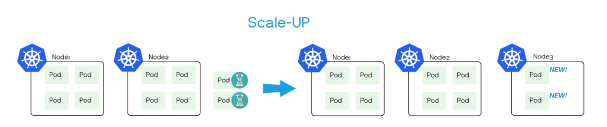

# Cluster Autoscaler

The Cluster AutoScaler is an extension that automatically scales a Kubernetes cluster's Nodes up and down. When cluster capacity is insufficient, it automatically creates new Nodes with Cloud Providers (supporting GCE, GKE, Azure, AKS, AWS, etc.), and automatically deletes Nodes with low resource utilization (below 50%) for an extended period (over 10 minutes) to save on costs.

Cluster AutoScaler is maintained independently from the Kubernetes main code base at [https://github.com/kubernetes/autoscaler](https://github.com/kubernetes/autoscaler).

## Deployment

Cluster AutoScaler v1.0+ can be deployed using the Docker image `gcr.io/google_containers/cluster-autoscaler:v1.3.0`. Detailed deployment steps can be found at:

* GCE: [https://kubernetes.io/docs/concepts/cluster-administration/cluster-management/](https://kubernetes.io/docs/concepts/cluster-administration/cluster-management/)
* GKE: [https://cloud.google.com/container-engine/docs/cluster-autoscaler](https://cloud.google.com/container-engine/docs/cluster-autoscaler)
* AWS: [https://github.com/kubernetes/autoscaler/blob/master/cluster-autoscaler/cloudprovider/aws/README.md](https://github.com/kubernetes/autoscaler/blob/master/cluster-autoscaler/cloudprovider/aws/README.md)
* Azure: [https://github.com/kubernetes/autoscaler/tree/master/cluster-autoscaler/cloudprovider/azure](https://github.com/kubernetes/autoscaler/tree/master/cluster-autoscaler/cloudprovider/azure)

Note that in clusters with RBAC enabled, a [cluster-autoscaler ClusterRole](https://github.com/kubernetes/kubernetes/blob/master/cluster/addons/rbac/cluster-autoscaler/cluster-autoscaler-rbac.yaml) should be created.

## How It Works

Cluster AutoScaler periodically (default interval is 10s) checks whether there are enough resources to schedule newly created Pods, and when resources are insufficient, it calls the Cloud Provider to create new Nodes.

To automatically create and initialize Nodes, Cluster Autoscaler requires that Nodes must belong to a Node Group, such as:

* Managed instance groups (MIG) in GCE/GKE
* Autoscaling Groups in AWS
* Scale Sets and Availability Sets in Azure

When there are multiple Node Groups in a cluster, the Node Group selection strategy can be configured using the `--expander=<option>` option, supporting four methods:

* random: Random selection
* most-pods: Select the Node Group with the largest capacity (that can create the most Pods)
* least-waste: Select based on the principle of minimal waste, i.e., the Node Group with the least unutilized resources
* price: Select the cheapest Node Group (only supported on GCE and GKE)

Currently, Cluster Autoscaler can ensure:

* Small clusters (under 100 Nodes) can complete scaling within 30 seconds (on average 5 seconds)
* Larger clusters (100-1000 Nodes) can complete scaling within 60 seconds (on average 15 seconds)

Cluster AutoScaler also periodically (default interval is 10s) automatically monitors the resource utilization of Nodes and will automatically delete the virtual machine from the cloud provider if a Node's resource utilization remains low (below 50%) for a long time (more than 10 minutes, during which no scaling operation is performed), considering a 1-minute graceful termination period. During this time, the original Pods are automatically scheduled to other Nodes (via controllers such as Deployment, StatefulSet, etc.).

Note that Cluster Autoscaler only adds or removes Nodes based on Pod scheduling conditions and overall Node resource usage, and is not directly related to Pod or Node resource metrics.

When starting Cluster AutoScaler, users can configure the range for the number of Nodes (including maximum and minimum number of Nodes).

When using Cluster AutoScaler, keep in mind:

* Since Pods will be rescheduled when Nodes are deleted, applications must be tolerant to rescheduling and brief interruptions (e.g., using multi-replica Deployments)
* Nodes will not be deleted when [Pods meet one of the following conditions](https://github.com/kubernetes/autoscaler/blob/master/cluster-autoscaler/FAQ.md#what-types-of-pods-can-prevent-ca-from-removing-a-node):
  * Pod has a PodDisruptionBudget (PDB) configured
  * kube-system Pod that typically does not run on a Node or is not configured with a PDB
  * Pod not created through a controller like deployment, replica set, job, stateful set, etc.
  * Pod uses local storage
  * Pod cannot be rescheduled for other reasons, such as insufficient resources, no other Node can satisfy NodeSelector or Affinity, etc.

## Best Practices

* Cluster AutoScaler can be used in conjunction with Horizontal Pod Autoscaler (HPA)

  

* Do not manually modify Node configurations; ensure all Nodes in the cluster have the same configuration and belong to the same Node group
* Specify resource requests when running Pods
* Use PodDisruptionBudgets if necessary to prevent accidental Pod deletion
* Ensure cloud provider quotas are sufficient
* **Cluster AutoScaler conflicts with cloud provider-provided Node automatic scaling features and CPU utilization-based Node automatic scaling mechanisms; do not enable both at the same time**

## Reference Documentation

* [Kubernetes Autoscaler](https://github.com/kubernetes/autoscaler)
* [Kubernetes Cluster AutoScaler Support](http://blog.spotinst.com/2017/06/14/k8-autoscaler-support/)

---

After converting the translation into a more accessible format:

# Cluster Autoscaler

**Welcome to the World of Effortless Scaling in Kubernetes**

The Cluster AutoScaler is a nifty tool designed to automatically adjust the size of your Kubernetes cluster nodes. In layman's terms, it's like a virtual gardener, sometimes planting more nodes when your digital garden (aka the cluster) needs them to accommodate a surge in digital 'plants' (pods), and pruning away the extra nodes when they're soaking up your budget with not much workload on their branches.

🌿 **Check out its home base**: [https://github.com/kubernetes/autoscaler](https://github.com/kubernetes/autoscaler).

## How to Set it Up

Setting up the Cluster AutoScaler is like baking a cake with a mix. You need the pre-made Docker image mix `gcr.io/google_containers/cluster-autoscaler:v1.3.0`, and you can follow the recipe closely on these links depending on where your digital garden grows:

* For Google Compute Engine Gardeners: [Cluster Management Directions](https://kubernetes.io/docs/concepts/cluster-administration/cluster-management/)
* For Google Kubernetes Engine Enthusiasts: [Cluster AutoScaler 101](https://cloud.google.com/container-engine/docs/cluster-autoscaler)
* For Amazon Web Services Tenders: [AWS Specifics](https://github.com/kubernetes/autoscaler/blob/master/cluster-autoscaler/cloudprovider/aws/README.md)
* For Azure Rangers: [Azure Tips & Tricks](https://github.com/kubernetes/autoscaler/tree/master/cluster-autoscaler/cloudprovider/azure)

And don't forget—if your Kubernetes estate has a gatekeeper (RBAC), make sure to create the needed ClusterRole.

## What Makes It Tick

Picture this: every 10 seconds (as punctually as a heartbeat), the Cluster AutoScaler scans to see if your digital garden has enough room for all of its plants. If the dirt's looking sparse, it dials up another order of nodes to Cloud Providers, like calling in a top-up for your soil reservoir.

📈 **Growth Factor**: Quickly sows new nodes in up to 30 seconds for small clusters and within 60 seconds for the larger ones.

But when a node is just loafing around with its resources snoozing below 50% capacity for more than 10 mins, the Cluster AutoScaler kindly lets it off duty by turning it back into stardust—or rather, informs the Cloud Provider to clean it up.

Remember, though, it's all about whether these digital 'plants' (pods) have enough space, not how much water and sunlight (metrics) they're hogging up.

## Pro Gardening Tips

When tapping into the power of Cluster AutoScaler, keep these green thumb tips in mind:

* Mix it with the Horizontal Pod Autoscaler for a lush digital landscape.
* Keep your nodes uniform—no odd ones out. This isn't the place for a unique snowflake node.
* Tell your pods how much they can eat and drink (define their resources).
* Protect your most delicate plants with PodDisruptionBudgets, so they don't get uprooted accidentally.
* Check the soil and weather conditions with your Cloud Provider (ensure you have the right quotas).

Above all, **do not cross the streams**—Cloud Autoscaling and Cluster AutoScaler are like two alphas in the same territory; best to stick with just one.

## Keep Learning

Deep dive into the world of Kubernetes autoscaling with these resources:

* [Kubernetes Cluster AutoScaler Textbook](https://github.com/kubernetes/autoscaler)
* [How Cluster AutoScaler Fits into the K8 Ecosystem](http://blog.spotinst.com/2017/06/14/k8-autoscaler-support/)

Happy Scaling! 🌱📏