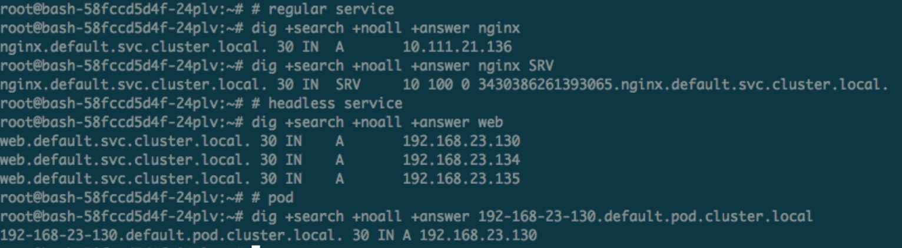
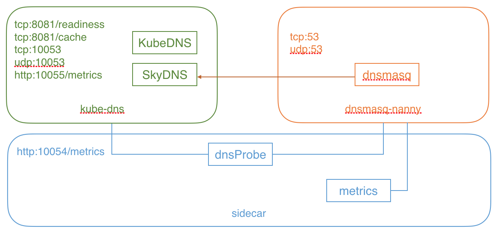

# The Essential Role of DNS in Kubernetes

DNS within Kubernetes serves as one of its core functionalities, offering naming services through extensions like kube-dns or CoreDNS.

## CoreDNS: The Preferred Choice for Kubernetes

Starting with version 1.11, [CoreDNS](https://coredns.io/) is available for naming services and was adopted as the default DNS service from v1.13 onward. CoreDNS distinguishes itself by its increased efficiency and reduced resource consumption, making it the recommended replacement for kube-dns in cluster DNS service provision.

The process of upgrading from kube-dns to CoreDNS involves:

```bash
$ git clone https://github.com/coredns/deployment
$ cd deployment/kubernetes
$ ./deploy.sh | kubectl apply -f -
$ kubectl delete --namespace=kube-system deployment kube-dns
```

For new deployments, [click here](https://github.com/kubernetes/kubernetes/tree/master/cluster/addons/dns) to view the configuration method for the CoreDNS extension.

## Supported DNS Record Types

* Service
  * A record: Generates `my-svc.my-namespace.svc.cluster.local` with IP resolution in two scenarios:
    * Normal Service resolves to Cluster IP.
    * Headless Service resolves to a specified list of Pod IPs.
  * SRV record: Generates `_my-port-name._my-port-protocol.my-svc.my-namespace.svc.cluster.local`.
* Pod
  * A record: `pod-ip-address.my-namespace.pod.cluster.local`.
  * Specific hostname and subdomain: `hostname.custom-subdomain.default.svc.cluster.local` as illustrated below:

```yaml
apiVersion: v1
kind: Pod
metadata:
  name: busybox2
  labels:
    name: busybox
spec:
  hostname: busybox-2
  subdomain: default-subdomain
  containers:
  - image: busybox
    command:
      - sleep
      - "3600"
    name: busybox
```



## Configuring Private and Upstream DNS Servers

As of Kubernetes 1.6, customization of stub domains and upstream name servers is possible by providing a ConfigMap to kube-dns. For example, the following setup inserts a separate private root DNS server along with two upstream DNS servers.

```yaml
apiVersion: v1
kind: ConfigMap
metadata:
  name: kube-dns
  namespace: kube-system
data:
  stubDomains: |
    {“acme.local”: [“1.2.3.4”]}
  upstreamNameservers: |
    [“8.8.8.8”, “8.8.4.4”]
```

Using the specific configuration mentioned above, query requests are initially sent to the DNS cache layer of kube-dns (the Dnsmasq server). The server first checks the request's suffix, sending those with a cluster suffix (e.g., ”.cluster.local”) to kube-dns and names with a stub domain suffix (e.g., ”.acme.local”) to the designated private DNS server [“1.2.3.4”]. Lastly, requests not matching any of these suffixes will be forwarded to the upstream DNS [“8.8.8.8”, “8.8.4.4”].


## kube-dns

### Deploying a kube-dns Example

DNS services are generally deployed as extensions, for instance by placing the [kube-dns.yaml](https://github.com/feiskyer/kubernetes-handbook/raw/master/manifests/kubedns/kube-dns.yaml) in the `/etc/kubernetes/addons` directory on the Master node. Manual deployment is also an option:

```bash
kubectl apply -f https://github.com/feiskyer/kubernetes-handbook/raw/master/manifests/kubedns/kube-dns.yaml
```

This action will initiate a Pod within Kubernetes that contains three containers running the three DNS-related services:

```bash
# kube-dns container
kube-dns --domain=cluster.local. --dns-port=10053 --config-dir=/kube-dns-config --v=2

# dnsmasq container
dnsmasq-nanny -v=2 -logtostderr -configDir=/etc/k8s/dns/dnsmasq-nanny -restartDnsmasq=true -- -k --cache-size=1000 --log-facility=- --server=127.0.0.1#10053

# sidecar container
sidecar --v=2 --logtostderr --probe=kubedns,127.0.0.1:10053,kubernetes.default.svc.cluster.local.,5,A --probe=dnsmasq,127.0.0.1:53,kubernetes.default.svc.cluster.local.,5,A
```

Kubernetes v1.10 also supports the Beta version of CoreDNS which has performance advantages over kube-dns. This can be deployed as an extension by placing [coredns.yaml](https://github.com/feiskyer/kubernetes-handbook/blob/master/manifests/kubedns/coredns.yaml) in the `/etc/kubernetes/addons` directory on the Master node, or deployed manually:

```bash
kubectl apply -f https://github.com/feiskyer/kubernetes-handbook/raw/master/manifests/kubedns/coredns.yaml
```

### How kube-dns Works

As the diagram below illustrates, kube-dns is comprised of three containers:

* kube-dns: The core component of DNS services, mainly consisting of KubeDNS and SkyDNS
  * KubeDNS is responsible for monitoring changes in Services and Endpoints, and updating the relevant information in SkyDNS.
  * SkyDNS handles DNS resolution, listening on port 10053 (tcp/udp), as well as port 10055 for metrics.
  * The kube-dns service also listens on port 8081 for health checks.
* dnsmasq-nanny: Responsible for starting dnsmasq and restarting it upon configuration changes.
  * dnsmasq's upstream is SkyDNS, meaning internal DNS resolution within the cluster is managed by SkyDNS.
* sidecar: Responsible for health checks and serving DNS metrics (listening on port 10054).



### A Glimpse at the Source Code

The code for kube-dns has been separated from the main Kubernetes repository, now housed at [https://github.com/kubernetes/dns](https://github.com/kubernetes/dns).

The code for kube-dns, dnsmasq-nanny, and sidecar all start at `cmd/<cmd-name>/main.go`, and they call on `pkg/dns`, `pkg/dnsmasq`, and `pkg/sidecar` respectively to execute their tasks. The core DNS resolution, however, directly utilizes code from `github.com/skynetservices/skydns/server` with specific implementation visible at [skynetservices/skydns](https://github.com/skynetservices/skydns/tree/master/server).

## Common Issues

**DNS Resolution Issues in Ubuntu 18.04**

Ubuntu 18.04 by default enables systemd-resolved, which places `nameserver 127.0.0.53` in the system's /etc/resolv.conf. Since this is a local address, it may cause CoreDNS or kube-dns to fail in resolving external web addresses.

The solution involves replacing the systemd-resolved generated resolv.conf file:

```bash
sudo rm /etc/resolv.conf
sudo ln -s /run/systemd/resolve/resolv.conf /etc/resolv.conf
```

Alternatively, manually specify the resolv.conf path for the DNS service:

```bash
--resolv-conf=/run/systemd/resolve/resolv.conf
```

## Reference Materials

* [dns-pod-service Introduction](https://kubernetes.io/docs/concepts/services-networking/dns-pod-service/)
* [coredns/coredns](https://github.com/coredns/coredns)