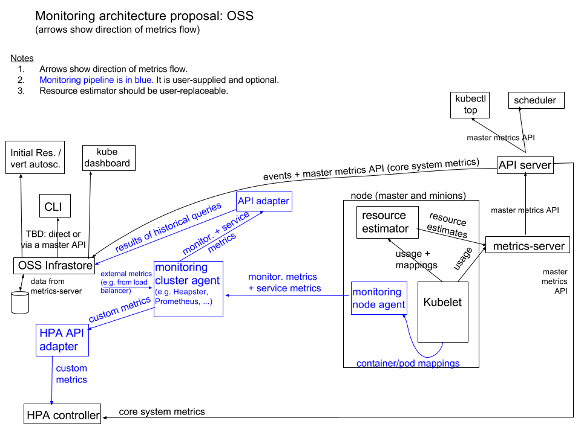

# Metrics

Starting from v1.8, metrics pertaining to resource usage (such as CPU and memory utilization for containers) can now be accessed through the Metrics API. It’s key to note:

* The Metrics API is solely for fetching current metrics data and doesn't retain historical data.
* The Metrics API URI starts with `/apis/metrics.k8s.io/`, and is maintained on [k8s.io/metrics](https://github.com/kubernetes/metrics).
* Deployment of the `metrics-server` is a prerequisite for utilizing this API, as it retrieves data by calling the Kubelet Summary API.

## Kubernetes Monitoring Architecture

The [Kubernetes Monitoring Architecture](https://github.com/kubernetes/community/blob/master/contributors/design-proposals/instrumentation/monitoring_architecture.md) is composed of two segments:

* Core Metrics Pipeline (illustrated in black in the diagram below): These are crucial metrics fundamental to the functioning of Kubernetes, sourced from the Kubelet, cAdvisor, and others, and provided by the metrics-server for the Dashboard, HPA controller, and the like.
* Monitoring Pipeline (illustrated in blue in the diagram below): This pipeline is built atop the core metrics, e.g., Prometheus can collect core metrics from the metrics-server, and other non-core metrics from different sources (such as Node Exporter), to then construct a monitoring and alerting system.



## Enabling API Aggregation

Prior to deploying the metrics-server, API Aggregation must be enabled in the kube-apiserver by adding the following configuration:

```bash
--requestheader-client-ca-file=/etc/kubernetes/certs/proxy-ca.crt
--proxy-client-cert-file=/etc/kubernetes/certs/proxy.crt
--proxy-client-key-file=/etc/kubernetes/certs/proxy.key
--requestheader-allowed-names=aggregator
--requestheader-extra-headers-prefix=X-Remote-Extra-
--requestheader-group-headers=X-Remote-Group
--requestheader-username-headers=X-Remote-User
```

If kube-proxy is not running on the Master, you would also need to configure:

```bash
--enable-aggregator-routing=true
```

## Deploying metrics-server

```bash
$ git clone https://github.com/kubernetes-incubator/metrics-server
$ cd metrics-server
$ kubectl create -f deploy/1.8+/
```

Subsequently, the metrics-server should be operational:

```bash
kubectl -n kube-system get pods -l k8s-app=metrics-server
```

## Metrics API

The [Metrics API](https://github.com/kubernetes/community/blob/master/contributors/design-proposals/instrumentation/resource-metrics-api.md) can be accessed via `kubectl proxy`:

* `http://127.0.0.1:8001/apis/metrics.k8s.io/v1beta1/nodes`
* `http://127.0.0.1:8001/apis/metrics.k8s.io/v1beta1/nodes/<node-name>`
* `http://127.0.0.1:8001/apis/metrics.k8s.io/v1beta1/pods`
* `http://127.0.0.1:8001/apis/metrics.k8s.io/v1beta1/namespaces/<namespace-name>/pods/<pod-name>`

These APIs can also be directly accessed through kubectl commands, for example:

* `kubectl get --raw /apis/metrics.k8s.io/v1beta1/nodes`
* `kubectl get --raw /apis/metrics.k8s.io/v1beta1/pods`
* `kubectl get --raw /apis/metrics.k8s.io/v1beta1/nodes/<node-name>`
* `kubectl get --raw /apis/metrics.k8s.io/v1beta1/namespaces/<namespace-name>/pods/<pod-name>`

## Troubleshooting

If the metrics-server Pod fails to start properly, such as being in a CrashLoopBackOff state with an ever-increasing restartCount, it's likely experiencing communication issues with the kube-apiserver. Checking the logs of the Pod could reveal:

```bash
dial tcp 10.96.0.1:443: i/o timeout
```

A possible solution is:

```bash
echo "ExecStartPost=/sbin/iptables -P FORWARD ACCEPT" >> /etc/systemd/system/docker.service.d/exec_start.conf
systemctl daemon-reload
systemctl restart docker
```

## References

* [Core metrics pipeline](https://kubernetes.io/docs/tasks/debug-application-cluster/resource-metrics-pipeline/)
* [metrics-server](https://github.com/kubernetes-incubator/metrics-server)